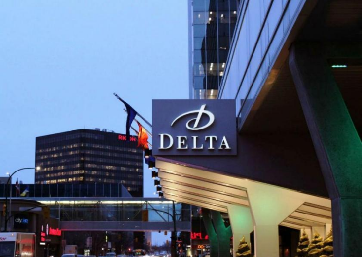

科幻大会通常都非常友好，但第15届北美科幻大会更是将其友好程度推向了巅峰。我来自美国中西部，在那里的“中西部友善”是一种文化特质，但加拿大人的友善更胜一筹，他们说“对不起”的频率远超我们说“哦”或“抱歉”的频率。加拿大不仅有独特的口音和重视自然的文化，而且在政治与社会发展过程中也有自己独特的轨迹。此外，加拿大的美食和历史英雄也同样别具一格。第15届北美科幻大会还特别强调了第一民族（First Nations）和梅蒂斯人（Métis）[^1]的存在。大会将自己定位为“通往大陆中心的旅程”，因为其举办地温尼伯位于北美洲的中心，周围被盛开的金黄色油菜花田包围。然而，北美部分地区因热浪引发火灾，导致各地区的空气质量从雾霾到严重烟霾不等。”

大多数活动在温尼伯的三角洲酒店和加拿大皇家银行会议中心举行，两地由空中步道相连。会议中心的南楼D厅设有销售区、艺术展、签名区、展览、粉丝桌以及下一届北美科幻大会（NASFiC）[^2]的举办地投票区，同时配备有一些会议室。这些地方都很宽敞，很舒适，但距酒店整整一个街区。正如一位参加者打趣地说：“每天走完这段路，我都能完成运动步数目标。”

截至周六，现场有509名会员，总的会员数达到849人，相对于北美地区的世界科幻大会（Worldcon）来说规模较小。参与者多为有经验的科幻大会爱好者，他们的经验，友善，友好，开朗态度让在大会最后关头陷入困境时发挥了重要作用。就在大会前一天，我们在酒店酒吧聊天时，手机应用“格雷纳丁”上的日程表在我们眼前不断更新。整个大会期间，日程仍不断变化，但有经验的与会者知道如何应对这种情况。我们来这里是为了开心嘛。”其中的一位解释道。

开幕式上，龟鼓（Turtle Drum）工作室的希瑟·比约克伦德（Heather Bjorklund）用原住民传统的歌声和鼓声进行了祖先召唤，以此作为第15届北美科幻大会的土地承认仪式的一部分。随后，文森特·多赫蒂（Vincent Docherty）为迈克尔·穆考克（Michael Moorcock）和威尔·默里（Will Murray）颁发了“第一代粉丝名人堂奖”；艺术家（Ken Kelly）和粉丝及出版商康拉德·H·鲁珀特（Conrad H. Ruppert）获得了“追授名人堂奖”。大卫·里特（David Ritter）向约翰·L·科克三世（John L. Coker III）颁发了“[山姆·莫斯科维茨](https://en.wikipedia.org/wiki/Sam_Moskowitz)（[Sam Moskowitz](https://en.wikipedia.org/wiki/Sam_Moskowitz)）档案奖”。

节目内容丰富多彩，嘉宾们忙得不亦乐乎。菲利普·约翰·柯里（Philip John Currie），加拿大古生物学家，博物馆馆长，分享了关于恐龙的一切。暴龙，尤其是幼龙的身上附有羽毛，用于保暖。而且你绝对跑不过它们，尤其是那些敏捷的幼龙；加拿大生物学家和科幻作家朱莉·E·策涅达（Julie E. Czerneda），为她参加的每个座谈会都带来了欢乐；加拿大漫画家乔治·弗里曼（George Freeman）讲解了漫画的创作过程；加拿大作家坦雅·赫夫（Tanya Huff）则作为主持人提供了活力满满的祝酒词。粉丝嘉宾约翰·曼斯菲尔德（John Mansfield）已于2023年4月去世，仍被授予了粉丝荣誉嘉宾称号。沃布格希格·赖斯（Waubgeshig Rice）讲述了加拿大的神话故事，尼西·肖尔（Nisi Shawl）讨论了写作，而洛娜·图利斯（Lorna Toolis）担任荣誉幽灵嘉宾。“红河梅蒂斯人”（Red River Métis）成员凯瑟丽娜·维尔梅特（Katherena Vermette）因工作冲突不得不缺席。

除荣誉主宾外，超过100位嘉宾参与了大会的各类流程活动，讨论主题涵盖写作、科学、社交媒体和人权等时事热点，以及粉丝们最喜欢的热门作品如《星际迷航》和《神秘博士》。此外，从周五开始大会还提供了线上活动部分。

虽然没有专门的媒体节目，但日程安排了其他娱乐活动：包括一个名为“Kaupapa”的新西兰游戏，可以学习毛利语；一个弹珠游戏室；角色扮演（cosplay）；以及大量以表演、座谈和工作坊形式呈现的Filk[^3]音乐。咖啡座谈会和焦点会话促进了友好的互动交流。由于酒店条件所限，派对活动受到了限制，而大堂酒吧则成为了热闹的社交场所。

包括我这个第一次参赛的人，共有十组选手参加了化装舞会。其中“芭芭雅嘎的跳舞小屋”以金色鸡腿支撑的房屋造型赢得了表演和工艺的最佳奖。而我凭借《神秘博士》围巾故事获得了新手级的荣誉提名。在艺术展上，[罗伯特·帕斯特纳克](https://fancyclopedia.org/Robert_Pasternak)的作品《食气者》[^4]获得了最佳展品奖。

当世界科幻大会在北美以外的地方举办时，会举办北美科幻大会。今年（2023年）世界科幻大会将在中国成都举行，明年（2024年）将在苏格兰格拉斯哥举行。在第15届北美科幻大会上，相比于去成都，更多人似乎对去格拉斯哥的兴趣更大。我听到的关于成都的讨论很有限，主要集中于对成本、中国政府可能干涉的担忧，以及对大会组委会组织能力的质疑。

因为2024年世界科幻大会将在北美以外的格拉斯哥举行，所以将举行北美科幻大会，但在哪里举行呢？需要通过投票来选择2024年北美科幻大会的举办地，为此在D厅召开了会议：这是有史以来[WSFS](https://en.wikipedia.org/wiki/Worldcon#World_Science_Fiction_Society)首次在北美科幻大会上召开事务会议。会议在周六早晨举行，只持续了十五分钟，而且大部分时间用于解释规则。在139张选票中，唯一的参选城市[布法罗](http://www.concatenation.org/news/news9~23.html#nasfic24)以129票获胜。

第15届北美科幻大会于周日下午落幕。闭幕式活动有风笛手领队，希瑟·比约克伦德唱歌敲鼓来释放祖先灵魂，还举行了将会议槌传递给布法罗的仪式。为了体现加拿大文化，当晚的“死亡狗狗”派对被改名为“眩晕麋鹿”派对。

苏·伯克是生活在美国芝加哥的作家和科幻爱好者。她的作品包括《符号起源》（Semiosis）、《干涉》（Interference）、《免疫指数》（Immunity Index）和《双重记忆》（Dual Memory）。更多信息可访问 苏·伯克[个人网站](http://sueburke.site) https://sueburke.site 。

[^1]:加拿大的原住民分为（Indigenous Peoples）三大类：第一民族、因纽特人和梅蒂斯人。第一民族（First Nations）包括 非因纽特人和非梅蒂斯人的原住部落，如克里族、海达族等。因纽特人（Inuit）主要生活在加拿大北极地区的原住民族群。梅蒂斯人（Métis）欧洲人与第一民族的后代，具有独特的混合文化身份。
[^2]:[北美科幻大会](https://en.wikipedia.org/wiki/North_American_Science_Fiction_Convention)（NASFiC，全称 North American Science Fiction Convention）是在世界科幻大会（Worldcon）于北美以外地区举办时，为方便北美地区粉丝而举办的替代性大会。NASFiC 的结构类似于 Worldcon，包括颁奖典礼、签售、艺术展、讨论会以及粉丝互动等活动。
[^3]:[Filk](https://en.wikipedia.org/wiki/Filk_music)音乐是一种与科幻、奇幻和恐怖迷文化相关的音乐类型，起源于20世纪50年代，并逐渐发展为一种独特的粉丝创作形式。它包括原创音乐和恶搞作品，内容涉及科幻、奇幻、电脑、政治等广泛主题，强调社群参与和互动。Filk音乐在科幻大会中演变为重要活动，且有专门的Filk大会在全球举行。
[^4]:食气者（[Breatharian](https://en.wikipedia.org/wiki/Inedia)）是一种伪科学信仰，声称人类可以不摄入食物，甚至有时不摄入水生存。类似于中国的辟谷断食。科学研究表明，长期禁食会导致饥饿、脱水，最终死亡。曾有信徒因尝试这种生活方式而死亡，科学界普遍认为这种做法极其危险。

