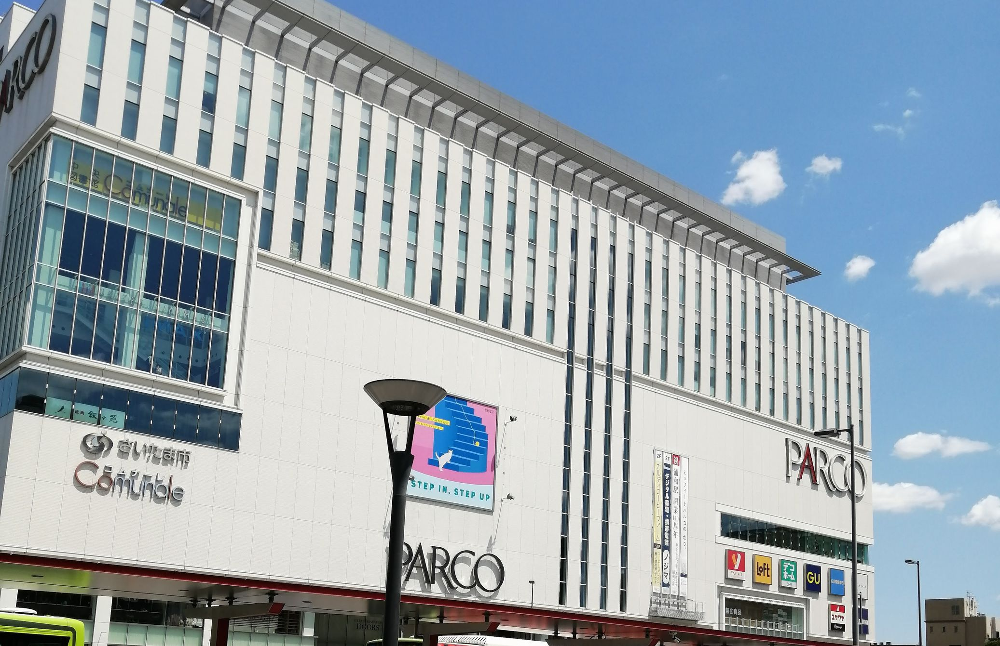
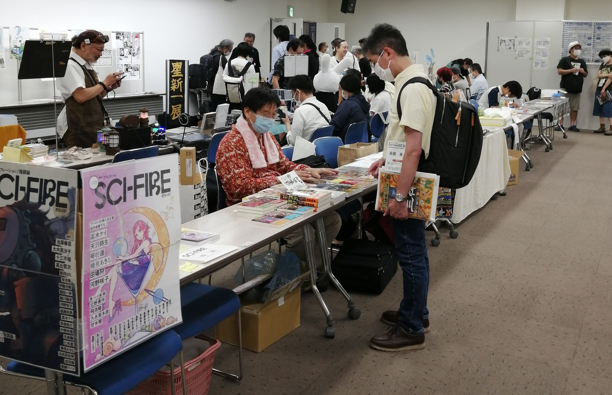
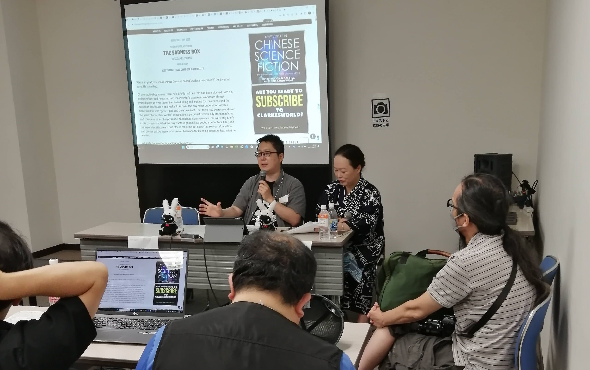
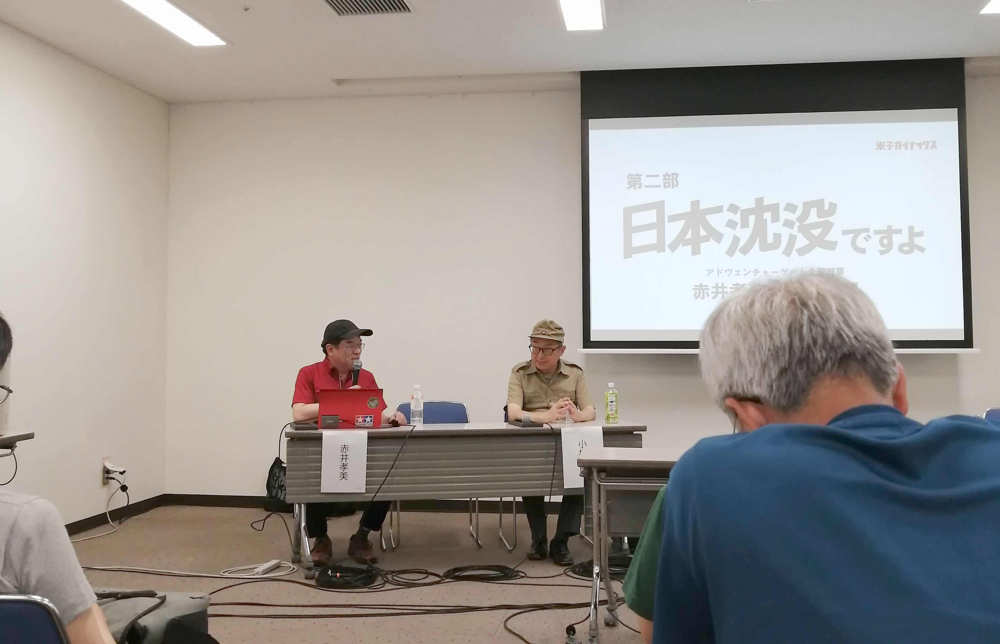
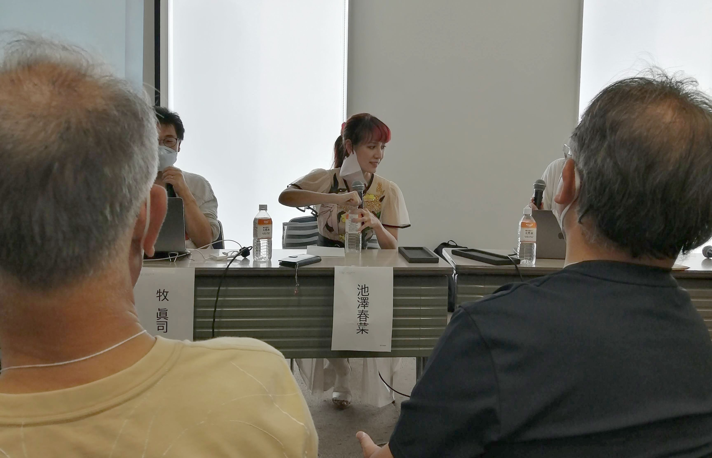
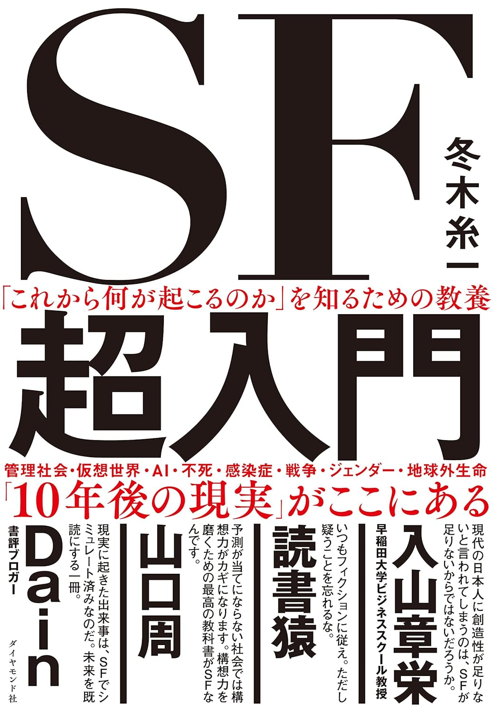
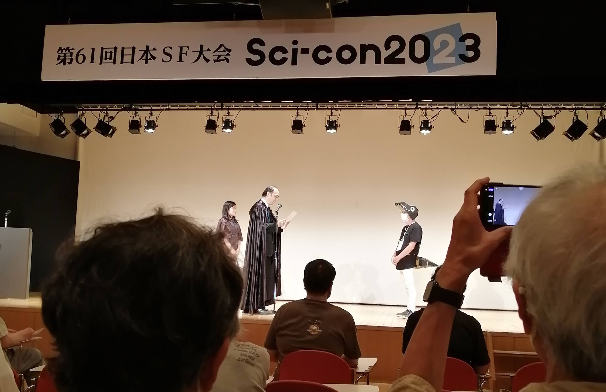
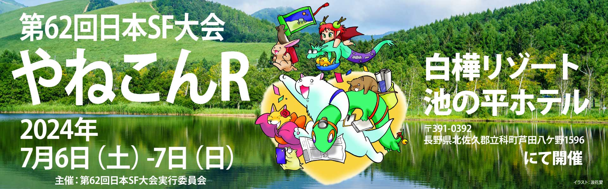
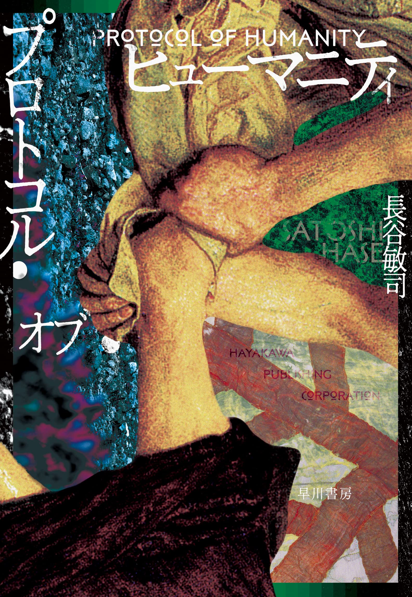
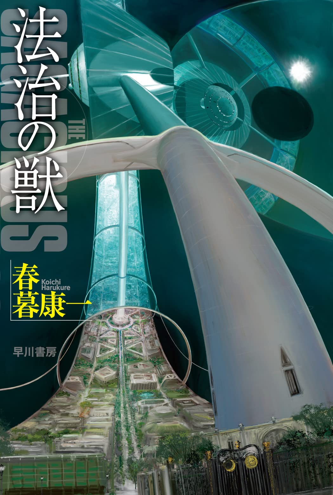

※这份报告是我根据自己的笔记整理的，可能有些地方不够准确。如果大家发现任何错误或者表达不当的地方，麻烦告诉我，我会及时修改。

今年的日本科幻大会于8月5日至6日（周六，日）在埼玉县埼玉市浦和区举行。浦和社区中心离浦和站很近，走路就能到。本届大会安排在了社区中心的9楼和10楼，是一场相对较小的城市型会议[^1]。

我下午一到会场，就直奔9楼的展销区摊位。

我先跟小优（YOUCHAN）打了声招呼，然后在哈尔空（HAL-CON）书店入手了克里斯托弗·普里斯特[^2]的中短篇集《致命的跌落》。之后溜达到星空暗流的摊位，又跟森下先生问了声好。最后找青井美香小姐买了本《科幻同人志2023年8月刊》——哇，这本也太厚了吧！我还见到了锻冶靖子女士。因为阿西莫夫获得了星云奖，所以她代领了那枚金奖章。但她很困扰——这奖章究竟该怎么交给已故的阿西莫夫呢？说得也是啊。然后我去了科火社（Sci-Fire）[^3]的展台，跟甘木零先生打了个招呼。他在推特上感谢我之前帮他们宣传，还说：“多亏你在推特上一介绍，东西突然就卖起来了！” 到底是关东地区的科幻大会啊，碰上了不少熟人。最后我还在《幻想家》（Imagina）的展位，跟宫本英雄先生打了招呼。一眼注意到上面有津田先生的内容，当即买了本第14期的《幻想家》。

10楼是活动专区。我参加的第一个活动是 《海外科幻文学奖中短篇入围作品研讨会》 座谈。

本以为已过下午两点，东京创元社的石龟航先生与作家胜山海百合女士的座谈该结束了，没想到还剩8分钟，便赶紧进场。
现场看到冈和田晃先生正用电脑在屏幕上展示的相关资料的PPT。他们当时讨论的似乎是雪莉·杰克逊奖（Shirley Jackson Award）的情况。
据石龟先生介绍，入围作品中有篇苏珊·帕尔梅（Suzanne Palmer）的《哀伤匣》（*The Sadness Box*），写的是个只会自动关机的AI。他提到故事结尾还挺圆满的。

胜山女士提到，小川雪美可能是首位凭英语创作小说获得雪莉·杰克逊奖的日本人（真希望她能获奖啊！）。虽说此前有日本人凭借翻译作品得过该奖，但这是原创小说头一回获得提名。

石龟先生特别聊到这次获奖的《金秀》，他觉得这书很有意思——整本书全是对话，讲一个能用VR实现任何幻想的世界，可读起来跟听相声一样诙谐[^4]，结尾意外的温情又治愈。

光听这结尾都这么精彩，要是从一开始就在场，该有多好！——虽然只赶上了最后8分钟，照样精彩纷呈，让人舍不得走，真没听够啊。

石龟先生推荐的作品，该不会都藏着暖心的结尾吧？

接着，我又跑去参加了《日本科幻作家协会（WJ）60周年出版与创作生态研讨》座谈会。

这次的座谈会要求参会者只能用文字报道，所以下面的报道没有照片。

嘉宾包括粕谷知世、樱木实和、十三不塔、蓝铜燕、扬羽花娜等老师。日本科幻作家协会现任会长大泽先生做了开场致辞。他强调应尽量避免将作品与作者的个人特质（比如性别）关联起来，呼吁大家不要过分关注作者的性别。

嘉宾们先做了自我介绍。 扬羽花娜是2019年凭借星新一奖出道的。蓝铜燕则是摘得了2021年日本奇幻小说大奖。然后是十三不塔，他于2020年参加第8届早川大赛拿到优秀奖，由此正式进入文坛。樱木实和的情况比较特别，他是“玄论大森望”科幻作家工作坊（Genron Ohmori Nozomi）的第1期学员，但他因为受到编辑赏识，直接以作品《美丽的茧》出道了。而在座中资历最深的要数粕谷知世，她是第13届（2001年）日本奇幻小说大奖的获奖者。

粕谷知世说，她出道的时候还没有科幻小说奖，所以科幻和奇幻小说奖都颁给了奇幻小说。樱木原本说自己本来是“玄论大森望”科幻作家工作坊的学员，所以他突然知道自己要出书的时候很惊讶。十三不塔原本钟情于纯文学，24岁时曾获得《群像》杂志新人奖。但之后未能持续写作，有十多年时间远离了小说创作。在那之前他只写纯文学，后来开始阅读娱乐类作品，重新燃起想写科幻小说的想法，于是开始在书阅小说网[^5]上写作各种故事。蓝铜燕在获得奇幻小说大奖之前，也曾进入过“玄论大森望”科幻作家工作坊的第4期进行创作。

粕谷知世提到，她出道那会儿还没有专门的科幻小说奖，结果科幻和奇幻小说奖都发给了奇幻作品。樱木实和接着说，自己本来是“玄论大森望”科幻作家工作坊的学员，可突然得知要编辑说要给自己出书的消息时，感到非常意外。十三不塔过去一直痴迷于纯文学，24岁那年还拿过《群像》杂志的新人奖。可惜后来中断了写作，有十多年没再碰小说。在那之前他只写纯文学，再后来接触了娱乐类读物，重新点燃了创作科幻小说的热情，便开始在书阅小说网（KAKUYOMU）是日上写各种故事。最后，蓝铜燕也分享到，自己在拿下奇幻小说大奖之前，其实也是“玄论大森望”科幻作家工作坊第4期的学员。

扬羽花娜还提到，集英社旗下的 《昴小说[^6]》 编辑们，现在特别关注“玄论大森望”科幻作家工作坊出来的作家。这本杂志上经常能看到以这个工作坊学员为主的新人科幻作品。VG+文艺通讯的记者井上彼方当时带了相机到现场采访，他特别说到，藤井太洋在采访中指出：“眼下需要有更多可以发短篇小说的平台。”

与过去最大的不同在于，如今有了网络出版平台，即使是短篇作品也能公开发表。过去，如果作家在比赛中获奖，下一部作品就必须要创作长篇，否则很难出版成书，这种压力令人窒息。而当下，科幻作家协会定期推出作品合集，科幻原型创作（ Prototyping）活动也在开展。此外，同行间还兴起了共同创作同人志的风潮，比如合作编撰《科火》（Sci-Fire）这类刊物。

与过去最大的不同在于，如今有了网络出版平台，即使是短篇作品也能公开发表。以前要是作家在比赛里拿了奖，下一部作品不写成长篇就基本没法出书，这种压力简直叫人透不过气来。现在呢，日本科幻作家协会定期会出作品合集，还有一种叫科幻原型创作 ( Prototyping) [^7]活动也挺热闹。而且科幻圈里现在还流行起一块儿做粉丝杂志，像大家合力办《科火》（Sci-Fire），就是很好的例子。
当时也正好在场的门田充宏先生也加入了我们的讨论。谈及“玄论大森望科幻新人赛”（也叫“砂之征”）的评审情况时，他说：原本以为只会有50篇投稿，结果一下子涌进来一千多份，多到都快看不过来了。办这个比赛的本意是想帮第一次写小说的新人，结果绝大部分稿子初审就给筛掉了。不过尽管如此，他们还是坚持给每份作品都写了详细的评审意见，并且都反馈给了作者。

粕谷老师也接过话头，说起早年有读者特地写明信片，告诉她看完书的感想，这份心意让她觉得特别温暖珍贵。而“砂之征”的创新点在于把所有的评审意见都公开在网上——作者与公众皆可查阅，但这对评委自己来说也是算个挑战。

之后我们聊到了科幻原型创作。樱木实和有一次在“玄论大森望”科幻作家工作坊里，邀请某公司的员工以“未来社会演变”为主题进行小说创作。她觉得，这样能听到来自企业内部对未来发展的独特构想，特别有启发性。另一边，十三不塔先生提到，某地的地方政府试着让人工智能当线上顾问，给有自杀风险的人提供心理支持，而他自己正在写一部与此相关的小说。

现在年轻作家们不再像过去那样独自闷头写书了（当然那也不是不行）——他们更愿意结成创作圈子，聚在一起讨论作品，互相促进不断提升创作水平，这种变化看了真让人特别振奋。

紧接着是饭田一史先生带来的讲座：《网络小说与科幻的过去和未来：媒体、商业模式和粉丝文化》。

饭田一史先生的演讲以日本为例，梳理了从互联网时代以来，网络小说与科幻的共生演变史，接着又从媒体载体、商业模式、粉丝文化三个角度，分析了网络小说与纸质出版的关系变迁。 当然，在这场讲座里可以看到水镜子（笔名）坐在了最前排，她旁边坐着的是三村美衣。

本次讲座活动规定所有内容都不对外公开。 因此，不仅无法提供照片，也不能撰写详细内容。不过，就算只能写个大概，这里还是要汇报一下。

饭田先生的演讲基于统计数据和相关资料，梳理了日本网络小说的发展轨迹——他的分析侧重于市场营销层面，而非作品内容本身。他还指出了传统出版社在应对网络小说浪潮时的一些失败经历。在分析中，饭田先生不仅涵盖美、中、韩三国案例，更特别强调了一个现象：日本本土的“核心科幻”（即除异世界转生类[^8]以外的传统科幻作品，以早川书房、东京创元社出版为代表）在网络平台严重缺乏存在感。例如早川书房和创元社的官网因为搜索引擎优化（SEO）不足，用户搜索时很难在结果前列找到它们。

回溯历史，自互联网时代起，针对正统科幻（如《清晨的加斯巴》等作品）也曾涌现积极尝试。然而最终因为缺乏延续性，沦为昙花一现的新奇实验。究其根源，在于科幻这一门类存在根深蒂固的价值评判体系——该领域的专业鉴赏家所品评推崇的作品，理应凌驾于业余创作者的即兴草稿之上——这种观念如此强势，使得广泛接纳大众投稿的平台机制，本质上构成对其存在根基的自我否定。他们始终奉行「质量高于数量」，宁取类型文学的纯粹价值而漠视市场反响。更深层的是业界对「把作品免费公布于世」抱持着强烈抵触心理。

回顾历史，早在互联网兴起之时，也有人积极尝试创作“核心科幻”作品（比如《清晨的加斯巴》）。但这些尝试往往后劲不足，最终沦为了昙花一现的新奇试验。究其根源，在于科幻领域内部有一套根深蒂固的价值标准：圈内专家推崇的作品，被认为理所当然地应该超越业余作者的即兴创作。这种观念非常强势，以至于接纳大众投稿的平台机制本身，就构成了一种对自身根基的潜在否定。业内始终奉行“质量高于数量”的信条，宁愿维护类型文学的纯粹价值，也不愿迎合市场反馈。而更深的矛盾在于，他们对“免费公开作品”这件事，内心有着强烈的抵触。

美国、中国、韩国也曾面临同类困境，但通过多种举措已逐步改善现状。但日本则危机意识明显欠缺——问题的症结并非作品质量，而在于产业机制本身。

关于改革方向的具体建议，因为活动要求，我不知道能否在此公开细节，所以请大家参阅饭田先生的网站。但核心观点可概括为：如果想要在坚守科幻社群核心价值的同时扩展市场规模，就必须建立可持续的科幻爱好者培养机制。为此，需要在网络上提供系统的科幻解说、历史和指南，而不是仅仅聚焦新作的营销。另外，针对中小学生市场的战略布局是至关重要的。饭田先生这一观点很具有启发性，而也是我一直在思考的问题，不过我对这个建议心中还是存在一些疑虑。

问答环节中，我提出了疑问：“这些提议很有价值，但具体目标如何定位呢？ 现在的日本新生代创作者已在VG+、玄论大森望在线、'砂之征'等多元网络平台推进生态建设，您如何看待这些实践？” 因时间有限，饭田先生仅做了简短回应：“希望他们全力以赴。” 若从市场营销角度来看，这些尝试目前仍属小众领域，实际成效可能需要更长期积累。

更让我惊讶的是水镜子的发言——他认为当下的科幻元素已在当代文化中深度渗透，因此刻意推广科幻的专门活动（如饭田所提议）纯属多余。事后我曾与三村美衣讨论此观点，我们觉得水镜子或许已经陷入一种他自我满足的心理状态，以至于他可能对“科幻”（作为独立文类）本身都他不太关心他了。他这种心境，倒像是《日本沉没》里那个高喊“我们什么都不用做了”的老人。纵然个人选择无可厚非，但作为深耕网文领域且被奉为科幻权威的水镜子，他这番话他恐怕会产生误导。

因为下个活动“日经’星新一奖‘专场”同样要求信息保密，所以我只能做个简要报道。

与会嘉宾包括扬羽花娜、菊池诚、关元聪、安野贵博、津久井五月、松森凛、芦泽鸥等。主持人为甘木零与鹈川龙史。此外，星麻里奈、日经新闻的泷顺一以及井上雅彦亦在会场列席。

大家聊了各自开始写小说的契机，还有参加星新一奖、早川大赛的获奖经历，话题慢慢转到为什么投稿星新一奖这件事上。

津久井五月提到一个关键点：评审团中邀请了多位非科幻圈、但在其他领域极具声望的权威人士，比如《大象的时间 老鼠的时间》作者本川达雄，还有游戏界的著名制作人小岛秀夫。安野贵博参加的理由很简单：因为自己研究室的导师（搞机器人研究的石黑浩教授）正好当了评委。扬羽花娜直率坦言：“纯粹因为超喜欢的藤井太洋老师坐在评委席啊！”关本聪是在通勤电车看到广告才投稿的。苇泽鸥则是被“接受AI创作”这条规则吸引，结果直接用AI生成了100篇小说投稿，直接把组委会惹毛了。最后菊池诚特别强调这是个主打“科学文学”的奖项，他说自己想写的不是传统科幻文学，而是基于科学思维的“科学小说”。

话题自然转向众人对“科学派小说写作”这个概念的看法了。值得关注的是，台上那几位，其实多半是理工科出身，或者现在干的都是技术类工作。

在工学院学习建筑学的津久井五月表示，建筑这行既要科学计算也得有人文构思，反倒更接近科学小说的内核。她说自己就是被“科学小说”这种带点儿矛盾感的叫法吸引来的。扬羽花娜坦言对“科学小说”这词没啥特别感觉，但之前干过临床检验师，“所以干啥都带点科学味儿”。关元聪的切入点更实在——他是搞植物学研究的，受够了野外调查的苦差事，干脆琢磨“能不能用技术代替人工？”结果这就成了他写科学小说的契机。

第一天的活动至此结束。大家于酒店过夜后，开始第二天的活动。

第二天的第一个活动是赤井孝美主持的专题论坛：“白萝卜女孩4[^9]（DAICON Ⅳ）四十周年纪念”与“《日本沉没》逆袭计划”。

原本我本来计划着要去日本作家俱乐部的活动，但最后选了更有意思的“白萝卜女孩4 四十周年纪念”论坛。

这场活动的嘉宾除了赤井孝美，还有武田康广、山贺博之、小松多闻四位元老。活动虽名为“白萝卜女孩4周年庆”，讨论却是从白萝卜女孩3开始的。武田、山贺、赤井三人分享的故事十分精彩，过程中还不断插话补充，“细节请看《青色火焰》漫画哈！” 他们不停努力地让活动变得更加有趣，这种专业精神让的我印象十分深刻。

他们先是聊起白萝卜女孩3时期的学生往事，谈到当时彼此的生活水平差异，武田和冈田家境相对宽裕，而赤井与山贺则是典型的穷学生。他们还谈到为做开幕动画参考，大伙儿还特地去看了真兔女郎表演。最劲爆的消息是，白萝卜女孩4动画里扛萝卜的兔女郎少女，原型其实是赤井画的 “顶着艾雷王触角的兔女郎” ！后来山贺看到这魔性草稿，硬给改成了现在我们熟悉的经典造型。

1980年末或1981年初，武田康广在京都索拉里斯咖啡馆（Solaris）与山贺先生等人一起见到了庵野秀明。庵野秀明当场在纸上画了一套动力服设计图，并通过翻页动画展示其动态效果。。（据山贺事后揭秘：庵野秀明只画了几张纸，然后把它们连在一起，但这套动力服设计的精细复杂程度直追鵺工作室（Studio Nue）的宫武和隆的专业水准，所以当它动起来的时候山贺感到非常震惊）

大阪艺术大学研讨会上，山贺博之等人极力邀请庵野秀明制作开幕动画。庵野最初断言“这事做不成”，但最终还是被说服参与。

在完成白萝卜女孩3动画制作后，面对生存压力的山贺博之决心进军动画行业谋求出路。恰逢鵺工作室（Studio Nue）制作《超时空要塞》，他们向庵野秀明、赤井孝美发出了邀约。未被邀请的山贺硬是喊着“我也要一起！”，一起挤进了东京团队。山贺因为画不来画而在片场四处游荡观察时，阴差阳错下被委任编剧工作——年仅二十岁的他，就此踏上了剧本创作的道路。

白萝卜女孩3动画虽出自业余学生之手，但到了白萝卜女孩4时期，这群成长起来的创作者在山贺博之带领下，交出了专业级的动画作品。从器材到制作全线升级，这背后是武田康广的全力资金支持。对山贺而言，他也想把白萝卜女孩作为未来职业布局的垫脚石。

活动的第二个部分，《日本沉没》逆袭计划，嘉宾增加了小松多闻先生。这部分主要讲述了赤井孝美策划的《日本沉没》冒险游戏改编方案。虽遭遇设备故障导致演示中断，但光光凭借讲述剧情就已经非常有趣了。

今年是《日本沉没》上映50周年。赤井孝美提出了一个颠覆性解读：日本列岛的沉没实际是因为席卷全国的“美少女文化”。日本人的本质是什么呢？那就是御宅族精神。然而，随着文明开化和启蒙运动的到来，一神论的大男子主义文化被强加于我们，我们逐渐失去了所谓御宅族精神。战后，虽然富国强军的理念消失了，但是抵御御宅族的观念仍然残存。在哈拉利《人类简史》中，他写道，智人是虚构故事的信徒，换言之，智人本来就是御宅族啊！

所谓“地动（萌）物质”[^10]，乃是因地幔俯冲作用而缓慢渗出地表的，带有御宅属性的物质。因四大板块交界处叠合之日本列岛，实为全球MOE物质流出量最大区域，此即日本人成为御宅民族之根源。小野寺曾随田所博士乘“海神号”潜艇调查该物质。然而接触MOE物质后竟美少女化。田所博士行踪不明。MOE物质也影响了机器，“海神号”潜艇娘化为十二岁黑发美少女。故事就是这样，虽然我不太明白，但是听起来感觉很厉害。

最终标题定为《日本要沉没了哟》。原方案《日本沉没的逆袭》经过占卜，汉字笔画数呈大凶之兆，所以被弃用了。

最后一个活动是八月份的科幻迷交流会，题目为“用一本入门书重新认识科幻”。

这场活动原定由牧真司、池泽春菜和冬木糸一三位嘉宾共同参与，围绕“如何入门科幻”展开讨论。可惜，池泽春菜却临时未能到场。原因竟然是——她坐错了电车，不小心去了桶川！更糟糕的是，返程车次稀少，一时间也无法确认她何时能赶到现场。究竟她还能不能及时抵达？真让人既紧张又替她着急。

牧真司先生在讲述入门书籍的发展历史时，一边展示各种入门书、指南书和随笔集的封面图像，一边也分享了自己从小学时代开始接触科幻的个人经历。甚至还提到了《男孩生活（Boy's Life）》这本书（我也正好有一本），话题也由此自然延伸开来。

入门科幻的书籍可以有多种类型，比如跨领域的综合类、书单导航类、随笔类、评论类等等。当然，入门科幻未必非得依赖专门的“入门书”，例如某些书籍末尾的解说部分，也可以成为非常好的切入点。福岛正实的《科幻入门》一书出版于1965年。当时我还在读中学，特地请书店调货才买到这本书。而我在小学时接触的，是讲谈社出版的《世界科学名作全集》。这套书每册末尾都有由杂志主编撰写的讲解，我正是通过这些文字，对“科幻”这一概念有了初步的理解。

福岛正实的《科幻入门》收录了大量来自科幻杂志的稿件，内容较为零散，缺乏系统性。他在书中所倡导的“科幻”，实际上是在对抗两种极端立场：一方是坚持权威纯文学论者，而另一方则是科幻极端狂热论者。福岛的主张是，科幻小说首先应是一部“小说”，其次应该是一部能激发成熟读者智慧的作品。1971年，福岛正实又编著了《科幻的世界》（由三省堂出版，1976年修订再版），尝试以“主题分类”的方式来整理科幻作品。然而现在回过头看，他所标示的“主题”更多是一种辅助性的分类标签，并非真正意义上的主题。例如，格雷格·伊根的硬科幻与E·E·史密斯的太空歌剧，真的都能被归入“宇宙探索”这一类目之下吗？

对我来说，石川喬司、野田昌宏可以说是与福岛先生齐名的这一类型作品的“三大巨头”。正是得益于野田先生的努力，日本人才对太空歌剧（Space Opera）有了“好作品”的印象。反观美国，读者过去对太空歌剧的印象几乎都是负面的（虽然现在情况已经有所不同）。顺带一提，《透镜人》系列在美国被视作正统文学，但在日本，它却是以“太空歌剧”的身份被引入介绍的。

筒井康隆于1971年发表的《教室》虽面向儿童读者，但伊藤典夫在书中并没有局限于儿童文学，而是介绍了巴拉德、奥尔迪斯等作家的作品。2008年由筑摩文库出版的那本入门书，在今年冬木与池泽二人的新作问世之前，一直是市面上最新的一本入门指南。其间虽不乏综合解说类书籍，真正的入门读物却长期缺少。早川书房的《新手册》曾经是畅销经典，但2015年的《海外手册》之后便无续作。想来或许是人们已逐渐习惯于从网络获取信息的缘故。

正当我们暂时中断和牧先生的讨论、转而谈到冬木先生的入门书时，池泽老师恰好推门而入。电车比预想的要早到，所以她赶上了。于是话题自然转向了冬木先生和池泽先生今年新出版的入门书。特别是冬木先生的[《超入门》](https://amzn.to/3YZ2wK4)。

冬木先生感慨说，日本近年文学发展的脉络在学界几乎无人系统梳理。为此他专门撰写了七万字的文学史章节，可惜出版社以“商务人士不需要了解这些”为由将其删去——真想读读那段被删掉的内容呢。

池泽先生的《现代小说指南》会出版，则因其早年主编《韩国文学指南》积赞下了声誉。出版社因认可其编撰能力，再度邀约他主持本项目。编撰的时候，他从当代作家中精选五十人，邀请年轻作者执笔介绍。为确保全书风格统一，他特别制定了创作规范，要求各位作者以此为基准。此外，他还邀请资深作家撰写专栏文章。而其中最费心力的，莫过于从众多作家中筛选出这五十位代表人物。

早川书房的井出先生临时加入了谈话，他兴致勃勃地举起宝岛社出版的《世纪末少年的入门》说道：“我当年读的就是这本”。他说自己大学时代读过这本书，当时被当年35岁的大野万纪和水镜子（鸟居定夫）写的文章深深打动。

大家还谈到了“书的介绍到底该做到什么程度”这个话题。有人提到《世界总解说》那本书里把情节的结局写得一清二楚，据说因此惹得星新一先生生气了——这还有这么一个小故事呢。

听着他们的讨论，我想到——正如昨日饭田一史先生所策划的项目那样，我们当下或许正需要一批能为儿童和青少年指引方向的“入门书”。这些书不应只是浅尝辄止的简介，而应成为一条清晰的路径，引导他们从兴趣的起点，稳步走向科幻、奇幻等类型文学的正统殿堂与核心地带。就像我们小时候在小学图书馆里，从《世界科学名作全集》卷末的解说中第一次了解这个领域一样，如今的孩子们又会从哪里进入这个类型世界呢？大概是通过网络吧（比如YouTuber或投稿网站之类的）。

不过，正如水镜子所说，也许在当今这样一个“内容泛滥”的时代，是否属于正统已不再重要，这种“引导”也反而成了多余的好心。可是，我始终认为，为年轻一代创造一个契机，让他们能够了解科幻、奇幻类型文学的历史脉络与经典之作，并以此作为深入探索的起点，其意义依然深远。而在这个过程中，他们能发现自己真正喜欢的东西，不被单一的兴趣束缚视野，同时又能沉浸在其中获得乐趣。

下次粉丝交流会定于9月16日（周六） 通过Zoom在线举行，主题将聚焦科幻文学大师雷·布拉德伯里，届时计划邀请中村融先生等多位嘉宾共同参与交流。

闭幕式是各奖项的颁布。不过，由于时间与其他活动冲突，我只看到了最后一部分。这里仅贴上暗黑星云奖的照片。顺便一提，现场那个非常拥挤的电梯又一次“获奖”了。

明年的大会是在长野举办的YaneCon，再来年则计划在东京举行，据说会在东京富士大学校园内举办——那所学校也是《铁腕DASH》中曾出现过的地方。

2023年第54届星云奖结果如下：

- **最佳日本长篇小说**：长谷敏司《人性议程》
- **最佳日本短篇小说**：春暮康一《法治之兽》
- **最佳海外长篇小说**：艾萨克·阿西莫夫《银河帝国》（全3卷）
- **最佳海外短篇小说**：萨拉·平斯卡（Sarah Pinsker）《终将入海》（Sooner or Later Everything Falls Into the Sea）、刘慈欣《流浪地球》
- **最佳视听作品**：樋口真嗣导演《新·奥特曼》
- **最佳漫画**：鱼丰《地。-关于地球的运动-》
- **最佳艺术家**：鹤田谦二、加藤直之
- **最佳非虚构作品**：《地球漫步指南》编辑部《地球漫步指南MU——异世界（平行世界）行走指南》
- **非类别自由**：无获奖作品

和往年一样，有些想参加的活动因为时间冲突没能赶上，但总体而言，这是一场非常精彩的大会。能够再次见到许多久违的老朋友，面对面畅聊，实在让我非常高兴。

衷心感谢所有工作人员的辛勤付出，正是你们的努力，才成就了这样一场精彩绝伦的大会。

## 译者后记

文中有一个细节，作者在摊位买了一本斯托弗·麦肯齐·普里斯特的小说集，名叫《落ち逝く》，里面收录了三篇小说《落ち逝く》，《波瀾万丈の後始末》，《エピソードを排除せよ》。查了一个半小时终于查证出来了。查证这本书的过程非常离奇，主要是日文译名和英文原名没有任何关系。

《落ち逝く》还算好找，因为中文科幻数据库中收录了这个作者的一篇文章叫做《致命的跌落》，这篇翻译还算是符合原英文名，所以比较容易找到。下面两篇就不好找了，原网站上能知道《エピソードを排除せよ》这篇，在英文小说集《Episodes》的第8篇，于是找了zlib里面的电子书，找到对应是Shooting an Episode，中文科幻没有译名，翻译成了《摄杀一集》。而《波瀾万丈の後始末》就完全找不到信息，最终翻遍谷歌，终于找到有一个日本科幻迷的读书博客，里面提到他卖了《落ち逝く》，写了这三篇小说的概述和感想，我知道了《波瀾万丈の後始末》讲的是一个女作家的书架书籍被自动排布的事情，知道这一点就很好找他的书，对应的英文名是《The Sorting Out》，让我意外的是，他有中文名，但是中文互联网上基本找不到。我找到他的中文曾译名是吴岩老师写的《西方科幻小说叙事学》中写的：“普里斯特在《分门别类》中构建的双重压迫性系统——物理的书架秩序与隐喻的命运秩序——堪称信息恐怖题材先驱”。感觉那天晚上当了一晚上侦探。我还以为肯定找不出来这本书的短篇都是对应哪些内容什么了，这下可以睡觉了。

作者第一天参加了《日本科幻作家协会（WJ）60周年出版与创作生态研讨》座谈会。这个座谈会提到了科幻写作工坊和一些征文和粉丝杂志的问题。实际上，这和国内现在科幻的写作现状是很像的。

所谓“科幻写作工坊”，在日本指的是一类具有持续反馈机制的创作社群，而在中国，对应的则是以征文活动为依托的“写作互助组”。这类互助组通常围绕定期征文展开，作者间互相点评、互助成长，并借助粉丝刊物（国内一般是电子平台）完成作品的初步发表。典型的例子如“零重力科幻”和“荒启科幻”，都采用了类似的模式：定期组织征文比赛，作者形成写作小组，互相评阅打磨，再通过公众号、QQ群等平台发布作品。

我第一次比较深入认识到这种创作机制，是在阅读《零重力报》第27期“我与科幻”专题时，特别是其中的两篇文章：《该死的科幻——未必科幻的我》（文/一帆）和《爱科幻的人，眼睛里都有光》（文/深蓝）。其中，“深蓝”是42号邮局的运营者，也是译者就读的成都理工大学的校友。他的公众号口号是“为你无处投递的科幻找一个家”，专门刊登那些未必能进入正式刊物、但依然富有热情的作品。而“一帆”的文章，则可以说是我迄今为止看到的对国内科幻写作互助模式讲解最清晰的一篇，非常具有代表性。

谈到写作互助、征文活动与粉丝刊物，不得不提到《引力波》创刊时，创社社长郭威写下的寄语：“科幻的发展几乎是与科幻刊物的发展相伴随的。协会成立之初，我们就希望创办自己的会刊，同时组建写作小组——或许在会刊中设立专栏，刊登协会成员的优秀作品，从而形成一个良性的创作机制。”

如今，我们也正着手推进类似的尝试。通过这些努力，至少能为社团中热爱写作的同学们提供一个互相支持、共同进步的平台；同时，也为他们提供一个展示自己、记录社团活动的空间，让每一篇创作、每一份热情，都不被浪费。

文章中还提到了网络小说和纸媒，核心科幻和通俗科幻之间的问题。

成都理工大学奇点科普科幻协会曾组织前往八光分出版社，与一位编辑老师深入交流过一个问题：中国当下真正需要什么样的科幻？很多科幻爱好者热衷讨论“硬科幻”，但事实上，这未必符合中国科幻发展的现实需求。

以欧美为例，人们通常会提到阿西莫夫、克拉克等“黄金时代”作家，认为他们代表了西方科幻的主流。但实际情况是，真正撑起欧美科幻产业和大众认知的，是《星球大战》《星际迷航》《沙丘》等更偏向通俗化、类型化的大众作品。甚至可以说，正是因为欧美曾一度过于强调“核心科幻”的严肃性，才导致科幻小说市场一度萎缩，几乎断代。

放眼中国，当下真正具有生命力的科幻写作，反而更多地依托于网络小说的生态。这一生态所提供的创作与传播机制，或许才是当前科幻小说快速找到自身定位的现实路径。

传统出版高度依赖编辑的筛选机制和作者的稳定产出。在上世纪，这种模式曾成功培养出以叶永烈为代表的一批优秀科幻作家，精准满足了当时大众的阅读需求。然而，随着时代发展，这套机制在适应快速变化的读者口味方面显得力不从心。

相比之下，基于网络小说平台的科幻创作模式，依托章节更新付费制度与算法推荐系统，形成了一种“以量取胜”的新路径。这种模式固然存在一些问题，比如质量参差、跟风严重，但它也不可否认地为大量新作者提供了曝光机会，并建立起更紧密的作者—读者关系。更重要的是，在这种创作环境中诞生的作品，更能真实反映大众的阅读偏好，为作者提供直接而具体的创作反馈，也更具现实指导意义。

河流曾说：”很多国家虽然拥有本国的科幻创作，但由于缺乏翻译者或在国际上的话语权较弱，这些声音往往难以被世界听见。若无法被看见，就意味着被埋没。而实际上，这个世界上绝大多数作品，至今都未被翻译成中文。“。

在翻译时，作者提到自己曾参加日本科幻大会 DAICON，第二天出席了一个名为“《白萝卜女孩4》四十周年纪念”的论坛。这个“白萝卜女孩”系列动画正是那些被埋没的宝藏之一。它是 DAICON 大会的开幕短片，由冈田斗司夫和武田康广策划，制作团队则是一群当时仍在大学的学生业余爱好者。今天我们都熟知这些核心创作者的名字——庵野秀明、山贺博之、赤井孝美。但在当年，他们只是热爱科幻的一群年轻人。虽然是粉丝向作品，这部动画短片却因其超乎寻常的完成度和热情，成为日本御宅文化史上的传奇。影片中充满了大量引用和致敬，但也正因如此，它浓缩了一个时代科幻迷的共同记忆与梦想。

知道这部影片后，我特地在某网站找到了它的 1080p 重制版。看完后我深受触动，也觉得非常有趣。遗憾的是，国内关于这部作品的信息很少，基本没有很多人讨论，这让我倍感惋惜。但它却在我心中激起了不少思考。

其一是关于粉丝创作和版权。现在中国科幻也存在大量的粉丝向创作，大学生创作。从零重力报，到各协会的会刊，到各式各样的微电影，影片等等。

如今中国科幻领域同样存在着大量粉丝主导的创作，比如大学生制作的科幻影片、各协会的会刊、科幻微电影等。从《零重力报》到各种校园科幻社团的创作，这些作品不依赖商业机制，根植于粉丝群体，天然就带有一种感召力和号召力，充满了粉丝群体的生命力，真正的体现着这个群体的活力与价值观。

不仅如此，一些创作者也可能从这些“粉丝阵地”出发，带上他们从“粉丝阵地”中培植的活力和价值观走上主流舞台，甚至引领一个时代。例如，以“技术宅拯救世界”为口号的米哈游公司，其创始团队也正是从 ACG（动画、漫画、游戏）爱好者中走出的典型。这在某种程度上与日本的御宅文化轨迹如出一辙，说明中日粉丝群体在文化感召上确有共通之处。然而，每当我被这些粉丝作品所打动，总绕不开一个棘手的问题——版权。比如，《白萝卜女孩》中使用了未经授权的大量音乐与动漫形象。从法律角度，这当然是不被允许的。但从创作角度看，它却是想象力自由奔跑的产物。因此，我常常忍不住想对那些束缚创意的版权禁令竖起中指，高喊一句：“FUCK YOU ALL。”

这就是想象力自由驰骋时会发生的事，这也就是为什么你应该让想象力自由驰骋。正因如此，我才会对所谓的版权制度持如此激烈的态度——因为它对想象力与创造力造成了难以置信的压制与伤害。这并不是否定对合理知识产权的保护，而是对那种僵化、冷漠、扼杀创意自由的版权体制的愤怒抗议。很多真正打动人心的作品，恰恰诞生于那种未经许可、却充满热情与想象力的自由土壤。正是因为有人勇敢越界、不顾“规范”，才诞生了那些划时代的创作。

其二是我在观看视频时的切身感受。当影片进入正片，白萝卜女孩在前情提要后变身为兔女郎，背景响起 Electric Light Orchestra 的《Twilight》时，我的内心突然翻涌出一种莫名的感动。那一瞬间，这部跨越40年的短片奇迹般地击中了我。说真话，我真不敢想象这东西首映时，在那个会场里的人是什么感受，如果是我，我肯定要崩溃的泪流满面。我想这个视频播放的时候正是日本的1983年，那时候距日本签署广场协议的1985年还有两年，那时候整个社会处在“泡沫经济”的助跑阶段，是一个自信、自豪、物质逐渐充裕，那时的社会的氛围既充满自信，又孕育着隐忧。但不论怎么说，那是日本昭和的黄金时代，是一个科技、知识和热情都集中在一起的时代。而今，即便是日本自己，也再难创作出那样的作品了。

科幻的魅力在于它召唤未来，让人对明天充满想象。而这部短片正好回应了这种想象的欲望。它不仅回望了日本过去的科幻和动画传统，更仿佛肩负着开启未来的使命。我相信，当年坐在会场里观看这部影片的人，一定对那个即将到来的未来充满无限期待。

Just on the border of your waking mind,

就在你将醒未醒的心灵边缘，

There lies another time,

潜藏着另一个时间，

Where darkness and light are one,

黑暗与光明在此合而为一。

And as you tread the halls of sanity,

当你踏入理智的长廊，

You feel so glad to be unable to go beyong,

你会庆幸，无法再越过去。

I have a message from another time,

而我带来了一个来自另一个时间的信息。

[^1]: 城市型会议是日本特有的活动组织概念，具体指利用城市核心区现有公共设施（社区中心，商业大厦等）举办的中小型展会活动。
[^2]: 克里斯托弗·麦肯齐·普里斯特（Christopher McKenzie Priest, 1943年7月14日－2024年2月2日）是英国科幻小说作家。其代表作《致命魔术》曾被知名导演克里斯托弗·诺兰改编为同名电影。文中提及的小说选集《致命的跌落》（原文：A Dying Fall）由哈尔空执行委员会出版，收录了普里斯特的三篇日语版中短篇小说：《致命的跌落》（A Dying Fall）、《分门别类》（The Sorting Out）以及《摄杀一集》（Shooting an Episode）。
[^3]: 科火社（Sci-Fire）是日本的一个科幻作家社团，由“玄论大森望”科幻创作社的作家组成，该工作坊于 2016 年成立，前身为日本的号角工作坊（Clarion）。科火社致力于科幻创作、评论与出版工作，同时会积极参加各种活动。
[^4]: 原文是漫才。漫才是日本的一种站台喜剧形式，类似中国的对口相声，起源来自日本古代传统表演形式的“万岁”，之后在关西地区渐渐发展。
[^5]: 书阅小说网（KAKUYOMU）是日本角川公司（KADOKAWA）设立小说投稿网站。 登录为作者即可在其上公开发表免费小说。小说创作者可在这个网站注册账号投稿自己创作的连载小说作品；读者无需注册账号可免费阅读，也可注册账号以跟随、收藏自己喜好的作品。
[^6]: 《昴小说》（日文：小説すばる，英文名称：SYOSETSU SUBARU）是由集英社株式会社出版的月刊小说杂志，每月17日正式发行。
[^7]: 科幻原型创作（Science Fiction Prototyping, P）是指一种运用科幻叙事描绘并推演未来技术及其衍生社会结构影响的理念。
[^8]: 原文为纳诺系（日语：なろう系，英文：Narou-kei）。纳诺源自小说平台”成为小说家吧“的缩写。因该站大量异世界转生小说被改编而固定为题材代称，后不限于平台泛指至同类作品，甚至衍生出「套路化作品」的贬义用法，即中文互联网所称异世界厕纸。
[^9]: DAICON III和IV指1981年（第20届）与1983年（第22届）日本科幻大会的开幕动画短片。日语中萝卜为だいこん或大根，发音为Dakon，而日本科幻大会DAICON，DAI为大阪的大发音，两者读音相似，所以译者这里将其翻译为白萝卜女孩。其中DAICON III以“白萝卜女孩”为主角，讲述她护送生命之水穿越怪兽重围，最终浇灌萝卜召唤宇宙飞船的故事。两部作品凭借超规格制作水准与密集宅文化符号震撼业界，亦因未授权使用兔女郎形象及多部作品元素引发争议。
[^10]: 这里原文是“地动”（Moment of Earth）物质。而Moment of Earth的缩写MOE也就是萌的日文发音，这里是个发音双关梗。