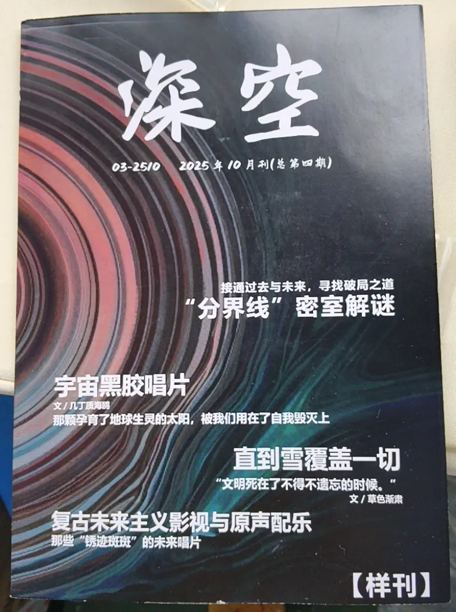
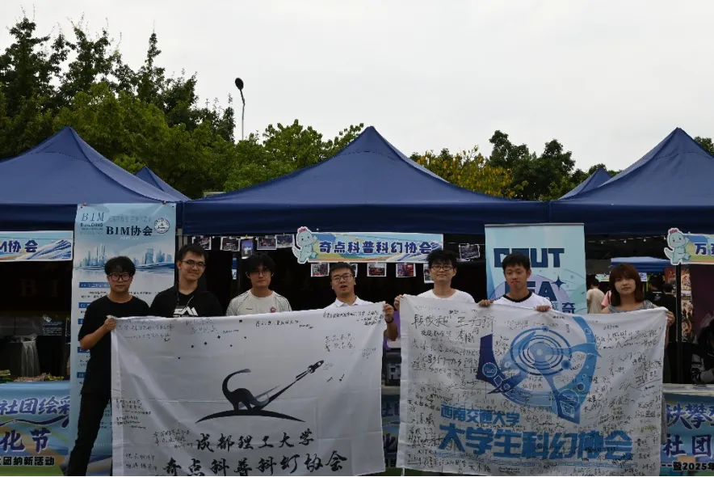

本文写在2025年国庆假期后，距百团大战已经过去了十多天，现在才动笔主要原因还是个人太过懒惰，说起来实在惭愧。本文仅根据十口个人在9.26、27日这两天的记忆写成，内容纯出自个人视角，因此不能完整记录百团活动的全内容。因记忆模糊也可能出现漏写错写人、物、事的情况，欢迎各位指正。

# 9月26日

上午10点多，白天鱼（23届副会长）在光影（23届活动部部长）的帮助下，带着自己定制的两个MC头壳（其中一个是社娘星祈的形象）、pico 头显、展示用活动照片、自制的梗图无料来到了百团的摊位（位于松林操场）。稍后jerriel（25届会长）拿来了招新用的展示物、奖品及其他物料，接着又离开去取本次活动的海报。下午1点40左右，我带着作为奖品的图书来到摊位，与jerriel简单布置了一下摊位。

下午2点，百团招新正式进行。这次百团我们准备了答题活动，奖品包括会徽吧唧、星祈钥匙扣、星祈吧唧、星祈立牌、科幻图书、gsc小手办。另外还有明信片和丝带作为无料。招新活动进行的很顺利，有很多同学参与了答题，我也发现了很多浓度很高的科幻迷新生。有把银河帝国系列反复读了多遍的阿西莫夫死忠粉，也有人一连说出多部我闻所未闻的科幻作品（他在找看Xeelee的书友），还有人已极高的正答率赢下了我们准备的大奖——gsc  eva手办。

招新期间，白天鱼一直在张罗让大家通过他的头显体验“三体远征游戏”，据他说这是部地道的烂作，他很想坐实我吃屎大王的名头而积极向我推荐，遭到了我的正义拒绝，后来因为电源和时间问题，实际体验的同学也不多。下午4点多，子夫（24届会长）带着自己的模型和图书来重新布置了摊位，林大人是羊、无明（25届活动部部长）、房友欣、Doomer Jreg（dj)、朱界诚（25届采编部部长）、夏亚（25届文宣部部长）、星沉等幻协成员也都来到了招新的现场帮忙。

第一天的招新接近尾声时，我跟jerriel清点了一遍物资，沟通了答题难度的情况，我觉得当前的题目太过简单，奖品的获取难度低，对库存考验很大（舍不得爆金币了），jerriel同意了这个观点，并决定在第二天对题目进行调整。晚上八点多我离开了摊位，jerriel负责了当日的收尾工作

# 9月27日

第二天，我可耻地睡过头了，主要原因是前一天晚上被同学喊去喝酒，个人没抵制住诱惑，跟他们喝到晚上一点多才回到寝室休息。

醒来的我慌忙收拾好东西出门，期间还在幻协的工作群里向大家道了个歉。不过当我抵达松林操场时（9：30左右），眼前只有空无一人的摊位，原来其他人都还没来，我竟是最早起床的那个。在群里催了一下其他人出门后，我按前一天的照片布置好了摊位（子夫摆的确实很有巧思），然后坐等社员和新生上门。

不过本社的社员还没等到，我先等来了其他幻协的成员。

上午10点40分左右，西南交通大学科幻协会的现任会长美芹和现任副会长五代在动漫协会成员的帮助下来到了松林操场，因为五代和另一位西交的同学（非科幻迷）都跟漫协的特摄部常有联系。美芹与我交换了两个协会的金属徽章及其他物料后，向我展示了交大幻协会刊《深空》第四期的样刊。

他们还热心的帮助我调整摊位布置，分发传单。然后本社的jerriel、星沉、无明等人陆陆续续的来到了摊位。jerriel在第一天的基础上对活动题目进行了调整，不过我和jerriel一致认为我们采用的问答形式实在太费时费力（拿着纸让同学们一个一个回答），并不利于我们的招新。另外我们也达成了共识，只要我们认真讲解宣传，就不会错过真心想加入幻协的同学。所以我们第二天实际上没有怎么进行答题活动。无明并没有待多久就离开了，因为他的导师李晓巍要在今天中午参加学校举办的集体婚礼，他也要去凑热闹（此为伏笔），我们还打包了一些幻协的周边托无明带给李老师他们。

中午12点30左右，拜托已经吃过午饭的eto看守摊位后，我、星沉、jerriel、朱界诚和美芹前往了理工东苑的奇味干锅吃午饭（五代和漫协的同学一起去吃凉面了），吃饭过程中我们简单交流了会刊制作，协会现状，参展经验回忆、协会发展等问题，但具体内容我已复述不出来了，仅在此分享我当时提出的两个古怪（扯的没边）想法。

第一，我认为，科幻协会普遍存在过度偏好@全体的情况，过多@会引起部分成员反感，尤其是不常参加活动的成员，这样会为幻协健康发展埋下隐患，所以必须想办法解决，于是我提出了@全体审批制度，全称《关于指导科幻协会内部艾特全体成员的相关办法》（详情请见文末）

第二，考虑到我们协会至今没有属于自己的活动室，一直处于协会资产无处可放、日常活动四处奔波的凄苦境地，我提出了一个曲线救国，为幻协搏活动室的办法……（详情请见文末）

饭后我们一同回到了招新摊位，看到了一位陌生的身影，那是本协会的21级会长丁菲学姐(丁皇)，她现在正在上海读研。本次国庆假期，她和幻协的其他几位学长学姐约好了自驾去九寨沟，她提前了几天来到成都，所以能出现在我们的摊位。虽然线上有过不少交流，不过我还是第一次见到她本人。除了丁皇，当天还有佩玲（带了一套轻小说赞助协会）、自动机（带了很多甜品点心）、巨宅（gsc手办提供者）三位在成都工作的学长来到了百团现场。

几位学长学姐过来后，都轻车熟路地操起海报，与我们一起招揽新生，有一说一他们比我们这些现任干事专业的多。招新途中我们也聊了很多很多，先是一起感叹漫协势力之强大，再明目张胆地悄悄羡慕他们；然后几位前辈分享起了自己毕业前在幻协的经历；我也向前辈们再次分享了近两年我在幻协的经历，以及幻协创造的新成果；当然必不可少的还有大胆锐评尖锐批判环节，不过在此就不便展开了。在此期间无明带着自己在集体婚礼现场毛的几袋子零食回来，dj从宿舍洗了一碗水果送给了我们（此为超级伏笔）。

在佩玲和巨宅来之前，天文协会的一位老前辈来到了我们的摊位，他是来跟丁皇叙旧的，他拿着相机提议为我们一起拍张照。于是我、星沉、自动机、eto、jerriel、丁皇、美芹举着成理和西交两个幻协的会旗一起合了影。

下午3点左右，西交的美芹和五代因为晚上还有其他事情，就先行离开了；4点左右，丁皇也因为事情提前离开了。出乎我们意料的是，李晓巍老师竟然带着他的妻子来到我们的摊位，他对严曦老师的《造神年代》有些感兴趣，可能因为他是物理学院的老师，他对此书中ai诞生意识这一设定有没有涉及硬件方面的解释而好奇。简单交流几句后，李老师就与他的妻子去逛百团的其他摊位了。

下午5点多，星沉、巨宅、佩玲、自动机、夏亚、光影等人一起去校外吃了晚饭，我和jerriel守在了摊位。晚上六点多，西南民大的龙于渊同学赶上了我们迎新的结尾，我们送给了他一些协会的周边制品，他与我们分享了他个人进入科幻圈的故事。西南民大没有科幻协会，他是在参加朝菌杯后，加入了重大的幻协群，然后又通过重邮的同学知道了河流，进入了河流的散户群，这才算真正找到了组织，他提出自己有想过在学校里创办科幻协会，但连同样喜欢科幻的同学都找不到几个。我和jerriel因此跟他交流了创建科幻协会的困难和风险，最后得出一个结论：办科幻社团，难，特别特别难。

我们一起交流了很多，不过因为时间关系他没有呆太久就离开了。因为这篇活动记录写得很晚，所以那两天的记忆其实已不怎么清晰了，27号晚上那一段时间尤其如此，大抵是最后在场的几位同学一起收拾了摊位，然后招新结束。

虽然招新回忆结束了，但还有一个伏笔尚未回收，那就是dj在27号下午为我们带来的那碗水果，但重点不是水果，而是那个装水果的碗。因为碗中套上了塑料袋，我们全都把它当作了普通的一次性塑料碗，所以在晚上收摊时也没有人注意到它，当回到宿舍后dj问起我们碗在哪里，并告诉我们他与那个碗的羁绊后（不忍心在此讲出他们的故事），我们赶忙回忆碗的去处，可最后也只能推测那个碗大概是被社联收场的同学收拾走了。现在想来还是无比愧疚，我们收拾摊位时太过粗心大意，实在对不起他为我们带来水果的心意。

说实话，幻协的底色可能是灰暗的。因为聚到一起时我们总喜欢唱衰未来，mudern担任副会长时说“我的任务就是让幻协别死在我手上”，我也常常开玩笑说指不定哪天幻协就完蛋了。虽只是调侃，但也确实表示着我们对幻协未来的担忧，因为我们见到了太多戛然而止的故事，多少努力到最后都没有结果，难免会使人心灰意冷。

不过至少现在看来，我们的故事还不会完结。虽然时间匆忙（银河科幻大会到百团期间只间隔五天）、错误连连，但这次招新还是取得了令人喜悦的成绩，两天中有近百位同学加入了幻协的大家庭。回想起去年招新，我们为招到50名同学而狂喜，香槟开得漫天，就不免感到有些感慨，不知不觉中我们竟然又前进了这么多。

最后郑重感谢所有幻协干事的付出，感谢所有前辈们的陪伴，感谢所有友协的帮助，也感谢所有愿意支持、相信奇点的人。还有更多的故事在等着我们去创造，希望新的一年里各位可以在奇点幻协玩得开心，收获属于自己的珍贵记忆！

# 附录

十口胡扯二则

一、《关于指导科幻协会内部艾特全体成员的相关办法》，细则如下：

为避免过度艾特全体影响同学好感度，本协会@全体行为需经过严格审批后执行。

具体流程为：

①社员根据需要提出艾特全体要求，填写申请表解释具体原因

②将申请表递交给所属部长

③经部长审核盖章后，移交申请表至副会长

④副会长签字后交给会长进行最后审批

⑤会长审批通过后，社员需向会长和副会长答辩解释艾特的合理性

⑥答辩通过后，在工作群公示七日

⑦若无同学异议，公示期过后社员可凭借申请表向群管理提出艾特请求

⑧群管理核查申请相关证明材料、审批信息准确无误

⑨进行艾特全体

注：如有重要事件需艾特全体，还需要上报至社联、指导老师等，具体流程详见《关于科幻协会内部重大事件艾特全体成员的相关办法》

以上毫无疑问都是玩笑话，不过我确实也觉得滥用艾特全体功能应当警惕，虽然很难说有什么大危害，但也最好尽量避免引起同学们的反感。

二、幻协活动室拯救法

背景：奇点幻协迫切需要社团活动室

前提条件：已知幻协成员可以担任学生会职务 已知学生会等校级组织拥有自己的办公场所 

具体内容如下：

①从大一开始培养一批忠于幻协的骨干力量，鼓励他们加入学生会等校级组织，并一步步晋升成为组织一把手。

②一旦有幻协成员担任校级组织的一把手，直接宣布成为当届幻协会长。（为避免学校系统出现冲突，幻协需另设一位名义上的会长）

③幻协会长在校级组织的办公场所中划分出一个区域交给幻协，名义上不改变其用途，实际上将其作为幻协的活动室使用。

④因此只要哪一年有幻协成员担任校级组织的一把手，幻协就可获得一年的临时活动室了

以上内容更是半点谱也不靠，只是一个妄想得到活动室的幻协怪人的胡言乱语罢了。
