原文于2016年3月1日发表在作者个人网站“新书与旧书”（Régi Új Könyvek）
匈牙利的科幻奇幻杂志如雨后春笋般不断涌现。在国家体制变革之前，《银河》（Galaktika）几乎是匈牙利唯一一本定期发行的科幻刊物，而到了90年代，匈牙利本土创作者也迎来了机会。
在这些杂志中，出现了许多匈牙利作家创作的小说，他们的水平丝毫不逊色于外国作家。
在这个时期，我订阅并阅读了许多科幻奇幻刊物，因为时代变化迅速，这些刊物每年都有停刊和新创刊的情况。在过去的几个月里，我重新翻阅了这些杂志。下面我将介绍20世纪90年代（主要是90年代上半叶）出现的匈牙利科幻奇幻刊物。
曾经有一段时间，匈牙利与角色扮演游戏相关的奇幻杂志吸引了大量读者，这些杂志中，人物的性格特点和能力决定了角色的设定。这份列表可能并不完整——因为我也不可能了解所有刊物——但我会用简短的话语介绍一些比较知名以及不太知名的杂志。 我将先介绍科幻杂志，再介绍综合类杂志，最后介绍奇幻杂志。
20世纪90年代的匈牙利科幻杂志
科幻杂志《织女星》（Vega sci-fi magazin）在20世纪80年代就有前身。1990年6月，1984年开始发行的《织女星》以新的形式首次亮相（封面上错误地印成了5月）。
在《织女星》上，匈牙利作家终于有了发表作品的机会。许多新老匈牙利创作者的小说得以刊登，这种20世纪90年代业界繁荣的景象，在20世纪80年代一家独大的《银河》上是不可想象的。在《织女星》上，我们可以了解到很多科幻界的消息，包括国内外的活动。杂志还介绍了许多知名科幻作家，提供了他们的书目信息和获奖情况。此外，还有科普和知识拓展类的文章，以及关于科学前沿的趣闻。
杂志也少不了征文活动，漫画、奇幻画作和海报也定期出现。在互联网时代之前，关于匈牙利科幻社团、出版物和活动的信息很实用，这让与地方组织和读者的交流更具信息价值。20世纪90年代的匈牙利科幻奇幻杂志或许也从这本杂志的创意和编排中汲取了灵感。
许多优秀的匈牙利科幻小说在《织女星》上崭露头角。比如，我很喜欢的久洛·霍尔蒂（Győző Horti）的《清凉的黎明》（Hűvös hajnal）、拉斯洛·R. 霍洛斯（László R. Hollós）的《对接》（A visszacsatolás）、帕尔·G.纳吉（Pál G. Nagy）的《检查》（A vizsgálat）、焦尔吉·科瓦奇（Györgyi Kovács）的《离去的女孩》（A lány aki elment）等作品。
尽管这本匈牙利科幻杂志很实用，但可惜的是，到1991年，随着匈牙利邮政的发行系统崩溃，《织女星》杂志在发行第8期后停刊。
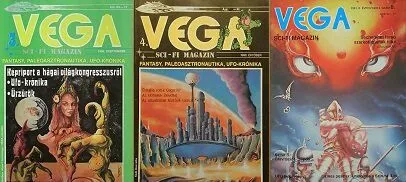
**匈牙利科幻杂志《织女星》**
《金星——科学幻想杂志》（Vénusz tudományos - fantasztikus magazin）于1990年由罗伯特·舒奇（Róbert Szűcs）创立的金星有限公司（Vénusz Kft）首次推出。它的内外设计都十分精美，与其他同类杂志不同的是，它在奇幻内容中着重突出了情色元素。
《金星》杂志定期刊登配有彩色图片的科幻电影和视频介绍。知名科幻作家的优秀中篇小说也不断出现。漫画也不少见（在此之前我只在一两本《方块》（Négyzet）杂志上见过科幻漫画），还有大量的插画、海报，当然是以情色元素为核心。
除此之外，我们还能从中学到很多科幻历史知识，有新闻、趣闻、研究文章，还有关于不明飞行物的内容。还能看到著名艺术家的作品，比如鲍里斯·瓦列霍（Boris Vallejo）或西德·米德（Sid Mead）的画作。1990年底，第6期和第7期合刊作为特刊发行。
发行情况的变化也影响到了《金星》，这成了它旧版本的最后一次亮相。1991年，新金星有限公司（Új Vénusz Kft）成立（该公司也出版书籍，但后来停业了），杂志有了继续发行的机会。《新金星》于1991年3月问世，比原版篇幅更长（64页），但只发行了2期。
《X杂志》（X-Magazin）是一本科幻与科普杂志。它于1996年12月首次发行，1997年又有了新的版本。除了科幻故事之外，该杂志还探讨了与奇幻元素相关的科学研究主题，读者也可以投稿短篇小说。此外，它还涉及电影、视频以及电视剧（比如20世纪90年代广为人知的《X档案》），后来杂志栏目中还出现了漫画。1998年2月，第15期也是最后一期《X杂志》问世。

| 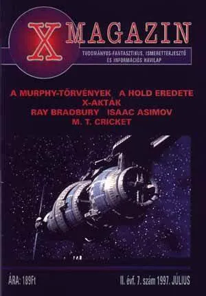 | 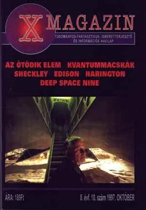 |
| --- | --- |
|

**匈牙利科幻奇幻杂志《X杂志》**
20世纪90年代匈牙利科幻奇幻综合性杂志
《邂逅：科幻与奇幻》（Találkozás science fiction & fantasy）由艺术凤凰有限公司（Art Phoenix Kft）出版，第一期于1989年发行。漫画是该杂志的主要特色之一，例如《神秘世界》（Titkok világa），该作品也以漫画形式连载。这里自然也少不了短篇小说，其中包括三篇美国作家罗伯特·霍华德笔下人物柯南（Conan）的故事，如《屋内的幽灵》（Zsiványok a házban），这些故事后来以其他书名结集出版。此外，《邂逅》中也有一些奇幻历史内容以及其他素材。据我所知，到1990年该杂志至少发行了7期。

| 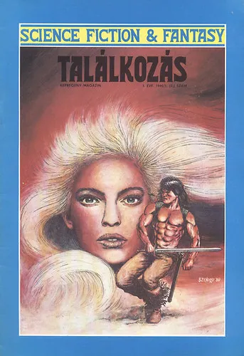 | 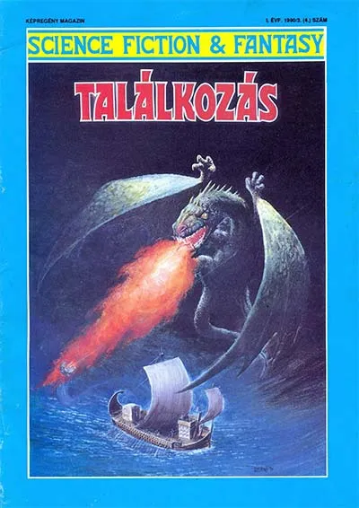 |
| --- | --- |
|

**匈牙利漫画杂志《邂逅：科幻与奇幻》**
《猎户座》（Orion）最初于1992年以《猎户座13》（Orion 13）之名发行，从1993年起简称为《猎户座》。该杂志由普雷耶·胡戈（Preyer Hugo）创办，定期刊登匈牙利作家的作品。后来，外国作家的作品也逐渐增多。杂志还开始连载科幻系列故事，比如帕尔·G.纳吉的《36号巡逻舰的冒险》（A 36-os őrhajó kalandját），以及《星际迷航》（Star Trek）中的《可汗之怒》（Khan haragját）。与此同时，其他素材、介绍文章、研究论文和趣闻轶事也丰富了杂志内容。

| 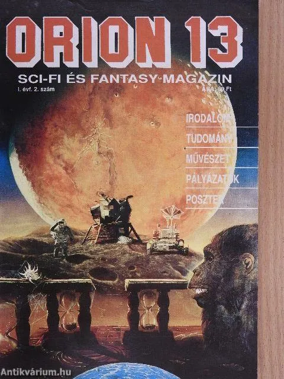 | 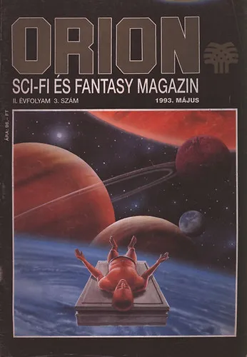 |
| --- | --- |
|

**匈牙利科幻奇幻杂志《猎户座》**
《人造人》（Android）可被视为《猎户座》的“姊妹刊”和后续刊物，在1993年4月至8月间共发行了5期。其主要内容大多是匈牙利的科幻和奇幻短篇小说。和《猎户座》一样，这里也出现了一些篇幅较长的文章。这两种题材在此相得益彰，毕竟在奇幻作品中它们也常常相互融合，想想星球大战：达斯·贝恩三部曲（Darth Bane）或者虚空三部曲（Üresség trilógia）就知道了。
此外，杂志还会定期报道俱乐部新闻，设有书评、报道和填字游戏等板块。还有编辑给业余创作者的留言，这些创作者会向杂志投稿他们的文章以及其他奇幻作品。
遗憾的是，由于普雷耶·胡戈在7月去世，《人造人》杂志也很快停刊了。

| 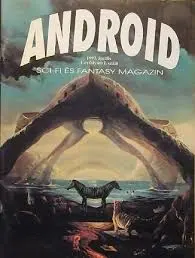 | 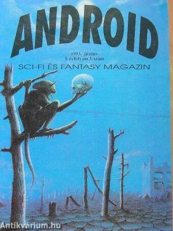 |
| --- | --- |
|

**匈牙利科幻奇幻杂志《人造人》**
《符文》（Rúna）杂志主要介绍各种知名的科幻和奇幻世界，如《魔法至尊》（M.A.G.U.S.）、《星球大战》（Star Wars），以及角色扮演游戏的相关装备，也包括短篇小说。此外，还有新闻、电影、CD相关内容，以及读者来信，不过到后期减少了很多附录内容。与其他杂志相比，这本杂志存活的时间相当长，从1994年到2000年共发行了28期。

| 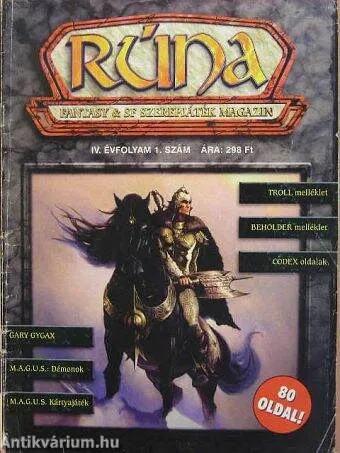 | 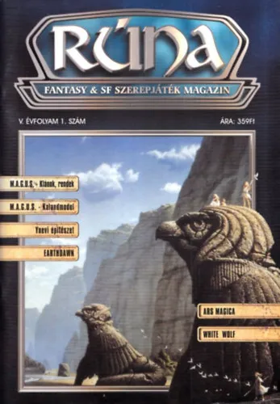 |
| --- | --- |
|

**匈牙利奇幻与科幻角色扮演杂志《符文》**
《阿洛诺里编年史》（Alanori Krónika）是守护者有限公司（Beholder Kft.）旗下的杂志，杂志内容基于该公司自主开发的游戏。杂志中介绍了多种通信类、卡牌类和网络类游戏，公司还出版了自己的书籍。这家1992年成立的匈牙利公司在1996年到2007年发行该杂志，此后仅在网络上有相关内容。

| 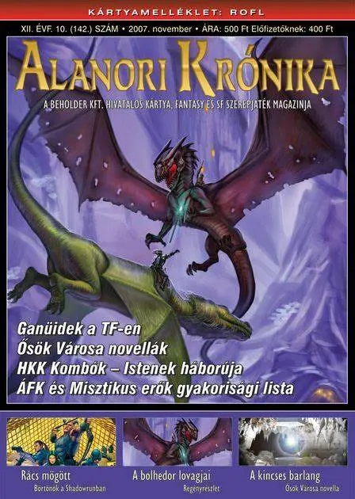 | 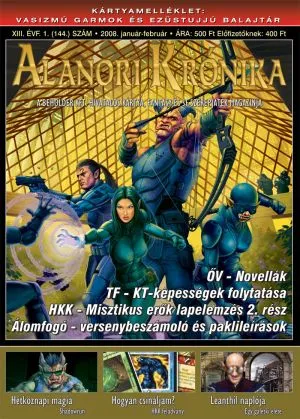 |
| --- | --- |
|

**匈牙利奇幻与科幻角色扮演杂志《阿洛诺里编年史》**
《龙》（Dragon）杂志由后来凭借《星球大战》系列书籍大获成功的苏基茨出版社（Szukits kiadó）于1998年为匈牙利角色扮演游戏爱好者群体出版。除了文章之外，杂志中还有短篇小说以及其他与主题相关的栏目。和英文版《龙》杂志一样，这里也有系列故事、漫画和教学类文章。《龙》杂志在1999年9月停刊前共发行了9期。

| 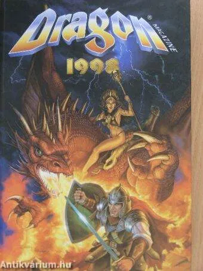 | 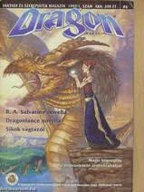 |
| --- | --- |
|

**匈牙利角色扮演与奇幻杂志《龙》**
20世纪90年代的匈牙利奇幻杂志
《亚特兰蒂斯》（Atlantisz）是第一本匈牙利语奇幻杂志，它作为《银河》（Galaktika）的“姊妹刊”于1989年问世。由于同年出版了罗伯特·E·霍华德（Robert E. Howard）所著的《蛮王柯南》（Conan a barbár）系列短篇小说集，人们对硬核奇幻的兴趣大增。受此影响，《亚特兰蒂斯》上出现了许多硬核、剑与魔法类型的奇幻故事，当然也有大量其他风格的短篇小说。
许多知名奇幻作家的大量短篇小说都在该杂志上发表，此外还能读到其他内容，比如每一期都有关于奇幻文学不同元素的词汇表板块。《亚特兰蒂斯》杂志在1991年前共发行了13期，之后便停刊了。

| 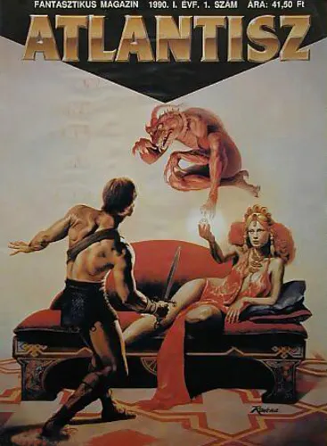 | 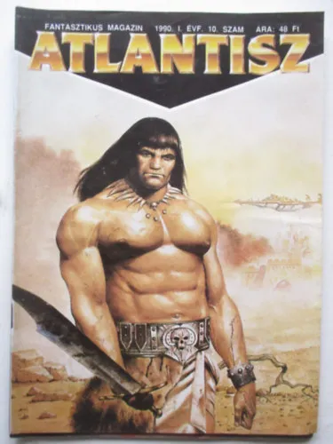 |
| --- | --- |
|

**匈牙利奇幻杂志《亚特兰蒂斯》**
在20世纪90年代的匈牙利科幻与奇幻杂志中，《绯月》（Bíborhold）杂志于1992年12月首次发行。除了奇幻短篇小说外，该杂志还着重介绍和讲解奇幻游戏与角色扮演游戏。它会回复读者来信，也会介绍作家和作品。此外，还介绍了各种奇幻生物，设有填字游戏和幽默板块，同时也介绍电脑奇幻游戏，详细描述奇幻世界和角色。
《绯月》杂志在1994年前每月发行一期，从1995年起由《月潮》（Holdtölte）
杂志接替，直至1996年停刊。

| 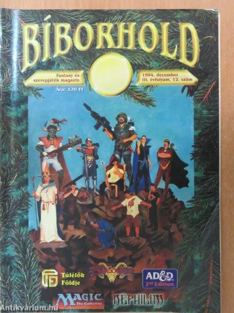 | 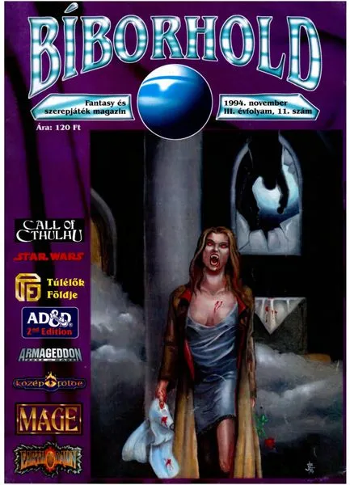 |
| --- | --- |
|

**匈牙利角色扮演与奇幻杂志《绯月》**
20世纪90年代的其他匈牙利科幻奇幻杂志
地方出版社和俱乐部出版了许多刊物，这里我仅顺带提及我所了解的几本。
玛尔叙阿斯科幻俱乐部由作家D.伊斯特万·内梅特（D. Németh István）于1988年创立，后来由拉斯洛·施魏尔（Schweier László）接手管理，随着时间推移，它成为了玛尔叙阿斯全国科幻协会俱乐部。我曾在1994年左右和拉斯洛·施魏尔通过信，因此得以接触到他们的一些出版物。《玛尔叙阿斯》（Marsyas）杂志从1988年开始发行，后来还有《玛尔叙阿斯增刊》（Marsyas Plusz）。这里面有业余作者的短篇小说、创作者介绍、插画以及其他科幻内容。
《玛尔叙阿斯小说库》（Marsyas regénytár）是1994 - 1995年间出版的小型免费刊物，其中收录了短篇小说，主要是外国作品和翻译的短篇小说。此外，俱乐部还出版了《玛尔叙阿斯资讯》（Marsyas Info）、《科幻全景》（Sci - fi körkép）和《玛尔叙阿斯漫画库》（Marsyas Képregénytár）。

| 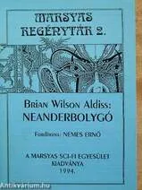 | 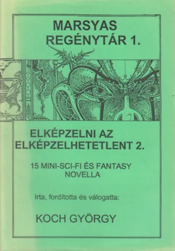 |
| --- | --- |
|

**《玛尔叙阿斯》杂志及出版物**
20世纪90年代的其他匈牙利科幻杂志
奇幻冒险小说杂志《天狼星》（Szíriusz）和《织女星》同时发行，每一期都是一部小说。

| 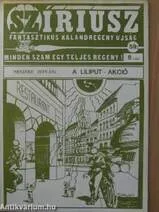 | 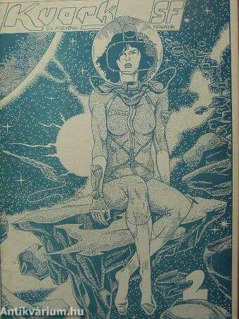 |
| --- | --- |
|

**《天狼星》和《夸克科幻前维加》**
我对韦什普雷姆（Veszprémi）出版的《夸克科幻》（Kvark SF）曾名《前织女星》（Prevega）了如指掌。这本匈牙利科幻杂志在1988年和1991年发行，大部分内容是业余科幻短篇小说，此外还有评论、作品介绍、创作者介绍等内容。
如果你喜欢，也分享给其他人吧！
