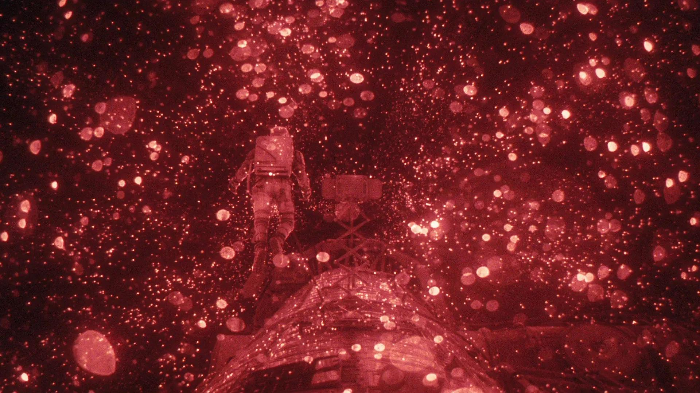
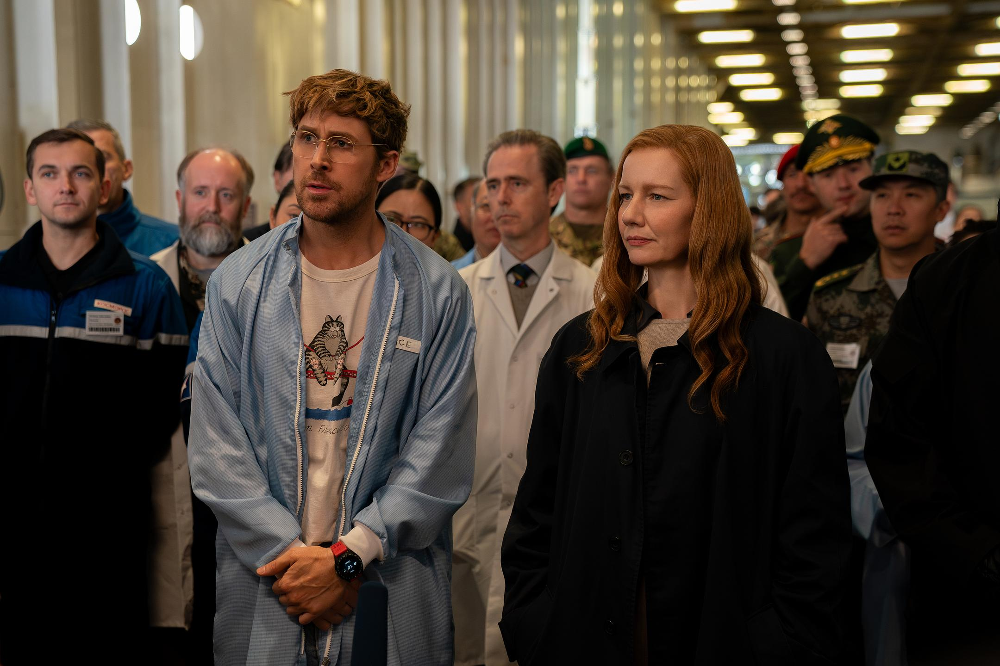
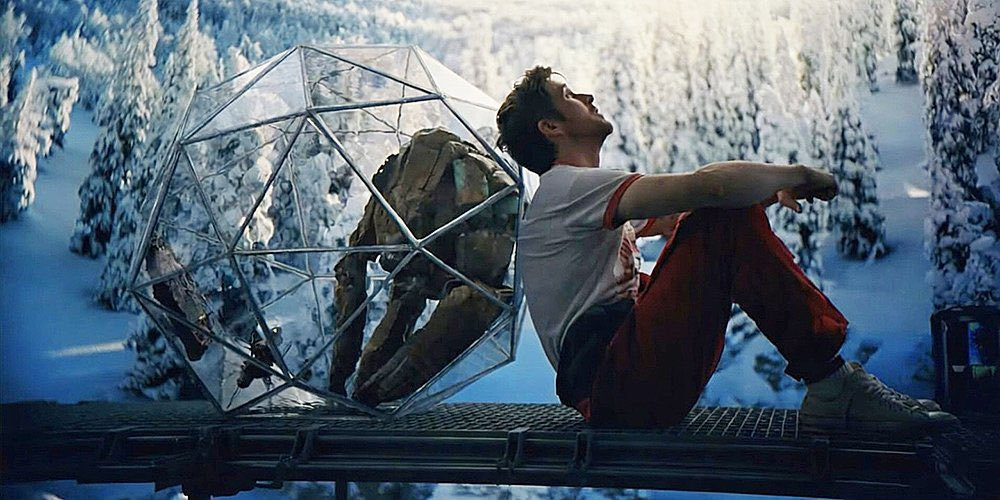
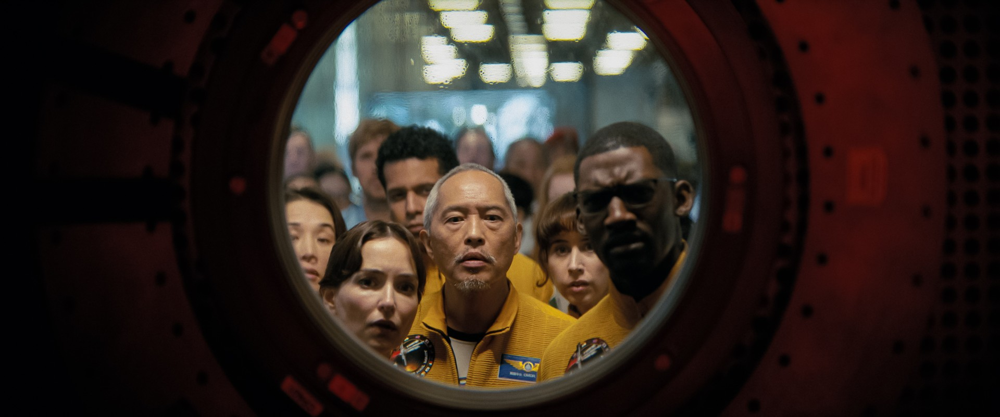
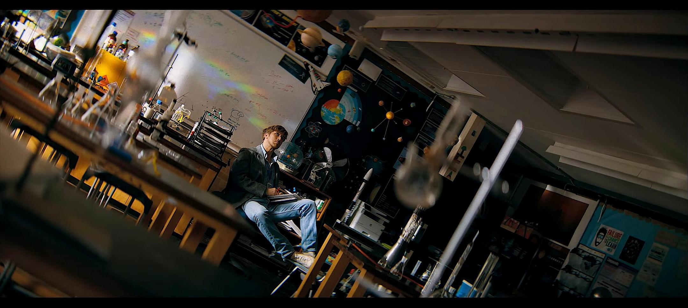
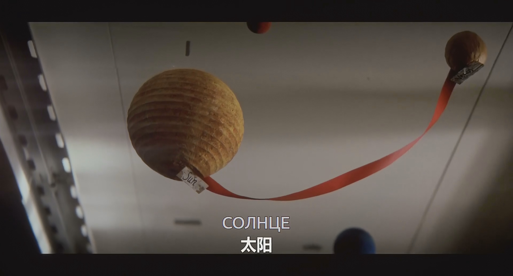

在 IMAX 里一刷完《挽救计划》，我最直接的感受，其实是遗憾。

这种遗憾并不来自于“电影拍得不好”。恰恰相反，它来自于电影拍得已经足够好了，甚至好到让我第一次如此清楚地意识到，电影这种载体本身是有边界的。

当然，这种边界并不意味着电影的失败。电影有属于电影自己的美感，有它在视听层面瞬间击中观众的能力，也有用一个镜头、一个构图、一个音色就把人拽进情绪里的天赋。《挽救计划》的电影版，恰恰就在这些地方做得相当出色。也正因为如此，我在遗憾之外，又生出一种很深的庆幸，**庆幸小说这种载体，尤其是科幻小说，还远远没有抵达结构表达的极限。**

所以这篇文章，我不太想把它写成一篇单纯的影评，也不想写成一篇纯粹的原著赏析。比起给电影打分、给改编挑错，我更想从两个角度去重新感受《挽救计划》这个故事。一方面，它在电影中如何成立；另一方面，它在从小说走向电影的过程中失去了什么。

如果你和我一样，在看电影之前已经读过原著小说，我其实很建议你换一种方式进入这部电影。不要把电影当成对小说的“简化复述”，而是把它们看作《挽救计划》向两个不同方向生长出来的分支。

电影相较原著，并没有对主线做大刀阔斧的重写，变化更多集中在人物塑造、叙事节奏以及科学原理的删减上。正因如此，它更像是同一故事的另一种演绎。只有这样，你才能在观影时避免不断对照小说，错过电影这个媒介真正能带来的体验。

## 一、作为电影相当出色

《挽救计划》的电影版最先打动我的，不是故事，而是画面。

这部电影由曾执导《蜘蛛侠：纵横宇宙》的菲尔·罗德与克里斯托弗·米勒操刀。提起《纵横宇宙》，很多人脑海中第一个浮现出来的，都是它极其鲜明的视觉设计：不同宇宙拥有不同的美术风格，色彩张扬、构图夸张、镜头运动充满漫画感。这样的创作者来拍《挽救计划》，其实是很值得期待的，因为这部作品本身就需要一种能够把“概念”转化为“奇观”的导演能力。

而成片也确实证明了这一点。

最让我印象深刻的视觉时刻之一，是格雷斯与洛基进入艾德里安的佩特洛娃线时，导演借用了“佩特洛娃镜”的主观视角，用近乎纯粹的黑与红迅速把观众拖进那个既陌生又壮阔的宇宙现象里。那一刻的震撼，并不来自对白，也不来自解释，而来自画面本身带来的压迫感与宏大感。它不需要你完全理解其中的科学原理，甚至不需要你来得及思考，它先把“宇宙的巨大”和“人类视角的渺小”直接灌进你的感官里。

另一个极强的视觉记忆点，是停泊在艾德里安轨道上、“钓鱼”开始之前的那段。艾德里安那种以绿色为主调的、带着异质感的外星景观，让整部电影终于真正有了“异星”的质感，而不再像是地球环境的延伸。这种不属于人类经验的空间感，会自然地强化格雷斯当下的处境，同时让观众在感受到宏大神秘的同时，更好的理解格雷斯的心境。

但真正让我第一次意识到导演构图意识非常明确的，反而不是这些大场面，而是一个相对安静的镜头：格雷斯在基地研究后，独自坐在通道中的那一幕。导演给了他一个近乎黑白剪影式的构图，把他压进狭长、封闭的空间里，整个人显得犹疑、疲惫，又被一种无形的压力包围着。紧接着，下一个镜头里斯特拉特从光亮中走来，形成极强的对比。这个处理其实非常精妙：它不仅在视觉上区分了两个人的气场，也在不言明的情况下暗示了他们的关系，格雷斯是被局势裹挟的人，而斯特拉特是主动主导局势的人。前者在阴影中犹豫，后者从光里走来。人物性格、权力关系、情绪气氛，都被放进了镜头结构本身。

与此同时，影片选择胶片拍摄，也进一步强化了这种“电影感”。胶片颗粒与这些经过精细设计的构图、灯光和奇观场面结合在一起，确实带来了一种比较稀缺的质地：它不是纯粹的数字清晰，不是那种过分光滑的科幻片表面，而更接近某种有触感、有重量的影像。然而，这一点对观众的接受度也的确有门槛。对像我这样本来就不太喜欢颗粒感、又恰好坐在 IMAX 靠前位置的人来说，有些画面会呈现出一种轻微的模糊和不够锐利的观感。不过这并不是拍摄上的失误，而是风格选择带来的取舍。

声音设计上，这部电影也比我预期中要克制得多。

除了安迪·威尔本人偏爱的甲壳虫乐队作品之外，影片并没有走那种“大编制交响乐渲染宇宙崇高感”的传统路线。它使用了很多电子音色、人声氛围和相对克制的配乐编排，去塑造一种更空灵、更神圣、也更少恐惧感的宇宙体验。这一点很有意思：很多太空电影会把宇宙拍成令人战栗的深渊，而《挽救计划》更像是在把宇宙拍成一个宏大、冷寂、但并不完全敌对的空间。它没有过分强调恐惧，而更强调一种近乎宗教式的寂静空灵的感觉。与此同时，大量风格各异的流行歌曲又不断提醒你：这一切终究和“地球生活”有关，和那个充满琐碎、音乐、习惯、流行文化的人类世界有关。

所以，如果只把《挽救计划》当作一部电影来看，它其实是成立的，甚至在视听调度上是相当出色的。问题不在于它拍得不够好，而在于，**这个故事本身，原本就不是一个只靠视听就能完整承载的故事。**

## 二、当它从小说变成电影

如果从“故事改编”的角度来看，《挽救计划》的原著小说在完整性上，几乎是全方位强于电影的。

这并不是一句简单的“原著党抱怨改编不如书”。更准确地说，是这个故事本身的信息密度、人物塑造方式以及叙事结构，都天然更适合小说，而不那么适合电影。导演当然做了大量取舍，这些取舍里有相当一部分我其实是能够理解，甚至如果是我来改编，也未必不会做出类似的选择。问题在于，**当一个故事的成立高度依赖内心独白、推理过程、科学解释与人物关系的渐进生长时，电影两个半小时的篇幅，客观上就是很难完整容纳它。**

于是电影的很多问题，并不是“改错了”，而是“改了之后，必然会失去一些作品厚度的天然支撑”。

我觉得这些损失，大体可以分成三个层面：**人物塑造的偏移、叙事结构的失衡，以及硬科幻部分的浅化。**

## 三、第一重损失：人物扁平化

电影中的几乎每一个关键角色，相较于小说，都发生了不同程度的扁平化。这种扁平化不是说角色完全变了，而是说：他们身上那些本来彼此矛盾、彼此补充、能让人物真正“立起来”的部分，被压缩掉了。

### 1. 洛基：沦为单一“太空搭档”

洛基是我觉得最可惜的角色之一。

电影里的洛基当然仍然可爱，也依然承担了大量情感记忆点，比如原创设计出来的“向下大拇指”之类的桥段，确实很容易成为观众记住这个角色的抓手。但如果和原著相比，电影版本的洛基明显失去了一些非常重要的层次：**他的工程师气质、他的羞怯、他的善意，以及他和格雷斯之间那种缓慢建立起来的亲密关系。**

小说里的洛基，并不是一个单纯负责“可爱”的角色。他首先是个非常聪明的工程师。更重要的是，他的聪明并不是通过一句“他很聪明”来告知读者，而是在两人不断共同解决问题的过程中，一点一点被体现出来的。他不是某一刻突然显得厉害，而是在整体相处中不断显得可靠、细致、有自己的知识系统。

同时，小说里的洛基也远没有电影里那么“自然熟”。他和格雷斯之间的关系，是在孤独、警惕、误解、试探、合作中慢慢长出来的。比如吃饭那段，在电影里，洛基强调的是自己的进食方式更“优雅”，这让他的角色气质显得更外放、更骄傲一些；但在小说里，那段真正动人的地方恰恰在于，**洛基其实并不愿意让格雷斯看自己吃饭，因为那是一件更私密、也更让他感到羞耻的事。**而正因为他不愿意，却最终还是愿意逐步让格雷斯进入那个领域，这段关系的情感进展才真正成立。

这种细节非常重要。因为小说里的洛基不是一种被驯化的“太空宠物”，也不是纯粹制造笑点和温情的外星搭档。他是一个有能力、有尊严、有边界、有脆弱点的人。电影版则更倾向于把这些复杂层次压缩成更直接的银幕魅力。他依然讨喜，但变得更快、更粗、更容易被接受，也因此更单薄。

我尤其遗憾的是，小说里那句非常经典的互相命名，格雷斯是“漏水的太空液泡”，洛基是“恐怖的太空怪兽”。而这些内容并没有出现在电影里，但这其实是两人关系质感的一个缩影。不是单纯的友情口号，而是一种建立在彼此承认差异之上的亲近和跨越宇宙两个星系孤独的相互抚慰。

### 2. 斯特拉特：重量与果断的错位

另一个让我很遗憾的角色是斯特拉特。

电影里的斯特拉特依然雷厉风行，也依然拥有极强的执行力和主导感。但她在原著中真正震撼人的地方，从来不只是“强势”，而是她那种明知自己会背负历史骂名、仍然一步一步做下去的沉重感。换句话说，原著里的斯特拉特不是一个单纯的决策机器，而是一个**承担了人类文明阴暗面后果的人**。

电影并没有完全放弃这一点，只是处理得非常隐晦。比如她独唱《Sign of the Times》那段，其实就是一个颇有意味的隐喻：“这是时代的征兆，不要再哭哭啼啼，欢迎来到最后的谢幕，希望你盛装打扮。”歌词本身几乎就在暗示她的命运：她要为一场不可能干净的拯救行动付出代价。再比如，她和格雷斯在甲板上的对谈，也明显在往更复杂的方向带；而影片结尾她被幽禁在破冰船上的状态，以及镜头中对她纹身的处理，也都在提示观众：她已经被审判了。

导演并不是没想写她的另一面，而是写得太隐晦。问题在于，原著里斯特拉特之所以成立，不靠这种象征性的点到即止，而靠非常具体的行动：她命令生态学家炸开南极、释放甲烷为地球保温；她决定牺牲非洲生态去铺太阳能板，为飞船制造噬星体燃料。小说只用了不算长的篇幅，就把她放进了一个非常明确的位置，**她不是“善良”或“邪恶”，她是那个必须替整个人类文明做肮脏决定的人。**

而这些情节一删，斯特拉特就从“背负一切仍果断决策的领导者”，退成了“一个很果断的领导者”。前者会让你不舒服，但生出敬畏；后者则更容易被接受，却少了厚度。

### 3. 姚与伊柳希娜：时代精神的退场

第三个让我觉得很可惜的，是姚与伊柳希娜这条线的处理。

电影里关于他们的刻画，主要落在两个地方：一是他们对自己死法的选择，二是格雷斯回忆中他们在“葬礼”前后的独白。但这一版处理，和原著在精神气质上其实已经发生了很明显的偏移。

小说里，这段最厉害的地方在于：安迪·威尔几乎只用“他们怎么选择死亡”，就迅速勾出了三个人各自不同的人物面貌。伊柳希娜一直是个乖女孩，所以在死前想体验最极致的快感，于是选择了毒品；另一位科学家选择了最无痛的氮气；而姚作为军人，出于责任感与荣誉感，选择了最后一个死，并且拿着九二式手枪，准备在前两人出现意外时替他们完成最后的了结。短短一个设计，就把责任、荣誉、个人欲望都写出来了。

但电影显然没法原样保留。你可以把这理解成篇幅问题，也可以把它理解成当下国际舆论和政治气候下的现实妥协。只是无论如何，这种删减都意味着，**原著里那种带有黄金时代科幻色彩的“地球共同体”想象，被削弱了。**安迪·威尔原本想表达的那种“全人类共同面对宇宙性危机”的乐观主义，在电影里变得更平淡，也更难被明确感知到。

## 四、第二重损失：叙事结构失衡

原著中最妙的一层结构，其实是“回忆”。

《挽救计划》小说并不是简单地把地球线和太空线平铺出来，而是把格雷斯对自身记忆的逐步恢复，设计成了一条非常隐蔽但极其有效的暗线。读者一边跟着失忆的格雷斯在飞船上求生，一边通过不断被唤回的回忆，拼出地球上到底发生了什么、这个计划为什么会走到今天这一步、格雷斯又究竟是怎样被卷入其中的。这个结构的好处在于，它既承担信息交代功能，又天然制造悬念，同时还削弱了“全人类末日计划”这种设定在前期可能带来的沉重感，让阅读始终保持推进力。

电影当然也保留了回忆叙事，但处理得明显不如小说自然。

最直接的问题是，影片开篇格雷斯在飞船里一边自言自语、一边探索环境的桥段，多少有些尴尬。小说中，这些内容因为依托第一人称叙述，自然而然；可一旦转成电影，角色必须把大量本该在脑内进行的推理外化出来，就会出现节奏上的迟缓和表演上的刻意。另一方面，电影在回忆插入点的选择上，也和小说不同，这导致观众在接受格雷斯后续行为时，所拥有的前置信息发生了变化。而这件事带来的最大伤害，是，**它损害了格雷斯这个角色最重要的人物弧光。**

小说里的格雷斯，不是传统意义上的英雄。更准确地说，他是一个**被逼成为英雄的人**。

他当然理性，能力当然强，但在他的性格中，恐惧与逃避一直压过责任感。他不是那种会主动为了人类命运挺身而出的人。相反，他有一种非常深植的退缩倾向：在发表了不被学界接受的论文后，他离开学术界，回去当中学老师；在被要求执行这项几乎注定是自杀的太空任务时，他第一反应也不是承担，而是拒绝。他会说自己还有学生要教，这当然是真话，但同时也是一种自我安置的借口。

而格雷斯真正动人的地方就在这里：**他不是没有善良，他是有善良，却没有勇气把这份善良稳定地转化为责任。**

斯特拉特正是看透了这一点，所以她才会选择把他迷晕、直接绑上飞船。原著里有个特别精彩的细节，格雷斯说自己会破坏任务，斯特拉特却笃定他不会。因为她知道，等他恢复记忆时，任务已经推进到一个他无法再回头的位置，而到那时，他会完成和自己的和解。

这个判断极其残酷，也极其准确。

但电影对“格雷斯的逃避性”处理得明显不够，因此他在银幕上更接近好莱坞传统叙事里那种“本来就值得托付使命的主角”，而不是安迪·威尔笔下那种更后现代、更不英雄、也因此更像普通人的科学家。安迪·威尔写人物，通常不太依赖“宏大意义”来抬高角色，而更依赖角色在具体处境中做出的选择。格雷斯的动人，本来就在于：他不是一开始就伟大，而是在一步步与洛基建立关系、与自己和解之后，才最终成长为那个愿意回头的人。

可电影由于压缩了大量内心独白、犹豫、推理和自我说服的过程，格雷斯“为什么这么做”的心理链条变短了。于是他的人物弧光，从逃避责任的人，到被迫承担责任的人，再到在关系中生成责任、最终主动选择牺牲的人，虽然大致还在，但可信度下降了。你能看到结果，却没那么充分地看到那个结果究竟是怎么一点一点生长出来。

另外，电影出于视听表达的需要，把很多原本属于格雷斯个人科研探索的过程，改成了在斯特拉特等人围观下展开。这种改法一方面确实更方便观众理解，另一方面也难免让场面显得更“戏剧化”而非“思维化”。原著里那种一个人靠脑子和耐心把科学问题一点点拆开的节奏，在电影中就很难保留下来了。

## 五、第三重损失：硬科幻退场

《挽救计划》原著最重要的亮点之一，其实并不是“太空冒险”，而是以噬星体为核心展开的一整套生物学硬科幻设定。

而电影在这一部分上的处理，可以说是足够清楚，却不够扎实。

小说里，噬星体之所以迷人，不只是因为它是一个“能吞噬恒星能量的生物”，而是因为它拥有一套极其严整、层层相扣的设定体系：它能以近乎完美的形式储存能量；它能够识别二氧化碳光谱，并以此为导航，借助“光帆”前往以二氧化碳为主的大气巨行星繁殖；它会保持恒温，这既解释了它的生物特性，也进一步被用在飞船隔热层的设计中。换句话说，噬星体不是一个“有趣的点子”，而是一个会不断向外生长、并与情节发生强关联的核心设定。

电影当然没有完全舍弃这些内容，但很多地方都被压缩得过于快速。比如噬星体保持恒温这一点，在电影里几乎只是一个一闪而过的镜头信息，大多数观众未必来得及意识到这意味着什么；噬星体引擎的工作原理，电影也并非没讲，但讲得不够突出、不够反复，因此观众很容易在第一次观影时漏掉关键逻辑。

还有一些删减，则直接影响了情节说服力。比如洛基飞船多数船员死亡的真正原因，以及为什么洛基飞船最后还剩下大量燃料、足够格雷斯使用，这些在小说里都解释得非常清楚：一方面，江波座人对辐射的认识不足，而洛基因为身处发动机附近，恰好被噬星体保护，反而躲过了辐射病；另一方面，相对论效应也使得飞船燃料的剩余量具备合理性。小说之所以经典，就在于这些看似细小的解释，都会成为支撑“世界可以运转”的基础。

电影删掉这些内容，当然是为了降低理解门槛，避免观众在短时间内被过高的信息密度压垮。但问题在于，**《挽救计划》的很多情节推进，本来就是和设定强绑定的。**一旦设定讲得不够充分，很多原本在小说里显得顺理成章的地方，就会在电影里显得更像“天选安排”。观众未必会准确指出哪里不对，但会隐约觉得：这件事是不是发生得有点太巧了？为什么偏偏是这样？为什么偏偏能成功？

例如格雷斯之所以被选上飞船，和他拥有较少见的抗昏迷基因高度相关，这在小说里是非常重要也非常清楚的逻辑；而电影对这部分的解释则明显弱了很多。于是对不了解原著的观众来说，这个关键设定就更像是一个需要默认接受的前提，而不是一个被严密搭建起来的因果链条。

这就是为什么我会说，电影并没有背叛原著，它只是把原著那种高信息密度、高解释密度的“硬科幻说服力”，换成了更偏视觉与情绪的科幻观影体验。这种取舍当然有收益，而且收益非常直观，更多人能看懂，更多人能被画面吸引，节奏也更接近主流商业片。但与此同时，它也不可避免地削弱了原著最迷人的那部分东西，**那种每一个设定都有来由，每一次“奇迹”都显得理所当然的快感。**

## 六、所以什么是媒介？

总的来说，我其实并不想苛责这部电影。

它已经是一次相当忠实、也相当用心的改编。导演没有粗暴地重写故事，没有把它彻底改造成另一种类型，也没有用一些更廉价的戏剧冲突去替代原著本身的魅力。相反，他们做了很努力的转译：把原著里那些复杂、密集、需要依靠阅读节奏慢慢消化的东西，尽可能地转成画面、声音、表演和银幕节奏。作为电影，《挽救计划》并不失败；作为好莱坞商业科幻片，它称得上十分具有诚意。

但也正因为它足够认真、足够漂亮，我才会更明确地感到一种遗憾：**有些故事的完整性，本来就不是电影能够轻易承载的。**

马歇尔·麦克卢汉说“媒介即讯息”。**媒介本身会塑造内容的形式、人的感知方式，以及社会的交流结构。**也就是说，同一件事，写成小说、拍成电影、做成短视频、放进社交媒体里，它就已经不是“同一个内容”了，因为媒介本身会改变它的节奏、重点、接受方式，甚至改变它能表达什么。

电影重视画面，天然擅长在一个瞬间里制造情绪和奇观；小说重视文本，天然擅长容纳推理、解释、犹豫、反复、内在弧光与复杂信息。前者让你“能让你直接看到”，后者让你“给你时间想明白”。《挽救计划》的电影版给了我很好的视觉体验，也让我重新感受到这个故事在银幕上的另一种生命力；但与此同时，它也让我意识到：当一个科幻故事的魅力不仅在于“发生了什么”，而更在于“为什么会这样发生”，更在于那些人物是怎样一步步变成现在这个样子的，那么小说仍然是更宽阔、更耐压、更接近极限的容器。

所以，比起把电影和小说简单地放在“谁更好”的坐标上，我更愿意把它们理解为两个分支。电影给了这个故事奇观、质感和直接的情绪冲击；小说则保留了这个故事更完整的骨架、血肉与神经。前者让它被更多人看见，后者让它真正成为《挽救计划》。

而我看完电影之后那一点挥之不去的遗憾，或许也正来自这里：不是因为电影没拍好，而是因为它拍得越好，我越能清楚地看见，它仍然替代不了小说。
