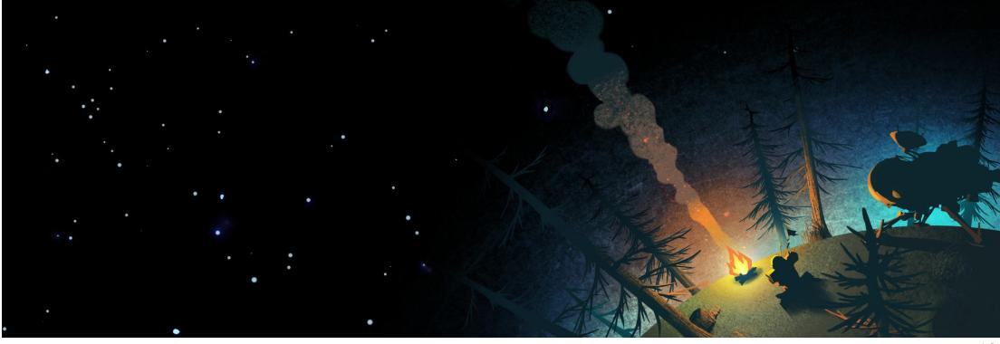

本文是一篇《Outer Wilds》(中文名《星际拓荒》)的游戏推荐,不免会有轻微剧透,内容仅代表十口个人对这款游戏的肤浅理解。它的世界远比我个人所能表达的更加宏大壮阔,如有纰漏纯个人理解能力问题,还请海涵。

在经历了约40小时的探索后,当最后一颗星星消失在视野中,我的旅途结束了。

对我来说,《星际拓荒》不仅是游戏史上的一项奇迹,更是对"第九艺术"最完美的诠释。它如同一双赛博之翼,带领每个仰望星空却无法触及的灵魂,去启航、去发现、去追问,是献给所有好奇心与求知欲者的珍贵宝藏。诸如此类的溢美之词还有许多。但本文的唯一目的只有一个:让更多人能有亲自体验这款游戏的兴趣,换句话说,传教模式,启动!

什么是《星际拓荒》?你可能从未听说过这款游戏,所以还是简单介绍一下,《原……不,《星际拓荒》是由Mobius Digital开发、Annapurna Interactive发行的一款3D开放世界的探索解密游戏。玩家将扮演名为"哈斯人"的四眼种族,通过驾驶木制飞船穿梭星系,追寻早已消逝的"挪麦人"文明遗迹,并逐步揭开这个宇宙深处的终极真相。

为了最大限度保留你的探索乐趣,本文将不涉及任何游戏内的具体剧情,接下来我将向你介绍三条「拓荒法则」,它们能帮助你更深度地沉浸在游戏之中,当然也会激发你向星空进发的兴趣。

# 法则一 信息至上法则——永远记住,信息是游戏中最最重要的部分

你最喜欢的游戏是什么?在那款游戏中最有助于推进进度、最有助于提升主角的要素是什么,等级吗?装备吗?还是其他东西?在大多数游戏中,确实需要这些要素来推动游戏进展,且它们通常是"主角"独有的。我们通过数据存档来记录这些状

态,但它们本质上并不属于你——所有权只在游戏角色手中。当然这并不是一件坏事,毕竟角色的成长也不独立于玩家而存在。

但《星际拓荒》并不一样,在游戏中你将与"主角"共享这趟旅途中的几乎所有收获——各种宝贵的信息和知识,游戏中只存在一种门槛,就是信息的有无,无论何时,甚至无论哪个存档,只要作为玩家的"你"掌握了知识,便再无阻碍。换言之游戏主角在故事前后基本上不会有什么实质性的成长,成长的是作为玩家的你。这也是我对游戏的具体内容闭口不谈的原因,我多讲一分,你对游戏的体验就会少一分。相反,你自己探索的信息越多,这款游戏对你来说就会越精彩。总而言之,信息至关重要。

# 法则二 时空运动法则——在游戏中,时间和空间一直处于运动的状态中

假设你是一只不同寻常的大公鸡。早晨四点,你昂首打鸣,准备顶着自己的大红冠巡视领地。不过这时一阵强烈的饥饿感传来,迫使你放弃了原定的巡视计划,你快步走出棚窝,围着空空的食槽转来转去,一直等到七点主人把饲料倒进食槽,终于美美的享用了早餐。

好了,鸡生模拟到此为止,请问在这段时空里你做了什么,为什么?你在早上四点打了鸣,那为什么七点时却没有?早上七点你去食槽吃了早饭,那为什么早早起床的你不能提前解决饥饿问题?这些问题听起来很白痴,但是足够帮助我们理解第二条法则的内容了。

50作为一只公鸡,早上四点正是你应该打鸣的时候,这是由你的生物钟和外部环境决定的,但随着时间流逝,已不再具备让你打鸣的条件了;虽然你早就饿的发昏,

但是因为主人还没起,没人往食槽中投放饲料,所以你只能等到他起床后才吃上早餐。在这样的世界里,时间在运动着,而空间也会随着时间而发生变化,同一片区域在不同的时空下会出现不同的情况。那在游戏世界中呢?举一个我同样很喜欢的游戏的例子,在《赛博朋克2077》的本体中有一个任务名为"夜曲OP.55 N.1",这是游戏剧情最后阶段的前置任务。当你推进这个任务并与荒坂华子见面时,游戏的时间便开始流动,你会被推动着不断前进,最终直面结局。如果你选择不做这个任务,让华子等候你,表面上夜之城依旧车水马龙、昼夜交替、人来人往,但世界已经被按下了暂停键,npc机械的运动掩盖不了世界已没有未来的事实。其实大部分游戏都是如此,时间和空间的变化依赖于玩家的行动,玩家推动则时间前进,玩家需要则空间变动,若无人干预,界的时空其实被定死在了某一刻,没什么东西能被真正改变,也不会有真正的变化,看似变化的时空,其实是机械而空洞的。《星际拓荒》不同的是,在绝大部分情况中,游戏中的时空运动并不围绕你进行,无论你做什么、看什么,世界都会按照自己的规律运行,时空也会一直处于运动的状态。在这种环境中,你可以在很大程度上体验到一种于现实类似的紧迫感,当然,对于体验游戏来说这并不是什么坏事。总之请记住,在游戏中采取行动之前,一定要考虑到时间和空间的影响。

# 法则三 自由世界法则——这是属于你的自由世界,请尽情探索

传奇沙盒游戏《我的世界》,相信你一定不会陌生,这是一个没有主线任务,提供极大自由度的沙盒游戏,你的创意有多大世界就有多大,想法有多丰富世界就有多精彩。但《我的世界》与《星际拓荒》这种存在主线内容的探索解密游戏大相径庭。假如我们给《我的世界》设置一条主线(或者目标)——比如前往末地,打败末影龙,那这两款游戏就有共通之处了。《我的世界》没有标准答案,见到末影龙前的一切过程没有定式,无论你是撸树开局的传统派还是神殿摸金的看脸派,你大可以尽情发挥想象力去探索这个世界,只要最终你能抵达末地,击败那条龙即可。《星际拓荒》也是如此,虽然没有《我的世界》那样夸张的自由度,但在探索游戏终点的路上,你有着属于自己的自由,因为你所处的不是一条无法回头的线性世界,而是存在无限可能性的群星之间。你能用自己的方式去认识一切,了解一切,探索不分先后,选择没有对错,只要能抵达游戏的最后,那就是属于你的正确道路。

这三条「拓荒法则」不仅是给那些本就打算体验游戏的玩家的建议,它们也在帮助没有了解过这款游戏的玩家判断自己是否适合这款游戏。如果它们激起了你内心的兴趣,那我将感到无比荣幸,能够为你开启这趟星际拓荒之旅。

如果你已经有了亲自体验这款游戏的打算,在正式开始游戏的时候,不妨再回想一下这三条法则。

……你回想起了信息至上法则

……你回想起了时空运动法则

……你回想起了自由世界法则

最后,在此献上我的祝贺,你已学会了三条「拓荒法则」,就请带着这些知识伴你度过余下的星际拓荒之旅。