中国科幻大会，从各种层面上来说，其实与“科幻”关系并不大。

原本在出发前，我打算写一篇详细的记录，认真写下这次参会的见闻。但真正到了现场之后，便想打消这个念头。一方面，是关于大会本身可写的内容并不算多；另一方面，那些真正值得写下来的部分，大多又与“中国科幻大会”这一官方议程本身关系有限。想来想去，还是觉得应该留下些文字，至少记录那些因大会而汇聚于此的人：远道而来的幻迷、科幻编辑、科幻作家，以及围绕他们自然生长出来的、比官方安排更鲜活也更纯粹的交流与活动。

先说中国科幻大会本身。虽然名字里有“科幻”二字，但它更像是一场披着科幻外衣的产业博览会。若要取一个更贴切的名字，也许叫“未来产业大会”或“先进科技大会”反而更准确。官方宣传强调“中国科幻大会十周年”，但实际现场更贴近现实的是“北京国际科幻与未来产业博览会”。在场馆里，你能看到探月工程模型、各式机器人、无处不在的 AI 展示、游戏体验区，以及所谓“飞行汽车”。这些内容本身未必没有价值，但它们与科幻文学、科幻创作之间的联系，其实相当松散。更有意思的是，现场还有摊位售卖按摩仪，标价 160 元，摊主热情推销，强调专利技术与保健功效。有人鉴赏带着按摩仪在馆内穿梭游走，若说这也是一种“科幻”，那倒确实称得上名副其实。

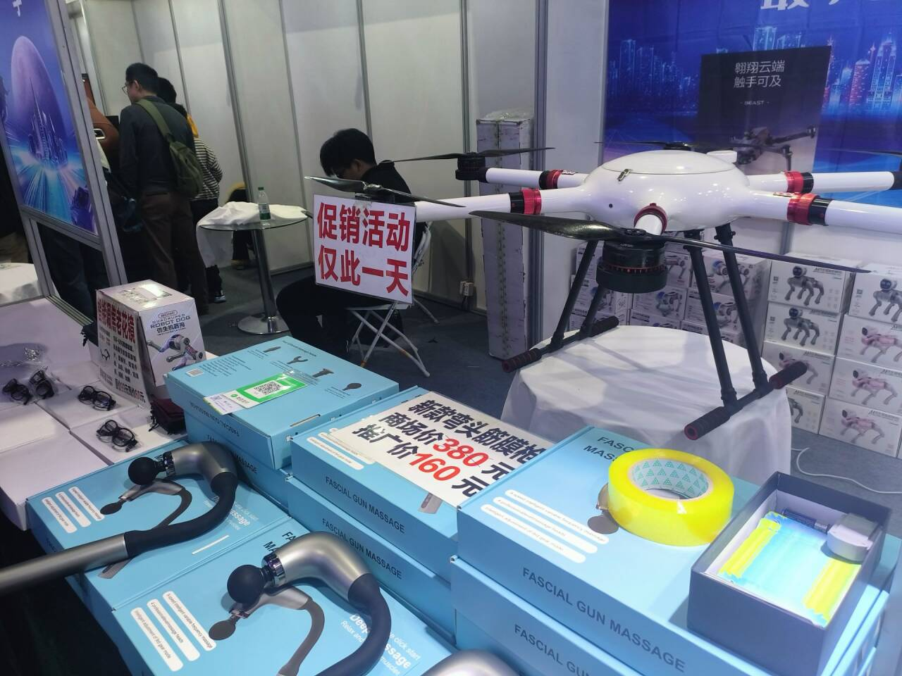

（160 元按摩仪器，促销活动仅此一天）

官方议程里最引发讨论的，大概是刘慈欣担任库洛游戏首席世界观架构师一事。这则消息一度登上知乎热榜，引发不少讨论。不过根据库洛官方公告，达成合作的并非刘慈欣个人，而是由其担任院长的北京元宇科幻未来技术研究院。许多人讨论“大刘参与后，是否能提升游戏剧情水平”，但对于熟悉中国科幻生态，也熟悉刘慈欣公众角色的人来说，这更像是一次标准化的商业合作与品牌联动，俗称“走穴”。

这些年，刘慈欣频繁出现在各种论坛、企业活动、产业合作与宣传名单里，已经不再只是作家的个人选择问题。他早就被塑造成中国科幻最稳定、最安全、最具公信力的一张名片。谁需要一点未来感，谁需要一点文化含量，谁需要一个大众能立刻识别的名字，就把他请来站一下台。至于具体做了什么、参与了多少、是否真正产生内容，往往并不重要。重要的是名字出现过，照片拍到了，通稿发出去了，外界就会默认这件事与“科幻”发生了关系。

这并不是刘慈欣一个人的问题。恰恰相反，这是整个行业贫瘠到只能反复消费少数符号人物的结果。一个发展了这么多年的领域，在公共层面仍然主要依赖同一位作家承担曝光、背书与想象力代表，本身就说明它并没有建立起更丰富的人物谱系、作品谱系与产业生态。于是所有人都知道这样做有些荒诞，但所有人又都只能继续这样做。

从这些现象来看，当下“科幻”的现实价值，更多体现在站台、包装与募资上。科幻这个词天然带着未来感、技术感和进步叙事，它几乎是最方便的一层外壳：科技展需要它来显得更有想象力，企业需要它来显得更具前景，地方活动需要它来显得更有层次，资本叙事需要它来让尚未落地的故事听起来更可信。很多时候，被需要的并不是科幻作品，也不是科幻精神，而是“科幻”这两个字本身。

它像一枚印章，盖在机器人上，机器人就不只是机器人；盖在游戏项目上，项目就有了世界观；盖在产业论坛上，论坛就仿佛通向未来。至于真正的科幻文学、科幻批评、科幻社群与读者生态，往往被安排在角落里，成为这场盛大叙事中最不重要、却最名正言顺被借用的一部分。

对此很难简单愤怒，因为这种逻辑并非不能理解：产业需要故事，市场需要符号，活动需要明星，所有人都在寻找最低成本的传播方式。只是理解归理解，看到“中国科幻大会”最后主要依靠这些东西成立，多少还是会感到一种无奈。

好，该批评的、该评论的，或者说那些与中国科幻大会本身强相关的话题，大概已经讲得差不多了。接下来的内容，则是我在大会期间，或者说因这场大会而发生的一些经历与见闻。相比官方议程，这些零散的相遇、闲谈与流动中的片段，反而更值得记录。

本次科幻大会在首钢园举办。首钢园到北京市区的距离，大致和成都科幻馆到成都市区差不多，属于并不算近、但也还在可接受范围内的郊区目的地。只是进到园区之后，我便迷路了。几座高炉之间的实际距离比想象中远得多，而且部分区域处在大会管控范围内，共享单车也不能骑行。于是如果一开始走错了方向，往往就很难在短时间内赶到另一个场馆。

不过我运气还算不错，在随机游走之中，竟然成功晃到了大会主入口，也顺利见到了“河流大军”。既然人已经找到了，去四号高炉的问题自然也就解决了。当时门口已经聚着一些熟面孔：河流、河大南山、中石油的托里拆利等等。大家在门口简单寒暄几句，便顺着人流进入主会场参观。关于展馆本身，前文已经说过，这里不再重复。稍微值得一提的是《三体》桌游，后来听说原本大概是粉丝向作品，被官方收编后正式售卖。只是价格略高，我便没有购入。不过又听说河北大学买了一套，准备作为后续社团活动物资使用。

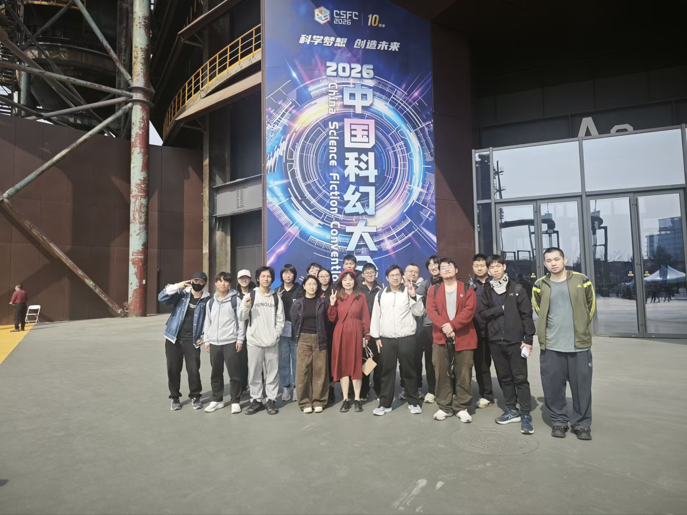

（在中国科幻大会场馆前合照）

简单逛完场馆后，大部分社团同学继续去参加刘慈欣签售会。而早早拥有签名书的我，大概已经没有兴趣再排一次那样漫长的队，只为了再拿一个签名。听说托里拆利中午不会参加高校聚餐，我便提前把《幻协生存指南》交给了她。这次十口给了我五本《幻协生存指南》用于免费发放，但事后看来，我们的预估还是过于保守。

随后，我和刘巍老师一起骑车前往吉日格勒。路上我们像两个再正常不过的科幻迷一样，聊着各种并不那么正常的话题，这大概也是科幻迷聊天的常态。我们谈到，与人相处或许有一个朴素却有效的原则：保持友善，以牙还牙，以及学会宽恕。大约半小时后，我们抵达吉日格勒。招牌上写着这是家饺子店，从外面看店面不大，进去之后却别有洞天，内部空间宽敞得像是可以承接婚宴。

到了这里，又见到了不少熟识的朋友：河流、重大的云埋、北师大的磁铁。我也顺势开始分发并介绍《幻协生存指南》，总算没有辜负自己这个“成都理工大学驻京办”的身份，算是完成了成理幻协交付的任务。云埋原本就打算预订一本，但考虑到他马上要去日本交换，大概率等不到十口邮寄，我便直接把手上这本给了他。同桌的还有中农的 action。也是在这次聚餐里，我第一次见到了中政法的闻欤和福克斯，按照河流的介绍，是“闻欤及其摄影师”。两人在谈恋爱，同时都曾担任过各自学校科幻协会的会长或副会长职务。整场聚餐来了 36 人，坐满四张半桌子，已经算得上一次颇具规模的高校幻协线下活动。

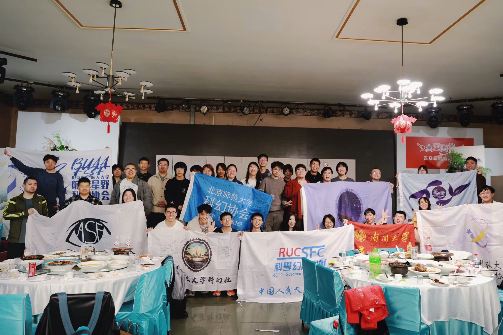

（吉日格勒高校聚餐大合影）

吃完饭后，我便跟着河流一起去参加《陌生且熟悉的她们——女性科幻的中国性与全球性》讲座。这里还有个小插曲：我们先是在场馆附近下车，却以为自己来错了地方，于是又赶去另一个点位；到了之后发现还是不对，只好再折返回来。等真正到场时，活动已经进行到一半。

这场沙龙聚焦中国女性科幻的本土经验与全球视野，邀请了凌晨、顾适、王岑岑等作家参与讨论。几位嘉宾谈到身体与意识、情感叙事在科幻中的位置，也谈到女性创作者的市场反馈，以及中国女性科幻与海外女性主义科幻传统之间的差异。现场一个颇有意思的观点是，中国女性科幻相比“对抗”，往往更强调“建构”——与其批判世界，不如思考如何改变世界。另一个让我印象深刻的判断则是，情感线在许多男性科幻里常被视作累赘，但在女性科幻创作中，情感本身可以成为理解人与世界的重要线索。关于这些内容，大抵已经有不少文章做了整理，我便写一些现场较少被记录的细节，作为补充。

先是嘉宾提问环节。主持人邀请在场的男性作家、编辑或相关从业者提问。杨晚晴表示自己没有特别的问题，但对“女书”这一主题很感兴趣，询问是否有人愿意创作相关题材的小说。分形橙子则提到，男性作家与女性作家在细腻情感描写与感知方式上，是否存在某种差异。随后，河流也结合最近正在整理的世界科幻专题，补充了一些与女性科幻和世界科幻相关的内容。他提到，在阿拉伯世界的幻想文学中，女性作者的创作往往受到家庭与社会环境的限制，甚至有人为了避免身份暴露而拒绝公开个人信息，因此这些作品本身就显得尤为难得。而在现有作品中，大多数仍以奇幻题材为主，真正意义上的科幻作品数量相对较少。其中，沙特社会活动家阿比尔·卡里于 2017 年出版的《克隆人》，便是一部较为少见的阿拉伯女性科幻作品。也正因如此，当河流提到伊朗最具代表性的科幻作家之一是女性作家佐哈·卡泽米时，这件事本身便显得更加特殊。

此外，河流还介绍了德国科幻中的女性创作现状。2019 年前后，德国科幻界曾因“德国女性科幻作家”词条问题，在维基百科上爆发编辑争议，而这场争议背后，实际上反映的是女性作家长期以来在德国科幻历史叙述中的缺位问题。此后，不少德国作者与评论者开始重新整理德国女性科幻的发展脉络，并进一步讨论女性作者比例、独立出版社困境以及德国科幻本土化等议题。另一个值得注意的现象则是，许多女性科幻作家为了避免性别歧视，20 世纪中旬的苏联时期会使用偏男性化的笔名发表作品。

接下来是读者提问环节。这时我才注意到，前排听沙龙的还有中石大托里拆利，河大鲸魁小姐和首师大最优解。其中有位同学提问，说自己作为女生，在高中创作时写下过许多情绪强烈的文字，但文学性与逻辑性都略显不足，最后文章往往只是宣泄情感的工具。她询问几位老师是否也有类似经历，又该如何面对这种写作状态。对此，凌晨老师的回应让我印象很深。她说，现在很多人写作本就不是为了发表，如果写作只是为了释放情绪，只要达到了这个目的，也未尝不是一件好事。而这些文字保留下来，未来也可能成为继续创作的土壤与素材。

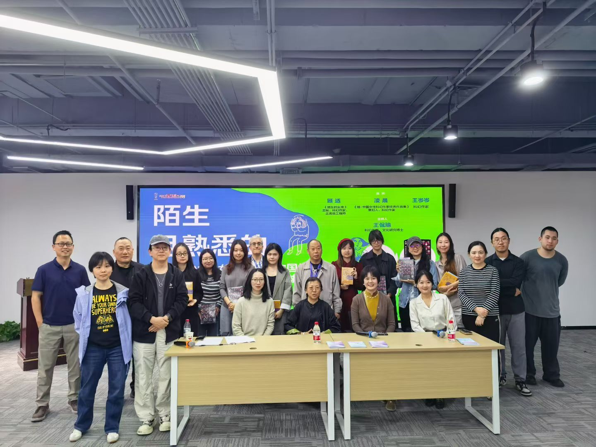

（《陌生且熟悉的她们——女性科幻的中国性与全球性》讲座大合影）

对于整场沙龙，我自己也有一些延伸的理解，在这里一并写下。

首先，从当下出版市场来看，相比传统文学，类型文学的受众往往更加稳定且广泛，科幻在这一点上尤其明显。但这些年，科幻作为类型文学，也不断与其他类型发生融合，例如推理、悬疑、社会议题写作等等。我自己的感觉是，女性主义在今天某种程度上也逐渐形成了一种具有稳定读者群体的类型表达。女性需要自己的经验被看见、被解释、被回应，而相应的作品便承担起这种需求的出口功能。一些作品在观点上的尖锐、偏斜甚至争议，恰恰也是它们能够被广泛讨论的重要原因，所以我们经常能在热搜上看到相关作品的争论。

聚焦到科幻领域，“科幻+女性”可能正是一条值得注意的路径。一方面，它多少受到近年韩国女性作家作品影响，让中国科幻意识到，这类写作同样能够扩大受众面，并引入新的社会议题。另一方面，女性主义提供了讨论的方向与场域，而科幻天然擅长搭建思想实验的平台，能够把现实经验放到未来、技术与制度变化之中重新审视。两者结合，在我看来是一种相当有潜力的尝试。

至于所谓“全球性”，我理解包含两层意思：其一，是中国科幻作品，乃至中国女性科幻作品，是否能够真正走向世界，被更多不同文化背景的读者阅读与理解；其二，是我们能否在交流之中吸收其他地区的经验，补足自身认识中的盲区，重新发现那些曾被忽视的问题与价值。也正如凌晨老师所说，中国作家的出海，并不是去挤占既有市场，而是在彼此进入、彼此交流的过程中，共同开拓新的读者群体，把整个市场的蛋糕做大。

第一天在首钢园附近的活动，大抵到这里就结束了。不过，当天晚上，各个高校之间还有一次小规模聚餐，只是人数没有中午那场那么多。下午时，我在高校科幻联盟负责人的群里看到比号提到，当晚还有《你不可及》的新书发布会。于是，在女性科幻主题活动结束后，我便独自坐地铁前往参加。期间还闹出了一个不大不小的乌龙。

《你不可及》的新书发布会设在大望桥 SKP 四层的书店里，但我当时却误打误撞走进了隔壁的 SKP-S。相比传统商场，SKP-S 更像是一座充满未来感的艺术展馆，内部陈列着大量以火星、宇宙与后人类元素为灵感的装置艺术，四楼同样也有一家书店。因此，一开始我完全没有意识到自己走错了地方。直到接近晚上七点，发现始终没有任何活动开始的迹象，才终于反应过来，急忙折返回真正的会场。不过，这场迷路倒也并非毫无收获。在 SKP-S 里，我碰见了两件颇有意思的作品：一件是碳基与硅基猩猩在火星上对弈的动态机械装置，另一件则是一只会通过摄像头持续注视观众的企鹅。某种意义上，它们甚至比“中国科幻大会”现场的一部分展品还更有科幻气质。

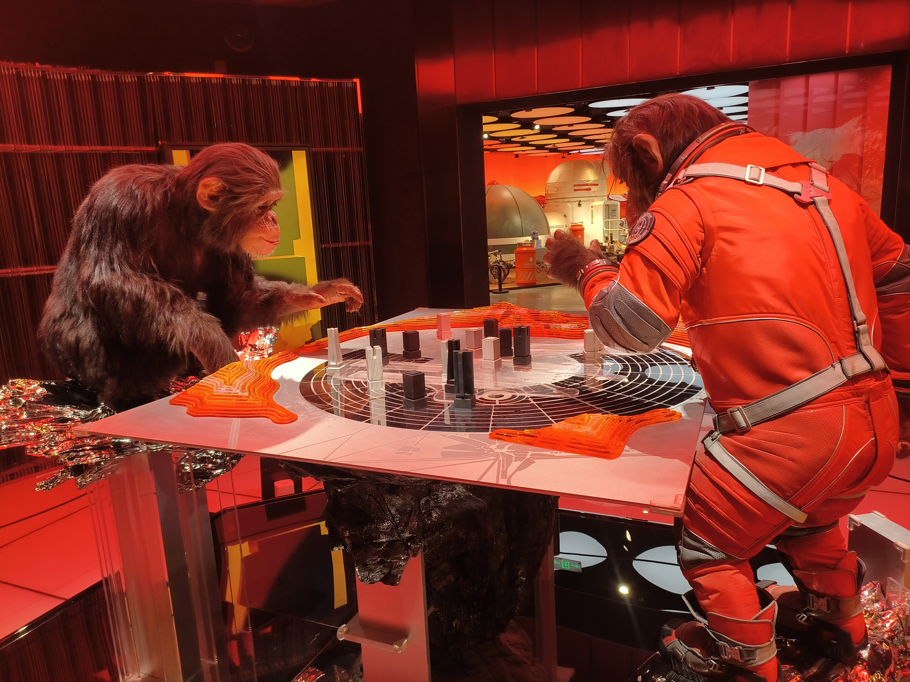

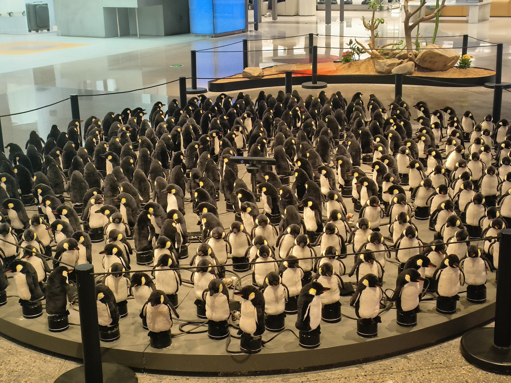

（SKP-S 艺术展品，左侧为火星上对弈的猩猩，右侧为注视你的企鹅）

《你不可及》的新书发布会位于书店内部一个单独隔出的活动空间。落座之后，我发现前排坐着单反和《科幻世界》副主编拉兹。整场活动里其实有不少颇值得记录的小细节。开场时，主持人给每位观众发了一张小纸条，请大家写下自己与某位重要之人“上一次见面的时间”。后来，这张纸条也成为了活动互动的一部分，任青和鲁般老师随机抽取大家写下的时间，猜测背后对应的人际关系，并据此即兴编织出一个个短小的故事。两人的叙述风格差异明显，因此也显得格外有趣。活动进行到一半时，《金桃》的作者杨晚晴老师也来到现场，并相当积极地参与了互动。

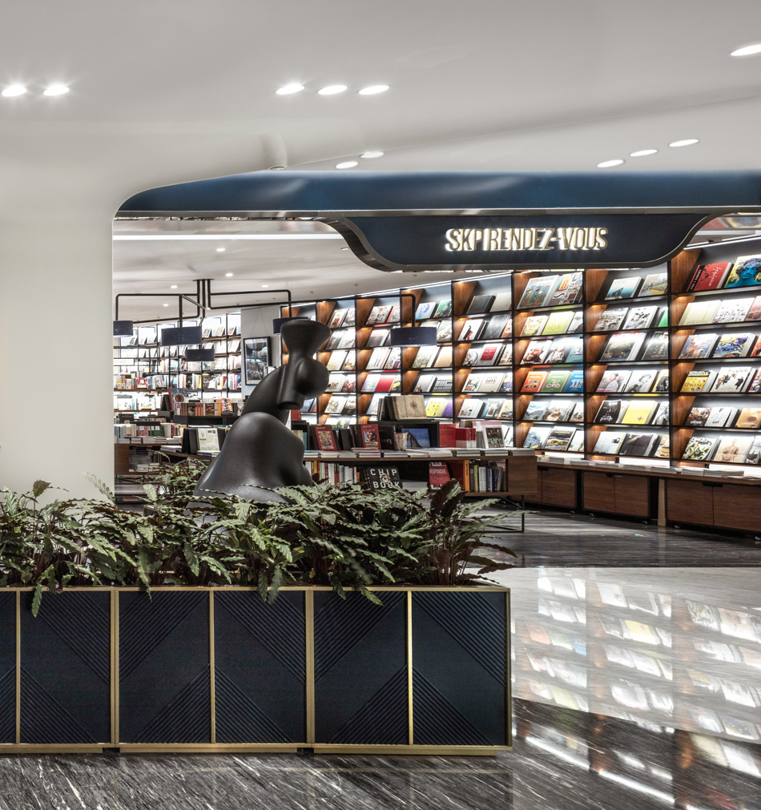

（RENDEZ-VOUS 书店）

关于《你不可及》的创作缘起，两位作者也分享了一段颇具“科幻小说感”的经历。据说，这本书的构思是在 2023 年 3 月份银河奖笔会期间敲定的。当时众人身处四川雪山，夜里大雪纷飞。鲁般突然对任青说，如果今晚真的死在这里，那么自己最想留下怎样一篇作品。随后，他提起自己曾读过一篇小说：两个人彼此奔赴，却始终在错过对方。只是他已经记不起原作名字，于是现场向观众征集线索。而《你不可及》的核心设定，某种程度上也正是对这一母题的重新演绎：一位天文学家与一位工程师，在相隔遥远的两个星球之间，以书信维系联系。两人在确定整体情节走向之后，便各自隔离写作，直到作品完成。提问环节中，一位小女孩问如何写好科幻小说，鲁般老师打趣地说，让她称自己为“哥哥”，而称任青为“叔叔”。

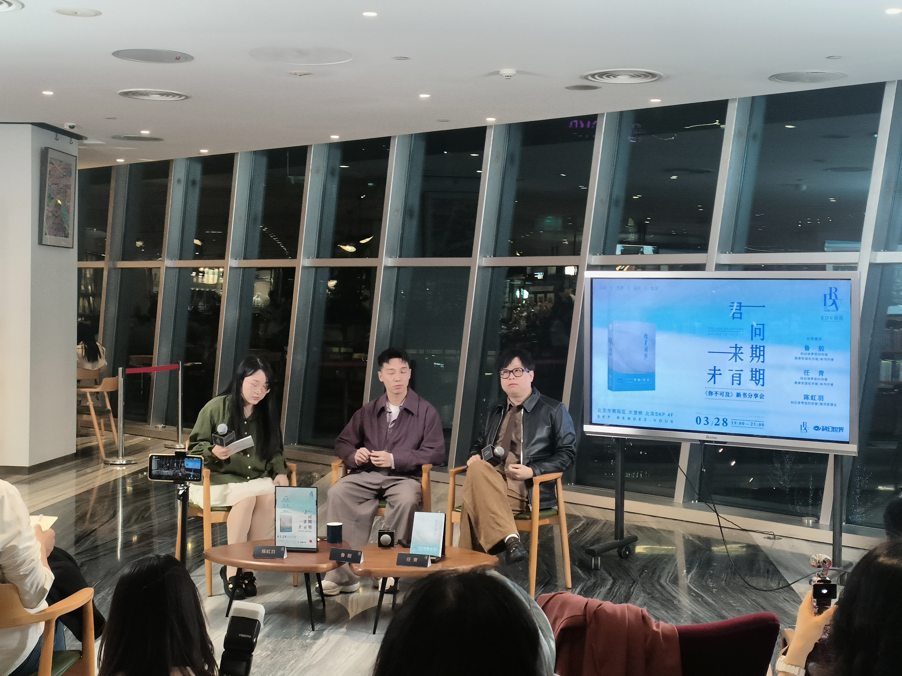

（《你不可及》新书发布会）

因为对这本书的设定与情节相当感兴趣，我当场买下了一本亲签版。回程路上，手机恰好没电，于是索性借着地铁与夜路的时间开始阅读。直到第二天再次见到河流时，我才终于把整本书读完。至于具体的阅读感受，大概还是值得另外再写一篇文章来慢慢谈。

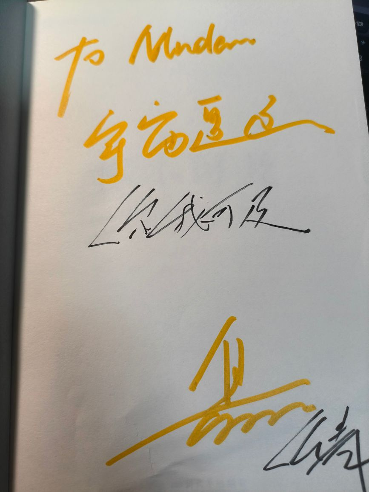

（鲁般与任青亲笔签名《你不可及》）

第二天的活动主要围绕着河流参加一些活动。上午，我们约在牛街附近见面吃烤肉，同行的有无理、烤肉，以及西电幻协的老成员种树人。打车时因为车里只能坐下四个人，无理便主动提出自己骑车过去，我们几人则先坐车去护国寺附近吃小吃。结果等到菜都上齐了，依旧迟迟不见无理的身影。后来才知道，他骑车时走错了方向，最后索性直接改道去了什刹海，参加另一场上午的聚会。整体来说，护国寺的小吃味道相当不错；至于吃烤肉时特地点的一杯豆汁，无理后来评价说“还行”，至少还在能够接受的范围之内。

下午，我陪河流前往菜市口，与张海龙老师喝咖啡、聊天。海龙老师提到，他已经从上一家游戏公司离职，目前正在推进一些自己的项目。就在我写这篇文章时，他也在小红书上宣布成立了“交幻机工作室”。据海龙老师介绍，“交幻机”一名取自“交流 + 幻想 + 人机”，期间其实也尝试过很多名字，但都因为各种原因被系统否决了。我感觉海龙老师现在的想法，其实已经不再是传统意义上的“做科幻出版”，而更像是在经营一个以科幻为核心的内容工作室。科幻仍然是底色，但具体落到哪里，并不重要，游戏、短剧、影视、有声、电子出版，都可能成为内容的出口。相比过去那种“做一本杂志”“做一家出版社”的路径，现在更像是围绕不同媒介反向组织内容。

期间，我们也聊到了科幻圈中的一些现象，以及河流如今的状态。能明显感觉到，他现在的状态已经好了非常多，能够去做真正想做的事情，也尽量减少了外界杂音的干扰，把更多精力投入到具体而实际的工作之中。至于这些工作的价值究竟如何，也许并不需要急着下结论，时间与最终的成果自然会给出答案。海龙老师对此也颇为认同。他认为，人真正有限的，其实始终是精力，因此比起被各种外部声音牵扯，更重要的是把注意力投入到那些具体而切实的工作之中。

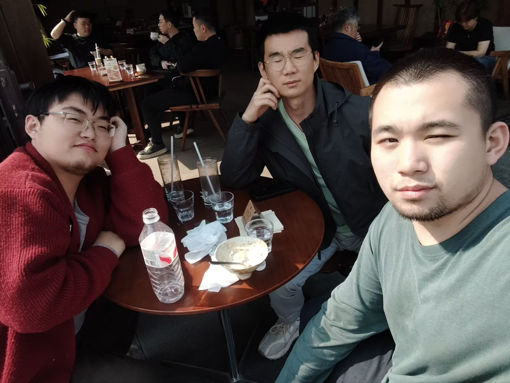

（在咖啡馆与海龙老师和河流合影）

待海龙老师离开后，杨枫老师联系河流，准备一起找个地方聊天，我也有幸参与其中。第一次线下见到杨枫老师，还是在第三届科幻边界聚会，但真正坐下来长时间交流，这却还是第一次。稍微有些遗憾的是，这次行程来得太突然，我事先完全没有预料到，因此也没能随身带一本到处安利的《幻协生存指南》用于分发。聊天时，我们谈起了最近上映的《挽救计划》电影，也聊到电影在处理洛基与男主格雷斯关系时，那种略显隐晦却又耐人寻味的表达方式。

随后，杨枫老师向我展示了他新做的一套“科幻迷成就系统”。作为一个长期使用中文科幻数据库、却始终没找到太多实际支持方式的人，我几乎是在看到的第一时间便决定支持一套。接着我开始慢慢对照清点自己的完成情况。越往后翻，越会意识到其中有些成就大概注定永远无法完成，有的是因为时代已经过去，有的是因为条件实在过于苛刻。例如中国有多少人能实现名人殿堂这个成就呢？大抵也只有刘慈欣罢了。不过如这种，可能本来就是为了证明“真正做到的人极少”而存在。而在笔者写此文时，这套成就票根也已经寄售在安塞波咖啡馆，欢迎大家购买支持。

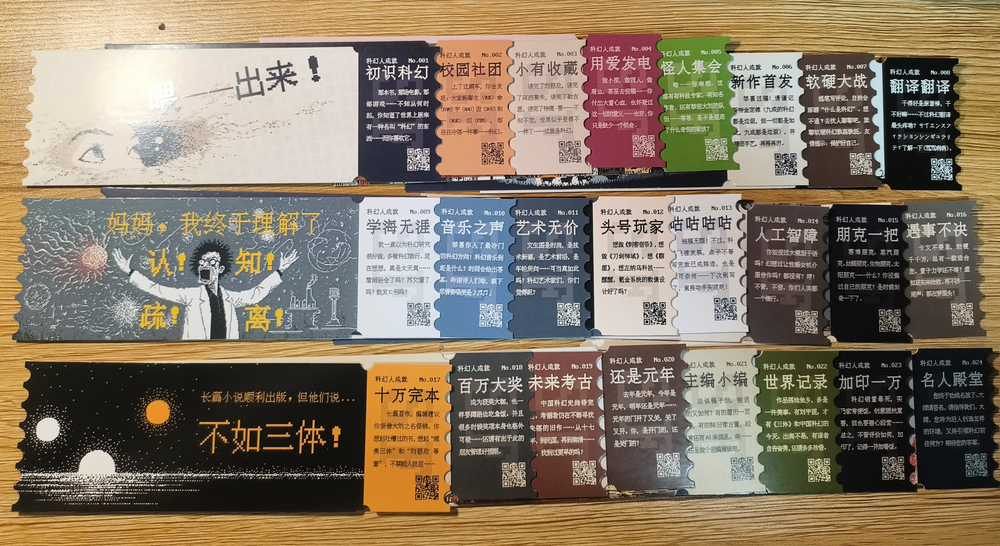

（科幻迷成就系统票根）

而那天下午给我最大的感受，则是如今的科幻产业，实际上正呈现出一种远比外界想象中更加复杂、也更加多元的状态。对于许多独立创作者、小型机构，甚至一些长期深耕科幻领域的人来说，仅仅依靠“科幻出版”本身获取利润并维持生存，其实已经是一件相当困难的事情。即使是业内最有代表性的出版社，例如《科幻世界》、八光分文化这样的机构，也很难说能够完全依赖科幻图书出版实现稳定盈利。至于更多规模更小、同时兼具出版业务的机构，则往往处于一种相当艰难的维持状态：他们需要依靠活动、众筹、IP 合作、课程、文创，甚至依靠主业之外的收入，才能继续把“做科幻”这件事坚持下去。

但与此同时，科幻产业真正能够产生更大收益的部分，其实早已不再局限于传统意义上的“科幻文学”。越来越多的利润与流量，正在流向动漫、游戏、广播剧、影视改编、潮玩模型以及各种文创周边之中。很多带有鲜明科幻内核的内容，在市场传播时甚至不会主动强调“科幻”这一标签。相比于“科幻”，它们更愿意以“赛博朋克”“太空歌剧”“机甲”“末日生存”“开放世界”等更具体、更具消费辨识度的类型进入大众视野。某种意义上，今天的科幻已经不像过去那样，主要以杂志、小说或出版社的形式存在。它更像是一种底层的叙事结构、一种关于未来的审美倾向，被不断拆解，再嵌入到更庞大的泛娱乐工业之中。于是我们会发现，“科幻”这个标签本身反而变得越来越模糊。它似乎无处不在，却又很少单独以“科幻”的面貌出现。真正支撑这个产业继续扩张的，也许早已不只是那些被明确归类为科幻的作品，而是整个文化市场对于未来想象、技术焦虑与世界观消费的持续需求。

而到了 4 月 24 日，我又因为一些事情回了一次成都，也再次见到了河流和其他朋友。那天我们在安塞波咖啡馆附近的一家餐厅吃饭，话题兜兜转转，最终还是回到了中国科幻大会，以及如今的中国科幻产业。

这次大会给人最明显的感受，依旧是那种近乎扑面而来的“科幻产业化”。无论是展会结构、宣传口径，还是现场重点呈现的内容，都越来越偏向产业、资本与未来技术叙事，而这种氛围多少也会让许多科幻迷产生一种隐约的疏离感。某种意义上，我的看法其实和之前参加银河科幻大会时并没有太大变化。

很多时候，真正让人觉得“科幻还活着”的，并不是大会本身，而是这些散落在各地的相遇。一群人因为一本书认识，因为一个论坛熟悉，因为某部作品开始长期交流；有人做数据库，有人办活动，有人翻译资料，有人运营社团，也有人只是单纯地持续阅读、持续讨论。相比那些动辄谈论产业规模、IP 价值与未来市场的宏大表达，这些事情看起来或许很小，甚至难以被量化，也无法立刻转化成商业价值。但某种意义上，它们才是真正构成中文科幻生态的底层部分。

不过往好处想，至少我们因为科幻而相识、相遇、相知。仅仅是这一点，本身就已经足够值得庆贺了。
