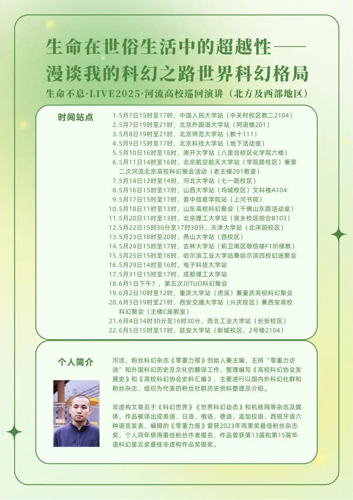
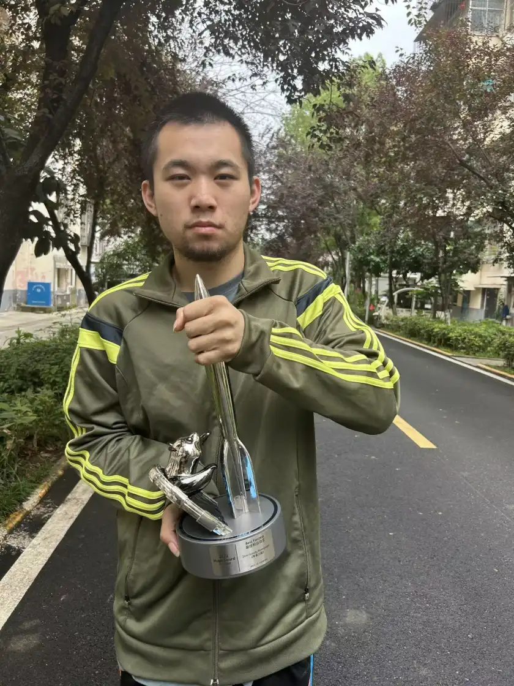
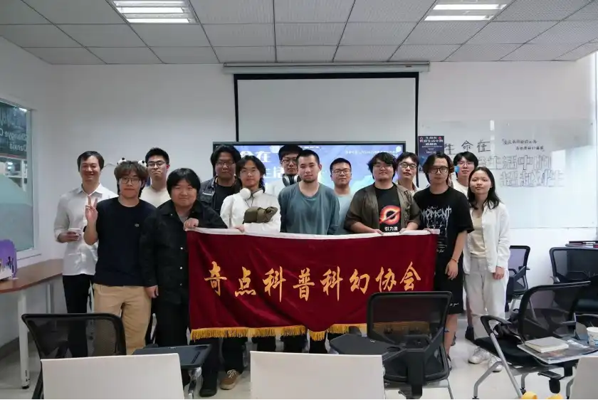

5月31日，毛毛雨中的成都理工大学，高校巡回演讲缓缓开始。这是河流“生命在世俗生活中的超越性”讲座的第17站。

我们坐在图书馆的研习室，窗外是阴沉的天和吹过的风。奇点科普科幻协会的同学、四十二号邮局局长、西南石油大学的showmaker，还有几位校外前来采访的朋友，大家静静等着，不喧哗。演讲因为安排问题推迟了二十分钟，但似乎没有人焦躁。等到宝葫芦设置好摄像机，河流开口，一切才真正开始。

我不知道别人是抱着怎样的期待来的，而我，其实有些迷茫。我知道河流这个名字，读过一些他的文字，也曾和河流见过几面。但这次我是想听他讲“活着”本身，讲他自己的故事——讲在世界并不为你准备温柔的时候，人到底怎么继续往下走。

河流从他的童年讲起。他在童年时就获得了一个信念：“不管别人把你的东西毁掉了多少次，只要你还保有恢复一切的能力，那么这些毁灭就不能真正伤害你。”

他说这话时语气平静，但那种平静之下，有一种难以言说的坚持。我意识到，所谓“超越”，很多时候不是飞升、不是升华，而是反复地、痛苦地、自觉地做选择——哪怕没有观众，哪怕不会变好。

在讲到他曾担任班级的劳动委员时，他笑了一下，说：“因为没人愿意干。”他说，名头并不重要，重要的是你到底做了什么。于是他去广场捡垃圾，最终被校长点名全校表扬。那种行动感，是这场讲座的底色和主题：河流几乎所有的改变，不靠希望，只靠行动——这是一种不寄希望于彼岸、扎根于荒诞生活之中的超越。

中场时，研习室使用时间到点，我们一行人转移到东区教学楼进行下半场。雨完全停了，空气微微潮湿。我收拾完研习室走在最后，脑子里一直在想一句话：“奔腾的河流，后来去掉了‘奔腾’。”

他说，接触科幻后曾给自己取名“奔腾的河流”，但随着身体状况每况愈下，后来决定只叫“河流”。那一刻我沉默了很久。当人有了名字便因为名字受别人驱使，受自己驱使，最终受累一生。对自己来说，我们常常用名字表达期望、理想、自我投射，而河流，删去的是最激昂、最有生命力的部分。我不知道那是放弃，还是深知“奔腾”无望之后，仍决意“流动”？

萨特说“人是被抛入世界的自由者，超越性正是在这种彻底的无依无靠中实现的。通过自由选择、承担绝对责任来塑造自己的本质和生命意义。”那河流的“自由”，河流的“超越性”也许正是如此——不是选择奔腾的方向，而是无论命运怎样将你禁锢无处可逃，无论境遇如何将你抛入无依无靠，都由你自己决定是否继续走下去。

下半场，河流讲到他在疫情中开始投入“零重力科幻”社群。他说，那些年里第一次感受到一种“被关心”的体验。是那些科幻迷带给他慰藉，而这份慰藉，促使他下定决心要为科幻迷做点什么。于是他开始投入到“高校科幻协会”的历史整理中，编撰资料，排版、校对、收集，全部一人完成。

那是一种像殉道者一样，以身赴死的方式在书写存在。当身体越来越差时，河流选择以“行动”的方式留住某些将要消失的东西。他不是在抵抗消亡，而是在确认生——在不断的痛感和限制中，不断地选择“不放弃”。

2021年，他完成了三版《高校科幻协会发展史》；2023年，他主编的《零重力报》获得了“雨果奖最佳粉丝杂志”。我记得他讲到的那一刻，当时成都科幻馆场馆内外、线上群聊都在为他欢呼喝彩。

“人的本质不在他所是，而在他将成为什么。”河流就是这样一个例子。他没有逃避，也没有幻想，而是在现实的重压中，用行动把自己从苦难中塑形出来。我知道这就是他所说的那种人的可塑性。

雨最终还是没怎么下，走出教学楼时我才发现天已经开始黑了。夕阳已经慢慢落下，我站在那淡薄的日光中想着，人生有很多不可控的部分，但意义是我们自己要造的。哪怕只是一个名字的更改、一段话的整理、一次行动的坚持，那都是真实的“存在”。而所谓“超越性”不是在苦难之上，而是在苦难之中。想实现超越就要通过一次次主动选择去定义自己的生命，而不是等待别人赋予意义。

“只有不停地做，才能找到更多的价值与意义，为此甘愿抛弃生命和物质基础。”这就是河流告诉我的事。

