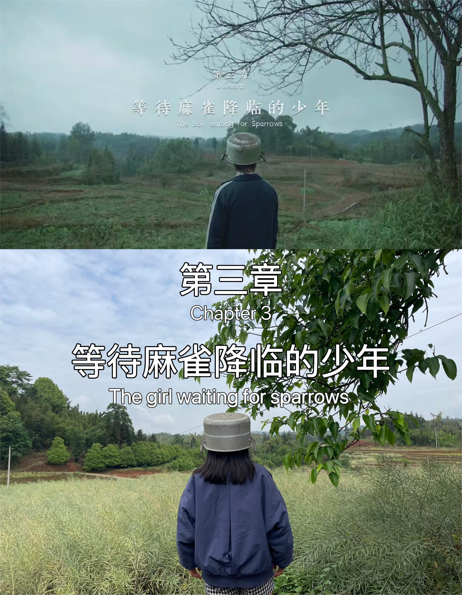
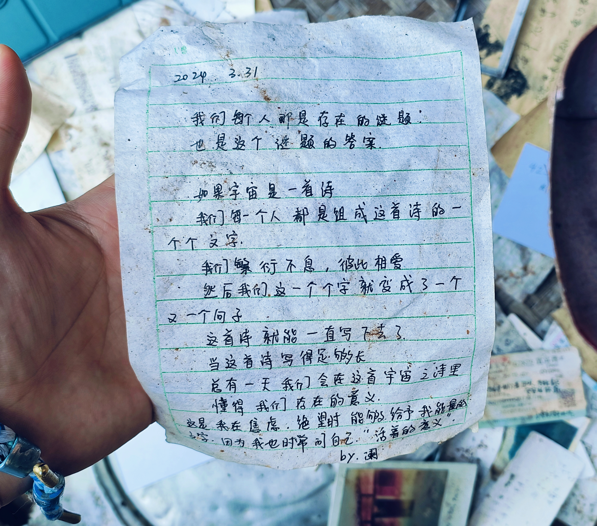
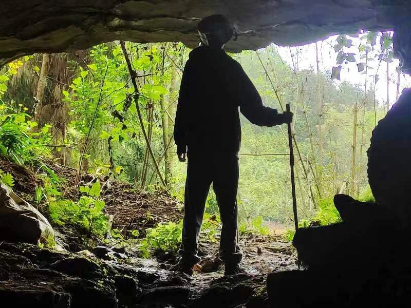
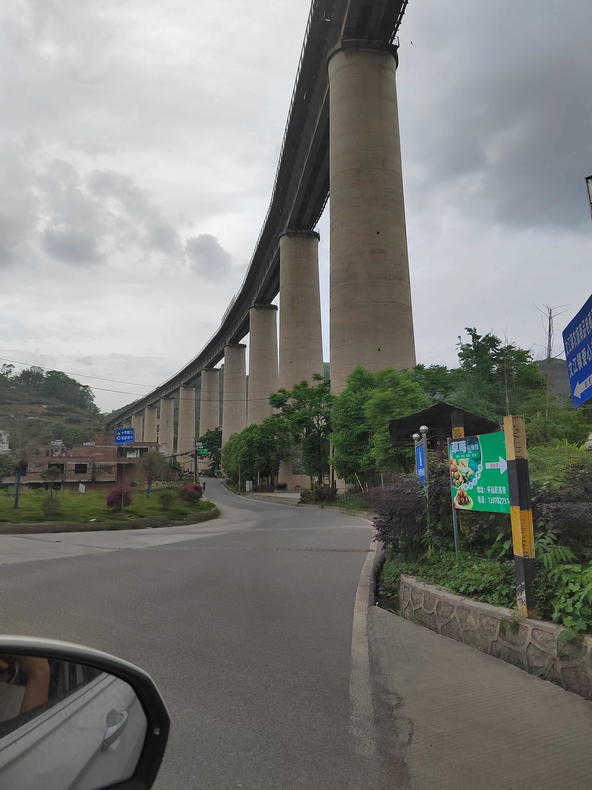

# 题记

如果宇宙是一首诗

我们每一个人都是组成这首诗的一个个文字

我们繁衍不息,彼此相爱

然后我们这一个个字就变成了一个又一个句子

这首诗就能一直写下去了.

当这首诗写得足够长

总有一天我们会在这首宇宙之诗里

懂得我们存在的意义.

# 正文

最近流传于科幻爱好者圈中的传闻称，据说宜宾宇宙探索编辑部取景地留存着外星生命的迹象，于4月21日探险队出发~~打卡~~捕捉外星生命，即刻背囊启程，邂逅神秘群体（势必捕获外星生命）！

## 孙一通的家

据传言，在废弃的孙一通门前，等候麻雀降临，倘若守夜者虔心诵咏禁忌诗篇，或许能召唤外太古之物存在（错乱）。昔日的石狮或已在无尽岁月的吞噬中湮没，我踏访之际，狮身早已湮灭......(*ﾟｰﾟ)ゞ。申老师吟咏孙一通之作，额外佩戴一顶银辉耀眼的盖头，仪式愈加完美，以招引那隐秘而不可名状之异域来客。或许是因为没有石狮加成，仪式并未成功召唤外星生物（悲）。

（申老师锅盖照）

孙一通家门前整齐地陈列着先前打卡留下的锅盖、电焊面罩、搪瓷杯，甚至几首诗。显然，频繁造访之故，惊得外星人惊惶而遁，抓球不到了，换地方！！！

（前人留下的诗）

## 嬢嬢家

据可靠线人透露，唐老师曾一访问的村口嬢嬢，似乎掌握外星人踪迹。当一行人趋至嬢嬢家门前，唯见昔日使用过的弯刀，而嬢嬢何处？莫非已为外星人所执？既未见踪影，唯有谨慎撤离，完成这一出小短剧后战略性撤退 (*´ω｀*)

（复刻宇编小短剧）

## 瀑布

夏天的瀑布山洞不仅是人们乘凉的好去处，更是外星人喜爱的隐秘基地。传说中，这里的水声不止是大自然的奏响，还夹杂着来自遥远星球的低语。如此重地不能不探，出发！瀑布内部湿润且凉爽，轰鸣声在这封闭的空间内回响，仿佛隐藏着某种秘密的呼唤。可惜除了地上的锅子和烧过火痕迹，并没有外星人的痕迹，难道是外星人听闻我们要来赶忙溜走了？

## 神秘山洞

说到宇宙探索编辑部打卡地中最神秘，最有可能出现外星人的还是神秘山洞！开车启程！到达宇编最深处！太神秘啦外星人山洞，诶呀，这不是外星人的神秘文字和DNA图形吗？再找找远处消失不见的外星人吧！

嗯？难道是洞口的是外星人？原来只是在拍照打卡的十口十口，太可疑了，差点就上去进行抓捕工作了~

# 返程

忙了一整天，仅发现外星人的痕迹，却未能捉到外星生物真身。返程途中，看到宇宙探索编辑部区域内的高架桥，耸立于苍穹之间，连接着探索与奇迹的可能。行驶在高架桥下，仿佛穿越时空的边缘，思绪陶醉在未知的宇宙奥秘中。

虽然没有找到外星人，但是和同频脑电波的~~神经病病友~~好友聚在一起，走过电影中的一幕幕画面，打破电影和现实生活的墙，产生了最美好的回忆。就像电影中那日苏说的”满世界寻找外星人，这件事就很酷“！