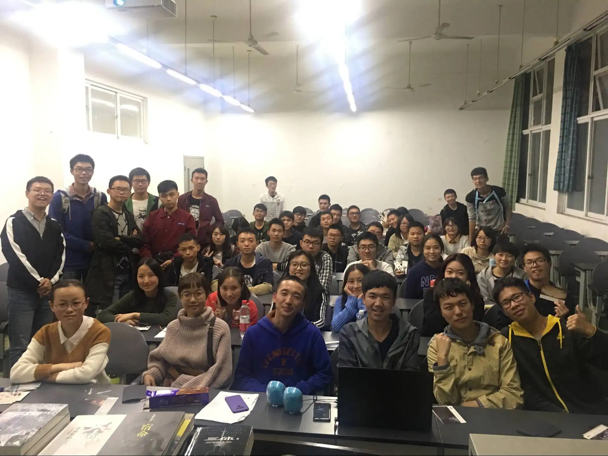

即将18岁的我坐在轿车后座上，看着眼前连绵不绝的群山峻岭与一条又一条的隧道，第一次对“蜀道难”有了切身的体会。那是在2015年，离现在已过去了整整十年。

我爸亲自开车载着我驶过了半个中国前往学校报到。我们用了一整天的时间从青岛飞驰到了西安，又用了一天的时间从西安穿越秦岭来到了成都。彼时作为大学新生的我还完全无法预料，自己将在这座远离故乡的城市度过怎样的青春岁月。

天府之国、三国蜀汉、熊猫、川菜，这是年少的我对于成都仅有的几点印象。当然，还有高中无数次在《科幻世界》上看到的那个杂志社地址，银河奖典礼常年的举办地——中国科幻之都。

和很多科幻迷一样，我与科幻很早便已结缘，不过鉴于本文的主题是讲述在幻协的往事与回忆，所以我大学之前的个人经历就不再赘述。

时间很快就来到了社团招新，我前往百团大战的会场，目标明确——寻找幻协，并且只想加入幻协。当时的我并不知道成理是否有幻协，不过现在看来我还是蛮幸运的，因为恰好就在前一年，初代会长郭威刚刚创办了你协。后来我也思考过另一个可能性，假如没有郭威，你协当时也没有被创办，那么满怀热情的我是否会选择亲自踏上创办协会的道路？在这样的世界线里，我又会有怎样的经历呢？

在协会的摊子上，一位留着寸头，手捧三体正在阅读的男生接待了我。后来我才知道，他正是幻协第二届会长钟谊新。

钟谊新学长是一个很善良的人，甚至有点嫉恶如仇。他曾在协会群里讲过自己对社会上的很多乱象极其看不惯，也参与过山区支教，后来还暂时休学当过两年的兵。但平心而论，在领导协会这方面，他的性格与能力还是有些欠缺的。后来我才知道，他其实并不算非常“硬核”的科幻迷，甚至连三体都是在他成为会长之后才读完的。之所以从郭威手里接过会长的职位，很大程度上是出于个人的情谊。不过不管怎么说，协会没有“一世而亡”，他还是功莫大焉。

对于大一我很多记忆都已模糊了，协会也并没有举行过长期、稳定的社团活动，但有几个曾参与过的活动我仍然记忆犹新：王晋康老师在你校的科幻主题讲座（并非你协邀请，是成都市政府举办的文化活动）、巫师3原著作者，波兰国宝级作家安杰伊·萨普科夫斯基在成都的签售与讲座、与诗文社联合举办的关于“AI是否能理解诗歌”的讨论会、电竞协会举办的学校社团间的LOL友谊表演赛，在两位钻石段位外援的帮助下我们轻松碾压了对面……

而在这第一年里，我也结识了幻协里的第一个朋友，也是我大学最好的朋友之一：李卓骐，外号“桌旗”。桌旗也算得上你协的一个传奇人物，这个放到后面再说。

大一的末尾，原办公室部长胡家斌被钟谊新指派为了第三届会长。他召集起幻协新一届的管理层吃了顿饭，就这样完成了换届，我与桌旗一同成为了副会长。

胡家斌学长是个很聪明也很健谈的人，这在社恐遍地的幻协很是难得。不过嘛……他的这份能力并没有完全用在建设协会上。也许是因为非常了解并信任我们，新学期伊始，他便把绝大部分的协会事务都放权给了我与桌旗。从招新开始，协会事无巨细基本都是我们两名副会长忙前忙后，而他则只在最关键的、必须要会长露面的情况下才会现身，成了名副其实的甩手掌柜。在迎新大会上，胡家斌发表了一番一针见血的讲话，他认为“科幻”是一个很泛的概念。足球协会踢足球，篮球协会打篮球，而科幻协会要干些什么，如何产生凝聚力，并不是明明白白摆在台面上的，这需要更多脚踏实地的具体活动才能锚定。

在这一年，协会也进入了一个危机与希望并存的新时期。

由于前一年协会运营不善，留存下来的活人几乎只剩下管理层的几个人，因此我们也很清楚，如果不能在新的一年里力挽狂澜，那么幻协很有可能会到此为止。

桌旗在这时便展露出了他的领导才能。当时的我非常悲观，满脑子只有如何苟活下去，对于是否能招到足够的会员也完全没有信心。而桌旗则秉持高度的革命乐观主义精神，写了一份详细的未来规划，包括可以举办征文比赛、辩论赛、拍摄微电影等想法都是他最早提出的。

十分幸运的是，16年的那一届是你协SSR集中爆发的一届。早在百团大战之前的扫寝宣传时，我们就发现了好几个铁杆科幻迷，后面更是尽入彀中，包括佩玲、老陈、老林（18年会长）、猛猛、小乐、小芹等十分活跃甚至保持联系至今的老登都是16年的。

然而尽管如此，我们最终还是未能招够社联要求的至少40人。为了凑数，我与桌旗各自垫了一部分会费，想方设法弄了一些“幽灵社员”报了上去。

在活动方面，虽然缺乏领导才能，但我也深知协会需要长期稳定的活动才能保持活力与凝聚力，因此我用笨办法，坚持主持了一整年的观影活动，放映了很多经典科幻电影并组织讨论。其他活动包括社区科普公益课、参观科幻世界编辑部、听讲座、参加颁奖典礼等，均取得了不错的反响。

而桌旗则在这一年里进化成了“幻协交际花”，联络上了成都其他高校的友协，时不时参加聚会，还带我一起参加了一次川大幻协写作组的线下笔会。在这个过程中，我们也汲取了很多友协的先进经验。

又是一年过去了，桌旗也顺理成章地成为了新一届的会长。此时的幻协已经彻底摆脱了初创时期的孱弱，变得欣欣向荣。在桌旗的带领下，那一届的招新，我们招够了四十人，不再需要想办法凑数。在迎新见面会上，教室坐的满满当当，一派人丁兴旺。见面会的最后，我站在讲台上为大家拍了一张照片，至今都是最令我难忘的照片之一。

这一年的10月27日，《银翼杀手2049》上映，协会头一次组织了集体观影。此前我对这部续作电影并未抱有太高期望，它却最终远远超出了我的预期。维导完美继承并发扬了前作的风格，带来了不输前作的震撼。就像一个豆瓣影评说的那样：这是一部能让你在多年后向他人吹嘘自己当年是在电影院看过首映的伟大电影。而更令我感动的是，我并非孤身一人。回学校的路上，深秋的夜带着阵阵凉意，似乎还下起了小雨，而我们一行人却热情似火，兴奋地讨论着有关这部电影与赛博朋克的种种，灵魂在震撼与感动中达到了深深的共鸣。这是我永生难忘的珍贵回忆。

随后的十一月，第一届成都国际科幻大会开幕，举办地恰好在东郊记忆。你协借着近水楼台先得月的优势倾巢出动，每一次讲座，每一个活动都能看到你协同志们的身影，甚至还有人因为到的太早而碰巧捕捉到了正在吃早饭的大刘。那几天在我的记忆中堪称梦幻：我见到了大刘并与其握手还要到了签名、我见到了老王、韩松、何夕、罗伯特索耶等其他知名科幻作家并同样要到了签名、我听了好多大佬们或轻松愉快或鞭辟入里的讲座、我逛了满是图书与周边的科幻集市、我参加了银河奖的颁奖典礼、我与在场所有的高校幻协的同志们共同上台合影……

而在协会里，新的活动也在开展着。卸任副会长后，我成为了协会的第一任写作组组长，仿照川大开始组织定期的写作活动。大家兴致高涨，从线下笔会的热烈讨论到线上的催稿，我们将自己的思想与情感凝结成一篇篇文章，尽管水平有限，但热爱无限。

对我来说，2017年是具有非凡意义的一年，它不仅是你协发展历程中的一个高潮，我曾经所有的企盼，所有的幻想，对科幻的热爱、对友谊的希冀，也都在这一年获得了圆满。

哦，写到这里才发现自己漏掉了郭威。在与郭威学长并不算多的相处时间里，他给我的感觉就是那种刻板印象当中的理工男，但带有一种理想主义的气质，人也非常和善。我想，能够选择创办幻协，他的这种理想主义气质一定起到了决定性的作用。在他还没有离开成都的时候，协会招新他也来帮过忙，和我们一起气喘吁吁地搬运物资。而最令我印象深刻的一件事，是他曾在协会举办过一次相对论科普讲座。名义上是“科普”，但我们去了之后才发现这压根一点都不“普”——这实际上就是一堂正儿八经的理论物理课，郭威是真的想要教会我们相对论。很快，令人眼花缭乱的数学公式就写满了整个黑板。作为愚蠢的艺术生，我自然是听不懂的，而同行的理工科的同志们也只听了个半懂。经历此事之后，我也深切地体会到了科普书上的理论物理与真正的理论物理之间到底有着多么巨大的鸿沟。

不知不觉都写了这么多了。不禁想起《麦田里的守望者》结尾的一句话，“你最好不要跟任何人谈起任何事，因为一旦你谈起，你就会回忆起每一个人，每一件事。”

那么就到此为止吧。这篇碎碎念，也算是我这个老不死的老登对于协会早期历史的一点个人记录。再往后，加入幻协大家庭的同志们越来越多，大概也不需要我来回忆了。

来到成都上学，加入幻协对我来说仿佛就在昨天，回首望去，却已是十年的光阴。这十年间确实发生了太多太多的事情，人们来来往往，世事变幻无常。

但我对科幻的热爱是少数始终未曾改变的东西，如同一个屹立在我精神世界当中的信标。某知名少女乐队番曾有一句名言，“要一起组一辈子乐队哦”，涉世未深的高中少女在人生道路的开端便说出如此“豪言壮语”，虽显稚拙，却也深情。对于羁绊，对于热爱，真的能“一辈子”吗？严格来说，我无法给出肯定的回答。但无论如何，我都真诚地希望这份热爱能够继续延续下去，你协也是一样，能够走过一个又一个的十年，成为一代又一代来到成理的科幻迷们的港湾。