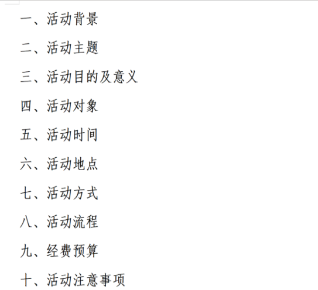

大家好，我是来自成都中医药大学科幻文化协会的知洲，很荣幸有机会为大家带来这篇幻协生存指南。在动笔之前，我已经思考了很久。因为我才上手负责幻协几个月，还算是半个摸爬滚打的新人，策划过的也都是最常规、最普通的活动，经历实在不算丰富。

但我深知，每个人都是这样一点一点走过来的。正因为我的记忆还很新鲜，踩过的坑还记得疼，获得的经验也最直接，所以我还是想分享一下自己的想法。这篇文章，就想和大家聊一聊“怎样办常规观影活动”。

首先，什么是“常规观影”？

这个大家肯定不会陌生，这就是幻协最熟悉、也最基础的活动：在学校的教室、活动室，在各个地方，给协会、学校的同学们放一部科幻电影。办好它不是为了惊天动地，而是为了告诉你的社员：“我们还在，这里每月都有个地方，能一起看科幻，聊聊天。”

它看起来毫无技术含量，似乎就是“找个影片，发个通知，然后播放”就完事儿了。但正是这种“想当然”，会让新手在第一次组织时手忙脚乱。写这个的目的，就是把“想当然”的步骤，变成“确切的流程”。

其次，如何办“常规观影”？

我会把整个过程拆解成活动前、中、后三个阶段，如有需要可以直接当成 checklist 来用。我会尽量细化说明，甚至会有一些很蠢的问题，因为所有蠢问题都是新人可能会踩的坑。

## 阶段一：活动前（提前1-2周）

## 确定影片

选片是活动的核心，建议遵循 “主流经典为主，兼顾趣味与话题性” 的原则。

大众经典优选：如《2001太空漫游》《银翼杀手》这类影史公认的佳作，接受度高，容易引发讨论。

类型可以多元：可以是灾难片《后天》、恐怖科幻《迷雾》，甚至轻松有趣的《哆啦A梦》系列（机器猫也是科幻！）。

慎选小众或争议之作：避免像《那个男人来自地球》这类可能过于沉闷小众的影片（尤其别看第二部！）。至于《太空旅客》或《上海堡垒》这类评价两极的片子，如果想作为“吐槽”或“鉴史”环节，需谨慎考虑。个人建议新手期尽量避免纯粹的“鉴烂片”的活动，以免影响初次参与同学的体验。

核心原则：确保影片本身质量过关，能带给观众积极的科幻体验或有益的讨论。

## 影片审查与报备

这是一个非常实际且重要的环节，负责人最好自己看过所选影片。它的内容是否过于血腥、暴力？主题是否过于晦涩或消极？

如果活动需要向学校申报，影片能否通过审核？虽然每个学校尺度不同，一般不会过于严苛，但务必提前了解规定，避免临时出现问题。

确定地点：可以是教室，可以是大草坪，也可以是图书馆，但是请确定好不同地点最多可以容纳多少人、当天的环境会不会有问题（要是选的户外场地，当天下雨可就不妙了）。

## 确定时间

尽量安排在周末晚上，同学们的空余时间更多。

## 分工

分工明确也是很重要的事情，一个人或许可以做完，但是没有必要，因为会很累。要把具体工作安排到具体的人头上，而且要交代好deadline。

我第一次干的时候觉得自己什么都能搞定，于是从申请、宣传到现场调试都一个人干。结果忙得手忙脚乱，而且活动结束后感到特别疲惫。

但其实哪怕只找一个人帮你，情况都会完全不同。可以是一个陪你提前去调试的“技术顾问”，一个在门口帮忙签到的“社交达人”，甚至只是一个活动结束后能和你一起吃夜宵、吐槽的好朋友。一定要记住，社团的初衷是“大家一起玩”，而不是“一个人为大家服务”。

## 写策划案，教室申请表

不同学校的要求各异。最快的方法是咨询学长学姐，参考他们往期活动的策划案和教室申请表，按照格式撰写（用AI辅助生成也行）。但务必注意无论模板如何，活动整体流程负责人必须心中有数，确保安排合理。一定要提前向社团管理部门问清所有具体要求，避免因不合规而反复修改，浪费大量时间。

## 宣传

如何让人愿意来？核心思路是降低他们的决策成本。让他们觉得这看起来不麻烦，而且有点意思。不妨做个海报或是编写优美的文案，把核心信息（片名，时间，地点）写得醒目一点，再弄一些吸引人的小标题。要是条件允许可以准备一些小零食。放好自己社团群和活动群的二维码，提前3天、1天、当天各发一次。观影可以不止是观影，还可以安排一些线上或线下的讨论活动。海报可张贴在教学楼公告栏、食堂入口、宿舍楼下等人流密集处，但注意学校使用公共场所的相关规定，如需提前提交《校园海报张贴申请表》并经相关部门审批等；文案可同步发布在社团公众号、协会群聊、社团活动群等线上渠道。（但个人建议，常规的日常观影等活动，没必要做海报。）

尤为关键的是，要用新人视角来检查宣传文案。把自己想象成一个完全不了解情况的同学，你需要知道什么？时间、地点、片名、是否需要报名、怎么样才算报名成功、活动的流程是什么、是否有特殊要求（比如“教室冷，多穿点”）等。

比如我们成中医，对于同学而言，最好的事情不过是可以加第二课堂的美育分，因此宣传的时候会着重强调这个事情。或许很多来的人只是为了美育分，真正感兴趣的人很少，但至少我们要先宣传到位，才能让更多人知道我们的活动。（没错，是带着利益去诱惑各位。）即使有人最初只是为了加分而来，但一次好的体验、一次有趣的对话，就可能点燃一颗真正的科幻心。你是在播种，你是在传承。

在一切准备就绪后，还有两个看似简单却极易翻车的环节需要你亲自确认：你应该在活动开始前看看你申请的教室是否正常，确保不影响活动进行。请务必提前下载好高清资源到电脑本地、检查播放器能否正常解码影片，最好不要在线播放。因为网络、版权等问题都是未知数。

## 阶段二：活动中（当天）

播放前：很有必要的准备是提前半小时或一小时去调试设备、试放影片、提前布置等。确定没有问题之后可以拍一些现场的照片，写一些提示放群里给大家，告诉大家在哪里，防止有的同学找不到路或是临时忘了时间。不要想着卡着点去，因为你是负责人；不要只顾着玩手机，因为你是负责人；一定要有规划，不要沉浸其中，因为你是负责人；一定要做好充足准备，防止到时候别人问你问题你什么也不知道，因为你是负责人！

播放中：开场白可以不用太吸引人，但场地允许的话一定要有适当的介绍，这样可以方便大家了解协会的其他活动。此外不妨把协会群的二维码摆上，这样方便对协会感兴趣的路人同学加入社群。还要让其他负责人或是自己多拍拍照片，办的活动有记录准是好事情，千万不要害怕上镜。放映的时候可以考虑是否需要关灯（看大家是白天还是晚上放），是否需要关门（可以给迟到或是有急事想上厕所的同学留一下后门）。还有维持秩序的事，此处就不多赘述了。

## 阶段三：活动后（当天，第二天）

播放后：观影结束之后若是没有后续的讨论活动，那这里我不是很建议电影一放完就关设备、开大灯、赶紧就走。我认为即时复盘是很有必要的，尤其是活动结束的黄金15分钟，你可以和一起组织的人在教室里聊聊一些事儿，比如：今天来了大概多少人？比预想的多还是少？今天的环节顺不顺？下次哪些地方可以改进？可以把聊到的关键点记下来，手机或是笔记本上都可以。（走之前别忘了收拾场地，收尾工作一定要处理好。）

接下来的线上互动也是要有的：

线上互动与沉淀：活动在线下结束，但线上互动是维系热度和发展同好的关键。

即时反馈：在社团群/活动群中发送精选现场照片，再次感谢大家的参与。

二次宣传：在社团官方账号（公众号/微博）上发布一篇简短的活动回顾，并预告下次活动意向，持续吸引关注。

抓住核心：积极耐心回复群内或私聊关于活动的任何问题。每一个主动提问的人，都可能是未来的协会核心成员。

但其实哪怕只找一个人帮你，情况都会完全不同。可以是一个陪你提前去调试的“技术顾问”，一个在门口帮忙签到的“社交达人”，甚至只是一个活动结束后能和你一起吃夜宵、吐槽的好朋友。一定要记住，社团的初衷是“大家一起玩”，，而不是“一个人为大家服务”。

最后我想再说一些真心话。

当你把以上流程都走通一两次后，你会发现自己不再是那个战战兢兢的新人了。或许你会有更多更大胆的想法，创意就是这样诞生的，它建立在你对常规活动的熟练掌握和自信之上。我刚接手的时候，也觉得这些流程很琐碎，害怕自己搞不定。

但请你相信你自己，因为大家都是这样经历过来的，没有人是刚开始就什么都会的。我写的这些东西里，没有什么高深的理论。我的目的，也绝非为了炫耀任何高贵的见解。这真的只是一个新人最真实的忙乱与摸索。或许我还有许多写得不到位、有错误的地方，欢迎大家指正并分享自己的经验。

如果你也曾为一场活动感到焦虑，那么我希望这篇文章能给你带去一点点安慰和勇气。我们的经验或许平凡，或许微不足道，但正是无数个这样的平凡结合在一起，就是无数个幻协活下去的理由与动力。

祝幻协的天空没有极限。
