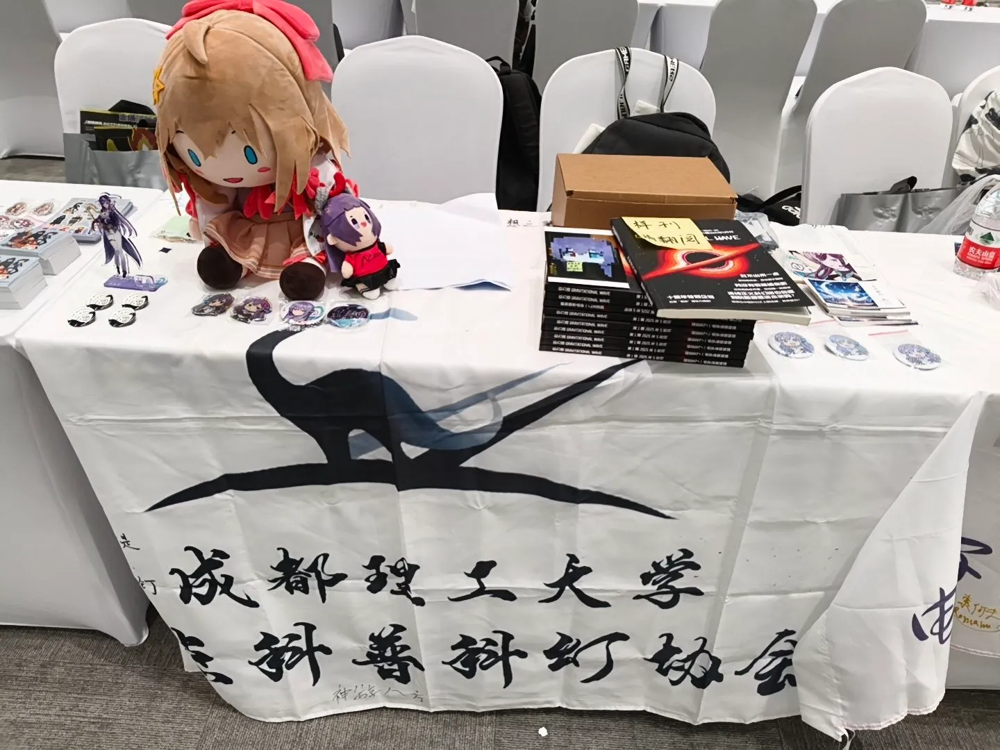
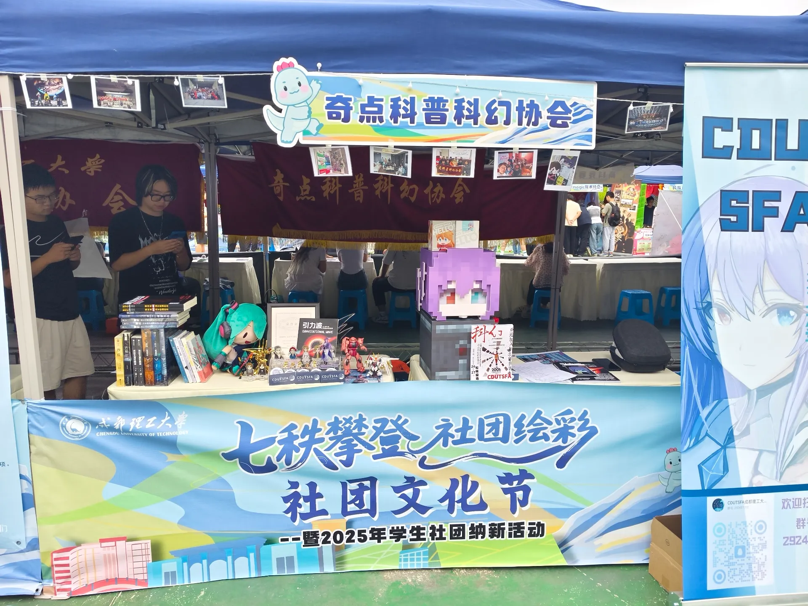

> 你好！首先介绍下，我是Jerriel，是成理奇点幻协的第11年的会长。我的邮箱是jerriel@qidian.space。
> 
> 文章写于2025年国庆期间。

在这之前的一个月内，奇点参加了一次银河科幻大会（如果你想看具体活动记录，可以移步至[银河奖活动新闻速递 | 奇点科普科幻协会](https://qidian.space/posts/%E9%93%B6%E6%B2%B3%E5%A5%96%E6%B4%BB%E5%8A%A8%E6%96%B0%E9%97%BB%E9%80%9F%E9%80%92/)）并成功在 **【CP×科幻世界 SF ONLY同人交流会展】** 以高校社团身份参展，然后也成功地参与了校内的百团大战（其实没那么多）社团招新活动。这俩次活动都有一个共同点——我们有专属的展摊点位，所以，本篇文章围绕这个小小的摊位展开，你可以在这里学到很多——怎么申摊、摆摊、看摊守摊、收摊各种你可能都没想过的问题。如果你不是相关负责人，也不妨看看我的这份经历，权当打发时间。

# 首先，你得先确保眼下有一个活动供协会参加，你才能考虑摊子的事情

当然在成都，这类活动的机会还是很多的，据我目前了解作为科幻协会可以参加的展会有——CD展（comiday），世界线，还有科幻大会，这些活动都是有稳定的举办周期和相对大众的流量。如果要细分的话，世界线的人流量最好，CD展的摊位最多最容易申请，科幻大会这种不一定每年都有摆摊子的机会，但这绝对是最对口的展会。

我不推荐你去申请世界线或者其他类似的展会。它的定位是 **【漫展】**，因此对外提供的摊位不多，且常常需要绑定特定IP，高校科幻社团在这之中显得格格不入并且我相信不会有那个正常人来漫展看科幻的。

CD展是一个很好的展示机会。它的定位是 **【同人展】**，并且我可以说他们对外提供**海量**的摊位，不论是个人的还是厂商的，甚至还有专门的高校社团街道。同人展的好处就是几乎没有任何tag的限定，不管你们想要展出的是热门还是冷门IP二创甚至是各种自设或原创作品，都不会有任何的违和。在CD29中甚至你还能看到科幻世界杂志社的入驻。

我们参加这一年的银河科幻大会可以说是非常幸运，能够碰上CP这个同人展的老大哥与科幻世界的合作，至于以后有没有这类专业对口的活动我真不好说，但是以防真举办了却没人有经验能hold住，我还是得写写。不得不提一嘴的就是在这次大会上我们把积压的《引力波》会刊第一期售罄了，甚至只用了一天导致第二天卖不了了，所以这个大会的含金量有多高不用我多说了吧。

至于其他的活动/展会，还需要负责人多关注相关信息了。

# 及时了解这些活动/展会的信息，别错过任何机会

首先我必须向你推荐一个APP或者平台叫做[CPP无差别同人站](https://www.allcpp.cn/)，你可以在他的官网上下载到对应的APP。我可以说在国内只要是同人展都能在上面找到相关信息，就比如CD展跟这次的SF ONLY展会；世界线则是发布在[B站](https://show.bilibili.com/platform/search.html?searchValue=%E4%B8%96%E7%95%8C%E7%BA%BF&from=ticket_home&msource=pc_web)，你可以关注官方账号获取信息；微博也是一个很重要的消息发布平台，据我所知CD展跟科幻大会都会在上面发布先手信息，但我不玩微博所以略过。

总之就是多去了解打听，如果有能力的话，别把活动范围局限在成都市区了。我一直认为高校科幻社团想要做大做强提高声望，就不能只是局限在校园内。如果你的学校无法为协会提供相关展示平台的话，对外这一块就只能自己想办法了。

# 关于物料

如果你想让你们社团参展，首先你需要确认好你们协会有哪些东西可以拿出来展示/售卖。作为高校科幻社团，有专属于自己的系列会刊当然是最好的选择。但是需要强调的是，对于大多数社团来讲，会刊的定位应该是实体册而不能是出版物，对应的你必须要准备电子版，这样能规避很多不必要的麻烦。其次就是社娘的周边（如果你们有自设的社娘），风格应该是符合大众化审美的，这能为你们社团的形象加不少分。其它的还有诸如明信片、徽章之类的小物料，品类当然是越多越好。

如果你参加的是大型漫展/同人展之类的活动，你一定听过“无料”这个词。通俗的讲，“无料”就是指路人能够免费获取的物料。它可以是要求用别的物料交换，参加一个迷你游戏获得，或者直接见人就送。“无料”的储备量应该确保在80个以上；如果获取难度低，考虑翻倍。这取决于人流量，但备好这个数一般不会出错，余下的也可以留到下次活动。

当你决定好了每个物料的价值（指哪些是白送的，哪些有门槛获取的，哪些是售卖的），请一定不要再随意更改了！最好在后续的各种活动中都延续使用这一套定价，否则会使你们陷入道德困境——路人：我昨天花钱买的东西你们今天怎么免费送了？当然，最终解释权在你手里，但也请尽量少做临时的更改。

关于其他具体物料的选择，综合成本后我会推荐这几种：

| 物料 | 说明 |
| :--- | :---: |
| **丝带** | 120元400张 |
| **吧唧** | 要是有能力自制，成本可以做到一元一个 |
| **小贴纸** | 这个定做很便宜 |
| **明信片** | 有些会展提供低量免费印制 |
| **钥匙扣** | 大约4元一个 |
| **金属徽章** | 约8元一个 |

关于丝带我提一嘴，丝带作为历届科幻大会的传统，我建议所有高校科幻社团都可以试着去做一份专属的丝带，性价比真的很高，我们两次大会见人就发，就这样还能余下1/3。

> PS：设计丝带时注意上下留空用于粘贴，将主要元素集中在中间60%区域

还有一件事也是必要的，给所有参展的展品都做好电子档案。你就假设你在开一家网店，你的商品就是你的展品，你需要宣传图、名称、介绍、作者、主题tag等介绍你的各个展品。当有人通过线上渠道找你们了解展品时，你就不会因为没准备而临时从哪个角落把东西翻出来再拍一张毫无美感的图片发给他。如果你会PS，那就尝试做一套渲染图/效果图，网上也有很多现成模板可以复用；如果实拍，就请找好光线与角度，保持背景无杂物。

# 关于申摊

该说不说，这反而是最简单的一步了。这里以无差别同人站为例，你应该做好以下步骤：

* [ ] 注册账号并创建自己的社团，最好开一个公共账号用于后续运营与维护（这也可以作为你们社团的线上门户使用），你可以查看我们的社团以供参考[奇点科普科幻协会](https://www.allcpp.cn/c/2053295.do)。
* [ ] 登录你的展品，这一点我在上文有提到。
* [ ] 找到你的活动界面，一般会在主页面有个申请按钮，剩下的步骤不再赘述。

# 关于摆摊

一个合适的摊位应该具备丰富的要素，这样你才能保证有足够的吸引力。

在这列出一份你能在用于摊位布置的物品清单：

* [ ] 一面会旗——平铺在桌面上，并且让LOGO面自然垂落，如果主办方提供了统一的Banner，那就可以不用；
* [ ] 易拉宝——记得提前准备一面通用的图案，而不是针对每个活动单独设计（财大气粗当我没说）。易拉宝一定要提前组装一遍，不仅是为了查看效果，还能防止因为不会装而浪费时间；
* [ ] 历年获取的奖项或者荣誉证书——有多少摆多少，用它们撑场面是很好的选择；
* [ ] 核心展品——集中置于C位，并且一定要有一本样刊供翻阅（以会刊举例）；
* [ ] 其他展品——在一旁集中展示，和无料区域做出明显区分；
* [ ] 赠送奖品/无料——分开摆放，放在桌上靠人行一侧，别只放一份；
* [ ] 宣摊海报（单）——随意摆放就行，记得见人就发，宣传单的意义就是散布出去；
* [ ] 一些也许和你们没什么关系的物品——各种玩偶、高达模型、个人收藏啥的，都能摆上来做装饰；
* [ ] 科幻相关书籍——放在桌子两侧；
* [ ] 活动照片——可以做成相册供翻阅，如果会场提供顶部空间可以考虑一字悬挂，最好加一挂小彩灯。
* [ ] 一个小容器——可以用来收容路人的无料投喂

总之，将这几平方的空间划分为不同的区域，各司其职，随便你用什么东西去填充，就是别让桌面有大片空余。

通常布置这样一个摊位的时间在40\~60min，所以你需要在散客入场前至少俩个小时入场，留足充分的机动时间，因为总有些问题你不去现场是绝对不会发现的。

# 关于运输

虽然我一直强调东西越多越好，但一想到要把这么多东西转移到会场，也是个不小的挑战，不过方法还是很多的——如果东西不多且距离近，我推荐你使用行李箱来装，真的很好用；如果你的物料多到不方便使用公共交通，那就叫一辆货拉拉吧；长距运输建议使用快递，容量小发顺丰，大物件可以发德邦，一般大型会展会提供官仓，按要求邮寄即可。

# 关于守摊

**请务必保证你的摊位在营业时间随时都有一人以上在看守！**

保持你的热情，给路人留一个好印象，你的目标是让更多人留在你的摊位。人少的时候就和路人甚至隔壁的摊主搭搭话聊会天，能显得你们摊位很热闹，别的路人就会愿意留下来看看怎么个事；人很多招呼不过来的时候，及时地趁空递上展示物料，再不济也给张传单先看看。当路人经过你的摊位放慢了脚步，视角停留了超过五秒，你就可以主动起来递上宣传物料了。

介绍你的摊位时，先从你们的身份介绍——“你好！我们是XX高校学生科幻社团/协会”。作为高校学生社团，相比于其他的社会摊位你们天然就能给人亲近感，如果对方是校友那这个BUFF的加成更是翻倍。然后就可以根据对方的兴趣点介绍你的摊位了，这点请临场发挥，别太死板。

如果你们社团很有活，能现场表演一些节目或者有Coser资源作为吸引点那就最好；如果没有，偶尔出去吆喝上几句也是一个好方法。

有时候你还需要一些互动活动或者是小游戏，我可以给你一些选择：

> * 留言——准备一本留言册/签名册，或者是提供便签纸；
> * 问答——准备一些科幻相关题库，在难度上做出各个等级的区分，提供对应的奖品。我建议将题目打印出来后裁剪成小纸条，随机抽取提问，这样能增加互动感；
> * 抽奖——准备一个转盘（建议自制），一定要设置大奖才能吸引人，因此这适合物料充足的社团采取；
> * 故事接龙——这个主办难度极高，你需要提供一个可以充分展开的故事开头，并且在故事向意外方向发展时及时纠正；
> * 你画我猜——可以事先准备好题库也可以现场作画，这个节目效果很好，你可以玩玩抽象；
> * 红黑榜——选出一些讨论度比较大的作品，然后让路人自由投票站队。这个活动正如其形式，潜在争议极大，举办要求极高，整好了就是个好活，没整好就完了（非常不推荐）；
> * 小玩具——华容道、拼图、二阶魔方（这个很简单）、孔明锁或者是别的什么益智玩具，方便设置难度阶梯，比如限时。

不管你采取什么形式的活动，最重要的都是要让路人得到参与感，基于这点你大可自由发挥。

如果活动持续时间涵盖并跨越了夜晚，那你还要考虑临时的收拾摊位。能把东西全部收起来带回去的情况少之又少，我相信大多数时你都要留东西在会场，那么至少别在摊面上留下任何物品，然后带走重要的财产。装饰性的物品可以留下，藏进桌布里面，或是锁进行李箱。一定要和场务沟通会场夜晚安保情况，是否有监控、会场是否锁门、是否有人看守，但这些都不是你可以免责的说明，所以请妥善保管好所有的资产。

# 关于收摊

我建议有专人记录所有物料的情况，注意是**所有**——你们带来了什么东西，哪些是属于协会的公共资产，哪些是属于个人的私有财产，会展期间出售/送出了多少东西，有谁提供给摊位什么东西等等。你不一定需要详细记录到送出了多少条丝带，但至少每样东西的**归属**一定要记清！如果不是你的，那就让他们回到应该的位置。

然后，怎么摆摊就怎么收摊，让这一切结束吧！

# 最后的一些话

说实话，由我操办的这两次出摊活动都不算完美，这期间出现过太多太多问题了，诸如易拉宝安装失败，物料安排混乱，甚至意外弄丢了协会成员的私人物品（真的非常抱歉！）所以我才会有写点东西的想法，供后来者参考——前人已经为你们踩中了许多坑了，趁着我还记得每个坑的具体位置，先记录下来吧。当然了，这篇文章是成都理工大学奇点科普科幻协会的独家专稿，其适用性恐怕离了这个社团就没多少了，甚至无用，但终归还是有些普适性的经验在这的。

随着我举办的活动越来越多，我更意识到了规章性和复用性的重要。一开始我也作为新人在各种可能得问题上小心试探，可以说有惊无险地完成了很多事情，但存在的问题我不说出来恐怕后人依旧要独自面对。所以当我也来到了前人的位置，我就想着，要不尝试着留下一些记录，就当做是 **【幻协生存指南】** 吧！

> 不管有没有解决你的一些疑惑，总之，非常感谢你看完了这篇文章！
