可能这篇文章会写得很松散，有的地方可能也很莫名其妙，就随便讲一点我和科幻的东西。

上大学之前，接触科幻更多的是接触科幻作品。

第一次接触科幻，是在初中一个冬天的傍晚。那天我们去老校区参加活动，步行回新的校区。风很冷，街灯刚亮，我已经记不清我们在路上聊了什么，只记得聊到我最好的朋友问我：“你知道猜疑链和技术爆炸吗？”。那时的我完全听不懂，只是一边听着他讲，一边慢慢地走。他又提到了《三体》，推荐我去看。这句话也就就此落在一个我当时并未察觉的角落。

几周后，在图书馆写题的间隙，我忽然想起那本书，从书架上抽出一本黑色典藏版。书的背面写着：“整个宇宙，为你闪烁。”我坐在图书馆角落的沙发上，手肘撑在边缘，一口气读完了第一部。等我合上书页，天已经暗了下来。夕阳透过整面玻璃幕墙，折射的光线有些刺眼。我觉得那一刻，整个图书馆都空了。那种空，不是寂寞的空，而是被某种巨大的东西抽空的感觉，有些东西变得很大，而有些东西又变得很小。冬天的天黑得很快，骑车回家时，太阳已经完全落下，书里面讲的东西在脑子里过来过去，但我觉得什么都抓不住，只觉得身体轻飘飘的，世界也变得轻飘飘的。

大多数人读完第一部《三体》后，会迫不及待地去找第二部、第三部。我却只是默默买了一套和图书馆一样的典藏版，放在书架上，半个学期都没翻。那套书附了一本刘慈欣的短篇集。奇怪的是，那本短篇集从某页开始印刷缺失了，好像从《流浪地球》的一半消失到另一篇的开头。后来书店又补寄了一本新的，而那本缺页的，就一直躺在书架角落。也许是盗版，也许不是，我也没再追究。但就是那本书，让我第一次读完《流浪地球》《乡村教师》《山》《微纪元》。真正让我震撼的，是《乡村教师》——那种文明与微末之间的巨大张力，那种精巧的故事结构，让我第一次意识到，人类的渺小与伟大可以同时存在，一个不起眼的东西，在宇宙的尺度上又是另一种新的意义。

河北的初高中很卷。清晨六点起床、骑车上学、早读、晚自习、补课、再回家。每一天都被事情压得密不透风，晚上回到家我习惯躺在沙发上半梦半醒的休息一会。伴随着电视机里的节目的声音，让我短暂的透口气。我也是在这样的半梦半醒间看完了《星际穿越》，当时只记得一望无际的麦田，对接时循环向上的音乐和男主推掉书架上的书来传递跨越时间的信号。有一次我和同学讨论电影，他说有一部片子想不起名字，只记得书架、男人、宇宙。我这才想起，那不就是我半梦半醒时看过的《星际穿越》吗？周末有空的时候，我也会打开电脑找电影看，其中我最喜欢的就是火星救援，我喜欢电影里人类团结一心只为了救回一个宇航员，只因为他是人类的一员，是同伴的一部分，我喜欢电影里主角一个人被扔在火星上，但还是保持乐观一点一点的做正确的事。那段时间，我好像透过这些东西看到了一个比我当下更远的，值得期待的未来。就像是那句话说的，火箭的尾焰会烧掉一切愚昧和无知。好像这些东西从某种程度上给了我一种安慰，也算是烧掉了我的焦虑和疲累。

后来，中国科幻好像迎来了他的好时候。2019年《流浪地球》上映。那年我中考。寒风里，我和当年推荐我看《三体》的那个同学一起走进电影院。那时看到人类推动地球逃离太阳，各国语言在结尾说再见太阳系，那时我觉得，这不只是电影，而是一种宏大的信仰——一种奇怪却能引发共鸣的东西。很奇怪，到现在我看到这种东西还是内心翻腾一种东西。在我大学压力最大的一段时间里，看到马斯克回收火箭成功，我会收获一种巨大的平静感，这种感觉到今天我也不知道是为什么。而在那年复习的日子，我常常在深夜听那首《带着地球去流浪》，算是一种精神的支撑。

中考后，我考进了当地最好的高中。那个暑假，我开始学Python和Java，第一次上Steam，玩《文明6》《冰汽时代》《生化奇兵》。那些游戏的世界观比很多小说还要震撼。文明的起落、冰封的末世、浮空的蒸汽魔法世界，慢慢的，我感觉看见了自己和世界的距离。

高中三年，科幻离我远了一些。河北的冬天天亮得晚，早晨五点半多起床，路灯下黑压压的人群，只有教学楼的灯是亮的。手里是捧着的热馅饼，呼出的白气在空气中散开。我很少再有时间看书，但偶尔也会在寝室里给室友讲刘慈欣的短篇，或者讲《文明6》里的奇观与语录。那时候我不觉得，但是我现在觉得，那时候的科幻是一种在灰暗生活里保留下来的微光。

有一次语文老师让我们写科幻科普征文，我记得主题好像是食物。我写了一个关于冰封世界的故事。那是一个借鉴《冰汽时代》的世界观——人类在极地建造据点，用微生物来改造人胃来缓解粮食短缺，却因为伦理委员会审查而作罢。当时感觉写的很有意思，现在回头看看，全文充斥着世界观的堆砌和长篇对话，实在算不上什么好文章。而好朋友写了一片在未来什么都吐不出来的故事，却因为在网页编辑器里不小心刷新一下，什么都没剩。又由于老师强制要求交稿，无奈随便摘抄了一篇科普文章交了。而有趣的是，那篇稿子后来在我主编会刊《引力波》时重见天日。好友知道我征稿，于是便回忆了这篇文章投在了我们的会刊上，名为《吐不出来一点》。这也算是另一种层面上的儿时射的子弹正中你的眉心吧。

高三那年，我开始看哲学与文学。那时候我常常有很多想不明白的事情，好像怎么也想不完。也正是在那段时间，我读完了《三体》的剩下两部。再次合上书页，这次和几年前读三体感受不同了，我感觉所有东西不再是轻飘飘的，而是沉重下来，慢慢的压下来。现在想想或许是那个时候对很多事情变得悲观起来。

那一年高考结束，我在志愿表上几乎全填了计算机相关专业。当时想法是，只要能当个程序员就行，最蹩脚的那种就好。可有时我仍会想，如果那时选了别的专业，会怎样？这让我想起初中时的那首小诗：

> 黄色的树林里分出两条路，
>
> 可惜我不能同时去涉足，
>
> 我在那路口久久伫立，
>
> 我向着一条路极目望去，
>
> 直到它消失在丛林深处。

上了大学之后，接触科幻更多的是科幻组织和活动。

上了大学，一开始科幻离我远了一些。或者说他被丢在哪个缝隙中，静静地躺着没人在意。大一大二忙着学生会的事务，忙着算法比赛，忙着各种所谓“功利”的事情。每天都很匆忙，偶尔停下来的时候也不知道自己再忙什么。唯一保留下来的习惯，是去看电影。自己一个人，不用预约，不用交谈，也不用解释。只要灯一暗，银幕亮起，世界就归于安静。

2021到2023年，我几乎看完了所有能在影院上映的，有热度的电影。我记得很清楚，2023年的春节档，大年初二，我从早晨一直看到晚上，《流浪地球2》《深海》《满江红》《中国乒乓之绝地反击》《熊出没·伴我“熊芯”》。我记得那年，我春节期间看了两遍《深海》和《流浪地球2》。第二次看《流浪地球2》那天，我和我爸一起去，天已经黑了。那是我第一次记错了开场时间，我们迟到了半小时。他骑着电动车带我去，我一边催他快点，他却说着说“不着急”。等我们进场时，正好是太空电梯的段落——那段我最期待的场景，为了这个效果，我找了全城最大的银幕。回来的路上他没和我聊科幻，而是说起他年轻时放露天电影的事，说那时候幕布比现在的银幕还大，我笑着说怎么可能。

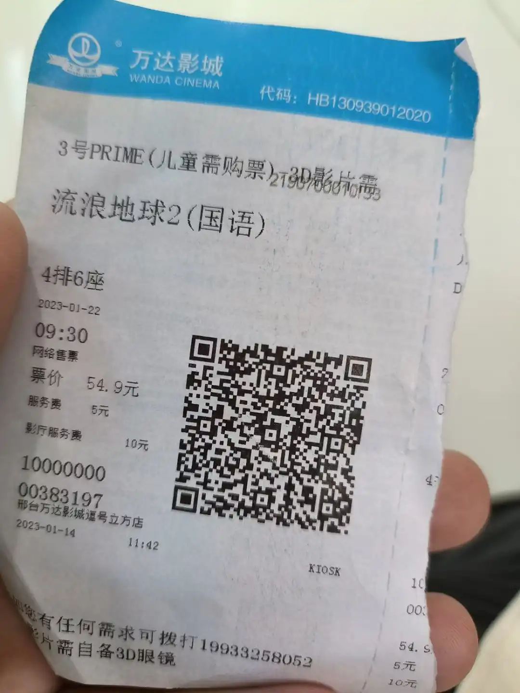

大二开学前，我第一次坐二十四小时的硬座，从河北回成都。火车穿过无数小站，夜色一层层压下来。为了打发时间，我在大麦上买了两张音乐会演出票，又鬼使神差地买了一张“成都世界科幻大会”的会员票。那时我对它一无所知，连雨果奖是什么都不知道，只觉得科幻大会可以去看看是什么。

还记得我刚刚到成都时，我和初中时推荐我看《三体》的那个朋友开玩笑说：“等我有空了，要去科幻世界圣地巡礼。”可直到今天，那次巡礼都没成行。而加入科幻社团真正的转折，是那年秋天的百团大战。校园里到处都是拉横幅的摊位，我因为买了世界科幻大会的票，特意去找“科幻协会”的摊子看看。而当时成都理工的计算机学院其实有两个最热的社团：信息安全协会和程序设计协会——一个打CTF，一个打ACM。我那时也在程序设计协会，是校队的一员。而校队一个常回来看我们的老学长，吃饭时笑着说：“其实咱学校二次元浓度最高的不是动漫协会，是科幻协会的动漫组。我当时不信。可那天在百团现场，那个笑话突然有了现实基础。关于那天我现在只能记起，RocketRaccoon拉我进组团去世界科幻大会的群，一个做的没什么特色的易拉宝，还有桌子上放着的银河奖奖杯和奖牌。

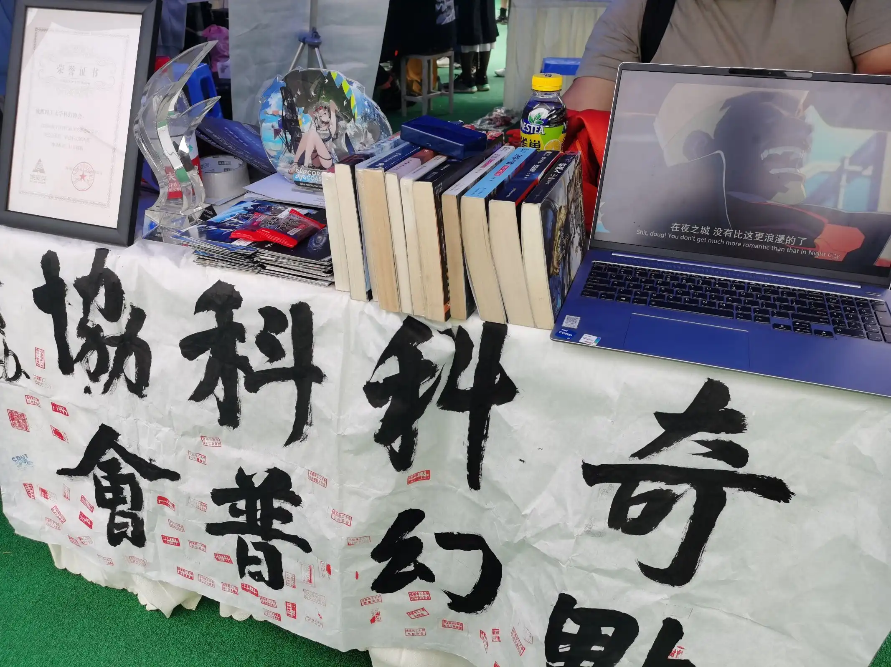

我被拉进了那个群，也被拉进了之后几年的故事。在当时看，那一刻其实没什么特别的，而再后来看则完全不同。

那一届世界科幻大会在成都郫都区的科幻馆举行。离学校远，坐地铁再换乘有轨电车，要两个小时。我前两天因为学校的事没去成，第三天终于和协会的星沉一起出发。直到换票前我都不知道，我买的是通票还是单日票。换完票是通票，工作人员在我的牌牌贴上“Mudern”的标签，也是从那天起，这个名字就成了我在科幻世界里的身份。

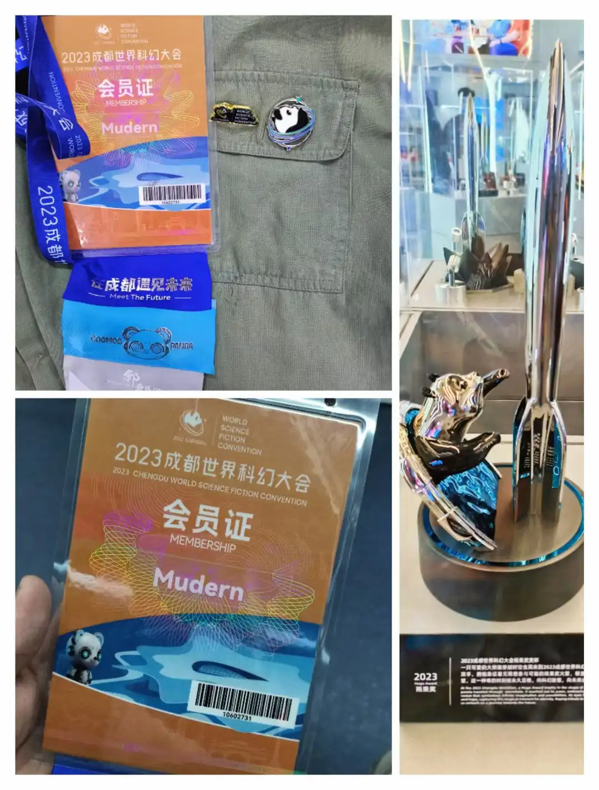

坐上接驳车，沿着湖绕行一圈，场馆渐渐映入眼帘。一个飞碟状的场馆出现在眼前，那一刻我突然有种奇怪的感觉：仿佛真进入了另一个维度。这里的人不再用真名，而用昵称彼此称呼。我遇到了哲学鸡、宝葫芦，还偶遇神游八方——就是那个做《我的三体》的神游八方。不过我当时并不知道他是神游八方。我让他在《科幻世界》特刊上签名，那本书后来送给了当年那个推荐我看《三体》的同学。

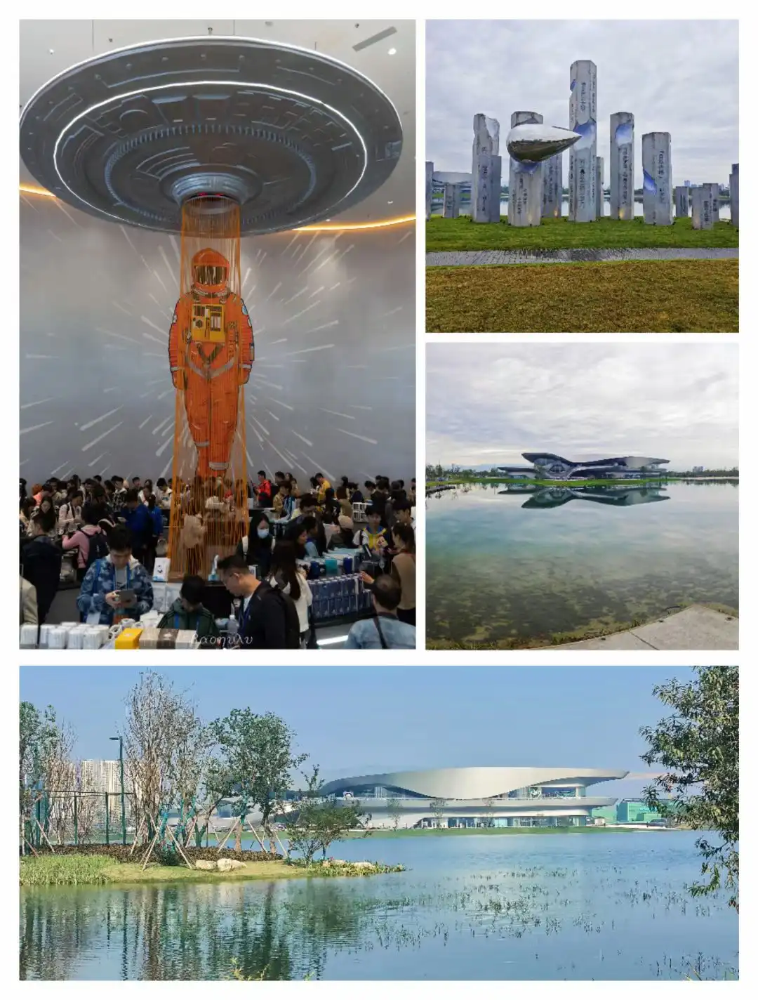

当天中午有最火的《三体》相关的沙龙，我们在会场外面排了超长的队，在队里和来参加活动的幻迷聊天，问问一些从没见过的丝带是从哪里拿的。进到会场中，活动还没正式开始，就有人高喊：“消灭人类暴政，地球属于三体！”后来听说还引起了上面的关注。也正是在这场活动中，王诺诺提问大刘，大刘笑着说自己其实不太满意“智子打在视网膜上”的设定，想改成“展开在太阳上”，可编剧拒绝了：“没人能魔改三体，刘慈欣也不行。”全场大笑。那几天，我几乎泡在各种沙龙和讲座里。走在展馆长廊，灯光、模型、人声混合成一种迷幻的氛围，像真在另一个世界。

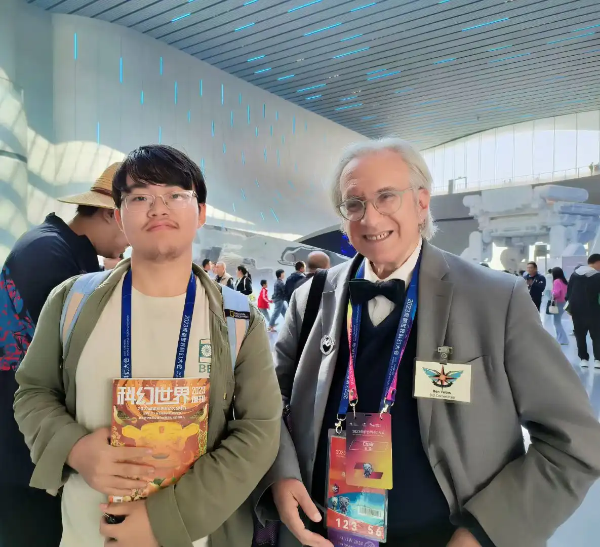

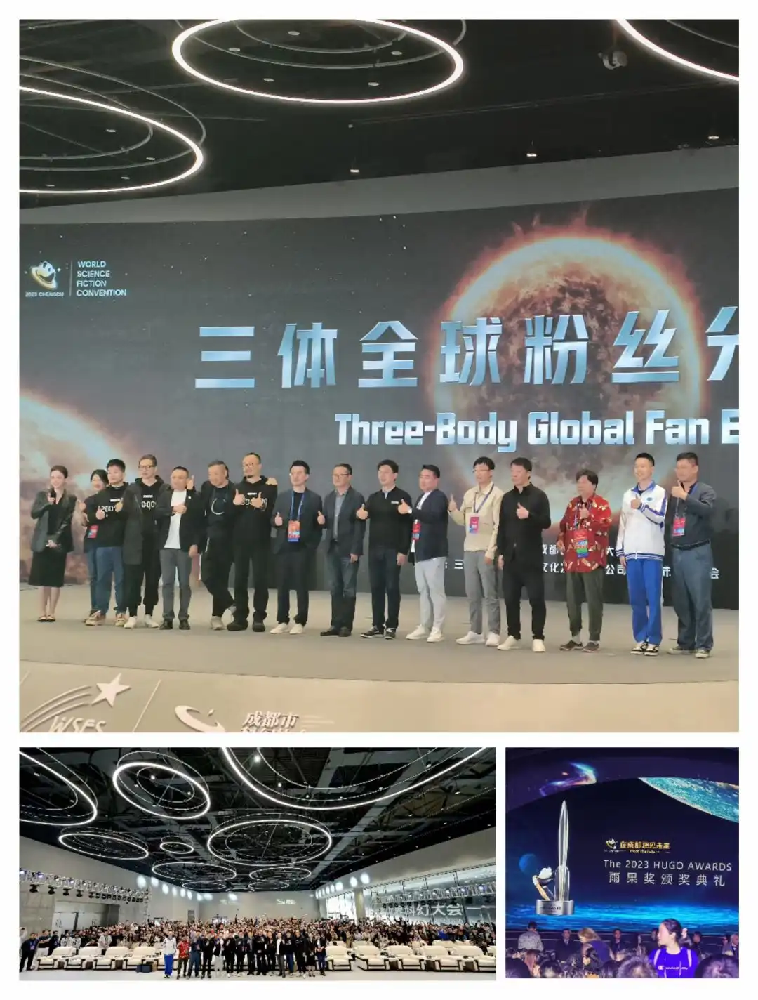

虽然科幻大会官方给我发了好几次，让我进行开幕式，颁奖礼和闭幕式的抽奖，我却从来没有抽过。我也就没参加雨果奖颁奖典礼。那天晚上，我一个人坐地铁回学校，手机上跳出消息：海漄获奖了，河流获奖了。“河流”这个名字第一次出现在我的科幻中。

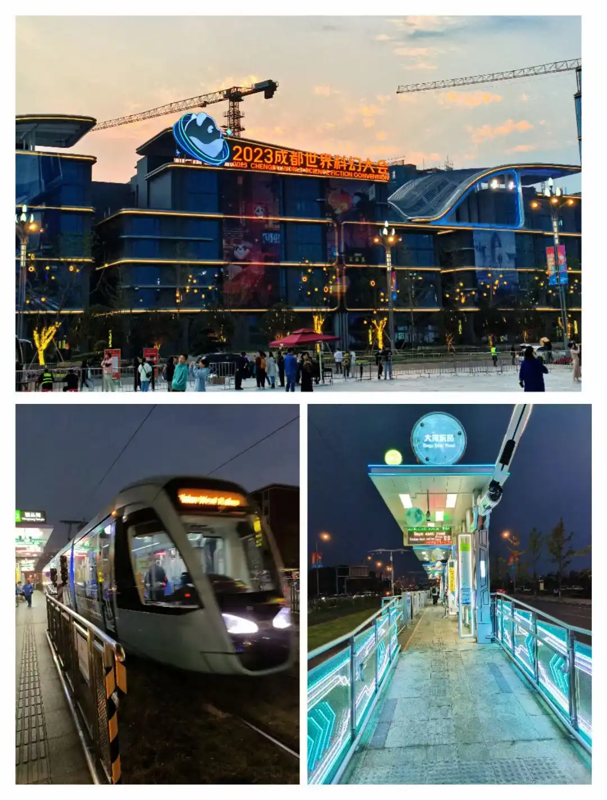

有时我会想，如果那天我没去那个摊位，如果我没问那一句“会不会组团去科幻大会”，如果Rocket没拉我进群——那我现在的生活，会不会完全不同？

世界科幻大会结束后没多久，我又去看了成都天府科幻影展，而随后成都理工科幻协会也开始了新一轮的招新。

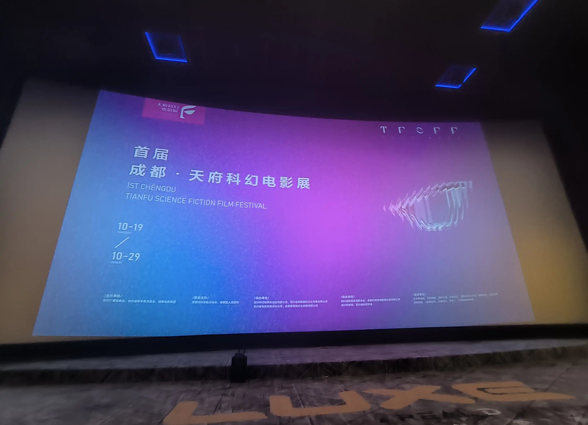

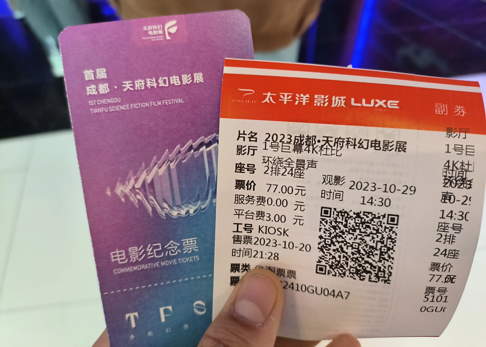

我去得很随意——Rocket递给我一张申请表，我连笔都没带，只好随手写了些乱七八糟的字。没想到第二天，我就被拉进了干事群。那之后，幻协陆续办了不少活动——老学长回归讲座、科幻机甲社课、每周一次的电影放映。我都去。起初是为了逃避学院的琐事，后来变成了一种习惯。

最让我记得清楚的，是河流来成都理工的那次。我那时已经早知道他——在世界科幻大会上因为编纂《零重力报》拿下雨果奖最佳粉丝杂志，也是在群里偶尔冒泡的那位“河流”。

那天晚上下雨，Rocket选了一个咖啡店旁的小棚子，说要“围炉煮茶”。天气不好，乌云慢慢的飘过来，压下来，风从缝隙钻进来，雨敲着塑料顶棚。老板支起两个炉子放在桌子上，放了两个红薯。炉火在风中飘摇，几乎没起到什么作用。我们把更温暖的位置让给河流，可还是因为天气不好让河流身体不太舒服，最后安排了两个同学把河流送上了车。剩下的人还在棚子里打UNO，聊天、笑闹。风还是从缝隙钻进来，雨还是敲着塑料顶棚，我们的笑声断断续续。虽然风有点冷，但是我的心里升起了点热腾腾的东西。

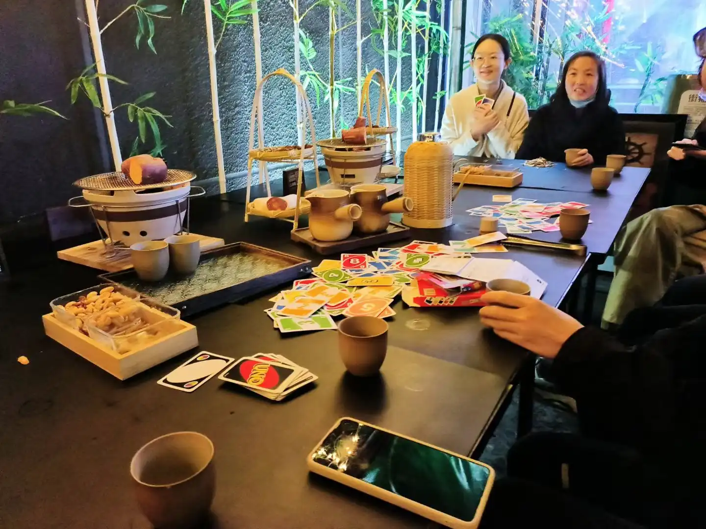

也是从那晚起，我算是正式融入了幻协。

关于河流，能说的还有很多。

河流算是奇点科普科幻协会的老朋友了，不过大多数往事都是我加入协会之后才一点点拼凑起来的。大概的脉络是这样的：早在他做幻协考古项目的时候，就和协会建立了联系。当时正值雷哥和Coco姐任会长，那是2019年银河奖之后、协会从鼎盛逐渐走向低谷的一段时间。而也正因为河流，协会那段几乎要消失的记忆被保存下来——包括早期的活动记录、雷哥对初代会长郭威的采访、协会第一版会徽等宝贵资料。

河流曾四次到访成都理工，我有幸参与了其中三次。至于他到访四川的次数，就更多了。这里只能选几件我印象最深的事讲讲，部分内容和其他章节会有重叠。

我和河流的第一次见面，正是上文提到的那场UNO牌局之前。在那之前，我们先在学校附近的“铁建鸡毛店”聚餐——那也是幻协常用来接待“外宾”的几家馆子之一。第二次线下联系，大约是一年后，2024年七月，正值格拉斯哥世界科幻大会前夕。那段时间，河流刚推出《零重力报》的英文专题版，也先后拜访了42号书咖、四川几所高校、八光分以及马门溪龙科幻图书馆。关于那次拜访，我的记忆其实不多，最清晰的是他朋友圈里那句配图文案：“河流大军来了！”可惜那时我因学业在外地，没能亲自去42号书咖。等我再有机会造访时，已是关店前最后一次聚会。那天的情景我至今还记得：石头姐、万象峰年老师，两面墙的科幻书籍，墙角摆着峰年老师的奖牌，还有临别前高校幻协同学们堆起的纸杯塔。闭店那天，石头姐让我们每人挑一本书带走，我选了《酒的全事典》。后来，这本书也成了我第一次在川TUO沙龙的主题——不过那已是后话了。

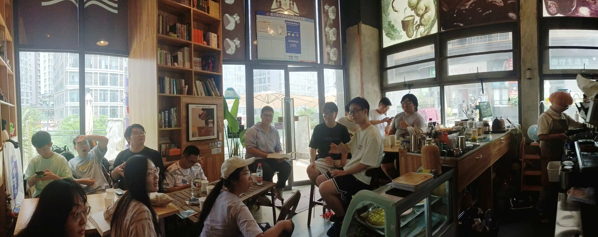

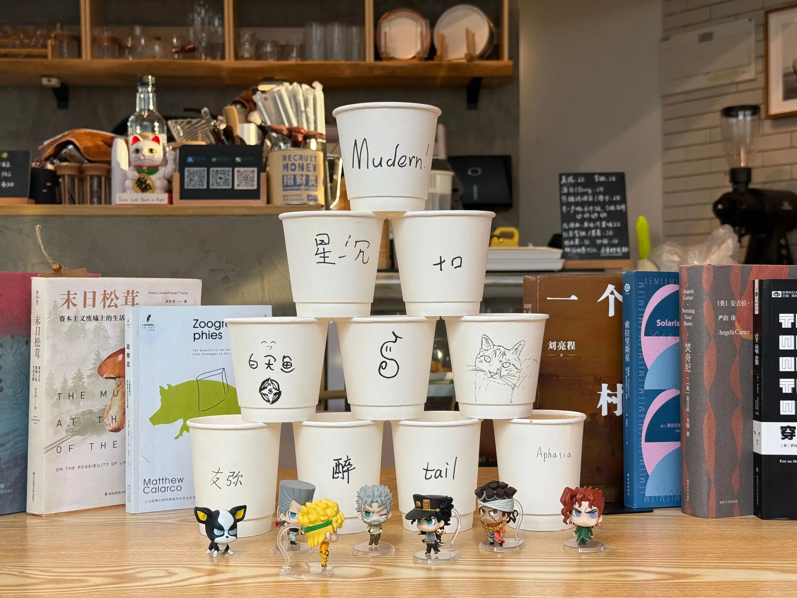

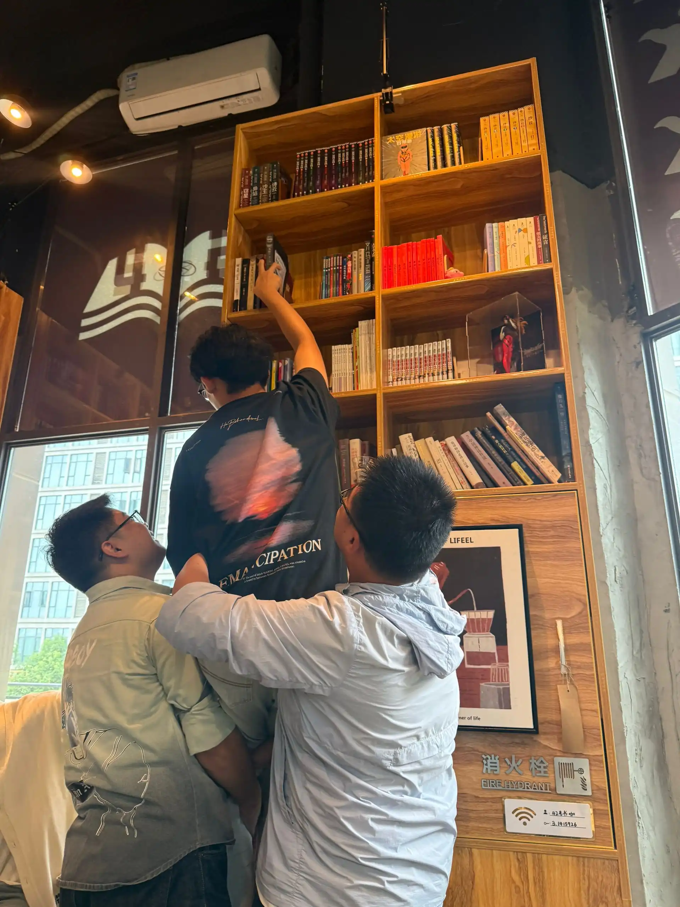

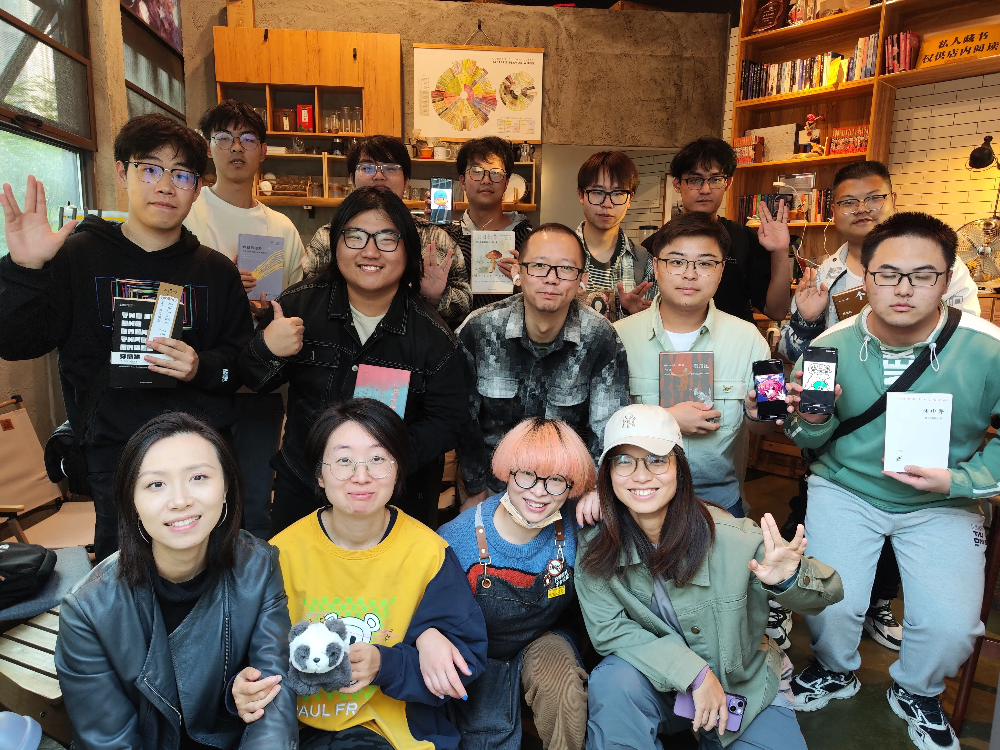

河流第三次拜访成理，是2025年1月，也是我第二次与他线下相见。算下来，距离上次见面已过去一年半。虽然中间没能再会，但因为河流在完成幻协考古后，开始做世界科幻的翻译项目，我也有幸参与其中，翻译了几篇短文，其中一部分后来刊登在《引力波》第一期及协会网站上。那次来访，河流的行程我已记不太清，大概也不是以“任务”为主，更多是老朋友见面。我们依旧在学校附近的餐馆吃饭，晚上去了动漫协会下属桌游社团老学长开的桌游店。而这次也是河流第一次和42号邮局局长“深蓝”见面。42号邮局是由成理毕业的老学长深蓝创立的科幻迷组织，以公众号为主要平台。我也算邮局的“老记者”，写过几篇活动记录。托局长的福，还曾参加成都市科幻协会的第一次会员大会。关于他的故事，可以在《零重力报》第27期“我与科幻”专题下找到——那篇《爱科幻的人，眼里都有光》正是他写的。想来冥冥之中也有点呼应：当时是他写河流的征文“我与科幻”，如今轮到我来写这部分的内容。那晚的桌游活动非常尽兴，但遗憾的是，那家店后来因种种原因倒闭了。我们又失去了一个据点，也失去了无数可能发生的快乐时光。

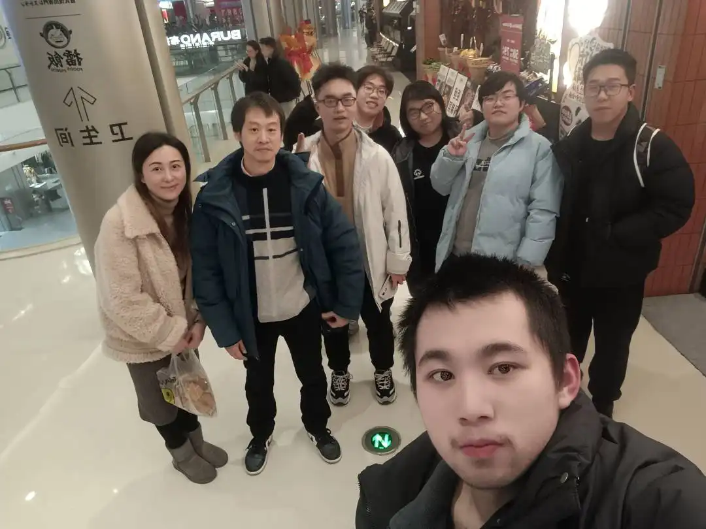

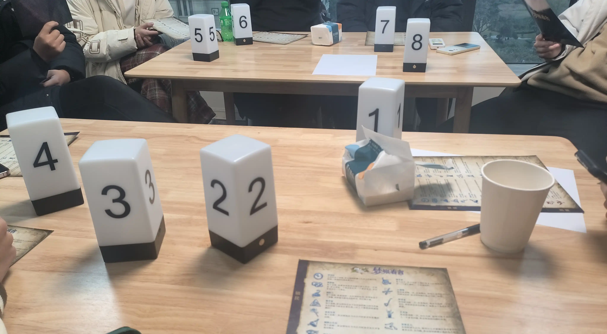

第三次见面时，河流已开启了高校巡讲——主题是“生命在世俗生活中的超越性”。那天上午，我们在宝葫芦家招待他；下午在学校图书馆的研修室里办讲座。小小的空间里挤满了幻协的新成员。我当时写了一篇活动记录投到42号邮局公众号，节选一段放在这里：

> “人的本质不在他所是，而在他将成为什么。”河流就是这样一个例子。他没有逃避，也没有幻想，而是在现实的重压中，用行动把自己从苦难中塑形出来。我知道这就是他所说的那种人的可塑性。
>
> 雨最终还是没怎么下，走出教学楼时我才发现天已经开始黑了。夕阳已经慢慢落下，我站在那淡薄的日光中想，人生有很多不可控的部分，但意义是我们自己要造的。哪怕只是一个名字的更改、一段话的整理、一次行动的坚持，那都是真实的“存在”。而所谓“超越性”不是在苦难之上，而是在苦难之中。想实现超越就要通过一次次主动选择去定义自己的生命，而不是等待别人赋予意义。
>
> “只有不停地做，才能找到更多的价值与意义，为此甘愿抛弃生命和物质基础。”
>
> 这就是河流告诉我的事。

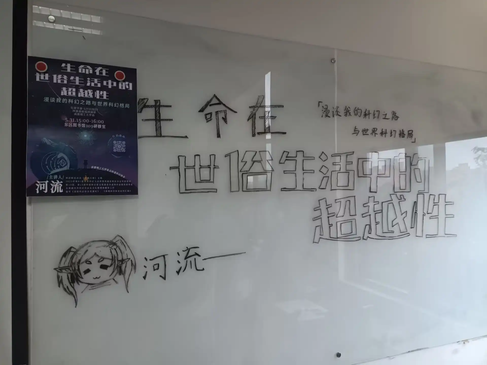

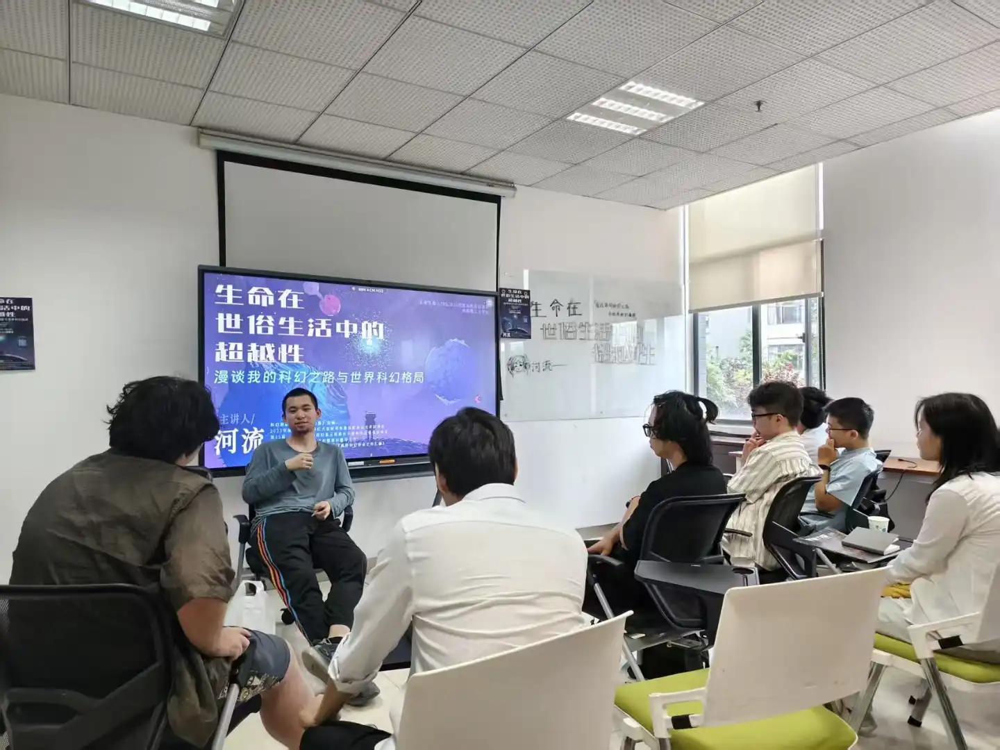

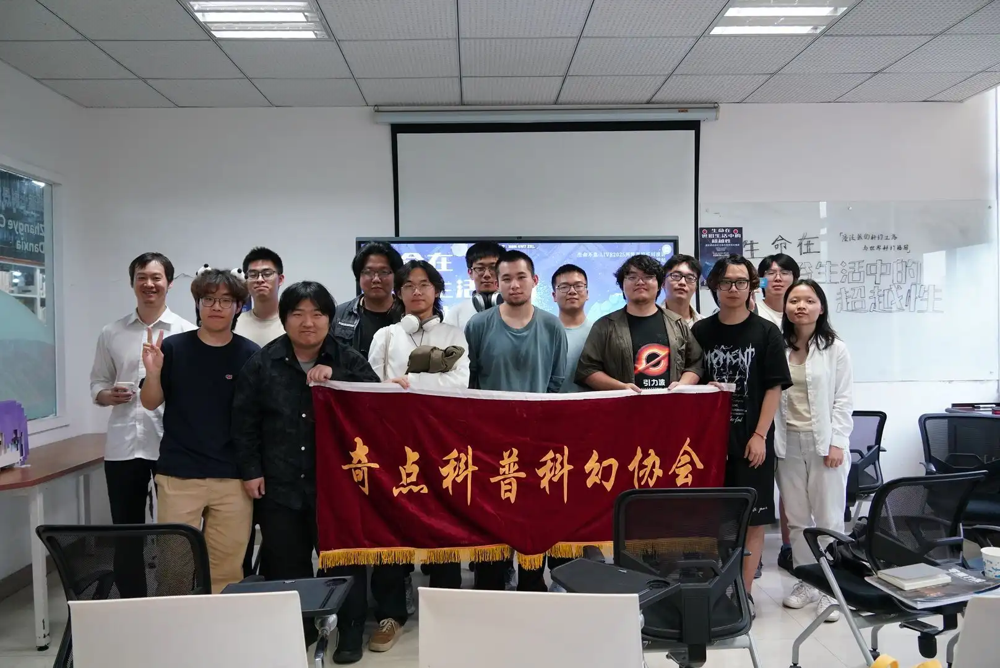

说回我自己，大三的那一年，我同时身在两个体系里：一个是学生会，一个是幻协。学生会有清晰的晋升轨道：大一做干事，大二做部长，大三做主席，大四保研。一切都循规蹈矩。主席觉得我“能力不错”，打算让我大三接任；可我并不感兴趣。我不喜欢争什么位置，也不喜欢那种暗流涌动的竞争。后来，学生会出了点鸡毛蒜皮的事——换届分裂、内讧、派系。我成了部长，但那场纷争让我心生倦意。我被调去团总支，负责一些不算多的学生工作，好在没有上下级关系，想做的事情都可以一个人搞定，不用麻烦别人。说是服从组织安排，实则被“边缘化”，我笑着接受，却从那一刻开始有了更多自由的时间。也正是在那段被“放逐”的日子里，我更频繁地去幻协。我在学生会的郁闷、学业的焦虑、生活的倦怠，全在那群人里被慢慢化解。我开始喝点小酒，有时喝点大酒，夜里看电影、看小说、聊天。

成为副会长这件事，其实有点意外。我原本只想在幻协“混着玩”，因为这里没有认识我的人，可以逃避学生会的琐碎与学院的压力。那年秋天，幻协要换届。Rocket拉大家一起吃火锅，其实就是要商量商量换届的事情。学校换届要求成绩和团员身份的一些硬性条件，所以没有什么很合适的人选。我其实心里明白，从功利角度讲，这个职务给不了我什么——它既不会加分，也不算荣誉。但我又不忍看幻协“断代”。所有在场的人都说，可以帮幻协工作，但是不想要个什么会长，副会长的头衔。而最后的结果，是莫名其妙的——子夫成了会长，而我成了副会长。像是命运随手一推，我们就站在了那个位置上。我本是闲不住的人，既然坐上了这个座位，就开始真正去点东西。

我对自己说：既然是幻协，那就让它像个样——不能死，也不能空。当上副会长之后，其实也没有做太多工作。更多的，是一种“把事情接下去”的心态——想给后来的人奠一点基，铺一点路，不求做得多好，只希望协会别死掉，至少别死在我的手上。

接任副会长后，我干的第一件事，就是换掉幻协的会徽。那时候协会缺美术资源，就只能找外部约稿。最后我们确定了一个主题：“从黑洞中诞生的马门溪龙。”围绕这个概念，我们反复讨论形象、配色、线条。后来才知道，原来之前那版难看的会徽，是老干部那届改掉的；最早郭威学长设计的第一版其实挺好看。我们做出初版会徽后，拿给河流看。他笑着问：“这个和你们的校徽区别是什么？为什么不参考一下第一版？”我们面面相觑——其实根本没人知道还有“第一版”的存在。那时的第二版实在太丑了，非换不可。那段时间正好是我大三上学期的寒假，我想着趁着有空推进会徽的更换。后来又找人约稿，绘了几张草图，最后从中选出了定稿。后来根据这个设计我们做了金属徽章，也印了明信片。拿到成品那天，我跑去打印店取货，包裹散发着油墨味。因为这事，我认识了学校附近一家打印店的老师，也算是提前找到了后来做会刊的供应商。

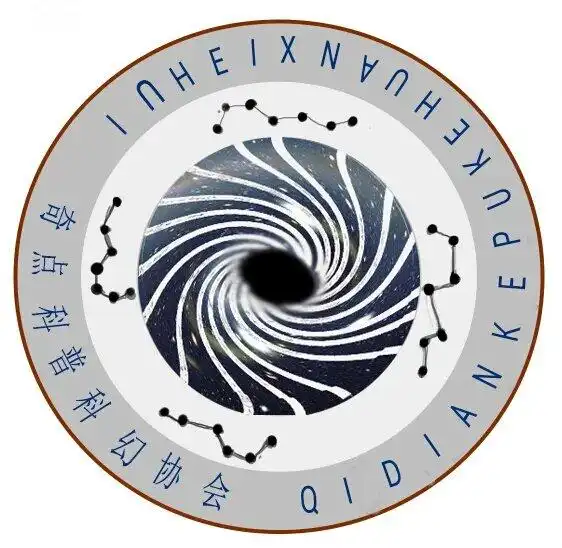

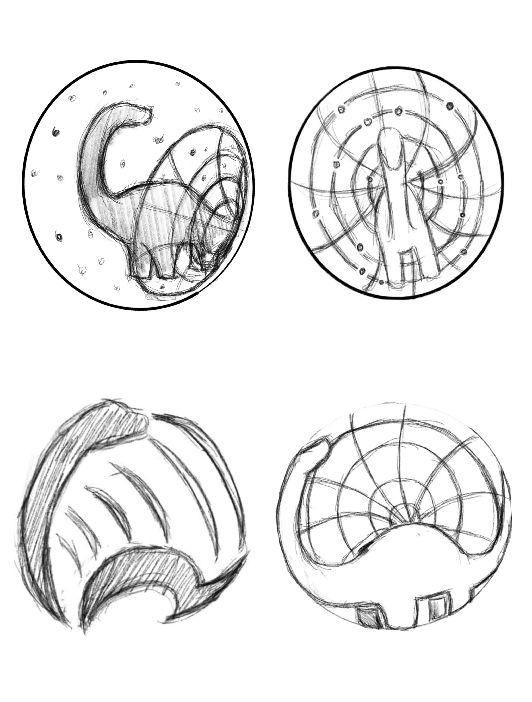

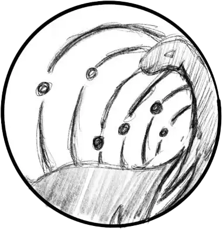

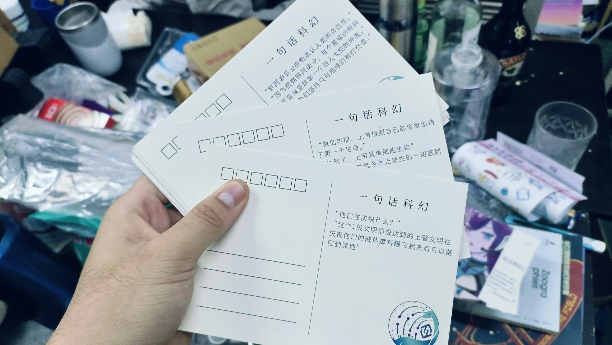

第二件事，是做会刊《引力波》。那时我已经参加过几次川TUO活动，心里一直有个想法：给幻协十周年留点东西，也算是留下点“公共记忆”。我调研很多学校的社刊，最后决定对标西南交大的《深空》。期间我还请教了小罗，问了不少关于制作细节的问题。调研完，确定版式、选题、栏目。我一直是个悲观的人。开始之前，我就问自己：“如果明天起只剩我一个人，这本刊物还能做完吗？”答案是——能，只是时间会更长一点。于是我决定开始。

那段时间遇到过各种问题，但比我想象的顺利。没有四面楚歌的孤军奋战，大家都在尽自己的力。十口主要负责编辑组织；星沉负责外联，找社团和作家征稿、签名；子夫完善了社娘的设计；白天鱼负责稿件编辑和校对；还有许多同学帮了不少忙，也包括协会的老登们。这些我都写在了《引力波》第一期的致谢部分。

做会刊时，也发生了不少小插曲。文章全部收齐的那个晚上，我睡不着，又怕吵醒舍友，就抱着电脑放在厕所旁的水池上，借着屏幕的光排版。所以，对，没错，《引力波》的第一版，就是厕所旁边做完的，这件事我谁也没告诉过。后来交付打印样刊，我和十口、Jerriel 去取样刊时发现，才发现选成了大度纸而不是正度纸，导致整本会刊大了一圈。

想到更早之前，刊物命名时，大家很热烈的讨论刊名——十口提议叫《插线板》，白天与提议用自己一篇没完成的小说命名。我专制又独裁的决定：“叫《引力波》吧”。引力波，那是一种微弱却真实的震荡，穿过空间，传递存在的证据。刊物做出来之后，我第一次感到一种奇异的完成感。那不是“成就”，而是一种“证据”——证据证明我们真的在这里，思考过、写作过、相遇过。在制作的过程中，大家都出了很大力。

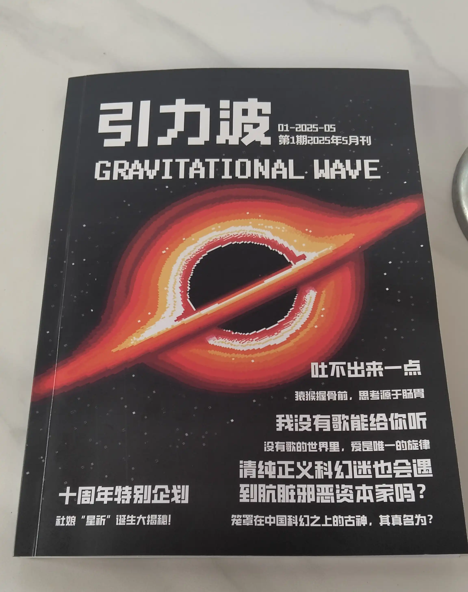

在我和协会的人混熟以后，幻协组织了很多活动，也发生了不少有意思的事情。这里我挑一些印象最深的写一写——有些是第一次公开说的“内部资料”，有些后来也被写进了协会网站或《引力波》。

要先提的，是《宇宙探索编辑部》圣地巡礼。那次活动由星沉响应42号邮局的周年庆策划，我们去了宜宾，参观电影的取景地。那也是我第一次和成都其他高校的科幻社团同学面对面接触。在找“卧底”游戏的环节，我认识了不少朋友——电科的点汀停鹭、川大的tail、还有哈尔。那次巡礼之后，我才真正觉得自己成了成都高校科幻圈的一份子。

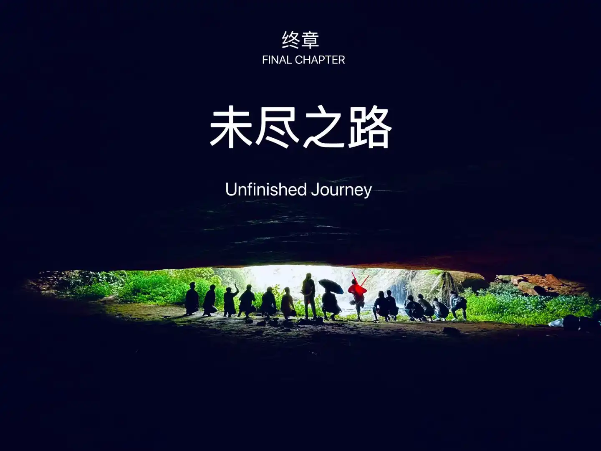

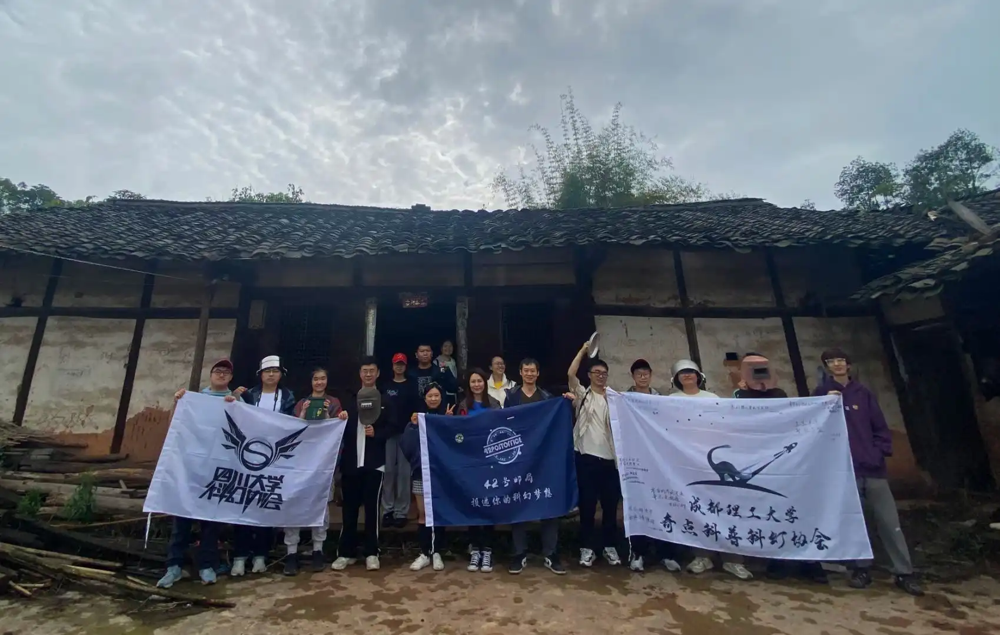

然后是川TUO，到现在为止，我一共参加了三次，不算最多，但也绝不是最少。

第一次是川TUO3.0。那次每个人都有名牌，全程是两组人对抗积分快乐赛。最后因为部分人来晚，分数没录上，结果成了“平局”。但因为平局实在是太有趣了，太科幻了，于是组织者几分钟临时写了个“平局结局”。我参加了很多沙龙，也和哈拉邵、子夫一起玩克苏鲁跑团《诡镇奇谈》。我还提问了严曦老师：科幻小说中如何写好宗教——后来看到别人写的活动记录里提到这个问题，哈哈，那个问题是我问的。后半夜我没怎么睡，凌晨四五点又去跑团。六点的时候搞了一个“谁是卧底”科幻版猜谜。那次我还认识了一位无线电爱好者，他送了我一张Eyeball卡[^1]

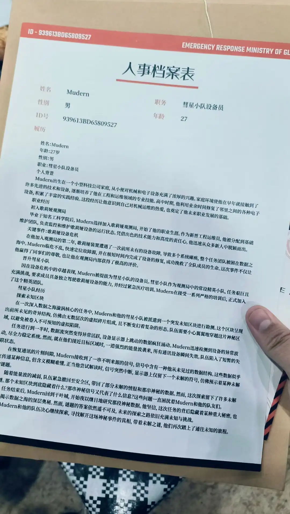

第二次是川TUO4.0。这次我第一次做了自己的沙龙：《酒，比酒更久的未来？——科幻中的酒》。那其实是我接手幻协之前喝大酒的一个小缩影。效果意外地好，严曦老师也在现场，还讲了自己大学时的喝酒故事。我也听了很多沙龙：泊翰老师的汉末生活讲座、阿Lin的娱乐圈揭秘、严曦老师的写作分享。我问他一个问题：“科幻作为点子文学，点子在创作中到底有多大比重？”晚上听了tail的讲座《从诡丽幻潭到飞碟探索》。内容极广，信息量大得离谱——那种过载的知识冲击让人恍惚，却又很过瘾。

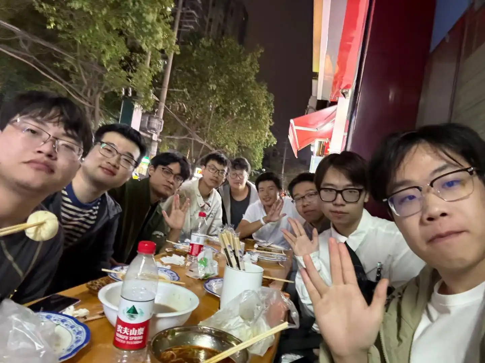

第三次是川TUO5.0。这次我讲了《地月间百万吨级物资运输》，反响很好，也因此认识了万子谦老师和赵辉老师。我还打印了一叠厚厚的论文，都是关于天钩、太空电梯等航天主题的资料。最后送给了赵辉老师，才知道他是川大计算机学院的老师。那时我刚进导师的科研组，做fnirs（功能近红外）和EEG（脑电）多模态识别抑郁症的研究。这次川TUO上，索木老师讲的《血肉飞升——我们离科幻中的脑机接口有多远》，正好讲到近红外信号，我当场提了个专业问题，如何解决信号噪声问题。那一刻我突然觉得，我的“学术”和“科幻”第一次重叠了。也在这次川TUO，我给十口提了“社团生存指南”的企划——想着给幻协留点火种。

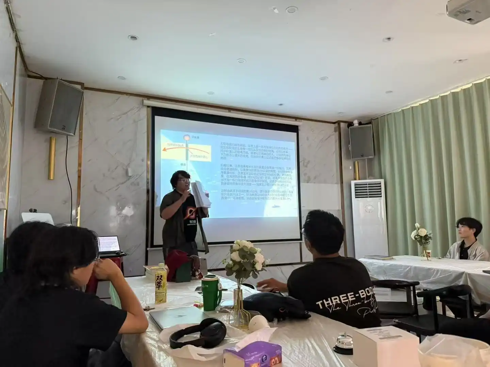

写这篇文章时，我在北京实习。原本以为赶不上川TUO6.0，但因为体测必须回学校，居然又能参加——这大概也是一种幸运。

幻协的日常活动之一是放电影。以前都是在教室里放，气氛安静但互动少。我那时突发奇想：为什么不搬到户外？于是我买了投影仪、幕布、支架和地钉。我们去过两次青龙湖，一边聊科幻，一边在草地上吃零食、喝酒、吹风。白天鱼吹口琴，阳光正好，那种惬意很难忘。后来我们真的在学校操场办了一次露天放映——结果那天成都降温、起风，观众没几个人，最后成了我们在全是我们自己人的情况下放完了《宇宙探索编辑部》。除此之外，我们还去过很多次联合观影：《沙丘2》《流浪地球纪录片》《你想活出怎样的人生》《蓦然回首》……每一场都成了我们的一段共同记忆。

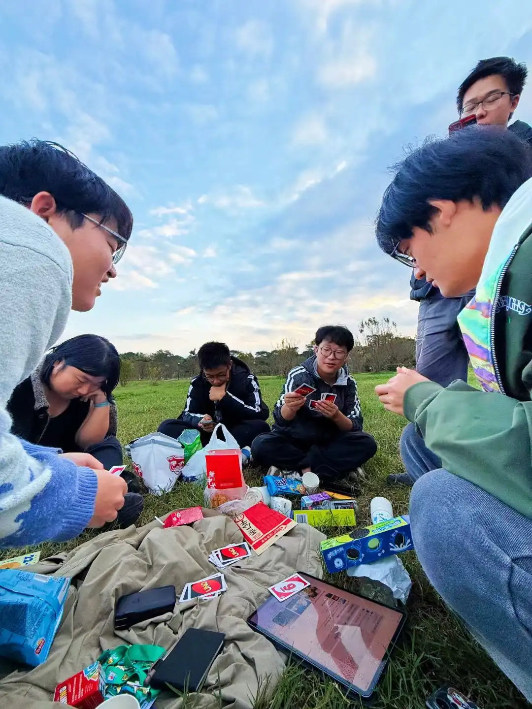

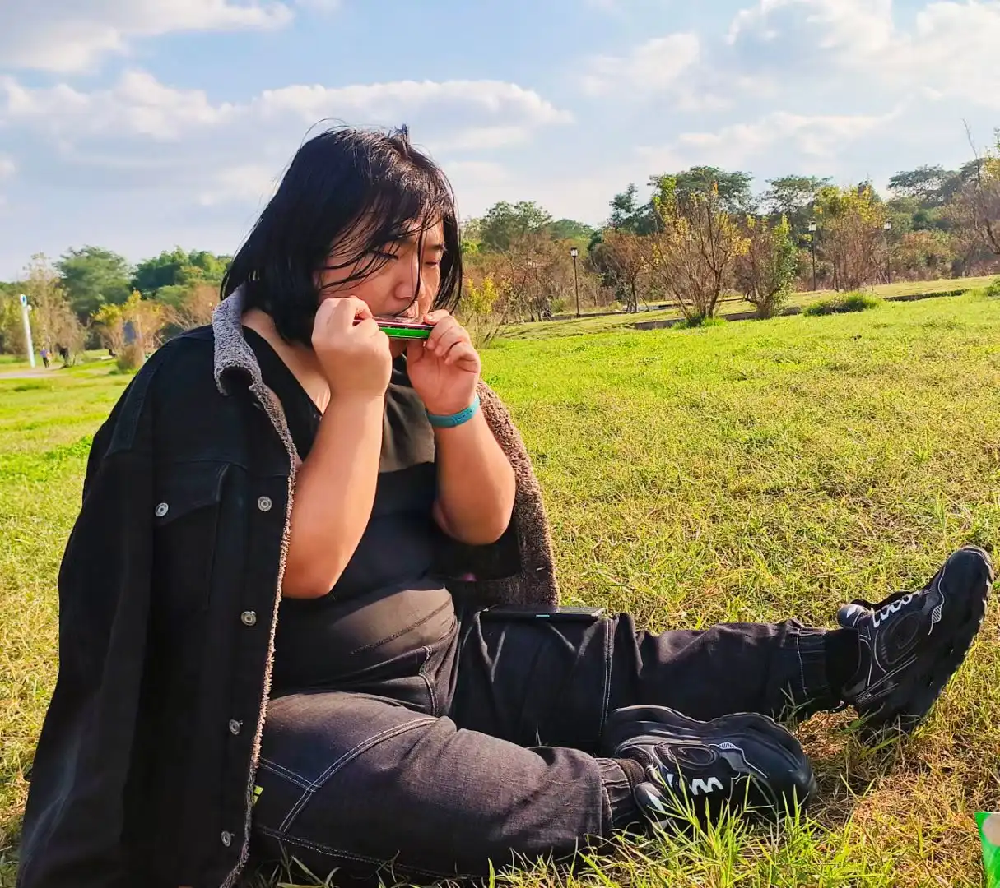

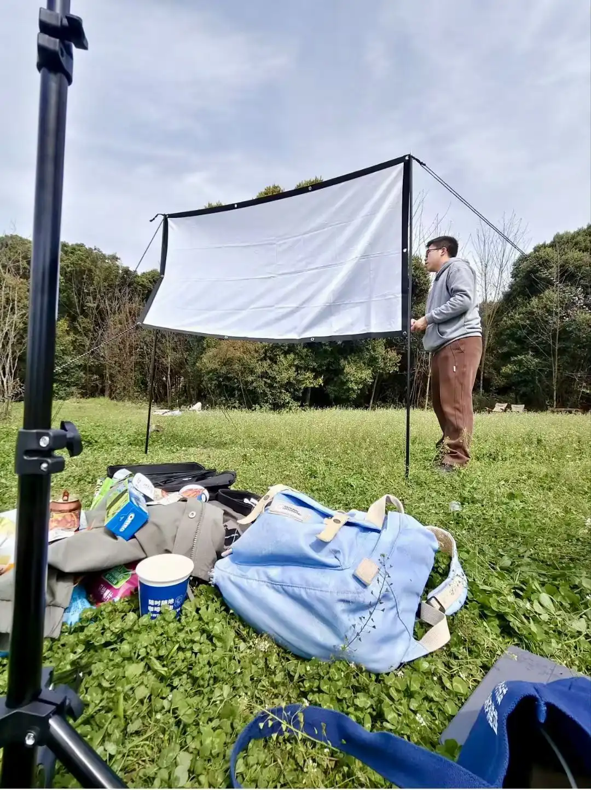

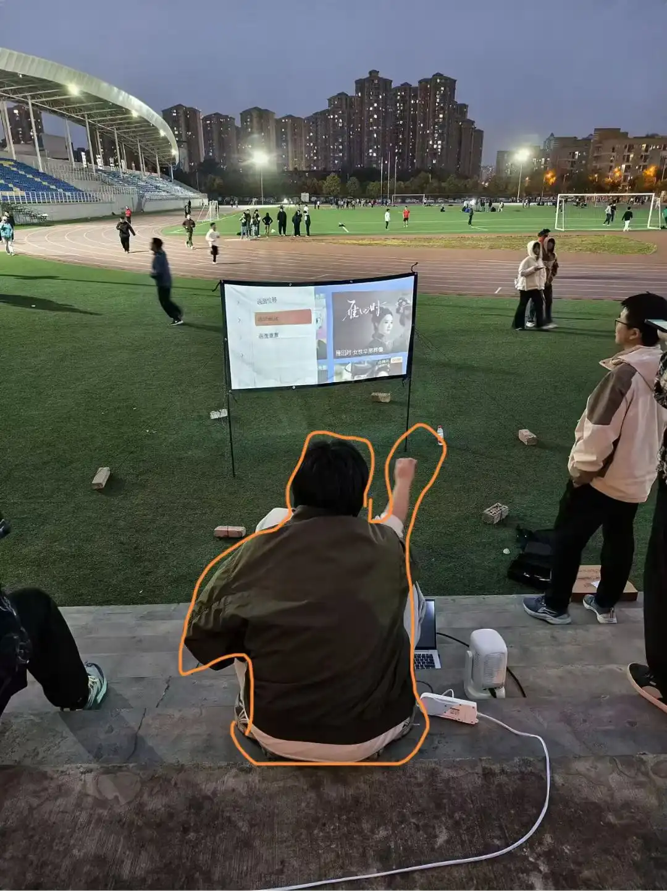

幻协有两次“老登回归潮”，第一次我也在。我总是认不全老登的名字，但星沉外联做得特别好——他总能叫出每个人的名字，和他们聊得像老朋友。后来他还专门写了一篇文章记录那次聚会。我在任时还赶上一次百团大战和招新。虽然我一向悲观，但那次真是运气爆棚——一举招到了十几个长期活跃的同学，他们后来都成了幻协活动和社刊的主力。

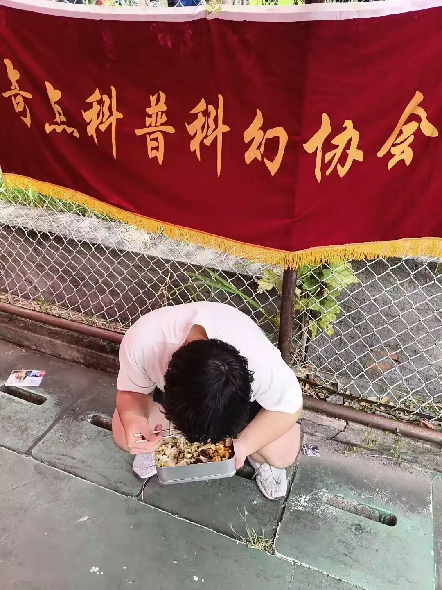

升入大四后，我卸任了。Jerriel 和十口接过了会长和副会长。我在成都找了个软件开发实习，负责公司AI Agent链路搭建。有天Jerriel 提议：“要不给协会做个网站吧？”技术上可行，但实用意义不大——不过我还是做了。我设定的唯一原则是：“哪怕我哪天突然不在了，这个网站也能自己跑下去”。现在网站确实成了会刊投稿和编辑工作的一个小平台，也算是一种反哺。实习期间，我的leader非常“器重”我，给了我一个大活（笑），期间经历了“被CEO、CTO双双盯进度、被骂、最后又离职”的完整流程。也因此，我的leader非常愧疚，我们也自此保持联系。后来辗转深圳、又去了北京。这些看似与科幻无关的经历，却意外地又和科幻连上了。第一次面试时，我看到面试官，也就是我后来的leader桌上放着成都世界科幻大会的本子。他偶然翻看我的朋友圈，我也才得知他是2010四川科幻协会的办公室部长，还当过成都科幻馆文创店店长、未来大师奖第一届筹办人。他笑着讲起当年把刘慈欣关小黑屋要八十个签名的故事。我调侃他：“龙哥，糊涂啊，搞科幻不挣钱，这就是搞科幻的下场。”

在幻协混的这几年，最有“烟火气”的两场活动我永远忘不了。第一场是河流第二次来成理。
那天我们在宝葫芦合租的房间里做饭，迎接河流，也请协会的同学们一起。人多到椅子都不够，大家边吃边笑。河流还是很多东西不能吃，这次吃得不多，只夹酱牛肉。但让人高兴的是，比起我第一次见到河流，他的身体已经好了很多，也能见很多朋友，甚至在各个高校讲解自己的科幻心路历程了。第二场是幻协的跨年。吃饭、喝酒、看十口点名要放的《749局》，一群人窝在一起数秒迎新。那是我第一次在一个真正意义上的“大家庭”里跨年。

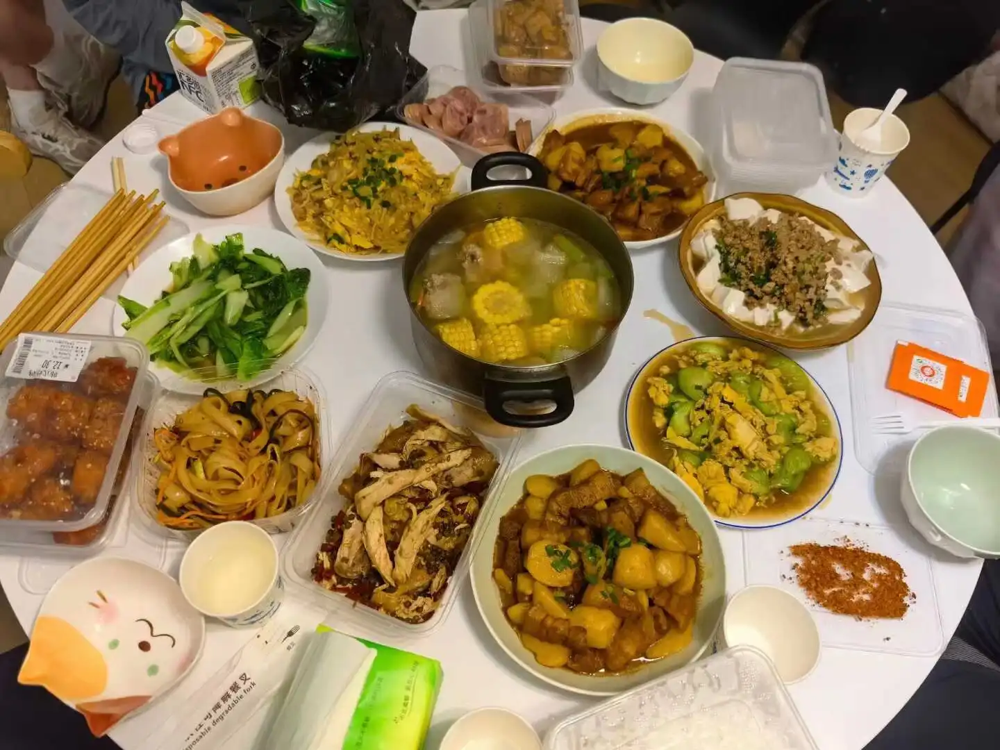

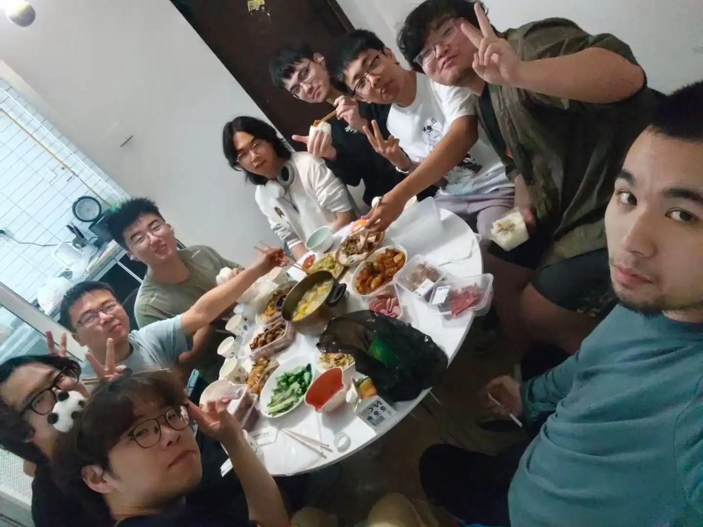

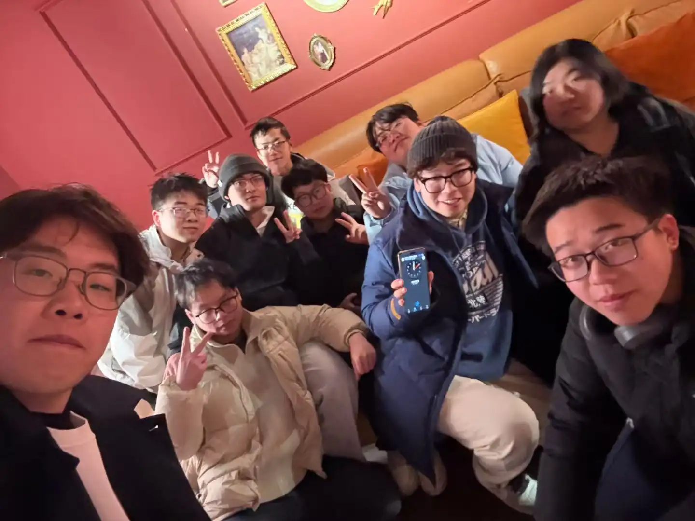

幻协的活动太多了——银河奖、星云奖、银河科幻大会、聚会、撸串、聊天。我们聊八卦，也聊Transformer模型里的高维语义空间；聊怎么重夺银河奖，也聊怎么找个废弃实验室当活动室。我记得有一次我和子夫真的去过计算机楼下那个实验室，满地化学瓶子和灰尘。子夫说想给科幻找个家。

我一直有一个想法——科幻社团其实是天然反科幻的。这句话听起来像个噱头，但我越想越觉得它是真的。为什么这么说？因为科幻是一种活在未来的文学，而科幻社团教会我最大的道理，却是如何活在当下。起初我也曾沉迷于“未来”的幻象。我以为未来是答案，是一切美好的源头。我们总在谈“有一天”，总以为只要熬过去，等到了那个时间节点，工作顺利一点、成绩好一点、遇到合适的人，人生就会真正开始。可慢慢的，我知道那天永远不会来。

我渐渐意识到，“活在未来”其实是一种极危险的精神鸦片。它让人把希望寄托在一个永远推迟的时刻上，让人忽视此刻的呼吸、眼前的人。而所谓的“未来”，其实根本不存在。很多人听到这话，会反驳：“今天、明天、后天，出生、成长、死亡，怎么能说时间不存在？”但我想说的是——我们太过看重线性流动的时间，以至于忘了当下的真实。

这也是我在一篇文章上看到的，文章还引用了这么一段话。

>“流动的并非时间，而是各种穿过你们称之为空间的静止场，
> 以及在此静止场中移动的物体。
> 时间只是你们用来测量运动的方式。”
> ——《与神对话2》

这句话我第一次读到时，觉得有些玄。可后来，我在幻协的活动、沙龙、露天放映、河流来访的夜晚、青龙湖的午后，一次次感受到了它的真实。过去与未来都不在那一刻存在，唯有那一刻的我们——谈笑、思考、忙碌、疲惫——才是最真切的“实在”。尤其在当下这个资源与机会都在收缩的时代，焦虑和内耗像是常态。很多人挣扎着被“未来”拖拽，害怕落后、害怕错过。而我在科幻社团学到的最重要的一件事是：唯有你在此刻开始去做，你才真正拥有。那些我在幻协经历过的一切，其实都不是“通向未来”的准备，而就是当下本身，就是那个最真实的东西。也许这就是我想说的，科幻社团所谓“反科幻”的意义——不是否定未来，而是在当下创造未来。

写下这些的时候，我已经离开了成都，漂在北京。早上醒来，推开窗，能看到这个城市的天。但我总会怀念成都的那种阴天，我总会想到青龙湖、想到幻协的那帮人、想到那个漏风的小棚子、还有会刊的第一页。

那时我们都不在乎什么未来，谈宇宙、谈未来、谈人类命运，可其实我们做的每一件小事，改会徽、排版、放电影、聊天，都比那些宏大的未来更真实。

我曾经以为，科幻是一种抬头的文学。

后来才明白，它也教人低头：

去看身边的光，脚下的路，眼前的人。

未来也许并不存在，

但我们在一起的那一刻，

我们谈论它、想象它、创造它——

那一刻的我们，就是未来。

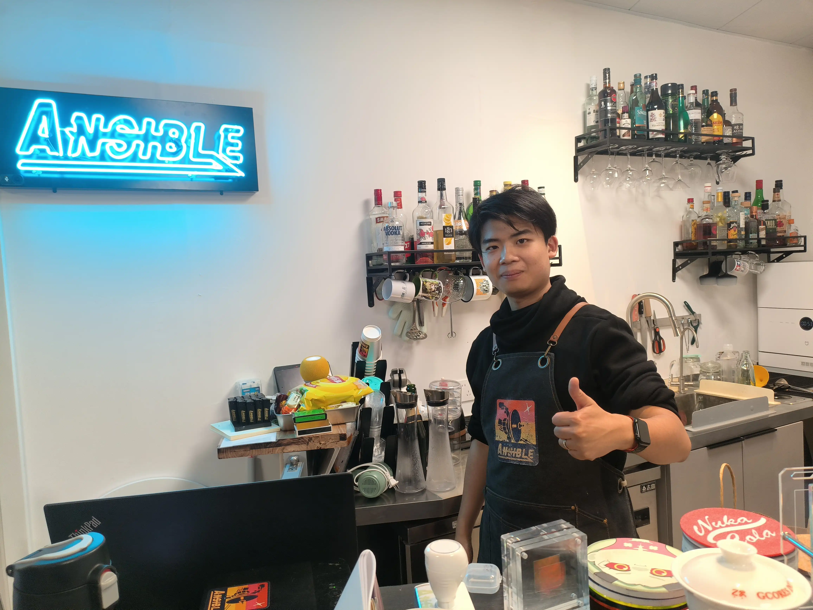

<small><em>文章成稿于安赛波咖啡馆</em></small>

[^1]:一般来说无线电爱好者相互之间通联成功会相互寄送带有自己呼号的卡片，如果是线下见面则会在原有卡片上做上标记作为Eyeball卡赠送。↩