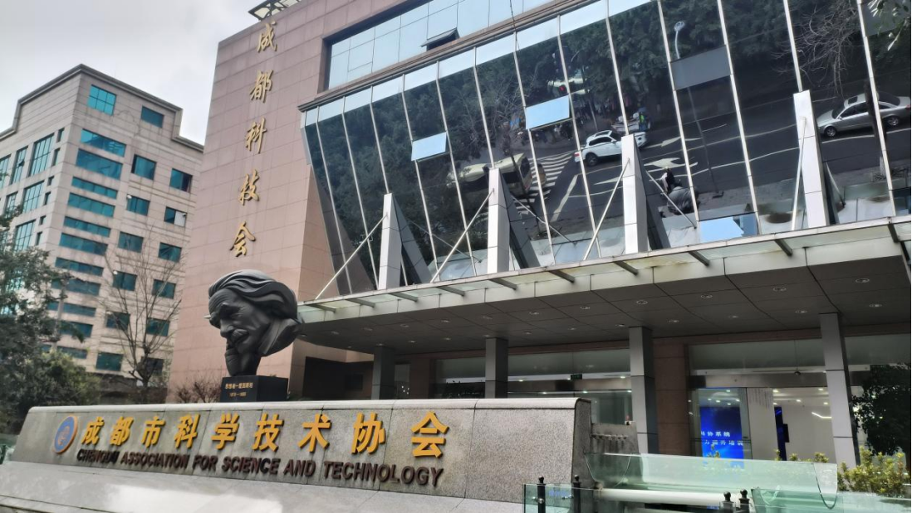
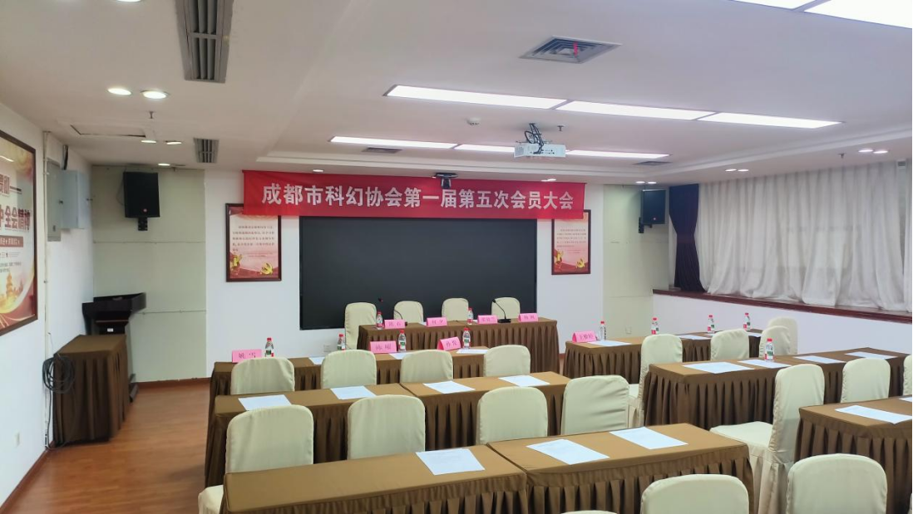
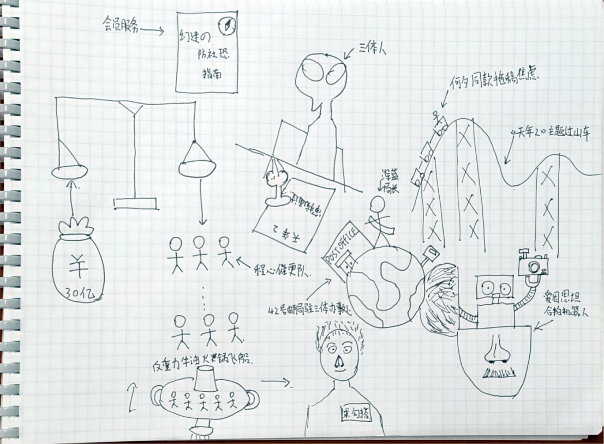
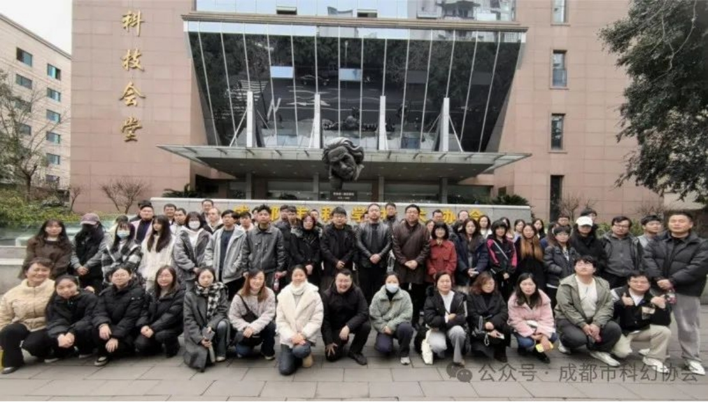

上周五（3月7日）我替局长跑腿，去成都市科协参加了科幻协会的会员大会，结果没想到这一趟成了“科幻迷追星现场&《社恐の奇幻漂流》”——全程怂得没敢搭话，明明和作家近在咫尺，却怂到连呼吸都调成了静音模式。

**「当社恐遇见爱因斯坦的歪头杀」**

3月7日清晨的地铁仿佛《星际穿越》里的休眠舱，我抱着「替局长签到就溜」的朴素愿望昏睡前行。直到科协门口那座爱因斯坦雕像闯入视线——青铜铸造的蓬乱卷发下，歪头沉思的表情仿佛在说：「年轻人，你即将见证的可是成都科幻宇宙大事件。」找A座时被门卫大叔的「左拐右拐再直走」绕得头晕，鬼使神差随便溜达进了个电梯，完全没留意身后跟着个发际线瞩目、有点憨厚的中年大叔。在签到处前签到，很久不写字的手抖得厉害，表格上“42邮局”四个字写得比罗辑的面壁计划还潦草。签到完转身时回头扫到那个中年大叔的脸，才惊觉这位竟是《伤心者》的作者何夕老师！第一次见他真人还是在成都世界科幻大会上。我内心疯狂弹幕：“要合照吗？算了算了，人家在认真看文件”“现在伸手会不会像变态粉丝？”想要张他签到的背影照发给局长交差，但是看着签到的长队，心里默默地想，”不会被当成偷拍的变态科幻迷吧，之后可能会被科幻迷们扭送公安局从而失去人身自由，不要哇……“。局长说：“没事，会议结束了之后还有机会。”

 

**「记得催更《天年2》啊！」**

距离正式开会还有一段时间， 局长的微信突然震动大腿，”记得催更《天年2》哇“。读完微信我抬头看了一眼坐在最前面整理讲稿的何夕老师，心里想，”要合照我都不敢，别说让我在作者本人面前催更了，啊啊啊，协会派我来之前没说要社牛来哇，下次我必须让十口和星沉作为协会顶级社牛来！“。但是转念一想如果我要是何夕老师回答这个问题，那肯定是。”《天年2》被拿去让三体人审稿了，三体文明要好好对其进行检查！一时半会是肯定出不了的！“但是《天年2》催更任务进度：0%...局长会扣我星际邮票配额吗？又偷偷抬眼看了一眼何夕老师，我正用余光测量与他之间的直线距离——5.72米，相当于《流浪地球》里韩朵朵扔校服的距离。或许该把催更纸条折成纸飞机？或者启动「假装晕倒触发急救剧情」计划？  

 

开会时，听何夕老师当选会长后讲“五大计划”，什么产业合作、国际视野，听着就很有格局。不过最让我共鸣的是他说要“加强会员服务”——比如下次开会前能发个《防社恐指南》就完美了（笑）。但是我天生的开会走神症，听何夕老师演讲时，因太无聊拿出用笔记本随便乱画，把30亿科幻基金想象成太空金币，足够雇佣100个程心去催更，再给局长P上「42邮局驻三体办事处」的绶带。抬起头，当何夕老师说到「将在郫都区建设科幻主题乐园」时我突然抬起头盯着他翻动讲稿的手掌出神：这双写出《六道众生》的手，此刻正划过成都科幻产业的星图，然后低下头我鬼使神差在笔记本上画了个「《天年2》主题过山车」（笑），标注：乘坐此设施可体验何夕式拖稿焦虑。  

散场时更戏剧，刚溜达到门口就撞见华文老师，两个“社交困难户”硬聊了三分钟天气，我和华文老师都不适应这么官方的场景，最后如释重负地各奔东西。

 

 

**「来自42邮局的祝福」**
希望成都市科幻协会的30亿基金能分0.0001%开发「社恐友好型追星系统」——比如在爱因斯坦雕像里藏合影机器人，或者给每位大佬配备「主动求勾搭」闪光胸牌！等成都真的建成赛博朋克火锅之都那天，我们这些手抖不敢要签名的小透明，或许也能乘着反重力牛油锅，坦然说出那句：「老师，能给我的《伤心者》绝版书签个个名吗？」。最后祝成都科幻越来越好！

 

