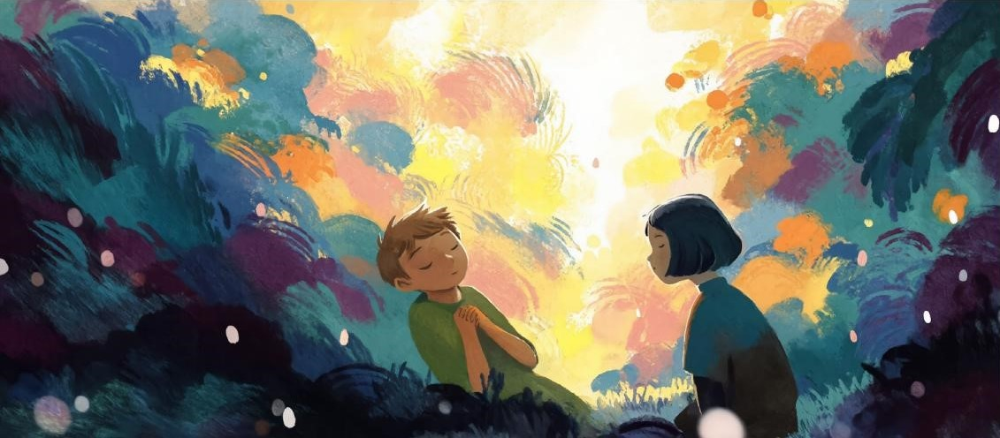

无垠的宇宙中,一艘飞船悠然划过。

比起那些追求速度与效率的流线型飞船, 这艘船更像是一个白色的圆球,上面带着看 不出用途的凸起与各种喷射口,不时喷出蓝 色的火焰调整姿态,旋转着向前飞去。

逼仄的船舱中,有一名少年盘膝坐着。 他身穿白色衬衣,黑发黑眼,秀气而纤细的 面容中好像没有一丝感情。

忽然,飞船的主控电脑用没有起伏的声 音告诉他,前方的星球上发现了人类遗址, 已将飞船的目的地改向了那里,预期记录时 间为五天。

少年叹了口气,走向了身后的减震舱。

飞船顺利降落,少年走下舷梯。环顾四周, 目力所及之处全是郁郁葱葱的树木,而在树 木包围之下,依稀可见无数残垣断壁。夕阳 透过摇动的树影,照在颓败的围墙上,如血 残阳好像在宣告人类的落日。不管这之前是

一个多么繁华的城市,在荏苒时光的轻抚下, 只余一片废墟。

除了一个例外。

在他前方五十米左右,仍立着一座三层 小楼,不知为何,在无尽时光的浸染下,只 有它还顽强地坚持着。即使半边已经倒塌, 它仍站在那里,不愿就此倒下。

但天色已晚,他决定明天再去探寻。

第二天,在清出一条勉强能够行走的小 路后,少年小心翼翼穿过废墟,来到楼前。

小楼的左半边几乎完全倒塌,右边剩下 的房间也全部紧锁,只能透过窗户往里窥视。

而楼梯看上去还算结实,他于是向上走 去。

来到了三楼,面前的房间吸引了他的注 意。这间房间正好塌了一半,只要注意脚下, 就可以很轻松地从倒塌的墙壁翻进去。

墙壁最低的地方,大概在他胸口下方一 点。少年用手撑起身体,翻了过去,跳入房中。

房间中铺满了地毯,因年代久远而变为 了模糊的灰白色。他落地的时候,激起了大 团的灰尘,在空中飞舞。

而在房间中间,正好是阳光所及的边缘, 静静地躺着一名少女。

她有着水蓝色的短发,白皙的皮肤,近 乎完美的面容,让人不禁心生怜爱。身娇小 的身体裹在黑色的公主服中,本应有些沉闷 的服饰在她身上却显得无比可爱。

少年不由得看呆了,他盘膝坐下,目不 转睛的看着她。

时间不知过去了多久,她突然睁开了双 眼。她直起身子,转向少年,似乎有些疑问 地歪着头望向他。

随即,少女突然笑了,纯粹的喜悦在嘴 角绽放。她张开嘴,用可以说是可爱的甜美 嗓音说道 : "你好,你想听我唱歌吗?"

"……虽然我刚刚是这么说的,但是我 好像没有歌能给你听欸,对不起哦。"

自称"小一"的少女在发了好长一段时 间的呆后,有些抱歉的说道。

少年在心中叹了口气。这颗星球上的人, 明明能够创造出几乎与人类无异的机器人与 人工智能,连记录工作都无法做到,结果就 用如此高的科技力量用来干这个?

现在看来,小一的储存模块大概有点损 坏,导致她忘记了"歌唱"。

"但是没有关系!"小一骄傲的挺起胸 膛,好像完全没有注意到少年的心情,"我 还可以自己作歌,只要有合适的场景激发灵 感就可以了!来。跟我来,只要到了外面, 我应该就能唱歌了。"说着,她便匆匆往外走, 准备将房门打开。

"等等。"少年有些弱气的声音在房间 中回荡。"那个……什么是'唱歌'?"

"……啊?"

"原来……已经过去这么久了啊。"

小一站在小楼楼顶,眼神复杂地眺望远 方。

少年站在她身后,仍在琢磨"歌唱"的 含义。

小一告诉他,歌唱是一种行为,意味着 伴随音乐,用有韵律的方法说出各种语句, 是一种传情达意的方式。

但少年还是不理解。传情达意,不是只 用说出来就好了吗?为什么要用这么拐弯抹 角的方式呢?

他提出疑问后,小一只是笑着告诉他, 等他听到时就懂了。

于是他把疑问放在一边,决定先试着了 解一下这里的过去。

"所以,以前这里是怎样的呢?"少年 开口问。

听到他的提问,小一回过神来,对着他 微笑着说道 : "以前啊?以前,这里是一个 很繁华的城市噢!人们从五湖四海来到这里。 也有无数人生于斯,长于斯。"

"所有人都坚信,这里会变得越来越好。"

"但是有一天,异乡人的出现打破了这 一切,从那天起,我们发现,原来自己在宇 宙中并不孤单。"

"虽然不知道为什么不管在哪个星球上 出现的智慧生命,最后都会进化成'人类' 这个物种,这里的人们还是一个又一个的离 开了,去往宇宙的深处。"

"在被称为'迁移时代'的末期,我诞 生了。创造我的人……是……"

她的眼中出现了一丝迷茫,声音也逐渐 变低,最后变成了喃喃自语——

"是谁……创造了我?我……又为什么 诞生?"

汗水从她洁白的脖颈流下,表情也从迷 茫慢慢变为痛苦。少年不由得看呆了。这么 真实的表现,她真的是机器人吗?

接着,她突然一抬头,对着天空高声喊 道 : "啊啊!真是烦死了,为什么我什么都 记不起来啊!而且,为什么都已经这样了, 我还是唱不出歌!明明情感、灵感什么的都 有了,明明很多东西想唱,为什么还是开不 了口啊?!"小一迅速转过身来,抓住少年 的肩急切地说道 : "你想知道什么是唱歌对 不对?那我们来做个交易吧!你陪我到处走 走,帮我寻找灵感,等我能唱歌了,就第一 个唱给你听!"

少年有些迷茫,他不知道为什么她对唱 歌如此执着,也不明白为什么一定要自己陪 着。她一个人去唱,不是一样的吗?

像是看穿了他的想法,小一这样说道 :

"那是因为,如果唱出的歌没有人能听 见,心中的思绪没办法传达,就没有意义了 嘛。"

"而且,如果我能唱出来,说不定就能 记起来别的东西了呢。"

少年在心中叹了口气,看来这里的记录 工作,要大大增加了啊。不过要是陪着她就 能记下这里独有的文化,也是不错的选择。

于是少年和小一,踏上了为歌而行的旅 途。

旅途的第一站,是曾经的中心广场。

之前宽阔整洁的马路上是无数高大的树 木和盛开的花朵,只有纠缠树根间偶尔出现 的几块碎砖还在锲而不舍的标记着人类生活 过的土地。

"虽然导航告诉我,确实是这里,但还 是真的什么都看不出来了呢。"

环顾四周后,小一有些傻眼的这样说道。

曾经是中心广场的地方,现在看来和热 带雨林没有差别,不过少年还是发现了什么。

"那是什么?"少年问道。

顺着他手指的方向望去,在前方不远处 有一簇藤蔓,好像试图抓住附近所有的事物 向外生长、蔓延。

而在杂生的藤蔓之间,有什么东西在阳 光下闪着温润的光。

"我也不知道是什么欸。"小一有些疑 惑的挠挠脑袋,"本来是想带你来看看城里 最繁华的地方来着,但那时候这里好像还没 有这个东西,算了,只要清掉藤蔓就能弄清 楚了。"说着,她走上前去,开始着手清理。

那是一块石碑,用黑色的大理石打造而 成,上面镌刻的字,大都被时光消磨殆尽, 看不出原本的样子,而它的四个面都刻着相 同的文字。

从能看到石碑上刻着的字开始,小一就 没有再说话,而是沉默着做着清理的工作。

此刻她仍盯着石碑,手指轻轻抚过上面 的文字,动作温柔地像是怕吵醒了谁。

"你知道这里写了什么吗?"她突然一 指石碑的最上方,那里刻着一行字。

她没有等少年回答,而是自顾自的说了 下去。"这行字的意思是——"

"我们曾在这里。"

小一眼神迷离,手指一寸一寸抚过石碑, 仿佛陷入了久远的回忆。仔细一听,她好像 在念叨着什么。少年好奇地靠近了一些,好 不容易才听清了她的话语。

从她的嘴角漏出的,是一个又一个陌生 的名字。她的眼中,带着浓得化不开的落寞 与悲伤。

少年重新将目光投向石碑,他好像终于 知道了它的用途。

这座石碑,是这个文明的墓碑啊。

名列其上的人们,大概是这里最后的坚 守者吧。当远航的最后一艘飞船消失在天空 尽头,雕刻家亲手将自己的名字镌刻其上之 时,是怀着怎样的心情呢?

太多的时光与故事沉淀在空气中,融化 在石碑里,让他想要说些什么,却又什么都 说不出口,让他想要去安慰眼前的少女,化 解她的落寞与悲伤。

但他什么都没有做,只是在沉默中静静 等待。

过了好一会儿,小一才慢慢从回忆中走 出。她转过身,并不掩饰眼中还未散去的悲伤, 只是笑着对少年说 : "谢谢你能陪我来到这 里,也谢谢你能包容我的任性,没有打扰我, 真的非常感谢。"

"但是我好像还是没有歌能唱给你听, 所以你能继续陪我走下去吗?"

少女眼中闪闪发光,提出了这样的请求。

旅途的第二站,小一说想去一个很高的 地方,看看世界如今的模样。

经过一番挑选,他们最终选择了一座雪 山。

飞船在距山顶还有几公里的地方勉强降 落,再往上的路只能徒步前行。

时间已经来到了下午,雪山上的阳光早 已失去了温暖的能力,只是在白雪上反射出 有些刺目的光,徒劳的宣示着自己的存在。 少年呵出的气在空气中凝成白雾,不断的带 走身体中的暖意。

而小一也没好哪去,她的服装,尤其是 鞋子都不是为了爬山设计的,害得她经常打 滑,有时还差点摔倒。

他们于是互相搀扶着,磕磕绊绊地向上 前行。

山顶的风光美得令人窒息。

在这里看去,山下的风景如画卷般徐徐 展开,在云雾缭绕中若隐若现。无边无际的 树林,拥簇着脚下的山峦,晚归的鸟儿从山 间飞起,成双成对地奔赴远方,却留下婉转 清亮的鸣叫在心中回荡。

看着如此美景,少年不禁浮现出一个想 法,或许正是因为人类的离去,才造就了如 此风景吧。如果人类从未在这里诞生,这个 世界会更加美丽吗?

看着小一的背影,少年又在心中给出了 否定的答案。

这里的风景即使再无与伦比,要是没有 人能够欣赏,没有人能一起分享,也不过是 白费了良辰美景而已。

唱歌是不是也是这样呢?少年在心中琢 磨着,他好像有些理解了,也不由得开始期待。

期待当她开口唱歌之时,自己会看到怎 样的风景。

随着最后一缕天光的消散,两人逐渐回 过神来。

清冷的月光洒下,寒气迅速聚集,衣服 带来的温暖再也挡不住山顶的狂风,少年不 由得打了个寒战。

"你很冷吗?"小一注意到了他的动作, 有些担心的问道,"那我们赶紧回飞船上吧。"

少年点点头,瑟瑟发抖地向下走去。

在一段时间的跋涉后,他们回到了飞船 附近。

但也许是他们的攀爬扰动了雪山的平静, 此时,他们听到了身后传来微弱的轰鸣声。 回头一看,只见一条白线正向他们迅速逼近, 后面跟着的是无数翻涌、怒吼的皑皑白雪。

冰冷的感觉瞬间抓住了他的心脏,并迅 速向四肢扩散,他如同聚光灯下呆立的动物 一般,动弹不得。但还好,他并不是孤身一人。

"想什么呢?快过来!"叫喊声在身边 响起,手被人抓住,扯向一旁。少年来不及 细想,只是机械地跟着面前的身影,跌跌撞 撞地向前奔去。

此刻,剩余的时间根本不够他们回到飞 船。他们正朝着不远处的一个洞穴没命地奔 跑着,马上要到了,洞口就在前方——

——但雪崩已经来到了他们面前,像是 在嘲笑他们的努力一样轰然落下。

在雪崩即将压倒一切的瞬间,少年突然 想起了他身上还有一个没有用过的工具。

于是他将小一迅速拉到身边,抱在怀里, 左手握拳,用力按下了手套上的按钮——

瞬间,雪崩在他们面前分开,又在身后 聚拢。小一在他的怀中,惊奇的睁大眼睛, 看着身边以他们为圆心展开的隐形的障壁。

但少年知道,现在还不是庆幸的时候。 他带着的个人斥力场,原本是为了在坠落的 时候保护使用者的,本来就不能持续太久。 在雪崩的冲刷下,更是随时都有可能崩溃。

此刻他也顾不上向她解释,只是一步一 步向洞口艰难地走去,生怕步伐太快引起斥 力场崩溃。小一明白了什么,开始紧张的配 合起他的行动。恐惧与焦急在两人之间弥漫, 在暴风之眼的平静中不断翻涌。

一步、两步、三步……

在他们踏入山洞那一刻,斥力场终于不 堪重负,"噗"的一下消失了。白雪带着重压,

凶狠的扑到他身上,将他狠狠撞飞——

随后,世界陷入黑暗。

不知过了多久,少年慢慢醒转过来。

有微弱的月光从头顶的小洞透入,借着 这点光亮,他看到小一蹲在他面前不远处, 正神色焦急地在他的包中翻找着什么。而前 方的洞口已然被积雪完全封死。

她大概是在找急救药品吧。少年心想。 他扶着一旁的石头,刚想站起来,左脚便传 来一阵剧痛,让他不禁倒吸一口凉气。

小一听到了他的痛呼,惊喜地转过身来, 快步走到他的身边,动作温柔地扶住了他。

"你醒了,太好了。看到你躺在地上, 我还以为……"她及时止住了话头,没有接 着说下去。少年不由得注意到,她的眼中有 泪光闪烁。一股暖意从心头升起,让他不知 不觉的握住了她的手。

小一一边扶着他坐下,一边说着 : "你 的左脚好像扭伤了,但应该没有骨折,你包 里有快速治疗的东西吗?"

少年撩开裤脚。看着那明显受伤不轻的 脚踝,有些面色扭曲的开了口,"包里只有 消炎止痛药物,要完全治好只能到飞船上再 说了。"

"那我现在就去开出一条路来!"小一 直起身来,坚定的向洞口走去,"你在这里 等我就好,很快的。"

"不行。"少年阻止了她,"现在贸然破雪, 很可能会引发二次雪崩,我们最好是等到第 二天早上雪层稳定一些再说。

"那这里这么冷,你又受了伤,如果没 有保暖措施,一晚上过去,可能会出事的。"

听到了她的担忧,少年只是指了指背包, 说道"包里有工具,我很快就能把火生起来, 但今晚只能在这将就一下了。"

火焰燃烧,噼啪作响。少年坐在一床毛 毯上,静静看着篝火冒出的青烟。

小一则不知从哪里搬来的一块石头,坐 在了上面,目光追随着头上洒进的一抹月光, 又时不时瞟一眼少年,不知在想着什么。

火焰在两人的眼中跳动着,填补着话语 间的空白和两人间的距离。

其实少年心中有一个问题,但平时就沉 默寡言的他,到了这个时候更加不知如何开 口。

"小一。"

听到少年的呼喊,她抬头望向少年,眼 神清澈。"你为什么要关心我呢?为什么要 对一个初次见面只相处了一天的陌生人这么 关心呢?"

小一没有说话,只是直直地看着少年, 眼中不知为何慢慢蒙上一层淡淡的哀伤。

她没有直接回答,而是这样说道 : "之 前你刚叫醒我的时候,我几乎什么都不记得 了,只知道自己要唱歌,要唱给某个人听。"

"但随着旅途的进行,我许多的记忆也 随之复苏,让我想起了创造我的人和他创造 我的目的。"

"在被称为迁移时代的末期,我诞生了。 创造我的人,将我造成了一个完美偶像,试 图挽回那些出走的人们。"

"演唱很成功,那时,几乎全球的人都 在观看直播,或者来到现场喝彩。"

"那时候,我和他都天真的以为,真的 能拉住离开之人的手,牵住他们的心。"

"日子一天天过去,外面世界的各种事 物不断涌入,新闻、广告也把其他星球描绘 成天堂的模样。我仍在努力的歌唱,台下的 人们却越来越少。"

"后来发生的事,我还没有想起。但是, 那块黑色大理石上,并没有创造我的人的名 字。"

"或许是他抛弃了我,又或许是我不愿 意离开这里。总之,现在已经不重要了。"

"你问我为什么这么关心你,因为这是 我生命的意义啊。"

"唱出最好的歌,挽回离去的人。"

"如果连你也逝去的,便再也不会有人 听我唱歌,那我的生命,不就没有意义了吗?" 说着,她露出一个凄婉而又令人心碎的笑容。

"或许我的生命早就失去意义了吧。当 所有的人都离开这里的瞬间开始,从我唱不 出歌的那一刻开始。"

"那我为什么还在这里苟延残喘呢?我 不知道,我真的不知道。"

说完这些,她的眼中彻底变得黯淡无光, 只有迷茫与痛苦在其中翻涌。忽然,她像下 定决心一般向少年说道,

"如果在旅途的最后,我也没有歌能唱 给你听……"

"可以请你,结束我的生命吗?"

少年僵住了,他不敢接下她的目光。小 一仍在等着他的回答。如果有必要,她大概 一直会等下去吧。

过了半晌,少年才直视她的双眼,缓缓 地说出了内心所想 : "不,你错了,你的生 命并没有失去意义。"

没有理会小一瞪大的眼睛,少年不管不 顾地说了下去。

"从前,我从未听说过歌唱。是你让我 知道了,世界上还有这样一种传情达意的方 式。我很好奇,很期待当你开口之时,我会 看到的风景,会从内心涌现的感情。"

"所以,在你唱出歌之前,我会一直陪 着你。"

"如果旅途结束也没有歌唱给我听,那 就不要结束旅途好了。"

"你的生命并非没有意义,你对我,意 义非凡。"

"而且……"少年有些迟疑,但还是继 续说了下去。

毕竟,他实在不想再见到她那令人心碎 的笑容了。

"或许你的创造者并没有抛弃你,也并 非是你一个人决定要留下。"

"或许是因为,这个星球的最后的坚守 者,都很喜欢你,喜欢到,想要你陪伴他们 直到生命尽头。"

"喜欢到,决定再也不离开,陪在你的 身边。"

"即使你没有能挽回所有的人,就算只 留住了一个人……"

"那么对那个人来说,你也是给他留下 的理由,是他独一无二的宝藏啊。"

"作为一个能够鼓舞他人,让大家从心 底笑出来的偶像,你的生命怎么会没有意义 呢?"

"所以,"少年向小一伸出了手,"为了我, 也为了那些曾经被你拯救过的人,不要再露 出那样的笑容,说出那样的话了,好吗?"

小一看着少年,眼中有泪光闪过。只是 那沉重的化不开的落寞与悲哀,已如冰雪消 融,渐渐沉寂。

她犹豫的伸出手,轻轻地握住少年的手, 温暖而令人安心。

于是她重重的点点头,一如他们刚见面 时,让笑容在嘴角绽放。

故事还未结束,旅途仍在继续。

他们曾乘着飞船在海底游曳,与鱼群为 伍 ; 曾徒步登上火山,在边缘向熔岩投下好 奇的目光 ; 也曾走入废弃的城市与地铁,感 受人们生活的痕迹。

不知从何时开始,少年发现,自己早已 不是为了记录文明而陪着她了,自己好像已 经喜欢上了有她在身边的感觉,喜欢上了这 个美好的女孩。

但也正因如此,少年才一直不敢告诉小 一,自己已经收到了工作室的呼叫。

那是告知他记录时间早已超时,要求他 停止这个星球的记录,继续前行的信号。

但少年仍继续着他们的旅途,尽力将阴 霾压入心底。

直到终将离开的那天。

这天一早,少年和往常一般从 304 房的 沙发上醒来。

房中的灰尘已经全部清理干净,连倒塌 的墙壁也都被他用飞船上的工具修补好。一 切仿佛回到了很久以前,这里曾经繁荣的过 去。

今天是工作室给出的最后期限,少年必 须要在今天离开,而他甚至没有勇气告诉小 一,更不想与她分别。

但他更不想不告而别,让她再露出心碎 的表情。

于是他走出门外,在门前的草地上找到 小一。

这是一个春寒料峭的清晨,小一正蹲在 草地上,伸出手轻抚小草。

春风拂过,在她的发间流连,阳光洒下, 给她勾勒出一道金边。

少年鼓起勇气,向她的背影轻声说道 :

"我要走了。"

小一的背影颤了一下,但她并没有开口, 也没有回头。

还没来及思考,话语便从口中倾泻而出。

"跟我走吧,我还有很多地方,很多风 景没有给你看呢。我想让你看到,千万光年 之外,奥尔特星云闪烁的霞光。想让你看到, 在参宿七绚丽的蓝光下,顽强存活的生命。 想让你看到头顶的一颗颗繁星上面居住着的 人们,和那些发生过的未发生过的,动人心 魄的故事……"

"跟我走吧,你还没有唱歌给我听呢, 外面的世界,也还没有听过你的歌声啊,不 是吗?"少年的声音早已带上了一丝微微的 哭腔。

"求求你,好不好?"

不知过了多久,小一转过身来,静静地 看着少年,脸上带着明媚的笑容。

但她轻轻地摇了摇头。

"对不起,但是我不能离开。"

"你之前告诉我,我的生命是有意义的。 对你,也是对那些早已逝去的人们。"

"但如果我真的离开了,像之前的人们 那样,那这里一切在我回来之前都会消失不 见吧?那些封存着美好回忆的地方,那些标 志着'我们曾在这里'的多少痕迹……"

"如果它们全部都消失了,那些出走的 人们如何寻根呢?我又如何面对他们呢?外 面的世界,对我来说又有什么意义呢?"

"况且,"她的嘴角勾起一抹顽皮的微笑, "为挽回出走人们的歌姬,最后成了文明的 守墓人,这听起来是个好故事呢,不是吗?"

少年定定的看着她。他其实早已猜到了 她的回答。

但他什么都没有说,什么都没有做。因为, 曾经有人告诉他,不管发生了什么,都要微 笑着好好告别。于是他点点头,在小一的注 视下,回身走向飞船。

在舷梯关上之前,他露出了一个淡淡的 微笑。

小一目送着少年决然地走向飞船,爬上 舷梯。

在舱门关上前,她看到少年突然回过头 来,露出了一个淡淡的微笑。

她突然想起,这是少年第一次向她微笑 呢。

咚咚、咚咚、咚咚,并不存在的心脏在 胸中跳动,让她觉得好难受,好难受。

让她突然意识到,少年即将离开的事实, 无比清晰。

而她甚至不知道他的名字。

"等等……"挽留的话语被发动机的轰 鸣盖去。她冲上前去想叫住少年,却又被飞 船起飞的冲击震飞。

于是她只能一个人坐在地上,呆呆地望 着飞船越升越高。

从没体会过的强烈情感在她心中冲撞、 飞翔。痛苦、悲哀、后悔、落寞、孤独…… 无数情绪让她想要大喊大叫,却发不出声来; 让她想要叫住少年,问出他的名字 ; 让她想 要——歌唱。

但是如果唱出的歌没有人能听见,心中 的思绪没办法传达,就没有意义了。

于是她身体中的无数程序开始全力运行, 寻找起那些仍未完全损坏的广播和喇叭,让 灯火在全球次地亮起,让星球变成她的舞台。 她颤颤巍巍地站起,望向少年离去的方向。

然后,她开始唱。

她唱到,无人见过的风景,无从知晓的 故事。

> 她唱到,无法抵达的时间,无法唱出的歌。 她唱到,说不出口的话,不存在的回答。 唱到地下埋藏的宝藏,城市闪烁的微光。 唱到离去的人们,孤独的星。

唱到生命的意义,少女在废墟中独自歌 唱。

唱到在晴空下,无法歌唱的偶像与不理 解歌唱的少年,他们的相遇和离去。

唱到他们,终将重逢。

无垠的宇宙中,一艘飞船悠然划过。

逼仄的船舱中,有一名少年盘膝而坐。 少年黑眼黑发,秀气而纤细的面容中好像没 有一丝情感。却不知为何,流露出哀伤与幸福。

"哒哒哒,哒哒哒……"

飞船中,少年慢慢唱起了歌。