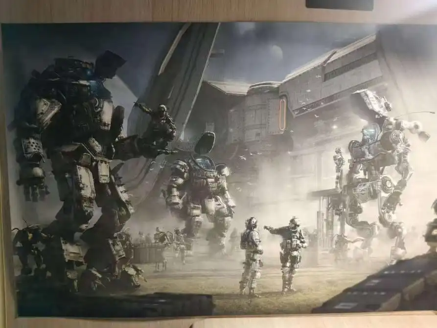

今年九月底百团大战，在你协回答招新问题时，我有很多答案是猜测。会长说我是社团老人，我却心怀有愧。最近一年我几乎未参与科幻活动，几乎不曾阅读科幻文章。因此，我想：我与科幻其实只是萍水相逢？幸逢此征文，便写写回忆。

第一篇科幻文章无疑是《带上她的眼睛》，第一本科幻书籍倒是有些遗忘，或许是《三体》。印象中最早读《三体》的时候，我正上初二——说到《三体》，对我而言就不得不提到一个人，不过我想晚一点说，他是一位让我对他的遭遇感到遗憾的人。

我一次性读完了《三体Ⅰ》。它并不是特别厚，对于没怎么接触科幻的我算是试试水。《三体Ⅰ》以文革的故事开头，似乎那段时间我也比较沉迷于这类历史，所以也就继续读。这本书我只读过一遍，印象最深刻的人是叶文洁，她太狠了。在她的恨面前，所有的爱都在让步。第二印象深刻的内容是“不要回答”。在那时，对叶文洁而言，是否是善意与憎恨的碰撞？我知道后面的故事，想着人要听劝。但叶文洁，她在知道后面的故事后，是否悔恨呢？我当初阅读时认同她的做法，如今回忆则不敢揣测。

而且现在回想第二部、第三部的剧情，在文明尺度下，一个个体的善意似乎没有太大的意义。有点悲观了，但确实是在悲伤的情绪下写的。

继续说吧，我差点没有看下去《三体Ⅱ：黑暗森林》，因为我觉得开头很无聊。后来是我一位初中同学凯，他为了让我们（当时还有一位朋友彭）看完三体，专门写了读后感给我们看。他的读后感我也没认真读。我想：他专门写了篇文章让我们去读，不能辜负他的好意。然后就去读了。现在想来，应该认真看看他的想法的。看完《三体Ⅱ》我超级震撼，并且最喜欢的是猜疑链。就不过多赘述三体里的内容和我的感想，不然这个回忆就成了读后感。

第三本也自然而然地读下去了。《三体Ⅲ死神永生》，主角程心最具争议。她的设定合乎情理却令我难以接受，而且结尾我认为有一点仓促，但在宇宙中，人类的时间本就短促又无力。

《三体》看完后，凯经常问我们关于三体中一些细节的东西。我当时看书就是囫囵吞枣，他问的问题我基本回答不上来，彭还能有来有回。我们三人讨论三体人被毁灭时三星的位置关系，讨论罗辑、章北海，讨论程心、智子。当时的讨论还没有什么更深层的想法，只是针对情节。现在回忆我能感觉到，科幻的硬与软，其科学技术与人文色彩，每个读者都由所倾向。

第二个科幻系列的书籍是阿西莫夫的基地。这本书是初中要求的必读书目，我觉得名字好听，就去读了。后来知道凯有一整套，每次都向他借。我和凯，从“三体”结缘，到“基地”存续，最后因热爱科幻而紧密联系。书借多了也会不好意思，在他生日那天，我和彭一起买了一本书送给他。然后我们三个看完之后一致觉得，这本书是我们所读的书中超烂的一本。

初中我们三人会一起写小说。我们写的内容不一样，凯走的是科幻偏奇幻的方向。我当时觉得他很有创作天赋，在我们三个中我最喜欢的就是他写的情节，还一直催更，是超级纯粹的一段时光。

凯虽然平时表现比较害羞，但他是一个内核非常强大，有自我想法的人。讨论科幻的时候，他意气风发。不过我现在和他少有联系，即使只言片语的聊天，也能感觉到他心中多有愁怨，不复少年。

到高中，我和凯还是同一所学校。我们之间的情谊继续，他写的小说依旧给我看，我依旧向他借科幻书籍，《球状闪电》《乡村教师》等等。不知道是哪一本书，我看了前言，知道了“基地”，记住了姚海军。在此之前，我从未明确过我看的是哪一类书；但在此之后，我有了意识：***\*这是科幻\****。

我高中的时候就在想，甚至现在也依旧这么觉得，是凯带我了解科幻，毫不夸张地说，他是我前往科幻路上的引路人。不过我现在依旧是科幻小白。

高二，凯转学了。学校是住宿制，一个月回一次家，我很少和凯取得联系。而且凯或许因为环境变化，逐渐不再阅读科幻。大一时，我曾与他一次联系，建议说可以投稿科幻作品。他回复：我以前写过科幻吗？看见这个问句，我只觉物是人非事事休。

高中，我和彭说：凯转去别的省了。她回复：凯应该感谢我们俩。在初中，我们是难得和凯能聊得来的人。我想的是互相感谢。我们都是对方生命中的过客，都绝对为彼此带来过价值，不用把自己的付出记得那么牢。

看到现在，应该能知道凯就是我感到遗憾的那人。从热爱到遗忘，短短三年，你还是鲜衣怒马高谈科幻的那个少年吗？

进入高三，感觉没怎么接触过科幻。但实际上，认真回想，我开始接触了科幻电影，从文字到影像，对科幻有了更切实的感受，不仅仅局限于想象。甚至最忙碌的三次摸底考试，我也还在看科幻小说《星之继承人》。看完这一本，我写了关于我对中国科幻与外国科幻之间的联系与区别的文字。不知道在哪里看过，自己也写写，不过是只读了几本书就自以为是的想法。

同年，我的朋友白，买了一整套的《三体》。除了《三体Ⅰ》，后两本我都二刷。这次有意识的写读后感，感叹道：“没有《三体》，人生不圆满”。

上了大学，在百团大战，我看见读书协会，想：如果是没有特别想进的，我就加入读书协会。蓦然回首，那人正在灯火阑珊处，我看见了奇点科普科幻协会。好似命运让我们相逢：不管怎样，我定要加入这个协会。学校规定最多加入两个协会，此后两年，无论如何，我都会给你协留下一个名额。

在你协，有很多深刻的记忆，其中最重要的是攻占SFW杂志社。说的严肃些，我认为这是我正式踏入科幻的一个重要事件，里程碑式的事件。

这次活动时间感觉特别短，我们在SFW待了大概一小时，单反老师同我们讲了许多：聊到科幻的前身，说到中国科幻的部分发展史，还有讲述你协曾艰难地存活。我像是走了很久很久，才到达大门前。但我没有感到苦累，全是对新世界探索的激动与兴奋。在那些交流声中，我对科幻、中国科幻有新的理解：我以前总觉得科幻小说是散的，每一位科幻作家只是为爱发电。实际上，在所有科幻的背后有SFW支持，有基地作后盾，并非一腔热血。

你协有一次免费领漫画。漫画根据大刘等作家的短篇小说改编，在b站刷到过，不是我喜欢的画风，没有看下去，结果线下拿了一本实体漫画书。现在还记得吐槽它：我认为有些比较重要的情节，漫画给删减掉了。我不了解画漫画，但我觉得既然你根据小说来画，那么一些重点、一些细节总得处理好。二来你的受众是谁呢？科幻迷，还是中国的科幻迷？或许漫画作者想呈现赛博朋克那种感觉，可人物比例和脸都有点难看。

在你协还上过两次社课。第一次主要讲太空歌剧，这时我才知道科幻有软硬之分；第二次授课是讲机器人，我拿到了一张泰坦陨落的海报。可惜我晕3D，不玩泰坦陨落，现在海报依旧挂在我的桌边。

还有一些小事，时常忘记。我自高中，基本不写小说，因此第十届、第十一届朝菌杯，我都报名了评审员。从初审到复审，我的打分总是很宽容。初审写评语惴惴不安，害怕别人看出我不专业；复审放平了心态，写评语是在写观后感，也是对自己科幻功底的摸底。后来，复审的评语发送给作者，我在群里看见我的评语得到了认可，心中充满成就感。之后也进入了零重力报科幻2群，加入了荒启科幻，继续我的评稿之旅。

这样写，我似乎完成了幻迷的一步步蜕变，但我认为我从未进入科幻，不是谦虚。我的阅读流于表面，没有深入思考其核心、内涵；我的观影感叹特效的华丽，情节的炫酷；我并未参与任何大型的有关科幻的座谈会或奖项颁布。每次我都觉得我与科幻不过萍水相逢，未曾深入了解过它。

不过我惯会安慰自己，我切切实实热爱科幻。如果仅是萍水相逢，我与科幻又如何牵扯许多年？百团中，何以一眼认定你协，甚至现在洋洋洒洒三千字？尽管如今与科幻接触渐少，但我曾熬夜阅读，寻找同好，为影片写读后感、找解说，为评审查询资料，这些所有都不是空话。

我再自问：我与科幻是萍水相逢吗？当然不是。

