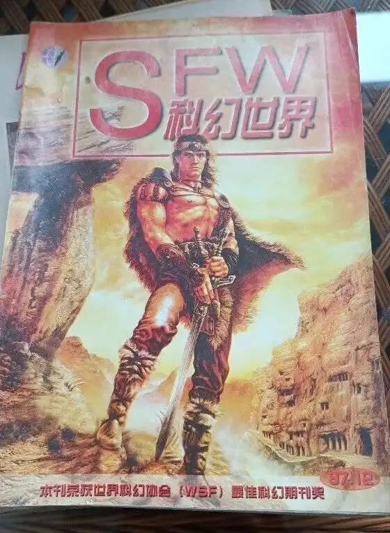
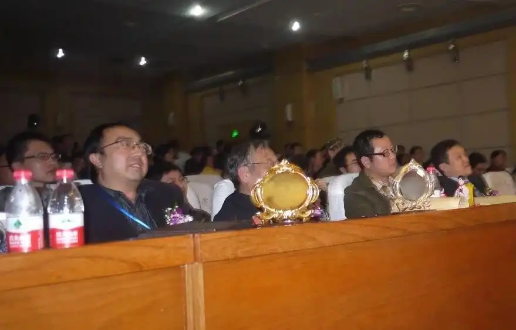
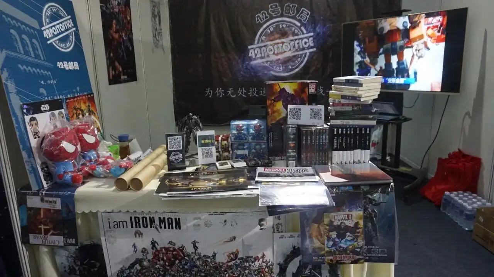
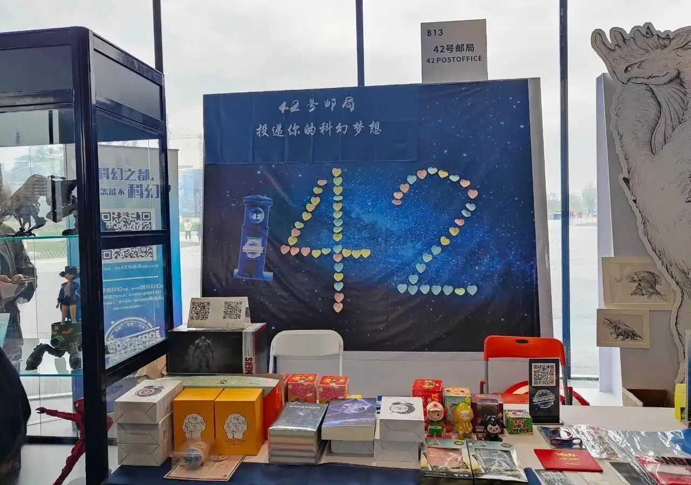
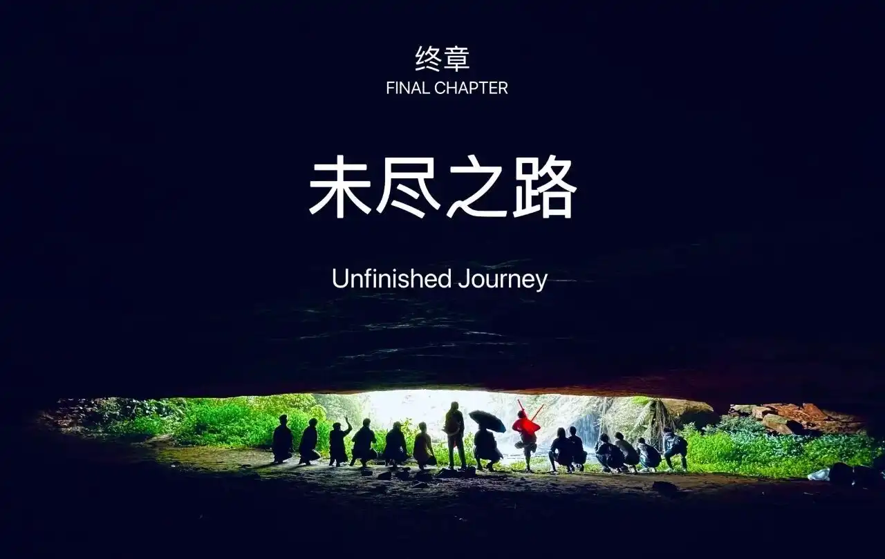
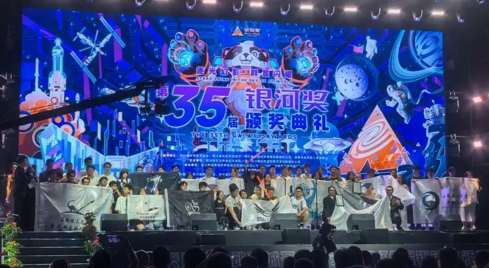

为了不让你们算时间，我先说了，我是80后。

上小学的时候，还没有科幻这个概念，但已经在电视里看过了一些科幻作品……的片段。小时候住在四川一个五线城市，电视播什么就看什么，所以很难能够观看一部完整的科幻片。至今仍然记得被那些恐怖的片段吓得不轻，《终结者》那打不死的骷髅一般的机器人，《地球停转之日》那庞大的外星人，《海市蜃楼》那嗜血的异空间生物……奇怪的是，这些光怪陆离的影像没有劝退我，反而让我兴趣大增。

上初中有了影碟机，都会找一些封面海报酷炫的电影来看，终于可以完整地欣赏一部电影，就又看了不少放到现在也算是经典的科幻电影，《第五元素》、《铁血战士》、《星河战队》……初三的一个下午，正一个人打篮球，那时的我已经喜欢篮球三年了。在篮球架下休息的时候，捡到一本封面像是野蛮人柯南的杂志，就随手拿起来翻。翻开第一页就是乔丹出演的《太空大灌篮》剧照。大家应该能想象乔丹对一个90年代篮球迷的吸引力吧。看周围没人，赶紧把杂志带回家。那本杂志就是《科幻世界》，开篇第一个故事是刘维佳的《黑月亮升起来》，从此一发不可收拾。后来还在同学家里发现了《惊奇档案》，好家活，那更是刘姥姥进了大观园。可惜这书是同学从成都买回来的，在我们那里根本买不到，只能望眼欲穿遗憾作罢。

高中学业很忙，但也不耽误一期不落地从报亭买《科幻世界》。如饥似渴地阅读，连广告都一个字一个字地看完。有一个同学也很喜欢科幻，我们经常在一起讨论那些新奇的科幻点子，还跟唐风写信问他怎么用光压来挣钱。我们从一则微型故事推出了一个恐怖的结论，能吓得尖叫起来。我们发现有一个叫刘慈欣的作家，每年会发表好多篇小说，还有一个叫柳文扬的，好多封面故事都是他写的。听说成都火车北站旁边的书市新出的《科幻世界》能打9折，暑假我和同学去成都找到了杂志社的摊位，真是4块5一本，同学先给了10块，我给他5块他也没有5毛补我。

大学考进了成都理工大学，正赶上互联网普及的时代。一有时间就上网泡论坛，从科幻世界第二代留言板论坛到BBS网页论坛，都留下了我的足迹。那时候认识了不少全国的幻迷，我们有自己的组织，**星际维护灌水部队**，简称**维水**，在论坛的喷泉花园有自己的一亩三分地，不定期在聊天室语音聊天唱歌。不光看《科幻世界》，也开始买杂志社推荐的周边，T恤、CD、阅读训练教材（-_-||）……有一天在学校小巷子一个不起眼的摊位看到一本《惊奇档案》，尘封的记忆被唤醒了，立即告诉老板之后每期我都要，一定要进货。《惊奇档案》让我更加开拓了科幻的视线，也了解到~~柳大的八卦~~，原来科幻还可以这样写。在科幻的熏陶下，做梦也更加天马行空，把几个梦境结合起来尝试写了一篇小说，几经修改后觉得很满意，投给了杂志社，当然是石沉大海，连退稿信都没收到。好在拿着两本《惊奇档案》在宿舍床上傻笑的照片被《惊奇档案》刊发了，兴奋了好久，可惜发的是镜像照片，不解。都已经在成都了，朝圣是肯定要去的。从学校坐公交到红星路口逛完外文书店，步行前往天府广场，顺着人民南路一路南下。我喜欢到杂志社邮购部买些单本小说，《超新星纪元》、《类人》、《狼毒》、《站立桑给巴尔》……再顺便薅一些海报。成理那时候还没有科幻社团，好在现在有了。

工作以后看书的时间越来越少，渐渐远离了这位老朋友。2007年7月的一个炎热中午，吃完饭在单位看报纸，一则短小的讣告还是被我看到了，柳文扬因患脑瘤去世……颤抖着反复确认是不是那个柳大，结果让我如坠冰窟……仅次于何慈康松的柳大就这么走了，他的幽默和松弛感甚至胜于前者。回顾看《惊奇档案》的点点滴滴，以及那封来自于猫骨匣的回信，他说他是一个诚实的人，所以给我写了回信。我想做点什么，却什么也做不了，《惊奇档案》已经停刊好几年，只能重新开始阅读《科幻世界》，把老朋友又接回来。

2011年11月，第二届星云奖颁奖，那是我第一次参加这样隆重的科幻盛会。第一次参加签售，那时候找大佬们签名很容易，不光可以to签，甚至还能获得一句赠言。读书会还能更近距离接触，真的是近距离，坐第一排脚伸长一点就能踩着王晋康的脚，在厕所能遇到何夕。颁奖礼的会议室里，活动开始前可以随意跟大佬们合影。没人的座位就可以坐，已经坐到第三排了，旁边就是程婧波，嫌远还可以盘腿坐在过道边上，刘慈欣、韩松、刘维佳、夏笳就从我跟前走上台领奖，一回头小姬还蹲在背后用墙上的电源给手机充电。

后来又给《科幻世界》投过稿，自己写的故事就像亲儿子一样，不甘心一直不能上刊，就准备“起义”了。2017年春天，在冬青子组织的一场踏青活动上拉了几个人，准备搞一个我们自己的公众号，大家一拍即合。刚建号的时候，还没想好叫什么名字，就临时起了一个，**献给阿尔法的猫**，取自于《献给阿尔吉侬的花束》、阿尔法狗以及主子。后来正式改名为**42号邮局**，42开头能让幻迷一眼认出我们的身份，邮局是集复古、浪漫以及希望于一体的机构。我们自己设计了logo，在**2017年4月22日**发布了第一篇文，所以这天就是我们的生日，这天还是世界地球日，挺好。之后，我们不定期发布一些科幻类的小说、影评书评、诗歌朗读、玩具测评、科普随笔、线上线下活动报道等等，还给42号邮局设定了故事宇宙观，写出了一系列小故事。我们在微博（**42号邮局的日常**）和b站（**42号邮局杂货铺**）也开了账号，但是粉丝寥寥，我们权当业余时间用爱发电自娱自乐了。

有了42号邮局局长（-_-||）这个身份，我经常参加杂志社、赛凡、八光分组织的大小活动，同年11月，我们有幸受邀参展第四届中国（成都）国际科幻大会。这可是展示我们的大好机会！我们订制了展位背景墙、统一的T恤、纪念蛋糕，我准备了一些图书、科幻周边、电影海报，又从朋友借来了一些珍稀模玩和海报来展示售卖，找玩具公司拿了科幻影视周边玩具寄卖，借来了电视机轮番播放我们平常的线下活动和玩具测评。我们的展位吸引到了不少大佬和幻迷朋友来参观，在科幻圈也算是初出茅庐了。

接下来的两年，我们不仅自己组织线上粉丝福利活动，还组织线下观影、桌游、听音乐会、泡温泉、玩玩具、踏青、撸猫、plogging、年会等活动。我到处参加科幻大会、颁奖礼以及各类动漫、潮玩展，北京，深圳，敦煌、成都，中国科幻大会、亚太科幻大会、成都国际科幻大会、异星狂欢节、成都国际动漫展、中国西部泛娱乐展、幻想互动娱乐展、动漫游戏嘉年华……有的是去参展，有的是去玩，甚至还实现了cos的愿望，cos过蜘蛛侠和罗夏，过了一把当超级英雄的瘾。2023年，绝对是中国科幻史上浓墨重彩的一年，42号邮局申请参展了2023成都世界科幻大会。我带着收藏多年的科幻模玩和周边，跟42号邮局的新成员们再次出发，同中外幻迷新老朋友们一起狂欢。这次实现了当演员的愿望，有幸接到成都电视台的邀请，拍了一段8分多钟的科幻短片。你别说，你还真别说，像那么回事。

去年4月，42号邮局7周年庆，我们同成都理工大学、四川大学、电子科技大学、西南交通大学科幻协会的同学们去到了宜宾宇宙探索编辑部的拍摄场地。在废弃的孙一通家发现了前人留下的诗，在村口嬢嬢家完成了演绎电影桥段的任务，在瀑布山洞感受湿润与凉爽，在外星人山洞探索壁画的秘密。但是支线任务失败，没有发现面壁者。

同年9月，第35届银河奖颁奖在成都举行，我也再次参加颁奖仪式，同成都理工大学奇点科普科幻协会的学弟们一起。在最佳科幻团体奖颁布以后，按照惯例，所有到场的高校幻协同学们都受邀上台感受这份荣誉。就在同学们上场的时候，一位学弟叫我也一起上台。说实话我是想上去的，喜欢科幻这么多年，我是非常渴望什么时候能有个主办方给我颁个奖，奖项我都想好了，**最佳民间科幻社团奖**。但我还是没有上去，这份荣誉是属于他们的。看着台上的同学们意气风发地拉着会旗，中国科幻后继有人繁荣昌盛，我很欣慰。因为我在他们的眼睛里，看到了光。

从2020年开始，我自掏腰包（意思意思的奖金）创办了**邮筒杯**征文。知道自己写作能力不行，所以还不如让大家一起来写。每一位投过稿的幻迷都希望在《科幻世界》刊发，也投过其他各大科幻机构，但退稿的还是大多数，这些退稿中说不定就有沧海遗珠。既然42号邮局有承载希望的属性，那我们为什么不把这些珠子展示出来呢？**为你无处投递的科幻梦找一个归宿**，这正是我们创办邮筒杯的初心。如今，2024年邮筒杯年度冠军正在评选中，即将开启2025年的新征程。
