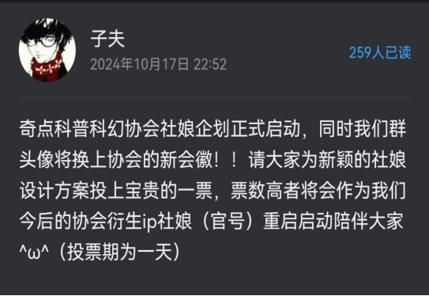
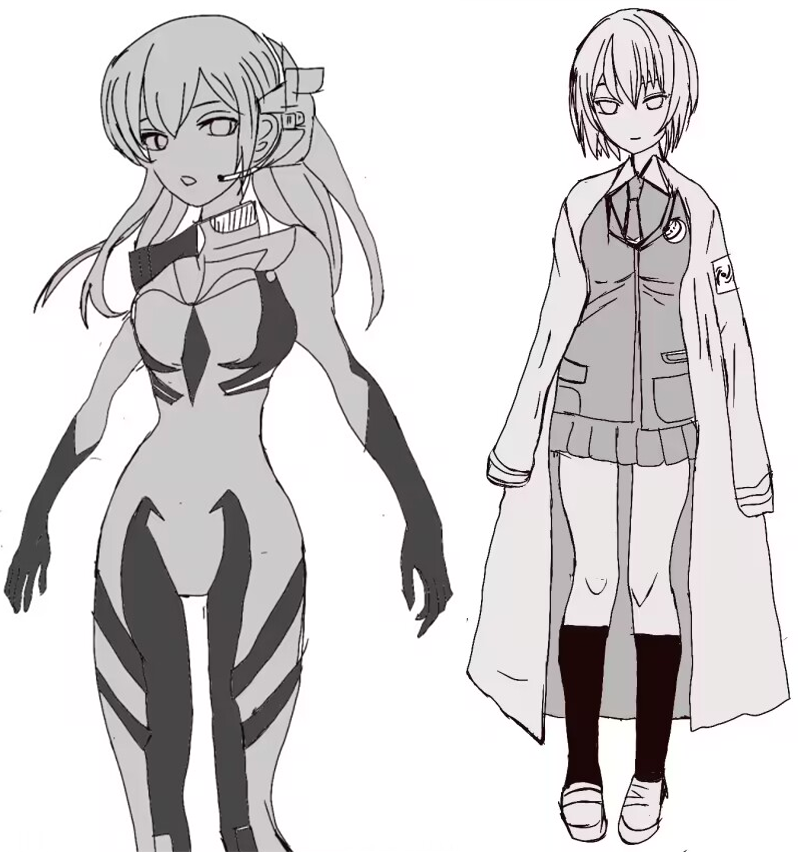
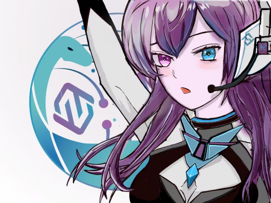
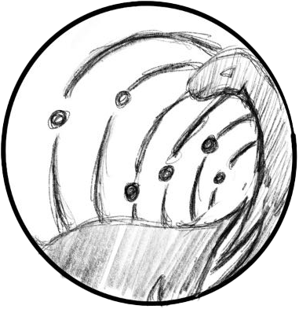

设计社娘的起点要从十周年一个不经意的想法开始。纵观奇点幻协历史，协会并没有出现过所谓社团的虚拟形象，我对此也是略感遗憾。那么借着十周年的焕新我们是否也可以拥有一个代表奇点幻协的社娘？抱着这样的想法发出了一条社娘企划公告。

  

关于社娘的设计想法随即在幻协的大群中激起了热烈的讨论，我决定收集大家的意见画出两版初稿设计，再进行投票选举定夺最终的风格走向。两版的设计思路分别是异瞳紫发战斗服（左一）和蓝色短发实验服（右一），最后左一以微弱的票数赢得方案选取。

诞生于奇点（singularity），取音“qi”，有着对协会未来无限美好的祈愿，仰望星空探索未知，热爱科幻至死不渝，遂取名“星祈”。随后绘制出了第一版的社娘。

  

时隔七月，在十周年的尾声感谢所有参与制作会刊《引力波》的成员们，而我也将奉献自己那肤浅的绘画能力尽可能去完善社娘“星祈”的形象。在本次的优化中重绘升级了正面立绘，强调了服饰特点，新增了Q版形象以及不同神态的表情。她的诞生不到周岁，“星祈”的故事还等待着无限的可能，正如“奇点”一般。

  

