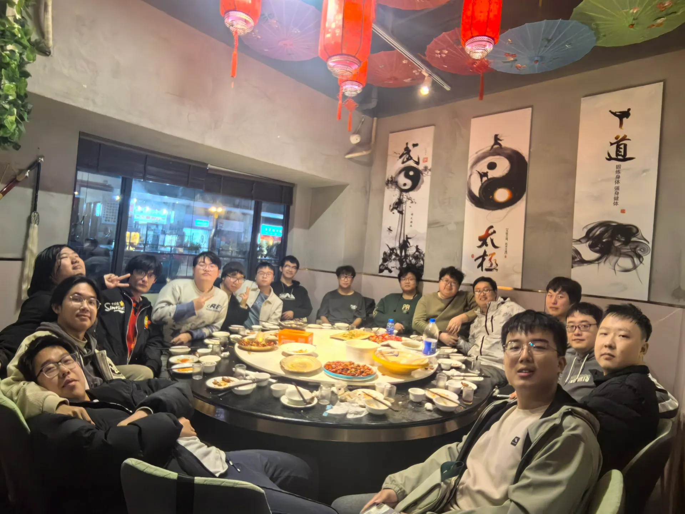
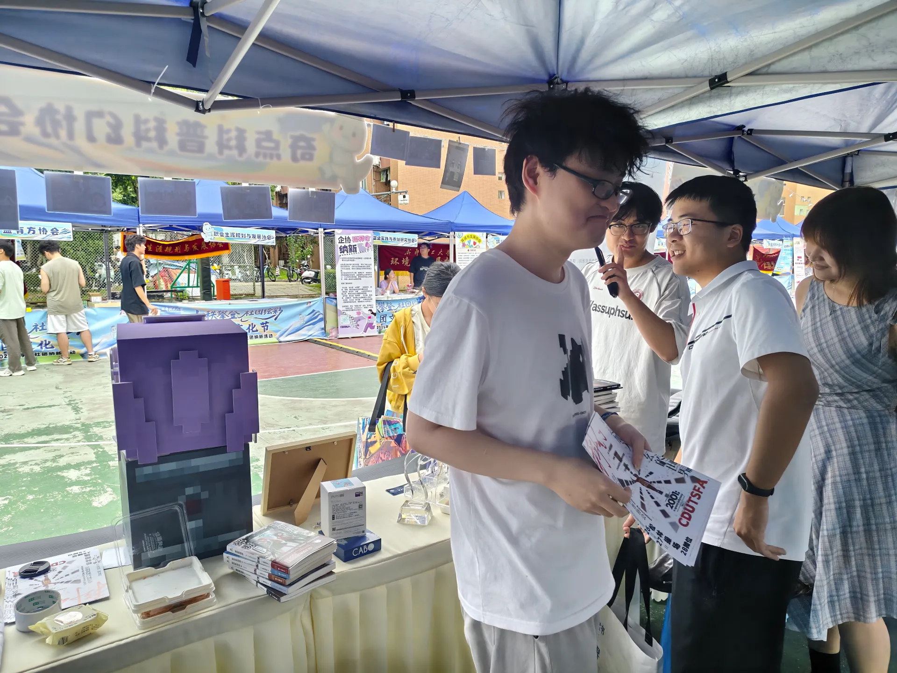
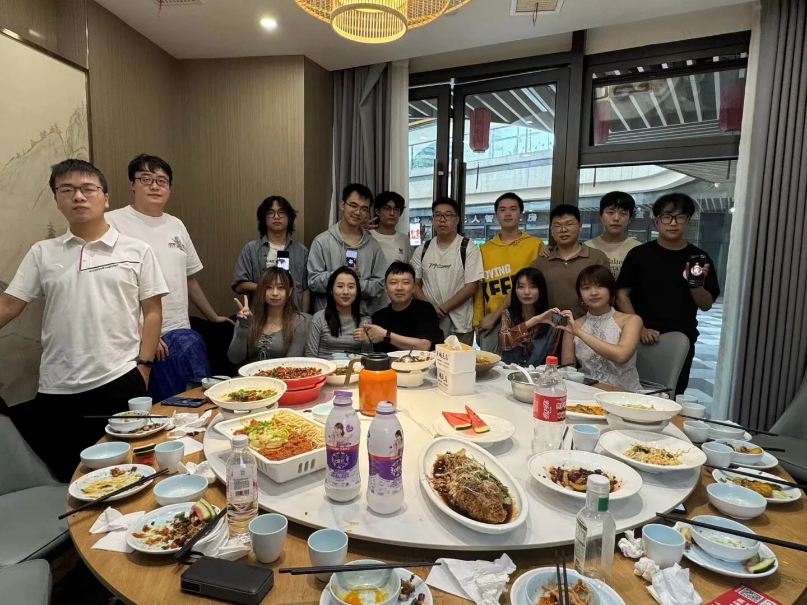
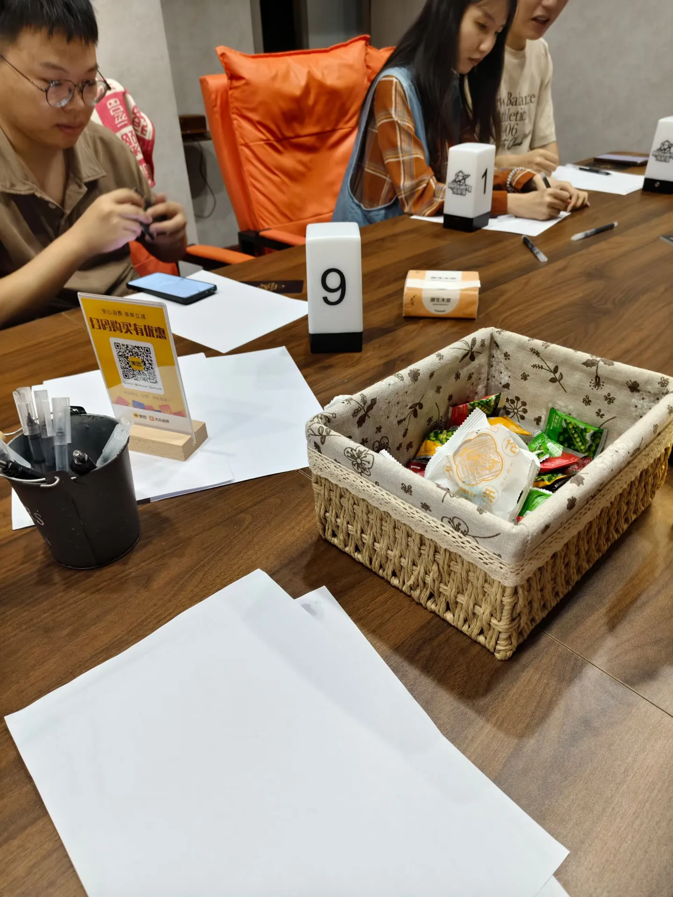
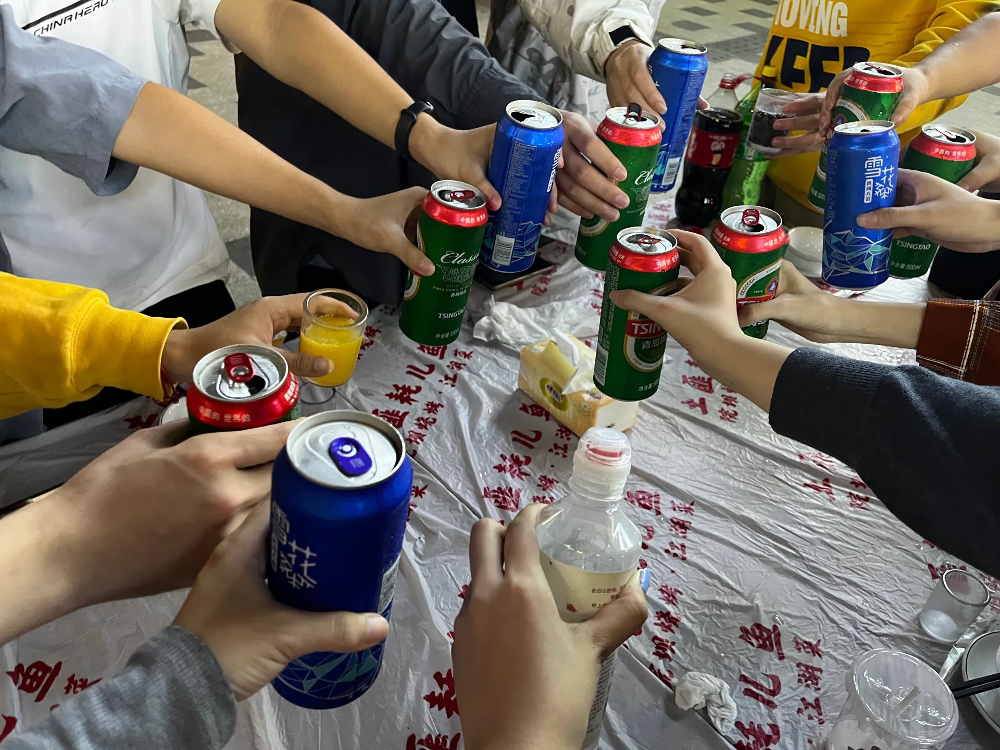
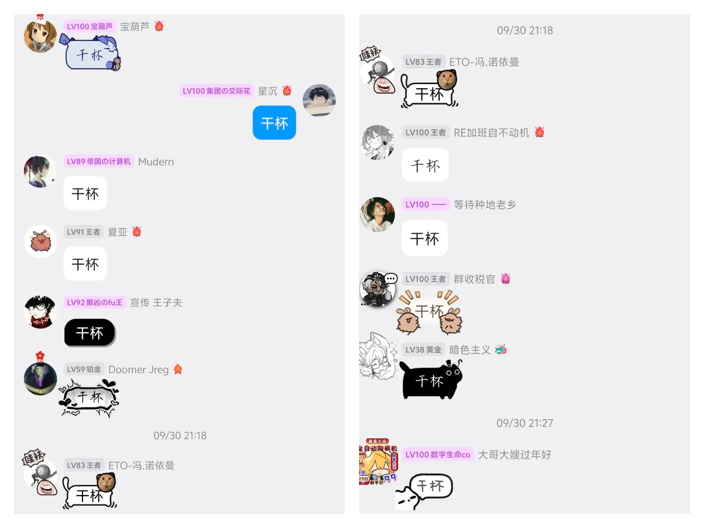
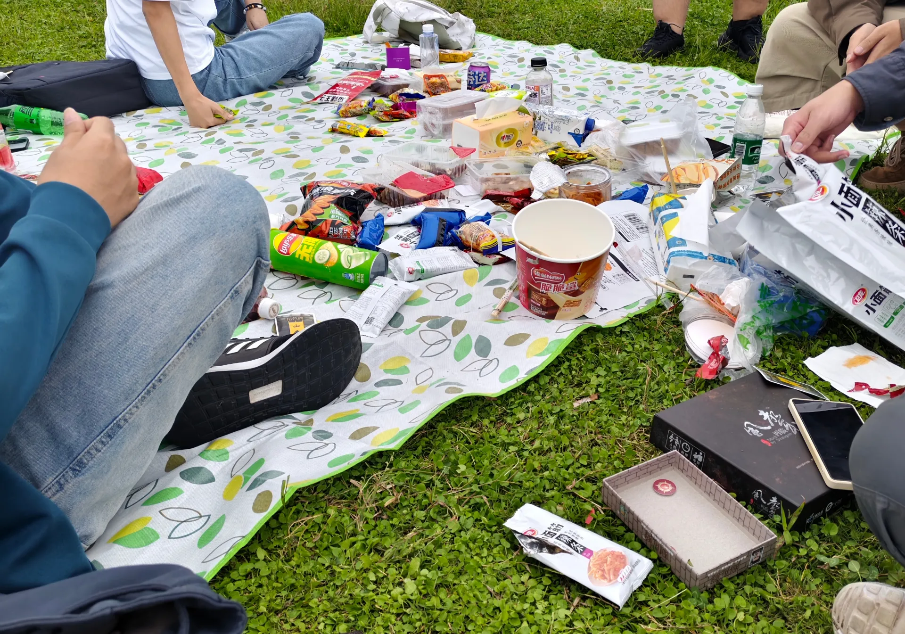
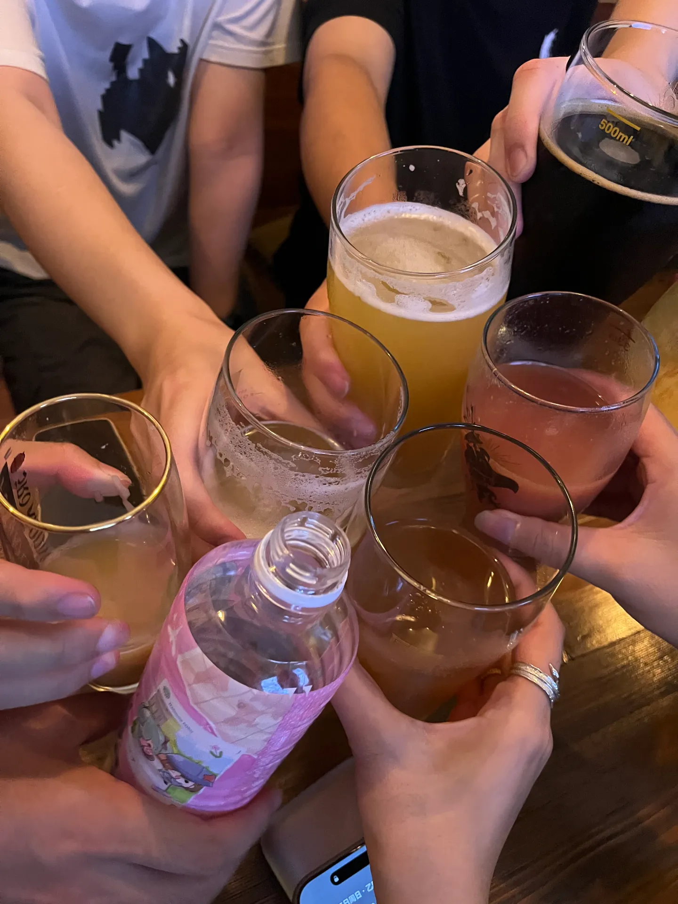

印象中，很多与学校和社团有关的人和事都很容易随时间而变迁。老生毕业，便尘封起了那段时间的记忆，他们也便沉入了自己的生活和工作当中，学校里的过往都成了闲暇之余的回忆。

但我们科幻协会却出现了一个奇怪的现象，不知从何时起，一代代的老生带着他们过往的回忆又回到了这个大家庭，和新面孔一起，聊着他们辉煌而又快乐的过去，在校的我们也和他们聚集在一起聊着协会的现状和未来的规划，跨越时间的言语和记忆，交织在一起，似乎又把大家连结在了一起。

但我已经记不清个人的回访了，印象里，巨宅由于和程协有着非常密切的关系，加上在成都上班，所以经常来玩。2024年暑假，老干部从青岛回来，和十口，陈浩阳，木木聚了餐。

# 2024年11月30日

在2024年11月30日，协会迎来了第一次的老登“回归潮”。这是我第一次见这么多平常只存在于动漫组的老登。

在餐桌上大家聊了很多协会过去和现在发生的很多事情，协会如何从这位会长传到这位会长，大家又在哪位会长手底下担任什么职务，干了什么活。印象最深的是许多学长讲他们第一次牵头联合成都其他高校去办活动，这件事也成为了后面协会获得银河奖的关键因素。他给我们传授一些协会生存和发展的经验，比如多和科幻世界联系和合作，多争取项目和资金之类的。（似乎每次这种聚会，大家都会焦虑协会的现状和未来的发展）。

大家聊了很久。结束晚饭后在饭店玩了会桌游，便各自回了家。

这次之后，自动机，佩玲，主席，还有巨宅便更加频繁的开始参与到协会的活动中，我们也和他们也更加熟络。聚餐，聊天，协会的活日常活动中，也经常见到他们的身影。

# 2025年9月27日

2025年9月27日招新活动，自动机和巨宅再次来到了协会的招新摊位，这次又迎来了位新的老登：20年会长丁菲。她从上海来成都玩，准备和其他几位协会的朋友去九寨沟玩，一下午的时间大家坐在摊位，聊着过往，想着将来，期间自动机和丁皇发了不少传单。由于十口和jerriel，光影，夏亚他们在前一天宣传了很久，所以有些许疲惫了。

晚些时候丁皇有事先行离开，不久佩玲也来到了摊位。大家聊了许久，吃了晚饭便散了场。

# 2025年9月30日

由于国庆假期即将到来，佩玲，老任（19年会长）、丁菲、子琳（23届团支书）和陈学姐（16级）便约着去九寨。临行前的30号，大家决定在学校附近见一面，一起和在学校的小登和在成都的几位老朋友一起吃顿饭。算上此前的五位，还有在成都的老许，主席，以及他们的家眷，来的老登有9位之多。由于此前定的饭店位置太小，所以我和丁皇过去看了一眼之后，便把位置又换到了鸡毛店的包间里，随后没多久主席便带着女朋友过来了，我们简单聊了下大家的境况。没多久佩玲，十口、无明、ETO和夏亚他们相继也来到了饭店，随后是许多学长和师嫂。大家开始点菜和闲聊。由于老任去机场接老陈，所以晚到了一会，然后宝葫芦和Mudern加入了线上会议。

在确定子琳姐由于打不到车无法及时到场后，大家先开始了举头像自我介绍，顺序依次是现任会长jerriel，我，第一次和小登聚会地任学长，以及丁皇和老陈。随后是佩玲，光影，无明，带着家眷来的许学长，主席，十口（依旧不忘打广告），ETO，夏亚，以及两位赛博老登设计大手宝葫芦和编程大手Mudern（十口代介绍）。

随后大家便开始吃饭，当大家都拿起手机在群里调侃着干部时，主席不知情地说了一句：“大家线下怎么真么拘谨呢，都在玩手机。”随后桌上莫名出现了干部的头像和托腮表情包在大家的面前转圈圈。大家开始在群里喊老干部，但老干部似乎没有任何回应，不知是谁吐槽了一句：“每次搬恶臭内容都是秒回，但这次四十分钟了干部依旧不回消息，是在装死吧。”不久，干部在群里说在做饭，然后大家开始疯狂地给干部打电话，打通之后干部给大家打了招呼，随后立马挂断了电话，夏亚和ETO激动的像是峨眉山的猴子，然后夏亚激动得说了句：“这声音符合我对干部得刻板印象。”不知过了多久，大家又打通了干部的电话，见到干部真容后，场面更加混乱。然后大家把手机放在桌子上，开始和干部互相动物园看猴子模式，打招呼的打招呼，比手势的比手势，截图的截图。

聊了一会后，拍完合照，无明和十口由于要赶车便先行离开了会场，许学长因为有事也先行离开了。我们边吃边等子琳姐然后商量待会干什么，最终决定去打桌游。

当大家茶足饭饱之后，子琳姐才拖着行李箱到来，丁皇和老陈为子琳姐留了一点吃的，子琳姐也拒绝加菜，稍适休整后，上课的去上课。剩下的人一起前往西门的桌游店打打桌游，子琳姐也在桌游店为大家一人点了一杯奶茶。我们玩起了阿瓦隆，这似乎是所有人第一次玩，期间老任反复横跳，增添了不少乐趣。

晚上七点多，自动机，子夫和临时回去值班的主席赶了过来，我们找了家烧烤店，便开始了今晚的酒肉聊天之旅，比较气愤的是烧烤店迟迟不上餐，让大家等了将近五十分钟，在大家一次次的催促下才开始上菜。在上菜前不久，巨宅掏出了他经常带着的《电车难题》小桌游，大家玩了起来，我在另一端不时听到他们又是金某恩又是川普的讨论，我看到对面的几位大叔用异样的眼光看着我们，自动机一直在说：你们这有点危险吧……之后，菜终于开始上了，觥筹交错，大家聊着MBTI，聊着一些二次元话题，时不时“讨论”两句干部，而主席却一言不发的坐着，我以为是历经了工作压力而变得憔悴，但大家又一致地认为是“妻管严”了。由于主席国庆要上班，好像还是七天！于是在大家的掌声中先行退场。大家又接着聊了一会，喝完老任买来地酒后打包了没吃完的烧烤，今夜的狂欢在夏亚的一声大喊中结束（内容保密），然后大家各自回了家。

其实在聚餐结束前不久，大家开始聊各自的话题的时候，我已经莫名的陷入了那种极乐生悲的状态中，今天发生的一切似乎在一瞬间化成了脑海中的回忆，上一秒的快乐时光下一秒似乎就化作了日后长期与我相伴的苦逼和孤寂的生活，大家还未离开，然而我却愈发的舍不得，不知是长期的独处，还是临近毕业，今年我总是容易陷入这种戒断反应中。前两天当和coco姐同时毕业的哈拉少学长回来的时候，我带他逛着校园，那些我们互相陪伴着去参加科幻活动的日常不断在脑海中浮现，每次谈起似乎就发生在昨天的时光时，泪水在眼睛里开始打转。时间总是短暂的，一切的一切似乎也只是一个过程，一切不断逝去，而我却总想想办法把这些美好留住，但似乎却总是无济于事。那天科幻大会回来后，看着Mudern写的活动记录，当时我还在想活动记录除了给协会留点记录，还能干什么呢。可当一切过去，当我再读那段文字的时候我的思绪好像一瞬间被带到了那几天，那些美好的经历也浮现在我的眼前，尤其是有着详细基记录的事件，真的给了我一种不同于照片所带来的模糊记忆。所以我也想写下这段时间这些美好的回忆和温暖。我爱着这个协会，爱着大家，珍惜每一次的相聚和这些美好的记忆。此后几天大家开始了自己的旅途，去九寨沟的去九寨沟，回家的回家。

# 2025年10月5号

10月5号，协会在青龙湖举办野餐活动。大家先行从学校出发，我随后买了点零食后出发了，到了时候大家都在玩UNO。然后我发现大家好像都带了许多零食，然后自动机提议说：下次聚餐还是分配一下带的食物，不然太浪费了。闲聊之后大家白天鱼就带大家玩起了阿瓦隆。玩了两局后，我们便开始准备收拾回去，这时子夫却刚好过来，然后只得再次和大家回去。他说他就是来接我们回家的。

随后我，木木，DJ，自动机，夏亚和巨宅一起去吃饭准备喝酒，吃完饭后佩玲和丁皇也赶了过来，于是我们又在酒吧里摆起了龙门阵。由于大家都比较累，自动机和佩玲不停的打瞌睡，我们便早早结束了此次的聚会。

此去一别，大家又回归到了自己原本的生活和节奏里。但不同的是，我们似乎在这段时间里将协会的过去现在和未来串联，我们也站在也由一届届前辈建立起来的大家庭中感受着温暖与快乐，在大家的努力下看到更远的未来。

从我加入协会以来，在协会认识了很多的朋友。而随着时间的消逝，大家也陆续离开学校，虽然嘴上说着一定再回来，但更多的时候是面对生活的无可奈何。所以我珍惜和大家的每次相聚，也希望大家能多回来。就像巨宅说的多吸收吸收小登的“阳气”（其实我觉得更多的是找寻自己曾今在这里的美好的记忆），让曾今那个朝气蓬勃的自己不被时间和工作埋没在过去。
