正所谓“日月安属？列星安陈？”，人类自古以来就对星空充满了浪漫的幻想和探索的渴望，而随着科技的发展和时代变迁，以加加林和阿姆斯特朗的成功为标志，人类终于完成了跨出自己摇篮的壮举。但自 1972 年阿波罗 17 号返回地球开始，各国的航天事业发展速度骤然降低，不再像过往一样不计成本地投入，地球的航天事业仿佛被智子封锁了科技发展一般，在一个被圈定的范围内不停地打转。而随着 SPACEX 的崛起、马斯克带来了猎鹰 9 号和星舰，一个模糊但崭新的未来为人类敞开了大门，可回收航天器这一降低成本的设计使人类廉价进入太空的愿望终于有了一个大概的方向。

如今大家的目光都放在星舰的发射回收实验，惊叹于其大胆的设想和强大的技术实力。成功者的光芒常掩盖失败者的努力，历史上许多未竟的航天方案同样值得铭记，因此本篇文章旨在为大家介绍从二战到现在，近 80 多年对该领域的一些探索以及人类为太空商业化的努力。

# 一、**先驱者的荆棘之路**

## **1.银鸟轰炸机**

既在意料之外又在情理之中，最早对于这一领域展开探索的是我们的老朋友，黑科技和决战兵器爱好者——纳粹德国。1941 年德国科学家桑格尔向德国航空部提交了一份亚轨道滑翔机的构想，该构想因为过于夸张被航空部直接否决，桑格尔则被发配去开发 SK P14 冲压战斗机（该项目最终也下马了）。但桑格尔本人并没有放弃这一天马行空的设计，1944 年在沃尔特教授的帮助下，桑格尔对该方案进行了大幅改进和简化，再次提交航空部进行审查，当时正好处于纳粹德国最后疯狂的时期，战争的不断失利让希特勒将希望寄托于这些黑科技方案，因此该方案通过了航空部的审查进入了研制阶段被称为银鸟（Silbervogel）轰炸机，但遗憾又合理的是，还没等项目正式产出成果其就随着纳粹德国的消亡而结束。

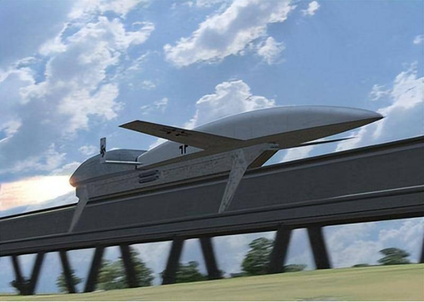

桑格尔博士对于这一疯狂构想的设计是，它需要在一个长达三公里的轨道上通过火箭滑撬加速到 1930km/h，随后打开自己的火箭发动机加速到 21800km/h 到达 145km 的高空。在这种高度开始下降到平流层使用桑格尔弹道（Sänger Trajectory）进行滑翔。桑格尔弹道通过升力体外形的特殊设计，使航天器在大气层边缘多次跳跃滑翔，类似“打水漂”。这种弹道利用飞行器下方激波产生的升力，将其重新弹射回太空。通过几次这样的弹跳就能将航天器的速度高效地转化为航程，计划在弹跳 3 次后达到 19000km 的航程。最后该机将跨越大西洋到达美国扔下 4000kg 的炸弹，随后返航降落到太平洋的日军基地，在这种任务下其最大航程可以达到 24000km。然而战后，各国科学家对于该设计重新进行了计算，认为其蒙皮不可能承受住重返大气层时所产生的热量，当初桑格尔博士很有可能是计算错误才定下这夸张的设计指标。

尽管该项目没有完成，但其留下了大量的技术遗产，并且对后世可复用航天器的设计产生了不可磨灭的影响，例如其对如今在火箭发动机上广泛使用的再生冷却系统做出了大量工程应用方面的贡献，再生冷却系统通过在发动机喷口壁内设置冷却通道，利用燃料或氧化剂流经通道时吸收热量，从而降低喷管壁温度。

## **2.X-20实验飞行器**

纳粹德国战败后，许多科学家和研究资料被美国接收。其中瓦尔特·多恩伯格，这一前纳粹火箭负责人带来了银鸟轰炸机的相关资料，这些资料使美国相关人士开始注意到了这一构型的潜力，于是在 1957 年美国空军研究与发展部开始了 X-20（Dyna-Soar）计划。

美国空军研究与发展部对于该计划的设想是：该飞行器采用升力体布局，升力体布局消除了传统的机翼设计，降低了进入大气层时所产生的空气阻力及其摩擦所产生的热量，同时能够在低速状态下产生大量升力，有助于提升其低空操纵性能。该机能通过运载火箭进入近地轨道，然后打开自身的发动机调整姿态重返大气层，使用银鸟计划中的桑格尔弹道进行滑翔，其设计的最大速度为 28200km/h 拥有 41000km 的最大航程，使用桑格尔弹道使其拥有了在临近空间机动的能力使其能规避各种防空武器，最后通过在大气层内滑翔着陆回收，美空军看重其优越的飞行性能，希望能将其作为侦察机和轰炸机平台。设计搭载 MK.28 核弹（当量 145 万吨）或 KH-8 侦察卫星。

但正如它的前辈银鸟一样，该机的一些设计依然远超当时的科技水平，在运载火箭选型上就面临巨大困难，在 1957 到 1963 年 6 年间，该计划花费了超 6.6 亿美元（折合如今 65 亿美元）但却没有成功试飞一架原型机。同时随着航天技术在军事领域的运用，间谍卫星和弹道导弹挤占了该飞行器侦察机和轰炸机的生态位，于是 1963 年时任国防部长麦克纳马拉开始质疑其性价比和实用性，并以再入误差高达 30km 为由暂停了该项目，同年 12 月该项目被正式终止。

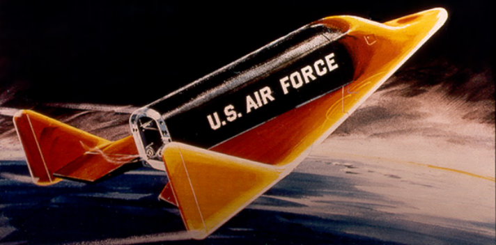

## 3. **美国与苏联航天飞机**

20 世纪 60 年代，美苏的太空竞赛愈演愈烈，随着阿波罗计划的成功，美国在该领域获得了空前的领先。而通过 X-20 计划对于滑翔技术和升力体布局的研究，美空军和 NASA 终于下定决心研究一型具有可行性、可以重复使用的航天器，也就是航天飞机（Space Shuttle）。

1968 年，NASA 正式成立研究小组展开研究，并提出了三个大的研究方向。第一类是把可重复使用的轨道器装上一次使用助推器；第二类采用多个一次性使用运载火箭的发动机与单个推进剂储存箱；第三类的轨道器和助推器都能重复使用。在考察过 29 种航天飞机方案后，NASA 最终选中使用两个侧助推器、三角翼轨道飞行器和消耗型推进剂储存箱的方案，同时助推器选用固体助推器来减少翻新的费用。

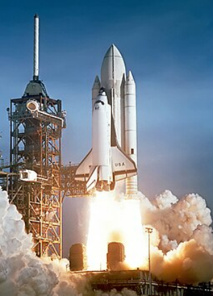

1974 年，航天飞机已经基本完成了设计，其高度为 56.1 米，使用一级半设计，用两个 SRB 固体推进器和航天飞机本体上的三个 RS-25 发动机产生共计 41350kN 的海平面推力。在外储箱的燃料消耗完后抛弃外储箱和两枚固体推进器进入近地轨道，然后靠机体上的两台轨控发动机进行变轨操作，在轨完成任务后，通过精巧的升力体设计和隔热瓦，航天飞机在 120km 的高度上以 25 马赫的速度再入大气层，通过 S 型机动减速和空气制动器，航天飞机可以在 3km 高度上减速到 150m/s。

其中隔热系统是整个航天飞机系统中最重要的一部分，当时世界上主要的返回式航天器都是使用烧蚀式隔热，这种系统的隔热性能能够满足要求，但却无法满足航天飞机可重复使用的要求，因此科研人员开发了能够承受 1600°C 极限温度的加厚型碳纤维强化碳质复合材料隔热瓦。

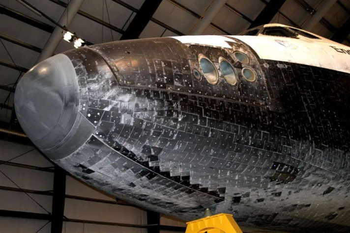

航天飞机是第一个实用化的重复使用航天器，虽然其需要抛弃两枚固推和外储箱，但其拥有 27.5 吨的 LEO 运载能力，并且能回收整个航天飞机组合体中最有价值的部分，并重复使用 100 次，这在当时是一个惊人的突破。

但该项目终究是靠着美苏争霸的大背景上马的，因此在成本上难以承受，项目总预算超过了 2210 亿美元，NASA 最开始的设想是在项目开发的前期大量投入来使整机可重复使用，等正式投入使用后依靠重复使用来摊平研发成本。但实际的情况却是受限于材料水平，航天飞机的隔热瓦在每次飞行后都需要检查并进行大量的替换。此外作为载有宇航员的航天器，航天飞机需要进行精细的检查和维修，何况轨道器所使用的 RS-25 氢氧发动机极难维护，这使得航天飞机的运作频率远达不到 NASA 最开始设想的每年 24 次。而原计划单次发射成本 1800 万美元，实际飙升 250 倍至 4.5 亿美元，主因是防热瓦更换需 2000 工时/次。

这样的状况在挑战者号和哥伦比亚号出现事故导致 14 名航天员死亡后彻底引爆了美国政府。美国政府开始质疑为了实现可回收航天飞机采用了大量复杂的设计，这些设计导致了维护成本居高不下且安全性难以保证，航天飞机的构型也决定了在发生紧急事件时航天员要脱离航天飞机逃生，只能驾驶航天飞机着陆才能离开。美国政府难以接受这种情况，于是在哥伦比亚号事故后一年就公布了航天飞机的退役计划。2011 年，在完成国际空间站的建设计划后，最后一架航天飞机结束了其使命。

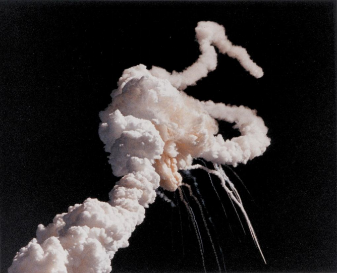

而作为对航天飞机计划的回应，苏联在 70 年代开始了暴风雪计划，虽然此前苏联内部已经有不少小型航天飞机的设想，但苏联政府更倾向于建造和美国类似的大型航天飞机。虽然暴风雪计划和航天飞机在气动和外形设计上非常相似，包括都采用了升力体布局和隔热瓦系统，但其在动力设计上有着巨大差异。

暴风雪计划中的航天飞机仅装备有姿态控制发动机和 4 台 AL31 涡扇发动机，其姿控发动机用于进行轨道修正，而涡扇发动机则用于在航天飞机返回地球后为其航向修正提供动力。这样的设计意味着其完全在进入轨道的过程中提供动力，因此在设计中，该航天飞机需要通过能源号火箭送入轨道，能源号由 4 个使用 4 台 RD-170 液氧煤油发动机的助推器和一个使用 4 台 RD-0120 液氧液氢发动机的芯级组成，凭借如此夸张的规模，能源号超越土星 5 号成为了当时最大的火箭。与美国的航天飞机设计相比，暴风雪计划的设计只能复用轨道器而无法复用其主要的火箭发动机，这样的设计降低了复用所带来的价值，但同样也降低了该工程的复杂性。

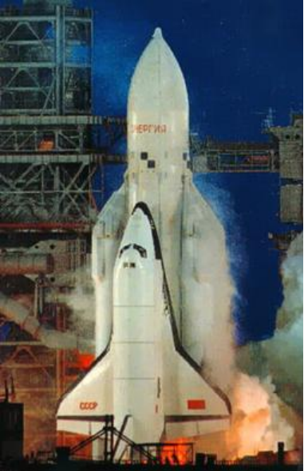

1980 年首架暴风雪航天飞机开始建造，4 年后完成了出厂，在 1988 年，暴风雪航天飞机进行了其首次轨道级飞行，作为一次实验飞行，暴风雪航天飞机并没有搭载生命保障系统，采用无人驾驶，且不执行任何在轨任务仅在轨道上停留了 206 分钟，随后重返大气完成了自动降落。但这次飞行却成为了该计划的最后一次飞行，首次飞行之后，苏联政府便以缺乏资金为由暂停了后续的飞行计划，随着苏联后期的国内问题层出不穷，暴风雪计划便再也没有继续的可能性，1991 年后，苏联解体、红旗落地，拜科努尔航天中心被分给了其所在地哈萨克斯坦，俄罗斯也没有能力继续推进这一庞大的计划，于是剩下 5 架已经建造好的航天飞机因为各种原因损失 4 架，仅存一架存放在茹科夫斯基飞行博物馆。

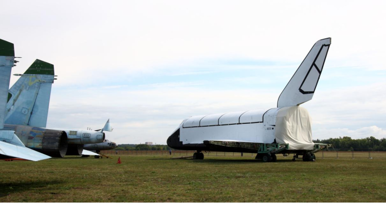

自此美苏两大航天强国的航天飞机项目都因为各自的原因而终止，这或许证明了大型航天飞机构型有其固有的缺陷，凭借当时的科技水平难以完成其实用化，但航天飞机的回收证明了可复用航天器并不是天方夜谭，虽然最后因为高昂的运营成本而黯然下马，但这也给其后的可复用航天器带来了新的曙光。

# **二、昙花一现**

20 世纪 80 年代，随着美国航天飞机计划的成功，一股可复用航天器的热潮在世界范围内掀起，全球出现了多个可复用航天器计划，各国摩拳擦掌争相开展相关研究计划。在这期间关于可复用航天器的相关理论也开始建立起来，从入轨方式来讲，这些飞行器一般分为 SSTO（单级入轨航天器）和 TSTO（两级入轨航天器），并且各国的理论方案经过学术交流也渐渐地走向同一个发展方向，即使用组合动力发动机在大气层尽可能利用大气的氧气减少航天器携带的氧化剂，从而提高航天器的运载系数，这样就有了实用化的可能性。

现如今主流的吸气式发动机例如涡扇、涡喷、亚燃冲压和超燃冲压发动机都有各自的工作区间，对于使用涡轮压气机的发动机来说，在空气来速大于 3 马赫时性能就会急剧下降，这是因为高速下压气机会产生巨大的阻力，并且高温空气在压气机的叶片上会产生激波，导致进气压力减小。而冲压发动机则不包含压气机，纯粹依靠进气道设计来产生激波，依靠特殊的激波形状来压缩来流提高压力，但这意味着冲压发动机具有一定的启动速度才能产生合适的激波来压缩来流。

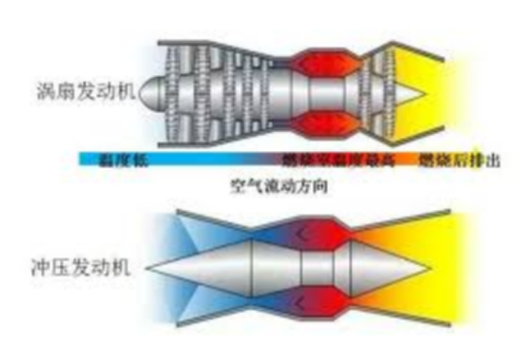

为了把航天器推进到足够的速度，诞生了组合动力发动机这一设想，即将几种不同的发动机组合起来，例如涡轮发动机的工作马赫数为0～2.3，亚燃冲压发动机的工作马赫数 2.0～4.0，双模态超燃冲压发动机的工作马赫数为 4.0～6.5，那么将其组合在一起，在不同的速度区间使用不同的发动机就可以将航天器推进到预定速度。

将这些引擎技术进行排列组合就组成了不同的组合动力发动机，例如 TBCC（涡轮基组合循环发动机），就是将涡轮发动机和冲压发动机结合起来，使用涡轮发动机作为起飞发动机，在加速到 3 马赫左右后切换到亚燃冲压发动机，然后亚燃冲压发动机再切换到超燃冲压发动机，最后达到预定速度。但是这样的设计会导致一个问题就是在涡轮动力发动机切换到亚燃冲压发动机时，亚燃冲压发动机才处于刚启动的状态，产生的推力难以加速到超燃冲压发动机工作的范围，这就是 TBCC 的推力鸿沟。为解决此问题便有了 RBCC（火箭基组合循环发动机），RBCC 使用火箭发动机代替了涡轮动力发动机，火箭发动机作为起飞发动机将航天器加速到亚燃冲压阶段，并且在亚燃冲压转换到超燃冲压模态时提供推力，这样便可以简单地跨越推力鸿沟，但使用火箭发动机就意味着在低速状态下的效率远不如使用涡轮发动机。

## 1. **德国Saenger II**

在 20 世纪 70 年代，德国 MBB 公司提出了 Saenger I 方案，该方案是为了纪念德国科学家桑格尔而命名的，但在当时并未引起足够的注意，只是作为技术预研存在。直到 20 世纪 80 年代，欧空局开始筹备下一代运载器，西德政府便向欧空局介绍了已经改进了的 Saenger II 方案与其他方案竞争。因此，Saenger II 方案在德国国内受到了巨大的关注，西德政府向其投入了大量资金，使得该项目得以走上正轨。

Saenger II 是一种 TSTO 构型，其一级计划使用 6 台 TBCC 引擎将组合体加速到 8 马赫和 30km 的高空，然后释放其二级，二级使用液氧液氢发动机，将二级送入预定轨道，该系统的预计 LEO 运力可达 15 吨。

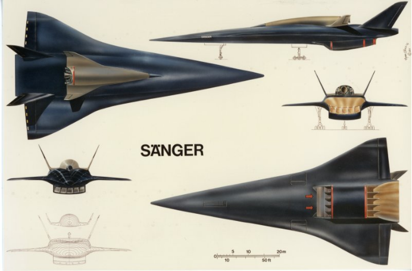

截止 1988 年，该项目总计投入了约 2 亿美元，到此时还只是进行相关子系统的研究，但好景不长，1989 年到 1991 年东西德统一，统一后的德国各处都需要钱进行投资开发，因此该项目开始缺少经费投入，原型机的建造工作也逐渐停滞。直到 1995 年，德国大学研究表明该系统的研制成本要远高于当时正在研制的阿丽亚娜 5 火箭，但发射成本只能节省 10%～30%，而项目预估的总成本达到了 200 亿美元，当时的德国政府无力支持这样庞大的项目，并最终停止了该计划。

尽管如此，1994 年欧空局发起的 FESTIP（未来欧洲太空运输项目）计划，将该项目的部分研究成果进行了延续和发展，但在 1999 年该项目预算开始膨胀，欧空局因无力负担如此昂贵的项目而转向了 FLTP（欧洲未来运载火箭技术计划）。但随着时间进入新世纪，NASA 取消了其可回收火箭计划，而该计划的预定载具阿丽亚娜 5 研发也出现问题，于是在 2002 年后该计划开始逐渐暂停。

## **2.法国Hermes航天飞机**

1980 年美国的航天飞机计划已经宣告成功，欧洲也开始计划建造自己的空间站 MTFF（载人自由飞行器），因此法国开始计划研制一型由火箭运载的小型化航天飞机，用于为空间站提供服务并摆脱对美国航天技术的依赖。

该机设计长 19 米，翼展 11 米，采用三角翼+翼尖垂尾布局，再入时承受 1400-1600℃高温，机身下部覆盖陶瓷-碳蜂窝复合瓦片，上部使用柔性玻璃纤维-陶瓷隔热毯，该机没有自主动力，依赖火箭发射，轨道器仅配备 2 台 2000N 推力姿态发动机。项目最初的设计指标为可以运载 6 人和 4.5 吨重的上行货物，但这种“小型”对于当时欧洲的主力火箭阿丽亚娜 4 来说依然太重了，于是法国太空总署瞄准欧洲下一代火箭阿丽亚娜 5 的运力指标，将 Hermes 的设计改为搭载 3 名航天员和 3 吨的上行货物。

1987 年，因为项目的经费和技术原因，法国开始寻求将项目转为欧洲合作项目，欧空局也认为一型可重复使用的小型航天飞机具有技术可行性，因此将其加入了欧洲下一代运载器计划，该计划正式由欧空局接手在 1988 年到 1990 年进行项目预研。但 1991 年，红旗落地，欧洲突然获得可以和俄罗斯进行航天合作的机会，这使得欧空局开始反思进行独立的运载器研究是否有必要。更糟糕的是，随着俄罗斯将和美国一起建造 ISS（国际空间站），欧洲也决定放弃 MTFF 计划，加入美国的 ISS 项目，而 ISS 的建设将主要由航天飞机进行，人员运输任务也将由俄罗斯的联盟号完成，这让 Hermes 彻底失去了用武之地。

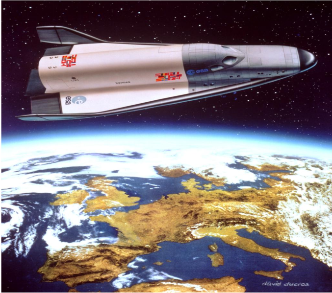

1992 年，该项目在花费了超过 30 亿美元后，因德国与法国争夺项目主导权和各成员国对设计原型的多次修改导致项目彻底混乱，欧空局在认真思考后决定正式暂停该计划。Hermes 的暂停不但是欧洲下一代运载器的失败，同时也是欧洲自主化航天计划的失败，欧洲选择拥抱美国的航天计划，MTFF 项目也因此被取消。

## **3.英国HOTOL空天飞机**

1960 年代，英国皇家飞机研究院的工程师艾伦发现通过液氢冷却吸入空气，可突破传统喷气发动机的热障极限，这也就是如今强预冷发动机的起源。强预冷发动机的原理是通过引射预冷或者换热预冷等手段降低来流的温度，这样同时也能提高空气进气的压力和密度，这样可以使喷气式发动机拥有更大的工作范围。1979 年艾伦和他的研究团队成功在实验中将 3 马赫的来流从 1000 度冷却到 -50 度。

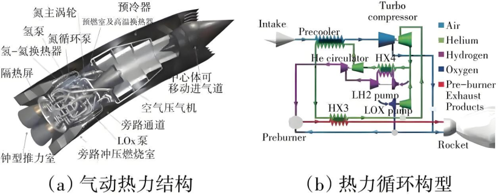

1982 年后，英国政府决心振兴英国航天界，于是拨款 1.2 亿英镑提出了 HOTOL（水平起飞和降落）项目，该项目旨在 1995 年实现单级入轨。该项目由 BAE 负责总体设计由罗罗公司负责发动机研发，1983 年，BAE 就拿出了第一版设计方案，该方案是 SSTO 构型，有 63 米长的三角翼，翼展 28.3 米，起飞重量达 210 吨，搭载罗罗研发的 RB545 发动机，能够运载 7 吨载荷，飞行器在地面由火箭滑撬加速到 200km/h 升空，在 26km 下使用吸气模式将飞机加速到 7 马赫，在 26km 上则切换到火箭模式将飞机送入 300km 轨道。

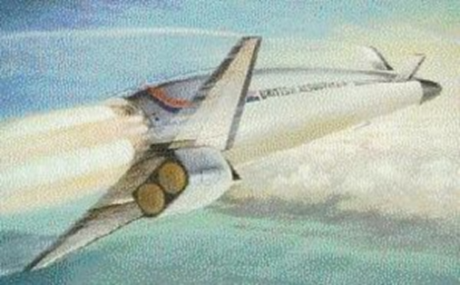

该项目遇到第一个问题是，在 1985 年的风洞实验中暴露出其热防护的不足，难以在 7 马赫中正常飞行，且 RB545 的重量过大整个机体的气动难以配平。为解决以上问题，团队不得不更改整体设计导致运载量由 7 吨降至 4 吨并且改为了无人设计，不再搭乘航天员。然而祸不单行，1987 年，液氢储箱又发生氢脆事故，导致了严重的燃料泄漏，项目又不得不推迟 18 个月来解决这个问题。

BAE 考虑到成本和技术，希望将该项目纳入欧空局的下一代运载器项目，但此时的欧空局对阿丽亚娜 5 和 Hermes 更感兴趣，并且英国政府也对与欧洲其他国家合作抱有一种消极的态度，最后该设想没有得到认可。1988 年，罗罗公司退出了该项目。理由是认为该发动机很可能无法收回研发成本，失去了该项目中最为重要的发动机研制部分，BAE 已经预料到该项目可能无法持续了。到 1989 年，该项目已经花费了 3.4 亿英镑，超支了 183%，在国会听证调查中，国家审计署指出该项目的预估单次发射成本高达 1.8 亿英镑，而同期的阿丽亚娜 4 的发射成本只有 0.6 亿英镑，这远达不到最初低发射成本的预想，最终该项目被英国政府暂停。

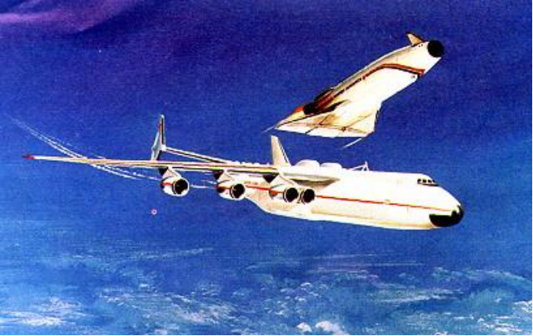

BAE 并不愿意就此放弃该项目，1990 年自筹资金推出了 Interim HOTOL 项目，Interim HOTOL 放弃了 SSTO 构型和强预冷发动机 RB545，改为由一架苏联安东诺夫 225 运输机运送到高空，再由自身的传统液氧液氢发动机点火进入近地轨道。但短短一年后，受到苏联的解体影响，安东诺夫与 BAE 结束了合作关系，欧空局便以有“技术依赖”的风险强行暂停了该项目。1991 年，HOTOL 项目的联合创始人艾伦不满于此，带领该项目的部分人马成立了 REL（反应发动机）公司，从罗罗公司那里买断了 RB545 发动机的技术专利准备另起炉灶。

自此欧洲的三个可回收航天器方案都以失败告终，三者均试图突破传统火箭范式，但受限于 1980 年代材料、制造成本与数字控制技术以及欧洲分散的工业体系，导致项目不断超支难产。冷战的结束也直接导致部分计划失去了用武之地，这些未竟之作提醒我们：航天史诗的每一页，都写满失败者的姓名。

# **三、破晓时分**

在经过 20 世纪 80 年代可回收航天器的大发展和大衰落后，新世纪后，各国已经不再投入巨量资源来研发这些看起来不具有可行性的技术方向，而随着马斯克的可回收火箭技术成功，尽管 HTHL（水平起飞-水平着陆）飞行器发展一度沉寂。但云霄塔与腾云工程，如晨星划破夜空，标志着可复用航天器的新篇章，尽管资金与技术壁垒仍如达摩克利斯之剑高悬，但这些项目证明：航天器的未来，属于那些在失败废墟上重建理想的人。

## 1. **英国云霄塔**

1989 年艾伦带领 HOTOL 项目部分人员成立了 REL 公司，延续了 HOTOL 项目的目标 SSTO，该项目被称为云霄塔（Skylon），与 HOTOL 相比主要的技术差异是使用了 REL 公司设计的 SABRE（协同吸气式火箭发动机）发动机。

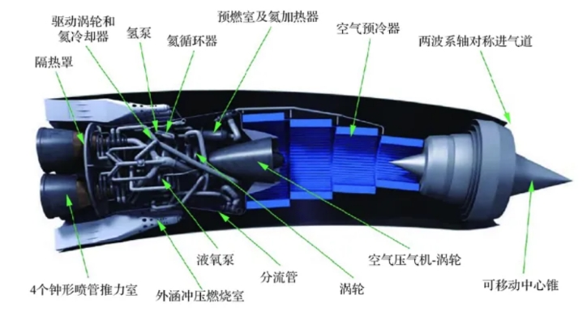

SABRE 发动机融合了预冷器、涡喷与火箭动力，其设计核心在于两种模式的无缝切换：在马赫 5.6 以下时发动机工作在吸气模式，工作在吸气模式时发动机会使用前方的激波锥产生斜激波压缩来流，然后进入进气道被预冷器冷却再进入涡喷和火箭串联的燃烧室进行燃烧，预冷器通过氦循环迅速冷却高温进气，使发动机在高速下保持稳定燃烧，这样可以支持吸气模式加速到 5.6 马赫，在超过 5.6 马赫后则会关闭前方的进气口进入火箭模式，此时直接用机体携带的液氧和液氢燃烧，推进机体进入近地轨道。该项目被设计为长度为 83.13 米，直径为 6.3 米，起飞重量为 325 吨能携带 17 吨的上行载荷运送至近地轨道或者运送 11 吨上行载荷至国际空间站。

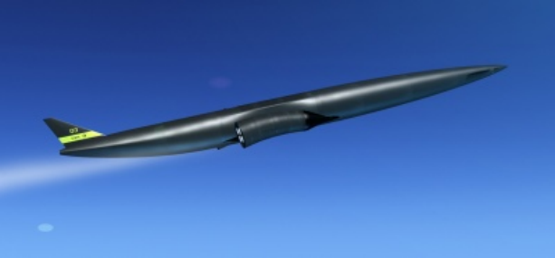

云霄塔项目从 1989 年 REL 公司成立起就一直是由该公司自行筹集资金研制，因此项目进度非常有限，直到 2009 年英国航天局宣布资助 REL 公司 100 万欧元进行研究，随后又帮助 REL 公司广泛地在国际上寻求合作，不久欧空局就宣布也将提供 100 万欧元的拨款，有了这波资金 SABRE 的进度一下子快了起来，在 2012 年便在实验室中完成了在 0.05 秒内将 1000°C 来流降低到 -150°C 的惊人成果。见此，英国政府和欧空局便决定正式地投入到该项目中去，在 2013 到 2015 年间一共提供了 1.1 亿英镑的拨款，而老东家 BAE 公司预见该项目的前景，便以收购股份的方式投资入股并且在 2018 年还拉来了罗罗公司重新加入该项目，至此 HOTOL 项目的原班人马再次聚首。

到 2020 年，REL 在地面完成了缩比发动机试验，公司希望能在 2025 年在高超音速试验台中完成无人飞行试验。但尽管技术验证取得突破，云霄塔仍面临资金缺口和技术复杂性挑战。原定 2019 年首飞因发动机可靠性和热防护问题多次推迟，目前 SABRE 发动机的高温试验和飞行集成测试仍在进行中。

## **2.中国腾云工程**

中国在《2016 中国的航天》白皮书中明确提出“建设航天强国”的愿景，腾云工程是这一战略的重要组成部分。2016 年，航天科工集团在武汉举行的第二届商业航天高峰论坛上官宣了新一代空天往返飞行器研发计划——腾云工程，与载人航天、探月工程、北斗导航等传统项目不同，腾云工程聚焦可重复使用航天器技术，旨在降低太空运输成本、提升发射频次，为中国在商业航天、深空探测等领域抢占先机提供技术支撑。

 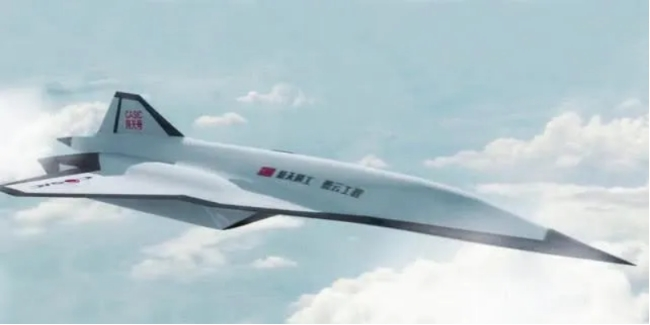

目前关于腾云工程的部分信息依然隐藏在迷雾中，但通过部分新闻报道我们可以知道，腾云工程是一架 TSTO 构型的可重复使用航天器，其一级采用组合动力发动机，二级采用火箭动力发动机。该项目计划从机场水平起飞，在大气层中加速到 6 马赫爬升；到达 30 至 40 公里高度时一二级分离，一级水平着陆返回；二级继续爬升进入近地轨道，完成运输任务后再入返回，预计有 2 吨载荷和 20 吨载荷两种构型。目前关于腾云工程一级所使用的发动机依然存疑，现有的三个可选项是中国航天科工三院 31 所的 TRRE 发动机、云龙 SABRE 发动机和航天科技六院 11 所的 TBRCC 发动机。

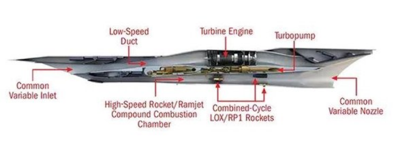

TRRE 发动机是一种涡轮辅助火箭增强冲压组合发动机，它是 TBCC 和 RBCC 发动机的组合体，其核心特点就是在传统 TBCC 发动机上并联了一个进气道和引射火箭，不同于 RBCC 中使用火箭作为低空动力和跨越推力鸿沟的动力，TRRE 中的引射火箭仅作为辅助使用，在低速状态时发动机使用涡扇发动机加速，到 2 马赫后再关闭涡扇发动机，启动引射火箭和亚燃冲压发动机，通过火箭的引射效应可以提高进气道内的空气压力，同时火箭产生的燃气还能提高亚燃冲压发动机的燃烧效率，这样就可以跨越推力鸿沟将机体加速到 4 马赫进入超燃冲压模式。

而 TBRCC 发动机是一种涡轮火箭超燃冲压组合发动机，这种发动机彻底放弃了亚燃冲压发动机，这样就不用解决 4 马赫的推力鸿沟问题。在低空阶段，TBRCC 发动机使用涡喷发动机进行起飞和加速阶段，在加速到两马赫后会启动火箭发动机，因为火箭发动机是直接放在超燃冲压发动机的燃烧室中，因此火箭的尾气和周围引射的空气可以直接达到 4 马赫的超燃冲压的启动点，此时超燃冲压发动机就可以直接启动推动机体加速到 4 马赫，此时再关闭火箭发动机进入纯超燃冲压模式，除此之外当达到临近空间后还可以只启动火箭发动机实现 SSTO 的效果。

在 2017 年的全球航天探索大会上，中国航天科工集团展示了腾云工程的主要目标：在 2030 年之前，设计并制造完成中国首架可水平起飞、水平着陆并且可以多次重复使用的空天往返飞行器。而在 2020 年 10 月 19 日，在第六届中国商业航天高峰论坛上，中国航天科工总工艺师符志民透露：腾云工程将在未来实现航班化运营，根据 2023 年最新披露，腾云工程已完成 TRRE 发动机的 4 马赫地面试验，预计 2025 年开展全尺寸验证机试飞。

# 四、**星辰不灭**

从二战时期纳粹德国的银鸟轰炸机到冷战美苏的航天飞机竞逐，人类对可回收航天器的探索已跨越近一个世纪。这一历程写满了理想与现实的碰撞——桑格尔弹道的理论突破、航天飞机的短暂辉煌、欧洲三大未竟方案的黯然退场，无一不印证了技术狂想背后严苛的工程挑战。然而，正是这些“失败者”的遗产为现代航天铺平了道路。航天飞机的隔热瓦催生了新型复合材料，桑格尔的滑翔理论启发了跨大气层飞行器设计，而 HOTOL 的预冷技术也在云霄塔计划中涅槃重生。如今，SpaceX 的猎鹰火箭正将“廉价太空”的愿景逐步具象化。

可回收航天器的故事远未终结，它既是人类挣脱重力束缚的永恒执念，也提醒我们：每一次划时代的突破，都站在无数先驱的肩头。这些被时光掩埋的尝试与牺牲，最终化作今日火箭着陆时那一道精准的尾焰。历史的讽刺在于，那些曾被嘲笑的“不可能”，往往为未来的“必然”埋下伏笔。或许，当我们凝视星舰腾空而起的刹那，也当回望那些在实验室和图纸上燃尽的星辰。
