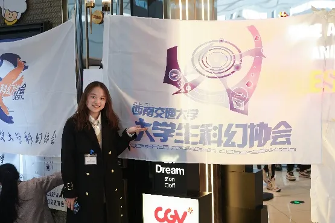
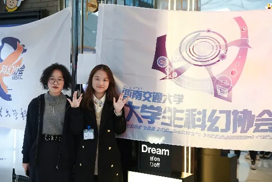
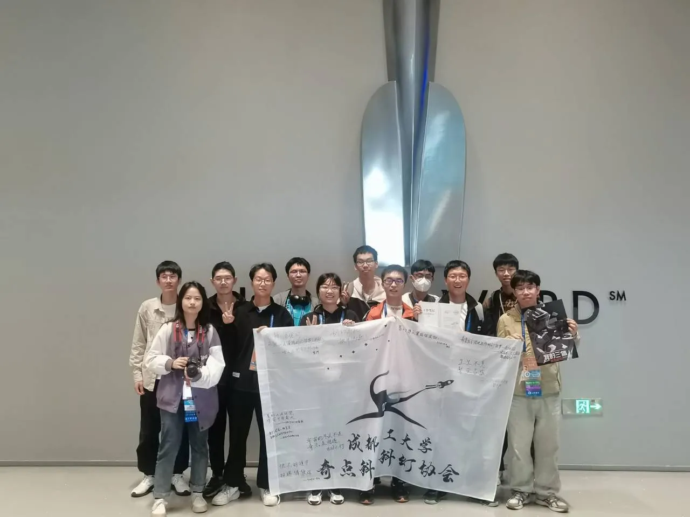
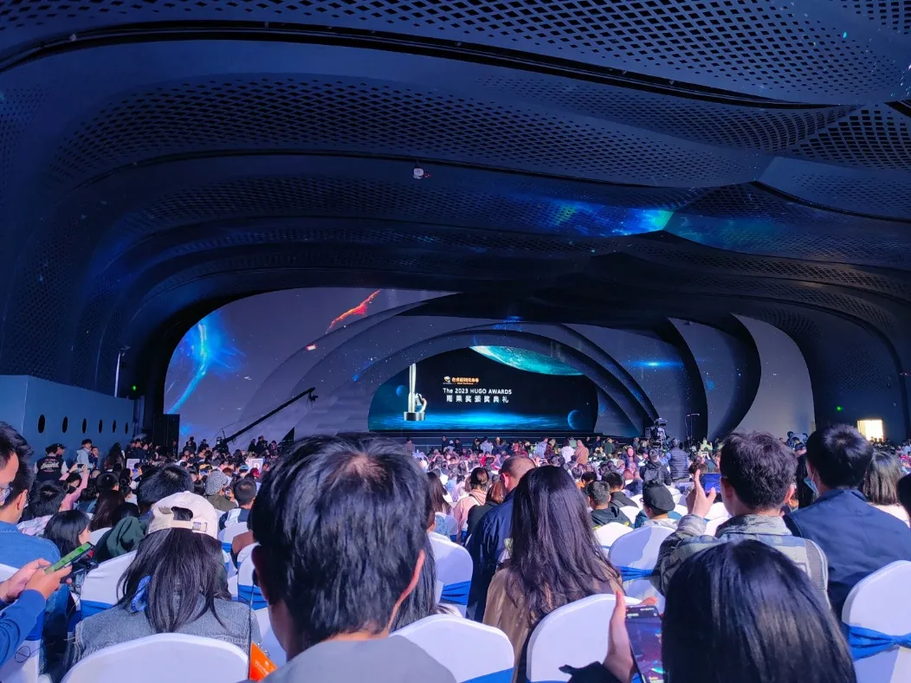
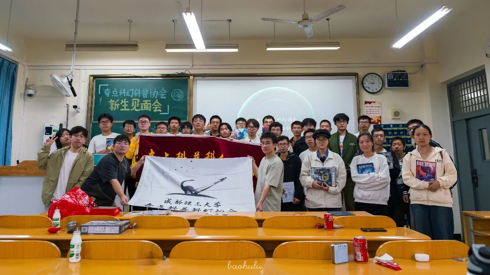
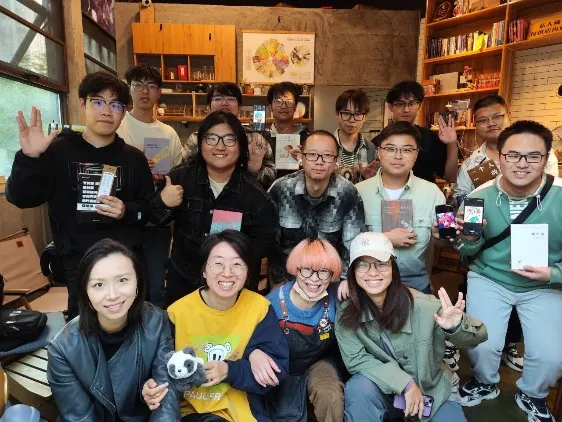
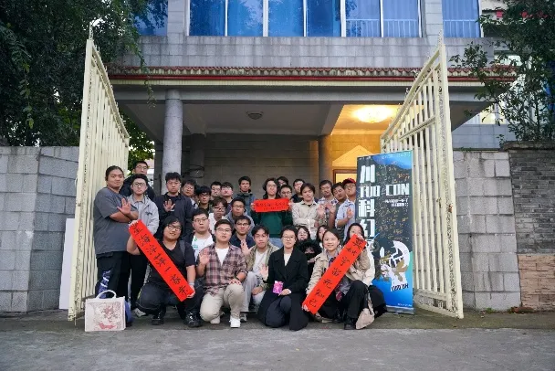
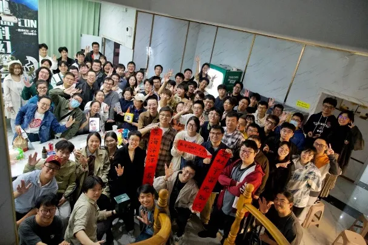
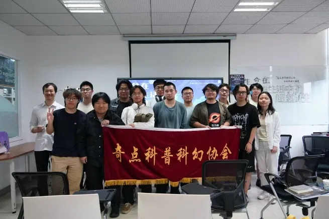
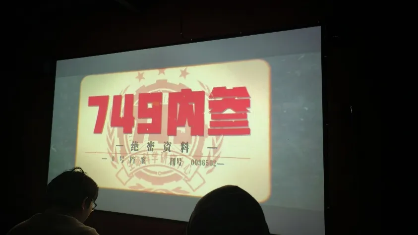

我始终敬佩、敬仰、喜欢这一类人——发烧友，这是一个比较古早的词语，但是是我能想到的最贴切的一个标签。从小时候敬仰的航空航天工程师、科学家、消防员，到现在身边有自始至终热爱的事情，并投入经历，获得肯定，甚至以此为工作的朋友，这样的人很难不有一股强大的人格魅力吸引着我。
在不久的月底，川TUO6.0即将开启，我刚刚把往返成都的票买好，猛然想起河流在空间和大群里一直吆喝的征文活动，虽然我从来没写过什么文章，但是思来想去，若是再不回忆，记忆或许真的会随风飘散。“还是多少写一点吧，就当是和自己对话”抱着这样的心态，于是有了下面的文字。
首先自我介绍一下，为什么叫宝葫芦：这个名字其实与《宝葫芦的秘密》没有半毛钱关系（在补了在补了）。只是小时候随手拍了一张老家种出来的葫芦照片当作QQ头像，那时候昵称都是根据头像起的。不过现在换成平泽唯了以后确实没有什么关联度就是了。
 

# 我与科幻
说真的，我一直觉得我不能算是一个很纯的科幻迷，如果硬要说的话，只能算是个三体粉丝或者刘慈欣粉丝，毕竟我只看过大刘的作品，阅读量有限，惭愧惭愧，所以处于对科幻发烧友们的尊重，我认为我是一枚非正式科幻迷。
初次接触是一部《三体》同人小说：《三体第二舰队覆灭记（贾晶华）》。2020年3月份的疫情元年，在高中QQ群群文件里偶然看到，原文件我现在已经找不到了，当时只觉得这个设定很宏大，很想去读正传。当时封城买不到书，只好借邻居的二手三体读一读，结果一发不可收拾，正式开始了我的科幻路。
关于《三体》这套书，其内容和设定对我的冲击巨大，没有什么类比可以形容当时读完的心情，只觉得很空虚，许久都没有缓过神来。《三体》打开了我的世界观，但是debuff也不少，自从读了《三体》，本就内敛的性格变本加厉，加之高中压力大，我又总是生病，便总幻想着地球爆炸，宇宙毁灭……由此，当年中二的我给自己立了一个人类观察者的人设，并延续至大一……具体表现为见到人绕路走，下课趴桌冷眼旁观，仿佛眼前的生物与我不是一个种族……现在回想起来，真的是傻子一个，白白浪费了大把青春，唉，远离人群的我还算是人类吗？
就这样观察到大学，我特地选择了一个3000公里外的城市读书——成都，希望能与过去的我彻底切割，开启新生活。但是真的入校后，该社恐还是社恐，第一步还是太难跨出了，什么社团也不敢加入，包括科幻社团。（完全没有印象，大一的时候有这个摊位吗……）但不论怎么讲，爱好还是有一些，抱着试一试的态度，我加入了图片社，虽然叫图片社，但其实是党委宣传部的学生组织，在图片社的日子里，精进摄影技术的同时，由于需要参加一些开幕式、运动会、志愿活动等大型活动，我的社恐也在慢慢治好，也发现了一个社交的技巧——返图，这为后面与奇点幻协的相识打下了基础。
与奇点幻协的初识是一段曲折与“非法”的过程，横跨了整个成都最东端和最西端，我才来到了奇点幻协。
整个大一，我都在图片社活动，直到2022年7月28号，我在山东老乡群（是的，沙东人太多了，老乡群甚至有03年老学长）的BD8EHB推荐下加入了成都理工星尘天文协会，因为当时我在研究怎么拍摄银河和流星雨，遂以“黑户”的身份在群里潜水。在水了半年群后，因为天协时常会有人讨论一些科幻影视和概念（原来科幻和天文是绑定的吗🌿），我在2023年3月初，还是BD8EHB发的消息，他说在3.20号有一场流浪地球2的告别观影会，有没有人想要参加。我心想，怎么就告别观影了，必须得去！

在观影团中，群主是一个顶着绿色头像的西南交大的同学——北鱼，也是时任西交幻协社长。在我的社交逻辑中，首先认识的总是组织者，然后再辐射社交，这或许也是新闻摄影的一种职业病。到了3月20号，我和两个胶佬朋友，从成都东三环坐了一个半小时地铁到达了犀浦的CGV影城（现已倒闭变成万达了），在现场，我联系上了当时负责拍摄记录的交大的同学RedD1fz，简单沟通后发现他也是胶佬和特摄佬，于是四人便在一起活动。活动过程中，我拍摄了大合照和一些活动记录，给北鱼拍了一张单人照（北鱼当时就说是人生照片（好夸脏）），又给北鱼和小罗（交大下一届社长）拍了一张合照（最近她俩说说回忆还有这张图，泪目），然后便是一些协会的合照和旗帜合照。这时候我发现了一个问题，明明联合观影里有奇点幻协，旗帜在哪里？人在哪里？后来才知道，他们几个忘记带旗子了……所以后面在帮助社团活动的时候，我一直强调出去办活动，不管是一个人还是一群人，一定要带着旗帜，留下影像。

讲了这么一大段，我想说，或许交大幻协和北鱼才是我在成都的科幻引路人，2023年3月20号的联合观影，在我大学的社团活动和科幻轨迹中，是一个非常重要的节点。当然，这也与疫情末期，本校社团普遍低迷的现状也有关系，后面即使我加入了奇点科幻协会群，群里也是半死不活的样子，没几个人说话……或许那时的奇点幻协最重要任务的是活下去。

# 我与科幻大会

 

就这样半死不活的潜水到6月份（大概），奇点幻协社长Rocket Raccoon（后简称rocket），在群里说有人想去科幻大会吗？这里有人出票。了解过后发现，大刘和我三的导演神游八方会来现场，我犹豫了两个小时，终于还是打败了颅内纠结社恐的自己，迈出了科幻活动的第一步，抢下了这张票。
整体来说，科幻大会第一天很有意思，之后就有些无所适从……可能与我社恐的性格和阅读量太少有关，其他作品确实是没涉猎过，偏远的地理位置也劝退了我。至于雨果奖，我是第一次听说，只知道之前在群里活动的河流得到了这个国际奖项，很厉害；2077获奖了，仅此而已。
第一天还是很兴奋的，第一次见到这么多同样喜欢科幻作品的人和模型周边，很激动，和rocket逛了一圈星球大战的飞船，然后有幸见到了《我的三体》的作者神游八方，要到了签名合了影，后面甚至能见到活的大刘（bushi），趁着协会人多，我们也在雨果奖颁奖典礼门口拍了一张合照。

 

   
到这里我觉得就已经值回票价了，后面跟着rocket排大刘签名的时候（虽然最后也没排到），碰到了电视台采访，果断拿rocket作挡箭牌，毕竟是社长，问答过程似乎很愉快。第二天应该是雨果奖，白天我跟着星沉，哲学鸡参加了一个三体讲座，具体他们讲的啥也记不清了，只记得郭帆讲了一下球二的制作花絮还蛮有趣的，当时笑得很开心。剩下的时间里我有些无所适从，因为读过的科幻作品就只限于三体和大刘的一些短篇，只好点击自动跟随，跟着他们到处走走。比较好的是科幻大会有集丝带的活动，很好的丝带，使我的收集癖大脑旋转.jpg，当时看有的幻迷和志愿者集的丝带像哈达一样长，很是羡慕。

          
于是我也收集，还和其他幻迷交换了几个丝带，很有趣。后面因为手头没带什么书籍，只好拿着西交的会刊盖章集邮，当时没注意，把他们的卷首语那一页都盖满了，后来北鱼还嫌我不应该盖那一页，当时还怪不好意思的。

其实晚上雨果奖现场我也没啥感觉，只觉得是个国际会议，有很多老外和科幻作者在颁奖领奖，偶尔蹦出几个我看过的作品和玩过的游戏，比如说2077，心里可能会兴奋一下，后面河流他们的《零重力报》获奖了，我也为他们感到高兴。可能这与我淡人的性格有关，也可能是一天下来确实没力气了。 

 

昨晚我在和星沉对科幻大会的时间线时，星沉说，@宝葫芦 怎么感觉你大会之后基本又没怎么来参加过社团活动了。好像确实是这样的，大会之后就入冬了，我的状态也随着气温降低而冷冻，尤其在这个没有暖气的冬天，阴雨的成都实在难熬，或许可以理解为我在冬眠。

# 我与奇点幻协
自大会之后的科幻活动时间可以分为三段，从大会到24年9月、9月到11月、11月到6月毕业。时间越靠后，我的活跃度越高，可能与学业压力和就业压力的变化有关。
一阶段——潜水，这是大三下课业最繁忙的时候，有很多次协会活动我也想去，但是专业课一上就是早八到晚八，当时还是太老实，不敢翘课，只好看着机会溜走。印象比较深的是24年3月初的沙丘2观影，这个我还是跟着协会去了两次，但是4月的编辑部圣地巡礼真的很想去但是没时间去成，太可惜了。除此之外，北鱼约过我好几次去川西自驾，但是每次我都有无法翘掉的课程，真的很抱歉，今年这次倒是没课了，但我要上班了😇也许这就是命中注定吧。中间也有两次川TUO，也是同样的原因没去，太可惜了，失去了很多乐趣。一阶段的我几乎只在群里水水群，与科幻活动无缘。
二阶段——复苏。第二阶段的复苏，总结来说是我在学会处理相遇与分离的主题。24年上半年，我经历了一次重要的分离，大学里为数不多的友人突然离世，让我第一次真实的感受到生命的温度。自此变故之后，我开始重新审视大学剩余的时光，我想抓住与我有关的细线，哪怕只是一根，哪怕它注定要断裂，但我希望能从连线上感受到生命的振幅，我想用影像记录，更希望能够切身体会，我要抓住当下青春的躁动，不留遗憾。因此，我要正式的加入奇点幻协，在一个科幻的社团中构建一些现实的活人味。
可能是子夫女装拐来了一些新人，又或许是银河奖和百团撞车，有足以吸引人的活动支持，24年的招新非常的热闹。我还记得百团第二天是我的生日，第一天晚上和同学在办公室工位畅聊到七点钟，从就业的现实困境聊到游戏和魂系游戏，非常的兴奋与畅快。第二天早上去百团之前，出租屋里飞来了一只虎皮鹦鹉，十分喜人。

可以说这次招新也把我招进来了，越来越频繁的活动和聚会，着实让我与这些可爱的科幻迷们有了别样的羁绊。科幻不一定是目的，但他应该是个好因子。后面我又与白天鱼、星沉、mudern、子夫、十口几位去42号书咖聚会，在聚会里认识了石头姐点汀和tail，给点汀画了他的头像，他当时说很喜欢。但是没想到过了几周，本以为可以当作新据点的书咖，就宣布要倒闭关门，转为椰子鸡门店了，世事无常，真是令人感叹。

 
来不及为42号书咖悲伤，马上向我们走来的是川TUO4.0。这是我第一次参加川TUO，第一次听到这么多有趣的分享和活动，而且体验了一把后半夜边用投影仪看剧，边聊天熬夜赶作业的超绝DDL冲刺（吐血）。

三阶段——吃。
人类是群居性动物，想要真正的生活，吃饭少不了。在剩余的大四一年时间里，我几乎是和幻协一起度过的，每当傍晚放学后广播站的bgm响起，群里时常会有人来约饭“今天吃什么”“想喝酒了”之类的稀松平常的话语，却总能在人群中激起波澜。约饭喝酒的话题印象里总是有那么几个人在讨论，一般是星沉或者十口发起，我、mudern和白天鱼最常响应，rocket是不好约出来的，因为他要备战考研；子夫、jerriel、无明有时也会参加。在奇点，事物的推进往往需要约饭或者喝酒（真腐败啊 笑），一开始的饭局只是消遣和报团取暖（成都的冬日真的难熬），但是聊天往往会有两个方向发展：鉴证或者社团活动。前者不多赘述，每一个科幻社团都会有人热衷于鉴证，奇点线下聚会中总会聊一些不能讲的事情，但是气氛意外的不会过火，大家也只是点到为止，最终的结局会在一声叹息中草草结束。

后者推进社团工作应该算是特色，十周年社刊的推进和海报制作都是在一顿顿深夜宵夜中推进的，社刊的制作我只负责了宣发的海报制作，虽然每次他们讨论都会叫上我，但我只能提些排版和宣传的建。当时说让我写一下拍星星和火箭的攻略文章，可惜，本拖延症患者拖到毕业也没写……

在这个话题中你能听到十口王的疯狂大饼，有且不限于占领学校建立科幻协会活动室；开辟图书馆科幻角；成立奇点科普科幻工作室，发售会刊和周边，招商引资，疯狂爆幻迷大米……每当配料丰盛、热腾腾的口家大饼端上桌来，屋子里顿时充斥着欢快的气氛，仿佛现实的引力随着桌上的白色雾气一同，带着我们的畅想，幻想与希冀，翻腾，消散而后又聚起，咕噜噜的向上飘去，直至与铺满油渍的红色塑料顶棚相撞，或者从穹顶四周溢出，回归到反射着霓虹的成都的深蓝色夜空当中去。
在品鉴大饼的食客中，担当吐槽役的往往是mudern和白天鱼，也许是计算机背景的思维mudern会把十口的饼切成具体的实施点来论证可行性，而白天鱼作为前任编辑部部长，会通过之前协会活动的经验，列举学校政策和真正实施下的阻力，推算大饼冷却的时长。
吃完精神食粮的口家饼，是时候吃点现实的物质饼。大约自24年下半年起，我就琢磨如何在出租屋里做饭，可惜能力有限，舍友的评价只停留在“熟了”，我也有很强的自知之明，因此虽说很想请同学来家中做客，可惜一直没付诸实践。然鹅在24年9月，科幻群中来了一位新同学——小房，由于是老乡的缘故，我俩比较聊得来的。有一次偶然间的闲聊中，他提到食堂好难吃，之前天天在家自己烧饭吃，想自己做饭，我随即邀请他来我出租屋里做点。后面，在我与另一位新同学诺依曼的品鉴下，一直认为，简直是大厨级别的佳肴，于是幻协拥有了房大厨这张SSR。
之后我们时常会抽空小聚，整点小菜吃，对于我这个即将毕业的空巢老登来说是莫大的慰藉。因此每次来聚餐，我都会带着他们翻看之前的活动记录和藏品，这种热闹的场面我一辈子都不能忘记。后面河流过来玩，我们也在我屋里聚了一次，那次应该是人最多的一次，多到没有座位我都不能上桌吃饭（bushi）。

说完好吃的，我们再提一些不那么美味的（真的吗）：赤石。这几乎是每个科幻社团都会有的传统异能，不得不品。群聊中搬史讨论史已经变成了日常活动，甚至需要线下品鉴！24年的跨年聚会，奇点幻协的一波人就去租了个观影室，细细品鉴了一次科幻石圈的著名作品《749局》！意思罪魁祸首十口被tail传染了749病毒，他带领各位会员，在影棚里逐帧分析749的各个槽点，把749局细细切成了臊子品，也是非常的美味啊！

不论是食物还是赛博赤石，好吃还是孬吃，吃，是奇点幻协的长青活动。重点不在于吃什么，在哪吃，而是因为吃聚在一起的生命，在每一次的品鉴与吐槽中碰撞出新的火花，在每一次的凝聚中，拉拢更多的朋友，形成更大的力量。奇点科幻事务推进，部门成员的增添基本上都是通过聚餐的形式解决的。希望之后的幻协能够多多聚在一起吃吃喝喝，延续下奇点的烟火气，让腾挪向上的幻想的热气一直翻涌着。

--- 

至此，我与奇点幻协，与科幻两年半来的羁绊就讲述完了，第一次写这么长的文章，文笔有限，还请读者海涵。
愿我们能在现实的引力波中找到属于自己的频率。
奇点幻协生生不息，蒸蒸日上！

<small><em> 宝葫芦，写于2025.10.20至10.26 </em></small>

