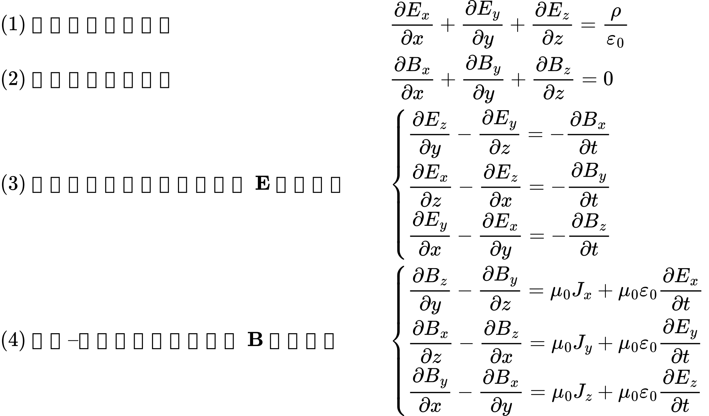
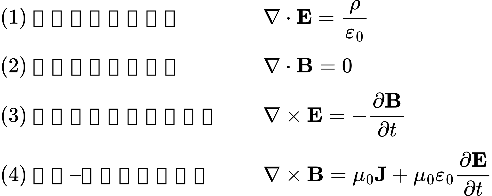

“哲学”一词源于古希腊语 *philosophia*，本意是“爱智慧”。有一句被反复引用的话大概可以表意为：惟有爱（*philein*），才能真正看见智慧（*sophia*）。在哲学的传统分类中，人们通常把根本性问题分为几个主要领域：

1. **形而上学**：世界究竟“是什么”？何为“存在”的本质？

2. **认识论**：我们能否认识世界？知识从何而来，又止于何处？

3. **伦理学**：人应当如何行动？何为“好”的生活？

4. **逻辑学**：什么是正确的推理？推理的形式与规则如何表达？

5. **美学**：美是什么？我们如何感知与判断“美”？

这篇文章会主要围绕其中的**形而上学**展开。

早在古希腊时期，哲学家们就提出了“**逻各斯（Logos）**”这一概念，用以指称在宇宙纷繁变化之中支配万物、维系不变的理性秩序。

当我们以这样的观点来审视计算机世界：当我们在编写程序，构建系统时，其实从某种程度上来说也是在追寻某种支配信息与计算的“底层逻各斯”。这正是《逻各斯与计算机编程艺术》这个标题的由来——当然，它是向我喜欢的一本书《禅与摩托车维修艺术》标题的致敬。

限于篇幅，这篇文章主要讨论两个观点。第一个核心观点是：**你对世界的理解越深刻，就越能简洁地描述它。**第二个核心观点则是：**当我们看待事物的角度发生变化，世界也就随之发生变化。**

# 观点一

你对世界的理解越深刻，就越能简洁地描述它。

我们常说，**软件工程是一门对抗现实复杂度的学科**。编程语言之所以叫“语言”，正是因为我们在用它向计算机**描述我们对现实世界的理解**。当我们对现实的理解越深刻，就越可能写出**更简洁、更准确的代码**。

通常在计算机领域，我们称这种东西为合理而正确的抽象。简洁并不是对复杂的粗暴删减，而是从纷繁现象中抽出真正本质的结构，用最少的符号捕捉最多的内容。

在物理学上我们可以找出一个很好的例子：**麦克斯韦方程组**。

它常被称为“物理学中最简洁、最具美感的一组公式之一”。先看它在不使用算子的展开形式（只展示结构，不深究物理细节）：



如果我们引入矢量分析中的算子，当然在这里我们不需要深刻的理解什么是算子，也不需要知道这些算子表达的含义是什么。我们只需要知道引入算子后，上面的式子将会被简化为：



在使用算子的这四条公式里，我们大致可以读出这样几条规则（略不严谨，但有助于直观）：

1. **静电场是有源无旋场，其散度在局部与电荷密度成正比。**

2. **静磁场是有旋无源场，其散度恒为零，旋度由电流决定。**

3. **随时间变化的磁场，会在空间中激发出有旋的电场。**

4. **随时间变化的电场与电流，会在空间中激发出有旋的磁场。**

当然，进一步，如果假设磁单极子存在，这组方程还能被推广成更对称的形式：


1. **静电场的散度在局部由电荷密度给出。**
2. **静磁场的散度在局部由磁荷密度给出。**
3. **随时间变化的磁场与磁流，会在空间中激发出有旋的电场。**
4. **随时间变化的电场与电流，会在空间中激发出有旋的磁场。**

如果没有散度（div）、旋度（curl）这样的算子，麦克斯韦对电磁场的描述就只能是**一长串分量方程**。到处都是偏导数、坐标分量和看不完的符号堆砌。从表面上看我们是引入了“算子”使得方程的形式整体化简了，但深层次是是因为，**我们逐渐理解了支配电磁现象的内在的“逻各斯”，才得以抽象出“散度”与“旋度”这样的概念，从而以更统一的方式描述整个体系。**从这些方程的对称结构中，我们甚至可以大胆猜测磁单极子的存在。

这正说明，**一旦我们对世界的认知深度达到某个程度，表达形式自然会趋向简洁与统一**。

# 观点二

当我们看待事物的角度发生变化，世界也就随之发生变化。

哲学家用“世界观”这个词来指称这种“看世界的角度”；程序员则更习惯用“范式（paradigm）”来描述一种固有的思维与设计方式。你认为“世界的基本单位是什么”，决定了你如何去拆解、组织和重构它。

从某种程度上来说，我们的每一次代码重构就是一次“革命”，一次范式转化。

要理解“范式转换”，首先得明白什么是“**范式**”。根据科学哲学家托马斯·库恩的定义，范式是“特定的科学共同体从事某一类科学活动所必须遵循的公认‘模式’”。它包括了共有的**世界观、基本理论、范例、方法、标准和工具**等。简而言之，范式是一个科学共同体成员所共享的一整套信念和实践规范。

所以用一句话概括这句话，可以是：

> 在所谓范式转化中，我们看到的一切没有变化，唯一变化的是我们看待这些事物的方式。

这里从两个视角聊聊世界的本原，也就是形而上学所说的，世界究竟“是什么”？何为“存在”的本质？

在《形而上学》写xxxx。亚里士多德区分了第一实体与第二实体。第一实体是具体的个体，是“这一个”在场的存在者；第二实体是种类与本质，用来回答“它是什么”；而属性（偶性）则依附于实体而存在，不能脱离实体单独成立。实体是存在的基础，属性只是对实体的说明。

在《形而上学》中写道：**“实体在最严格的意义上，是既不述说于一个主体，也不在一个主体之中的东西”。**换言之，实体不是别的东西的属性，也不依附于其他存在者；它本身就是一切述说的基础。围绕这一点，亚里士多德区分了第一实体与第二实体。第一实体是具体的个体，是“这一个”在场的存在者；第二实体是种类与本质，用来回答“它是什么”；而属性（偶性）则依附于实体而存在，不能脱离实体单独成立。实体是存在的根基，属性只是对实体的说明。

我们可以将这种思想概括为三个基本观点：

1. 世界由实体构成
2. 实体具有自足的存在
3. 属性依附于实体而存在

想象一片宽广的草原。草原上有小马，有小草，有湖泊，有风。风吹动小马的鬃毛，吹低草叶，吹皱湖面。我们在描述这幅画面时，总是先指认“有什么”，这匹马、这片草、这个湖面，随后才谈论它们的颜色、高度或状态。

在这种视角中，世界首先是一组独立的对象，而属性只是对象的附加说明。那匹小马可以被单独拿出来描述：它是白色的，两岁，正在奔跑。即便暂时忽略它与其他事物的联系，这个对象本身仍然是完整的。

如果把这种结构写成代码，它会呈现出一种极为熟悉的形式：

```rust
// 世界由实体构成
type World = { entities: List<Entity> }
// 实体具有自足的存在
// 属性依附于实体而存在
type Entity = { kind: Kind, props: Map<Key, Value> }

world = {
  entities: [
    { kind:"Horse", props:{ "color":"White", "age":2 } },
    { kind:"Grass", props:{ "height":"10cm" } }
  ]
}

color(horse) = horse.props["color"]
```

实体携带属性，属性属于实体。世界是一组对象，而对象内部封装了自己的状态。

在现实中，这种与面向对象的范式基本符合。我们会抽象出系统中众多的实体作为基础的类，为这些类添加字段作为他们各自的属性。那么系统自然就是这些类的实例的相互作用关系。

在另一种思想传统中，存在并非独立而自足。《金刚经》里写，凡所有相，皆是虚妄。若见诸相非相，即见如来。佛教讲“缘起性空”，一切事物都依赖条件而生起，并无固定不变的自性。所谓“相”，不过是条件聚合后的暂时形态；离开条件，这种形态便不复存在。从这种角度来讲，我们之前面向对象的视角就是“着相”了。

那么可以总结出更简单的两个基本观点。

1. 世界由关系构成
2. 实体并无自足本性
3. 属性生成于关系结构之中

我们仍然回到那片草原。但这一次，不再从“有一匹马”开始，而是看到阳光、空气、水分、土地、时间等条件在某一刻交汇，形成一个相对稳定的结构，我们为它命名为“马”。当条件改变，这个结构也随之改变。所谓“白色”，也不是附着其上的内在性质，而是光线、物质与观察者共同作用的结果。

在这种视角中，世界首先是一张关系网络，而所谓实体，只是网络中的一个节点。属性并非对象内部携带的字段，而是关系结构在某个位置上的结果。

如果把这种结构写成代码，它会呈现出完全不同的重心：

```rust
// 世界由关系构成
type World = { entities: List<Entity>, relations: List<Relation> }
// 实体并无自足本性
type Entity = { id: Id, kind: Kind }
// 属性生成于关系结构之中
type Relation = { from: Id, rel: Rel, to: Value }

world = {
  entities: [
    { id:"h1", kind:"Horse" },
    { id:"g1", kind:"Grass" }
  ],
  relations: [
    { from:"h1", rel:"color", to:"White" },
    { from:"h1", rel:"age",   to:2 },
    { from:"g1", rel:"height",to:"10cm" }
  ]
}

color(horse) = lookup(world.relations, horse.id, "color")
```

在这里，实体本身并不携带属性；属性存在于关系之中。世界不再是对象的集合，而是连接的结构。

即便如此，我们仍然可能会对这种视角感到陌生。但其实关系型数据库早已在日常生活中实践了它。所谓“我”，并不是一个自带固定属性的自足实体，而是在“学生表”“员工表”“家庭关系表”等不同结构中的交汇点。我的“身份”并非内在本质，而是关系赋予的位置。当关系改变，身份也随之改变。

于是我们得到一组几乎可以彼此照镜子的世界图景：

在一种图景中，世界由实体构成，实体自足而在，属性依附其上；
在另一种图景中，世界由关系构成，实体并无自性，属性生成于结构。

前者从“有什么”出发，后者从“如何关联”出发；
前者将对象视为基础，后者将联系视为根本。

世界本身或许并未改变，但当我们改变了看待它的方式，世界的组织形态便随之重排。

# 总结

虽说文章名是逻各斯与计算机编程艺术，最后好像没有太聊到计算机编程。但是退一步来看，当我们以不同的视角审视相同的世界，并对这个世界的理解逐渐加深时，世界自然的将其更原本的面貌展现给我们，而而编程之道就在其中——写下你关于这个世界的认识！

虽说文章名为《逻各斯与计算机编程艺术》，但行文至此，似乎并未直接谈论多少编程技法。然而，退一步看，编程本身不正是在用代码描摹我们对世界的理解么？当我们以不同的视角审视同一个世界，当我们对支配万物的“逻各斯”理解得越发深刻，我们的表达便自然趋向简洁、统一且富有洞见。而所谓的编程艺术，恰恰就在于这种不断逼近本质的洞察之中——透过层层抽象，抓住现象背后的秩序，用最凝练的符号，写下你对这个世界的认识。
