**9月19日**

上午九点钟，成都理工有一班大巴九点出发去银河科幻大会。我和十口星沉、协会的新同学一起上了车。车上大家聊起考研、保研和就业和后续的方向。在中国现实的引力还是太沉重了，任何超脱飞扬的想法都会怦然坠地。

上午大概十点钟我们到达了生态馆，科幻大会的举办地还是那么的科幻那么的远，每次参加科幻大会都像是来到了异星球。

到了银河奇想市集，第一件事是帮深蓝师兄把东西搬到42号邮局的摊位。安顿好后，就开始去各个科幻协会串门。先去了安塞波和马门溪龙科幻图书馆，安塞波摊位是akii和小罗在守摊。边走边和大家打招呼，顺便发我们奇点科普科幻协会的丝带。川大的摊子特别热闹，友弥在那儿看摊。我们交换了川大社娘的新邮票，他还送给我们一个川大的会徽，顺便看了他们的30周年纪念刊，协会书箱里也有一本。去年招新大会时，我们想做会刊，上台展示时我们便是用《临界点》做例子。川大隔壁是上海交大的摊位。我做会刊时也曾参考过他们的《GPA》，从中吸取了不少经验。这次他们出了新的会刊《SCI》，我们协会的五个人当场决定预订一本。再隔壁是哈工大思飞科幻协会，协会的会长给了我一个他们的会徽吧唧。华南理工大学的社长来得比较晚，一来就免费发放他们的报纸。记得我们当时做会刊时，还讨论过要以三个月为周期出报纸，用来培养协会的排版能力。当时河流在群里分享过他们的电子版，我对报纸上的一篇文章印象很深刻——是一个章鱼用腕足勾住了人的腿，说要把人拉入科幻协会，介绍古神文化。

后来听说大会可以集章打卡，换科幻世界40周年的刊物，于是我和十口马上开始了“集章之旅”。摊位上的章相对容易收集，过程中还遇到很多熟人，比如子旋、单反、华文老师。我们在科幻史展馆也盖了章。收集到大概二十个章后，进度就慢下来，因为剩下的章在作家和staff手里。这时遇到小罗和北鱼，他们已经集到了巴鳞的章，而这个章应该在陈曜老师手中。于是我们就开始寻找作家和编辑的章，比如分型橙子、陈曜、长铗等。最后我们收集到24个章，还差一个。恰好这时何夕等老师的签售开始，遇到了tail。他说签售旁边有老师带章，于是我们最终成功盖到了“新贵”的印章，也终于集齐了25个章。最后换到了银河奖40周年《科幻世界》增刊上下册，还拿到了“我们是基石”的丝带。我们大概是大会第一个集齐25个章的社团。

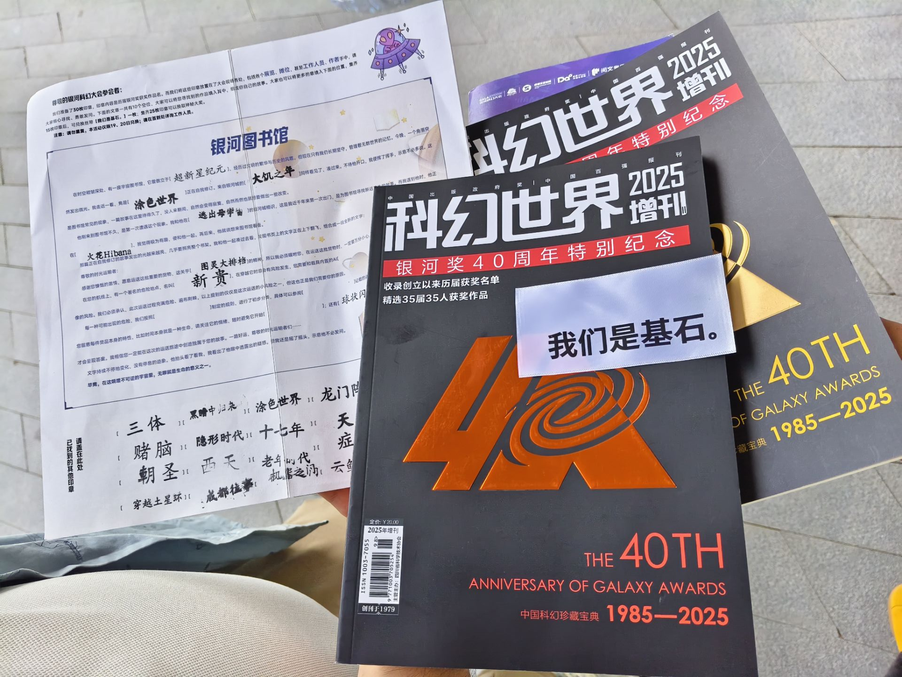

晚上是银河奖颁奖典礼。预订六点半开始，我们六点就拿到票，六点一刻被放进会场，正好赶上彩排，气氛有点像草台班子，还在进行最后的调整。活动刚开始，大家发现视频里AI痕迹很明显，颁奖表格也像AI写的。整个典礼商业化色彩很浓，过程很长，其中夹杂了一些幻迷的祝福视频。今年新增了一个学术奖，有一篇获奖论文的题目是《太空核威慑背景下金庸对海因莱因的翻译考》，这个标题就引起了不少疑问和轰动。社团奖由哈工大社长和刘慈欣共同颁发，上交和东华平行界获奖，恭喜他们。于此同时，科幻世界还宣布了“火种计划”，每年拿出5000元分成十份，帮助社团开展活动。典礼持续两个半小时，到后面很多人都疲惫了。但最后的40周年切蛋糕环节却十分令人动容。屏幕上播放了三四十年前银河奖起步时的影像，与今天的盛况进行对比。谭楷老爷子亲自分蛋糕，老一辈幻迷作家们纷纷送上祝福，刘慈欣也在其中。其中有祝福语让我印象深刻：“待到山花烂漫时，她在丛中笑。” 银河奖走过40年，如今确实算是“山花烂漫时”了。十口把我们的丝带送给了大刘，他若有所思。哈工大社长硫酸铜递给我一块蛋糕，经品尝是很蛋糕的蛋糕。科幻活动与其他活动不同，最打动人的是幻迷之间的真情。这种纯粹的联系，是无可替代的。

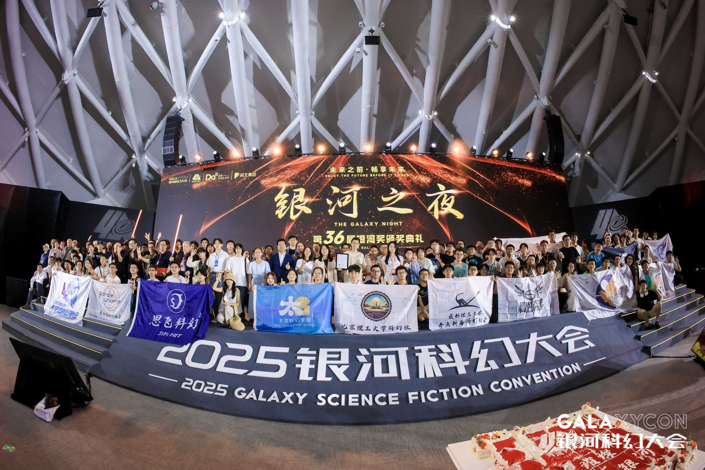

有了上次郫都区世界科幻大会的经验，这次我预订了兴隆湖边的三天两夜酒店，不用把时间浪费来回通勤上。收拾完摊位，送走成理幻协的同学们，我一个人走在湖边，看到很多人在露天看《疯狂的外星人》。因为明早还有活动，我只停留片刻就回酒店了。晚饭在酒店附近吃。刚坐下，就看到两位背着京东图书袋子的同学进来。我问他们是哪个学校的，他们说重庆邮电。我自我介绍是成都理工奇点科普科幻协会的。吃完饭走出去，才想起包里还有丝带，于是折返回去送了他们两个。等红灯时，他们竟追出来，把他们协会的徽章送给我。幻迷之间的这种交流，自然而真诚，也是科幻大会最吸引我的地方。

------

**9月20日**

早上九点从酒店出发，十点钟到了42号邮局的摊位，紧接着去四号分会场，参加“银河科幻大会升级优化专题讨论会”。我和星沉坐在第一排。出乎意料的是，现场根本没观众，参会的有两位科幻世界编辑、吴显奎老师、藤井太洋老师，以及世界科幻大会的两位代表，分别是世界科幻大会的高级顾问尼古拉斯·亨特·怀特和格拉斯哥世界科幻大会的主席埃斯特·麦科勒姆·斯图沃特，其中由陈曜老师担任翻译。

会议的讨论主要围绕不同地区科幻大会的差异，以及银河科幻大会可以借鉴的经验。世界科幻大会每年都会吸纳新的文化元素，其中约六成参会者来自美国。对美国参会者而言，传统极为重要，但新人们往往并不在意这些。陈曜和吴老师则谈到中国的情况：中国的科幻主要依靠三方面的力量——科幻世界、幻迷以及政府。然而幻迷和志愿者的潜力远未被充分挖掘，本次大会只有大概60名志愿者。吴老师提到，银河联盟曾培养过上千名幻迷，但最终没能很好地利用，这是很可惜的。

在志愿者动员问题上，藤井老师分享了日本的经验。他指出，日本的科幻大会尤其重视大学生的作用，大学生几乎是大会的支撑力量。这一点和中国的情况形成鲜明对比。

世界科幻大会则以志愿者为主体，而非专业人士主导。尼古拉斯举例说，有教授打着做调研的名义请假六七个月，其实是去组织大会了。对此，吴老师补充道，昨天和尼尔·克拉克聊天时得知，他小时候看科幻常被认为“不务正业”，而如今中国社会却非常开放和欢迎科幻。中国的科幻大会也有明显不同之处：产业参与度非常深。吴老师还透露，未来打算把科幻大会落地在绵阳科学城和宜宾大学城，不再沿用两年一次的节奏，而是让银河科幻大会能够持续开展、保持常态。

总体来看，中国科幻大会与世界科幻大会的“不同”并非贬义，而是一种积极的差异。

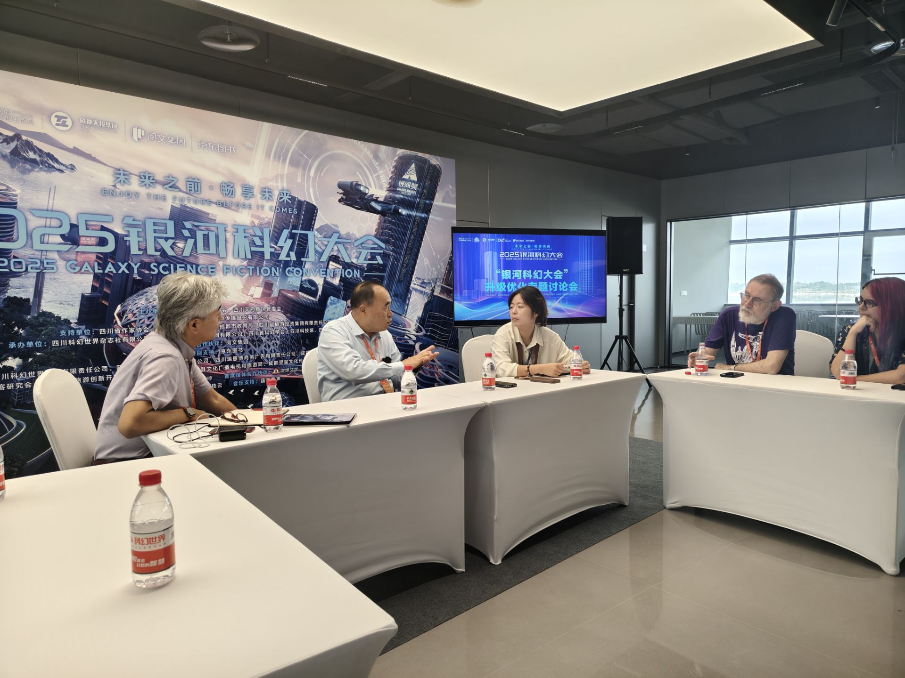

中场休息15分钟，结束后因为藤井老师要赶往下一场的沙龙活动，吴老师便提议拍一个合照。吴老师和藤井老师离开去别的会场。我把协会丝带送给藤井和尼古拉斯，但因为这次科幻大会是无票即可入场，很多人没有名牌所以我们在设计丝带时没有考虑粘贴需求，只能简单递给他们。在藤井老师走前，我聊到我有翻译过一篇关于“DAICON”的文章，他感慨当年日本投了很多资源，所以办成了一场非常让人记忆犹新的大会，我说那是日本的黄金年代。他笑着拍拍我的肩，说未来在我们这一代手里。

随后科幻世界的编辑过来问对昨晚颁奖典礼的看法。我提到产业化的问题。其实从23年大会到现在，幻迷对产业化的接受度在提升，但大家最期待的还是纯粹的活动。昨晚的切蛋糕环节就非常打动人，因为它打破了人与人之间的隔阂，让大家像一家人一样庆祝。我举例说，刘慈欣的签售让人和作家有距离感，但切蛋糕环节大家都是幻迷，彼此平等。陈曜老师补充了TUOCON和幻迷组织的发展，还提到生态岛未来十年可以继续使用。

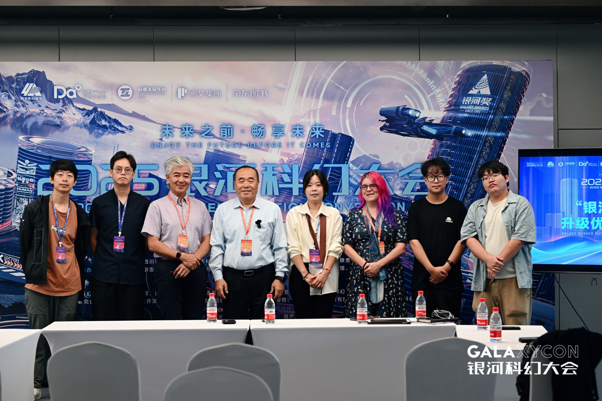

第二场参加的是“他山之石可以攻玉：日本科幻现状”。我之前在河流翻译计划时翻译过一篇关于DAICON的文章，其中讲到大森望老师创建的写作工坊，这场会议的内容和那篇文章很接近：涉及文科理科的争论、早川书店、异世界厕纸文、成为小说家吧网站，以及日本文学新人出道的方式等等。后来我的同传耳机没电，加上中午12点SFO展会开始，我就离开去帮忙。于此同时另一场沙龙也在进行，我们协会的夏亚参加了，主题是“别写了，这些题材我们看腻了”。讲的是老题材已被写尽，据他所说现场聊到了对一些作家的批评。近十年，单一老题材很难写出新意，不过一个建议是可以通过“1+1”的组合方式找到新点子。之前我在川TUO上也问过严曦老师，如何寻找科幻创意，他的建议就是：把两个科幻概念组合起来，往往能激发新灵感。

在展会上闲逛了一阵后，我赶去参加《赛博朋克2077》的 Live 演出。开场先是主创团队的对谈，帕维尔·萨斯科谈到自己来到成都后的感受，还笑说这里满大街都是辣的食物，让他还遇到了一些困难。乐队演出开始前，键盘设备出了点小状况，于是主持人临时请刘照坤和台下的幻迷们先聊了几句，气氛依然轻松。随后，刘照坤与木纹乐队带来了《Never Fade Away》《Chippin’ In》《I Really Want to Stay at Your House》《This Fire》，全场反响热烈。

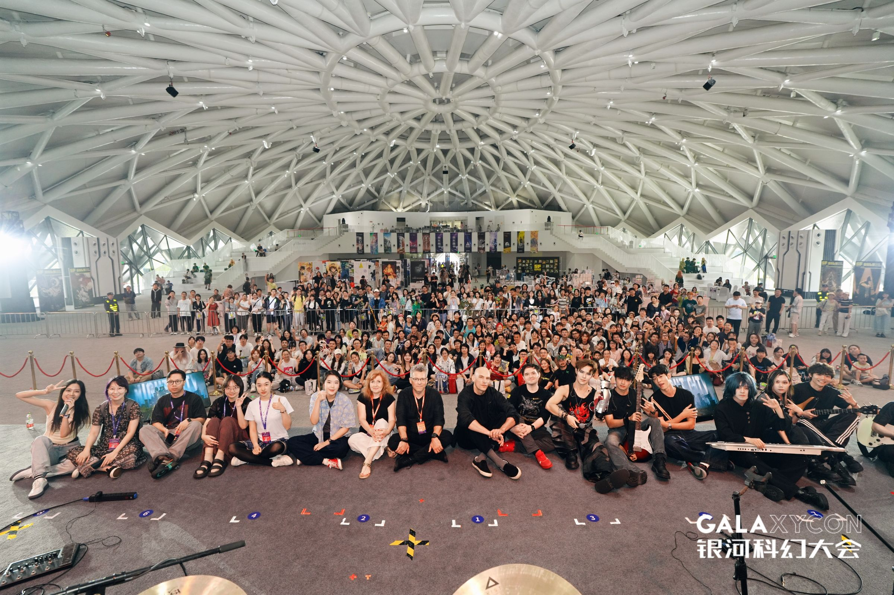

下午我参加了《打破次元壁：科幻叙事的未来走向》沙龙。本来是冲着想听索何夫老师的观点而去，但他因为图书签售活动迟到了，前半场没有出现。鲁般老师还特意吐槽，说上一场是自己主持的索何夫的活动，结果自己到了索何夫都没来，不知道在忙什么。活动的讨论围绕“叙事”展开，聊了很多角度，其中让我印象最深的还是关于 AI 使用的部分。几乎在场所有作家的 AI 使用率都超过 10%，主要用于构思文章整体思路、验证点子是否合理、生成角色名字和地名等。索何夫老师还提到，早期网文网站对坚持产出原创内容的作者有很高的激励，但后来大家发现可以用 AI 生成的内容来“钻空子”，于是平台不得不降低了这方面的权重。

之后我又回到 SFO 成都理工奇点科普科幻的摊位。正好《科幻聚会举办指南》已经到货，当时是 tail 在看摊，我便支持了一手。在电科的摊位还偶遇了草肃小涮。让我特别高兴的是，我们协会的会刊《引力波》已经卖到只剩下两本了。顺便问了点汀关于晚上社团见面会的形式，不过似乎没人清楚细节，连活动地点都是刚刚才定下来的。

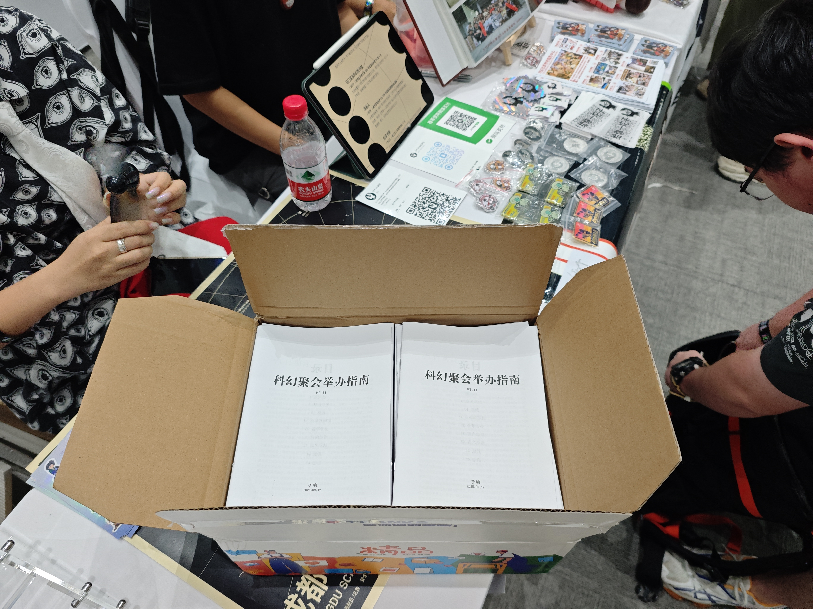

晚上如约参加了社团见面会，现场聚集了很多高校科幻社团的同学：有哈工大的硫酸铜、东华的星海横流、武大的白祁、重大的晴天然林等，也见到了不少新一届幻协会长，只是没能来得及问清名字，比如西财、重大等。比较惊喜的是单反也到了，还担任了主持，并贴心地为大家准备了零食、充电宝和签字笔。

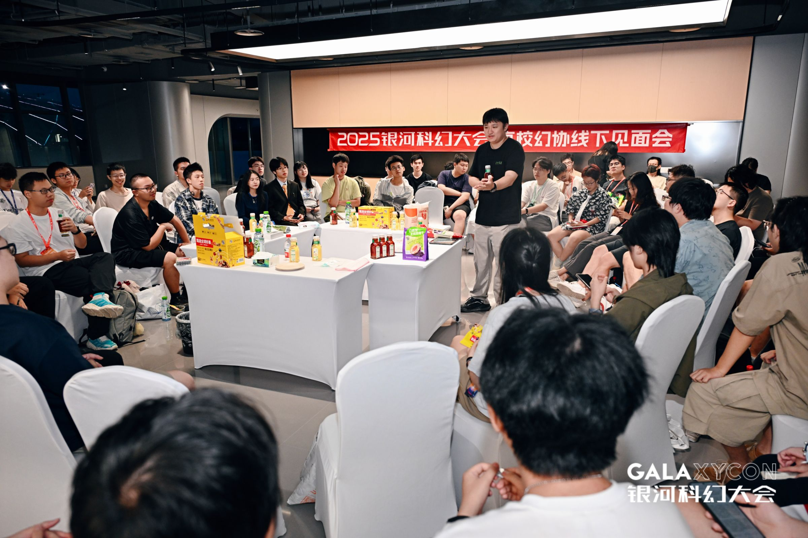

首先发言的是东华平行界的同学，他们分享了今年获得银河奖最佳社团的经验。让我印象深刻的是，他们能够充分调动所有资源，把支教的社会实践和科幻活动结合在一起，产生了很好的效果。接下来是各社团介绍自己物料的环节。哈工大的硫酸铜第一个上台介绍他们的作品，但过程中设备不断掉落，反而意外吸引了全场注意。随后是武大的白祁，他解释为什么只有他们社团的名字里保留了“学生”二字，谈到武大在规章制度上的一些特殊规定，并指出遵守校规从某种程度上反而有利于社团发展。趁着这个话题，重大的晴天然林也聊了一下他们协会的现状。

最让我汗流浃背的环节是我们奇点幻协的十口发言。他抛出一连串“暴论”，尖锐地指出社团之间存在的巨大差异，新老交替时缺乏顺畅的传承，以及如何增强凝聚力等问题。当我们提到正在编写《社团生存指南》时，他顺势提到子旋之前写的《科幻聚会举办指南v1.11》，北鱼也把这本指南分发给在场的很多协会。十口的观点如“我们讨论的一切都没有意义”“所有社团明天都可能灭亡”，让现场原本轻松的氛围一下子沉重起来。

之后进入会刊制作经验的分享环节。川大介绍了他们的 30 周年纪念刊《临界点》，包括如何为不同栏目征稿、整体策划思路等。西交的北鱼提到，最早川 TUO 曾经整理过一份制作会刊的 PPT。我也介绍了成都理工会刊的制作经验，主要强调了 AI 在封面设计和排版上的应用，我们还开源了排版文件，征稿方式灵活，并采用滚动更新来缓解短时间内编辑压力过大的问题。最后，单反补充介绍了川 TUO 的一些内容，尤其是对《科幻聚会举办指南v1.11》做了进一步的说明。

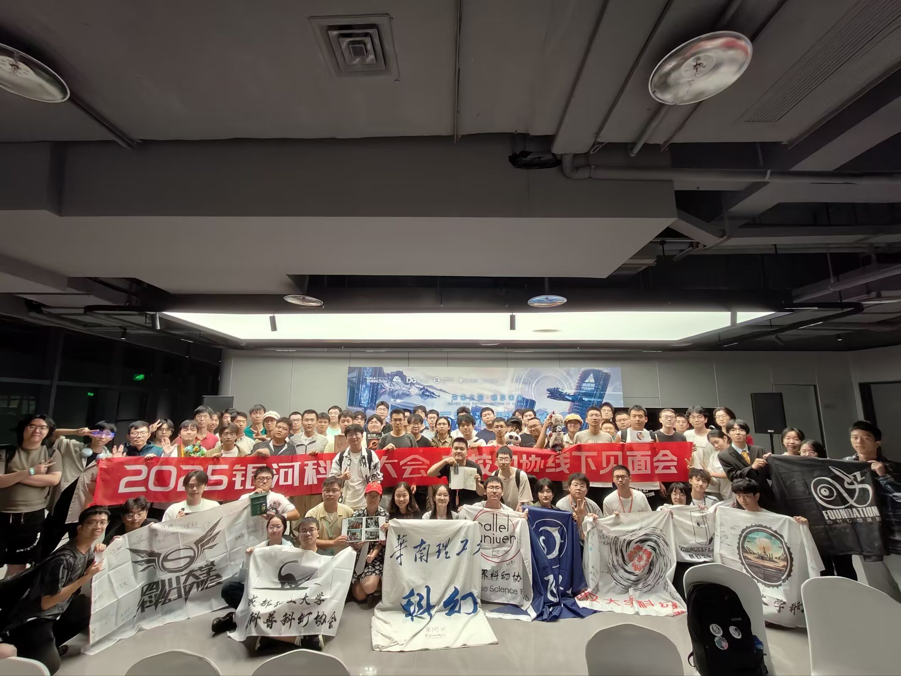

线下见面会结束后，社团们自行组织了烤肉聚餐活动，同时录制了庆祝南京高校科幻联盟成立的祝福视频。

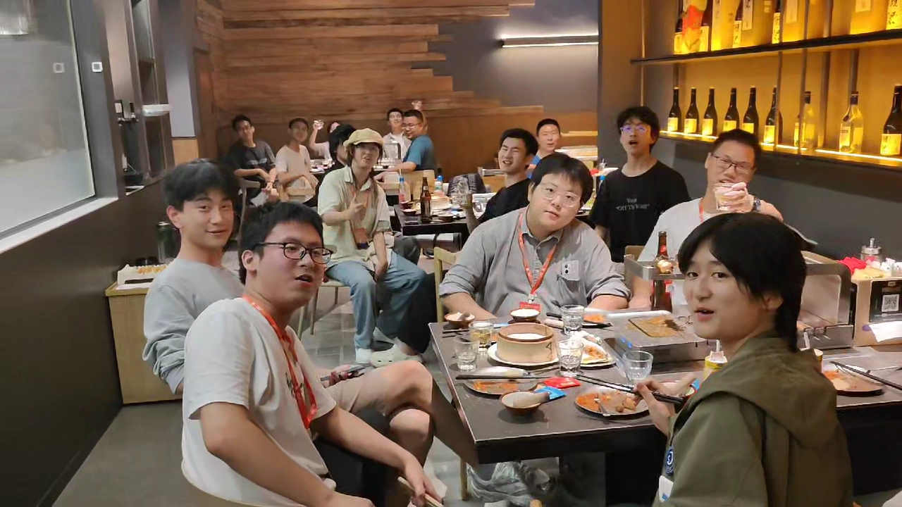

---

**9月21日**

第三天，我参加了“从高峰到高原：科幻世界作家培养计划”沙龙。沙龙原定10:00开始，我11:30才进入会场。刚坐到后排时，主讲人陈曜老师认出了我昨天参加过银河科幻大会优化讨论会，并邀请我往前排就座。

她首先强调，长篇创作更像是一种体力劳动，而不是灵感突然降临的闪现，因此必须依靠大纲来支撑。她举例说，在一些地方，大纲甚至需要写到三十万字。18、19世纪的法国作品往往将章节名本身就作为大纲。她进一步指出，短篇小说通常围绕谋杀案展开，而长篇小说则是围绕谋杀者本身。写作时，作者需要与人物建立共情：在事件的表层，读者只能看到结果，而作者必须洞悉每个人的动机。

随后，她分享了科幻世界近年来在作者培养上的变化。过去主要是以作品形式划分培养结构，而现在更多根据版权属性来区分。原创版权与引入版权的培养链条是完全不同的。早期宣传作者的方式较为单一，往往只是拍艺术照，而她强调宣传方式完全可以多样化，不论采用何种风格都值得尝试。尽管日本有蒙面作者的案例，但在中国的出版环境下，作品和作者形象依然需要产生联动。她还提到，宣传渠道十分广泛，包括书展、书店活动、高校幻协、幻迷俱乐部、奖项申报，以及世界科幻大会和国际书展，这些都能帮助作者与海外出版商建立联系。她举例说，王诺诺老师曾赴俄罗斯，鲁般和严曦老师则曾前往格拉斯哥。她希望未来能有更多作品实现既叫好又叫座。

在她看来，从发现作者到出版作品，再到后续的宣传推广，整个链条都至关重要。而在体裁上，不必拘泥于短篇、长篇还是超长网文，只要作者能写得开心，都值得去尝试。

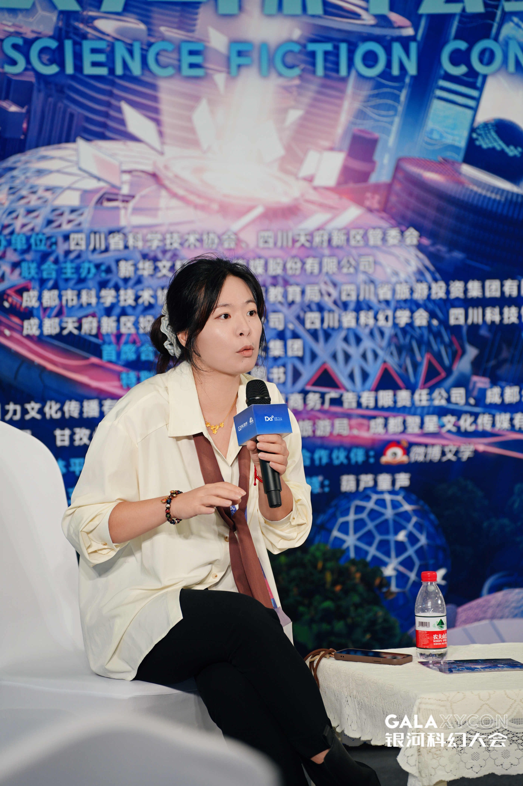

在提问环节，成都理工创设会长郭威学长提出：科研工作者该如何写小说？陈曜老师建议，科研人员应多读畅销小说，尤其是通俗小说，从中学习结构和规律。她还与邓思源老师展开讨论，并推荐了恰克·帕拉尼克的作品，强调要理解一本畅销小说的构造与特质。她还举例说，莱姆是讲故事的高手，尤其推荐《星际旅行日记》。

然后郭威学长提问：科幻作家是否只能为自己写作？对此，杨晚晴老师认为，作家首先要为自己而写，写得开心才是第一位的。陈曜老师则补充，如果目标是出版，就必须考虑读者，因为没有读者的写作是不完整的。从边际来看，编辑是作品的第一位读者，是判断的关键。她强调，为读者而写与自我表达并不冲突。一个平庸无聊的点子写出来依旧无聊。科幻小说作为类型文学和通俗文学，最终必须兼顾故事性和点子。她举例说，即便是菲利普·K·迪克，也是在为自己写作的同时兼顾读者。她总结道：一个好的小说，就是既讲好故事，又呈现精彩的点子。

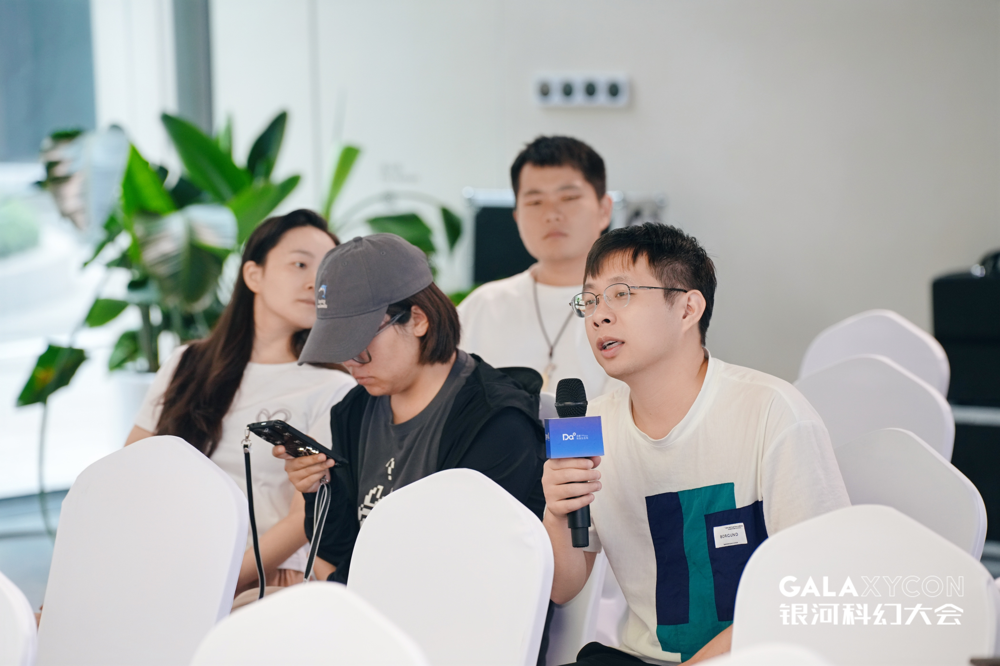

活动结束后，我和郭威学长打了招呼，并带他参观了各个摊位。我们先去了银河幻想集市，拜访了深蓝局长，随后又带他看了我们 SFO 的展位。郭威学长目前在西华师范大学任教，教授物理学。恰好隔壁西华师范大学的同学听说此事，当场表示希望创办科幻社团，并邀请郭威学长担任指导老师。

这次的活动记录本来是一边参加一边写的，所以有些地方呈现出流水账的形态。许多感触在现场还没完全成型，我把那些零碎的想法放在下面，连同一些观察性的补充一并写出。

总体上，我觉得这次和 COMICUP 合作是一次非常值得肯定的尝试。原因很直观也很现实：COMICUP 在活动承办、场地组织、摊位管理和对接供应商方面有成熟的经验，能弥补科幻世界在人力和执行力上的短板；更重要的是，漫画圈和科幻圈在人群兴趣、周边商品，双方在观众流量和传播渠道上有天然的互补，这样的跨界合作能带来更广的受众、更多的联动活动和更丰富的现场内容——对主办方、参展社团和普通观众都是双赢。

大会采取比以往更开放的入场策略（除了少数需要购票的展区外，多数活动免票）也很有意义（再也不会出现三丰老师因为没有牌牌被拦截在外面的尴尬情况）。开放性带来的好处包括：降低参与门槛，吸引更多初次接触科幻的人；鼓励路过观众随性参与，增加人群多样性与现场的偶遇可能；给予小型社团和个人更多曝光机会，利于生态的基层生长；同时，对整个行业而言，更多群众基础也能为未来的活动留住潜在志愿者和读者。简单来说，开放带来的是更宽的入口和更丰富的可能性，而不是对品质或专业性的必然妥协。

大会推出的“银河相册”小程序也有实用价值，不只是“方便下载照片”那么简单。一个统一的小程序能把大会的影像资料做成可检索、标签化和归档的资源：按场次、按讲者、按摊位、按时间排序，便于回看、引用与传播；为参会者和社团提供了高质量的媒体素材，方便后续宣传与报道；对主办方而言，这是品牌与活动记忆的集中库，也便于对外授权、合辑出品和视觉呈现；对普通幻迷来说，小程序降低了寻找照片和互相分享的成本，增强了大会的“可记忆性”。至少对于我来说提供了更好的，方便整理的资料来源。

我常常说，参加科幻大会和科幻迷聚会是有戒断反应，短暂的摆脱现实的引力，让想象力在科幻迷群体中飞扬。在现场被同好包围的即时反馈与共鸣会产生强烈的情绪高点：讨论热烈、观点碰撞、瞬间建立的信任与认同感，会让人像被“补充能量”一样，想象力被放大。这种感受只要体会到过一次，就很难再割舍。幻迷之间的坦诚，共鸣，信任，组成了科幻大会和科幻迷聚会中最独特的内容。

总之祝银河科幻大会越办越好！
