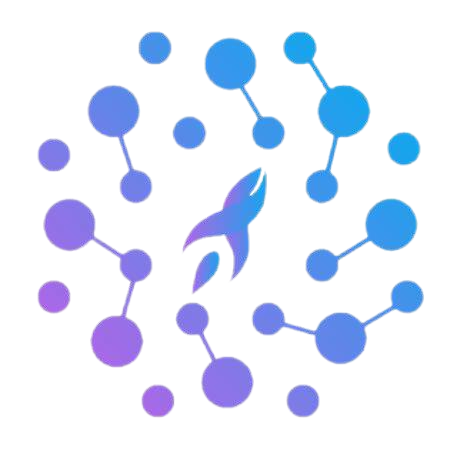

  <a class="link-item" href="https://www.csfdb.cn/" target="_blank">
    
    

      
中文科幻数据库

      
我们见证，我们记录，我们讲述

    

  </a>

  <a class="link-item" href="https://www.0gsf.com/" target="_blank">
    
    

      
零重力科幻

      
科幻迷的聚集地，创作者的新手村！

    

  </a>

  <a class="link-item" href="https://gpabooks.github.io" target="_blank">
    
    

      
上海交大会刊GPA

      
我来，我看，我叙事！

    

  </a>

