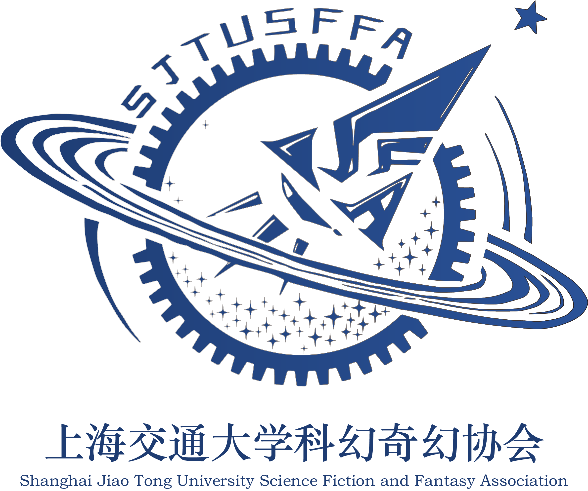
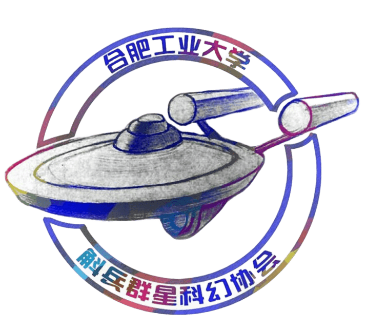

  <a class="link-item" href="https://www.csfdb.cn/" target="_blank">
    
    

      
中文科幻数据库

      
我们见证，我们记录，我们讲述

    

  </a>

  <a class="link-item" href="https://www.0gsf.com/" target="_blank">
    
    

      
零重力科幻

      
科幻迷的聚集地，创作者的新手村！

    

  </a>

  <a class="link-item" href="https://gpabooks.github.io" target="_blank">
    
    

      
上海交大会刊GPA

      
我来，我看，我叙事！

    

  </a>

  <a class="link-item" href="https://hubingsf.cn/" target="_blank">
    
    

      
斛兵群星科幻协会

      
天马行空的幻想咖啡厅！

    

  </a>

  <a class="link-item" href="https://mp.weixin.qq.com/mp/profile_ext?action=home&__biz=MzIzMDgyMzg2NA==&scene=124#wechat_redirect" target="_blank">
    
    

      
42号邮局

      
为你无处投递的科幻梦找一个归宿

    

  </a>

  <a class="link-item" href="https://mp.weixin.qq.com/mp/profile_ext?action=home&__biz=MzIzMDgyMzg2NA==&scene=124#wechat_redirect" target="_blank">
    
    

      
川TUO

      
四川给你一坨子！

    

  </a>

  <a class="link-item" href="https://mp.weixin.qq.com/mp/profile_ext?action=home&__biz=MzIzMDgyMzg2NA==&scene=124#wechat_redirect" target="_blank">
    
    

      
宇宙尽头和牛馆

      
河流个人微信公众号

    

  </a>

